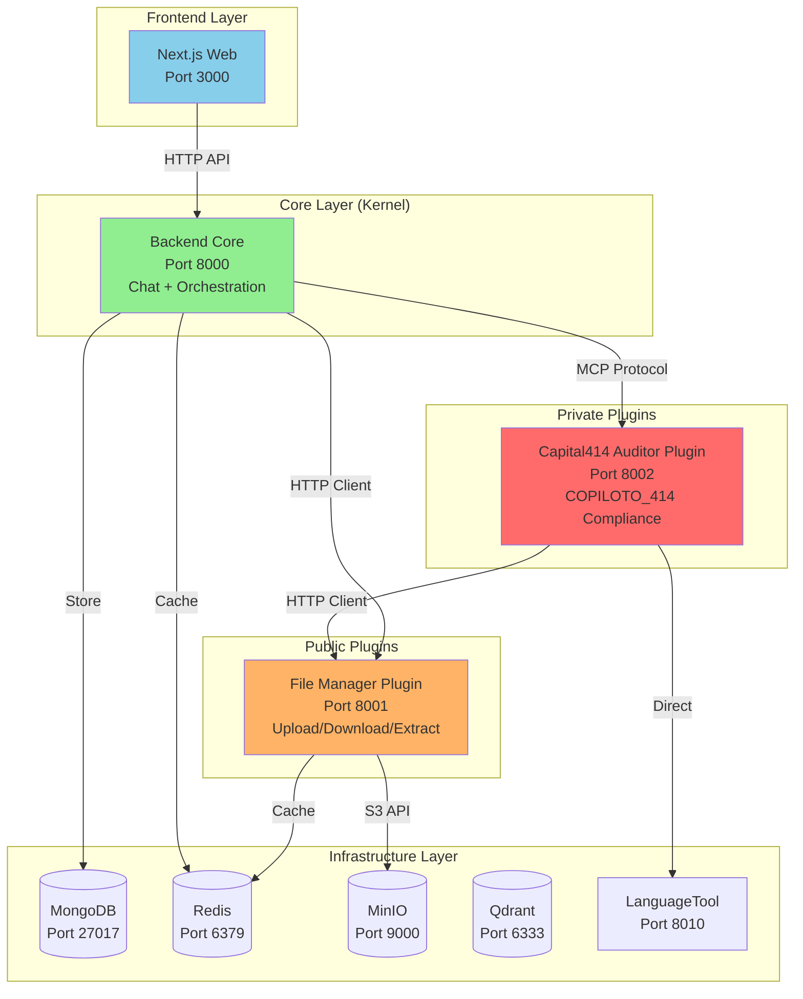

# Migración Arquitectural: Monolito → Plugin-First (Micro-Kernel)

## 📋 Tabla de Contenidos

1. [Resumen Ejecutivo](#resumen-ejecutivo)
2. [ANTES: Arquitectura Monolítica](#antes-arquitectura-monolítica)
3. [DESPUÉS: Arquitectura Plugin-First](#después-arquitectura-plugin-first)
4. [Comparación Lado a Lado](#comparación-lado-a-lado)
5. [Ejemplo Práctico: Flujo de Auditoría](#ejemplo-práctico-flujo-de-auditoría)
6. [Beneficios de la Migración](#beneficios-de-la-migración)
7. [Desafíos y Trade-offs](#desafíos-y-trade-offs)
8. [Referencias de Código](#referencias-de-código)

---

## Resumen Ejecutivo

**¿Qué cambió?**
Transformamos un backend monolítico en una arquitectura Plugin-First (Micro-Kernel) donde el Core es ligero y delega funcionalidades específicas a plugins independientes.

**¿Por qué?**
- **Escalabilidad**: Cada plugin puede escalar independientemente según demanda
- **Mantenibilidad**: Cambios en plugins no afectan el Core
- **Open Source Ready**: Plugins públicos pueden compartirse sin exponer lógica privada
- **Ownership Claro**: Equipos pueden trabajar en plugins sin conflictos

---

## ANTES: Arquitectura Monolítica

### Diagrama Visual

```
┌─────────────────────────────────────────────────────────────┐
│                     BACKEND MONOLÍTICO                       │
│                      (Puerto 8001)                           │
│                                                              │
│  ┌────────────────────────────────────────────────────────┐ │
│  │                    src/routers/                        │ │
│  │  • chat.py          • auth.py       • files.py        │ │
│  │  • documents.py     • review.py     • reports.py      │ │
│  └────────────────────────────────────────────────────────┘ │
│                             ↓                                │
│  ┌────────────────────────────────────────────────────────┐ │
│  │                   src/services/                        │ │
│  │  • ChatService                                         │ │
│  │  • DocumentService                                     │ │
│  │  • MinIOService (almacenamiento)                      │ │
│  │  • ValidationCoordinator (COPILOTO_414)               │ │
│  │  • DisclaimerAuditor                                  │ │
│  │  • FormatAuditor                                      │ │
│  │  • GrammarAuditor                                     │ │
│  │  • LogoAuditor                                        │ │
│  │  • ReviewService                                      │ │
│  │  • ColorAuditor                                       │ │
│  └────────────────────────────────────────────────────────┘ │
│                             ↓                                │
│  ┌────────────────────────────────────────────────────────┐ │
│  │              Dependencias Directas                     │ │
│  │  • MongoDB (base de datos)                            │ │
│  │  • Redis (cache)                                      │ │
│  │  • MinIO (archivos)                                   │ │
│  │  • LanguageTool (gramática)                           │ │
│  │  • Qdrant (vectores)                                  │ │
│  └────────────────────────────────────────────────────────┘ │
└─────────────────────────────────────────────────────────────┘
```

### Características del Monolito

#### ✅ Ventajas
- **Simplicidad inicial**: Todo en un solo lugar
- **Deployment único**: Un solo contenedor para desplegar
- **Debugging sencillo**: Stack traces completos en un proceso

#### ❌ Desventajas
- **Acoplamiento alto**: Cambiar COPILOTO_414 requiere rebuild del backend completo
- **Escalabilidad limitada**: No puedes escalar solo la auditoría de documentos
- **Conflictos de código**: Múltiples equipos editando el mismo backend
- **Open Source bloqueado**: No puedes compartir funcionalidad sin exponer todo

### Estructura de Archivos (Monolito)

```
apps/
└── api/                          # TODO EN UN SOLO LUGAR
    ├── src/
    │   ├── routers/
    │   │   ├── chat.py           # Chat + File Upload mezclados
    │   │   ├── documents.py      # Gestión de documentos
    │   │   └── review.py         # Auditoría COPILOTO_414
    │   ├── services/
    │   │   ├── chat_service.py
    │   │   ├── minio_service.py  # Acceso directo a MinIO
    │   │   ├── validation_coordinator.py  # Auditoría
    │   │   ├── disclaimer_auditor.py
    │   │   ├── format_auditor.py
    │   │   ├── grammar_auditor.py
    │   │   ├── logo_auditor.py
    │   │   └── color_auditor.py
    │   └── models/
    │       └── validation_report.py
    └── Dockerfile               # Un solo contenedor
```

### Ejemplo de Código (Monolito)

**Antes: Backend accede directamente a MinIO**

```python
# apps/api/src/services/chat_service.py
from .minio_service import minio_service  # ACOPLAMIENTO DIRECTO

class ChatService:
    async def upload_file(self, file: UploadFile):
        # Backend se encarga de TODA la lógica de archivos
        file_bytes = await file.read()
        minio_key = f"user_123/session_456/{file.filename}"

        # Acceso directo a MinIO
        minio_service.upload_file(
            bucket="documents",
            object_name=minio_key,
            data=io.BytesIO(file_bytes),
            length=len(file_bytes),
            content_type=file.content_type
        )

        return {"minio_key": minio_key}
```

**Antes: Auditoría COPILOTO_414 vive en el backend**

```python
# apps/api/src/routers/review.py
from ..services.validation_coordinator import ValidationCoordinator

@router.post("/audit")
async def audit_document(file: UploadFile):
    # TODO el código de auditoría está en el backend
    coordinator = ValidationCoordinator()

    # Auditores directamente acoplados
    result = await coordinator.validate_document(
        pdf_path=temp_file,
        policy_id="copiloto_414"
    )

    return result
```

---

## DESPUÉS: Arquitectura Plugin-First

### Diagrama Visual



### Filosofía del Micro-Kernel

El patrón **Plugin-First (Micro-Kernel)** separa:

1. **Core (Kernel)**: Funcionalidad mínima esencial
   - Chat orchestration
   - Autenticación
   - Session management
   - Plugin registry

2. **Public Plugins**: Infraestructura reutilizable
   - File Manager: Upload, download, extraction
   - Open Source ready
   - Versionado independiente

3. **Private Plugins**: Lógica de negocio propietaria
   - Capital414 Auditor: COPILOTO_414 compliance
   - Propiedad intelectual protegida
   - Puede venderse como servicio

### Estructura de Archivos (Plugin-First)

```
apps/
├── backend/                      # CORE LIGERO (antes: api/)
│   ├── src/
│   │   ├── routers/
│   │   │   ├── chat.py           # Solo orchestration
│   │   │   └── auth.py           # Autenticación
│   │   ├── services/
│   │   │   ├── chat_service.py   # Delega a plugins
│   │   │   └── file_manager_client.py  # HTTP client
│   │   └── mcp/
│   │       └── client.py         # MCP protocol client
│   └── Dockerfile
│
└── web/                          # Frontend (Next.js)
    └── ...

plugins/
├── public/                       # OPEN SOURCE READY
│   └── file-manager/             # Plugin independiente
│       ├── src/
│       │   ├── routers/
│       │   │   ├── upload.py     # POST /upload
│       │   │   ├── download.py   # GET /download/{key}
│       │   │   └── extract.py    # POST /extract
│       │   ├── services/
│       │   │   ├── minio_client.py
│       │   │   ├── redis_client.py
│       │   │   └── extraction_service.py
│       │   └── main.py           # FastAPI app independiente
│       ├── Dockerfile            # Contenedor propio
│       └── requirements.txt      # Dependencias propias
│
└── capital414-private/           # PROPIEDAD INTELECTUAL
    ├── src/
    │   ├── auditors/             # Auditores especializados
    │   │   ├── disclaimer_auditor.py
    │   │   ├── format_auditor.py
    │   │   ├── grammar_auditor.py
    │   │   └── logo_auditor.py
    │   ├── clients/
    │   │   └── file_manager_client.py  # Consume file-manager
    │   └── main.py               # MCP Server
    ├── Dockerfile                # Contenedor propio
    └── requirements.txt
```

### Service Dependency Chain

```
1. Infrastructure Layer
   └── MongoDB, Redis, MinIO, Qdrant, LanguageTool

2. Public Plugins
   └── File Manager (depends on: MinIO, Redis)

3. Core Layer
   └── Backend (depends on: MongoDB, Redis, File Manager)

4. Private Plugins
   └── Capital414 (depends on: File Manager, LanguageTool)

5. Frontend Layer
   └── Next.js (depends on: Backend)
```

### Ejemplo de Código (Plugin-First)

**Después: Backend delega a File Manager Plugin**

```python
# apps/backend/src/services/file_manager_client.py
import httpx

class FileManagerClient:
    """HTTP client for file-manager plugin."""

    def __init__(self):
        self.base_url = os.getenv("FILE_MANAGER_URL", "http://file-manager:8001")
        self._client = httpx.AsyncClient()

    async def upload_file(
        self,
        file: UploadFile,
        user_id: str,
        session_id: str
    ) -> Dict[str, Any]:
        """Upload file via plugin."""
        files = {"file": (file.filename, file.file, file.content_type)}
        data = {"user_id": user_id, "session_id": session_id}

        response = await self._client.post(
            f"{self.base_url}/upload",
            files=files,
            data=data
        )
        response.raise_for_status()
        return response.json()
```

**Después: Backend usa FileManagerClient**

```python
# apps/backend/src/services/chat_service.py
from .file_manager_client import get_file_manager_client

class ChatService:
    async def upload_file(self, file: UploadFile, user_id: str, session_id: str):
        # Backend DELEGA a plugin
        fm_client = await get_file_manager_client()

        result = await fm_client.upload_file(
            file=file,
            user_id=user_id,
            session_id=session_id
        )

        return result  # {"minio_key": "...", "file_id": "..."}
```

**Después: Capital414 Plugin consume File Manager**

```python
# plugins/capital414-private/src/clients/file_manager_client.py
class FileManagerClient:
    async def download_to_temp(self, file_path: str) -> Path:
        """Download file from file-manager to temp location."""
        content = await self.download(file_path)

        with tempfile.NamedTemporaryFile(delete=False, suffix=".pdf") as tmp:
            tmp.write(content)
            return Path(tmp.name)

# plugins/capital414-private/src/main.py
@mcp.tool()
async def audit_document_full(minio_key: str, policy_id: str = "auto"):
    """Validate PDF via MCP tool."""
    # Plugin descarga desde file-manager
    fm_client = await get_file_manager_client()
    pdf_path = await fm_client.download_to_temp(minio_key)

    try:
        # Auditoría independiente
        coordinator = ValidationCoordinator()
        result = await coordinator.validate_document(pdf_path, policy_id)
        return result
    finally:
        # Cleanup automático
        pdf_path.unlink()
```

---

## Comparación Lado a Lado

### Flujo de Upload de Archivo

| Aspecto | ANTES (Monolito) | DESPUÉS (Plugin-First) |
|---------|------------------|------------------------|
| **Endpoint** | `POST /api/chat/upload` | `POST /upload` (file-manager) |
| **Proceso** | Backend maneja todo | Backend → File Manager Plugin |
| | 1. Backend recibe archivo | 1. Backend recibe archivo |
| | 2. Backend sube a MinIO | 2. Backend llama a file-manager |
| | 3. Backend guarda metadata | 3. File-manager sube a MinIO |
| | 4. Backend retorna resultado | 4. File-manager retorna minio_key |
| | | 5. Backend usa minio_key |
| **Código en Backend** | 200+ líneas | 20 líneas (HTTP client) |
| **Responsabilidad** | Backend: TODO | Backend: Orchestration |
| | | File Manager: Storage |
| **Escalabilidad** | Todo el backend escala | Solo file-manager escala |
| **Deployment** | Rebuild backend completo | Rebuild solo file-manager |

### Flujo de Auditoría COPILOTO_414

| Aspecto | ANTES (Monolito) | DESPUÉS (Plugin-First) |
|---------|------------------|------------------------|
| **Ubicación** | `apps/api/src/services/` | `plugins/capital414-private/` |
| **Acceso** | Función Python directa | MCP Protocol (toolcall) |
| **Código** | `coordinator.validate()` | `mcp.call_tool("audit_document_full")` |
| **Auditores** | • DisclaimerAuditor | • DisclaimerAuditor |
| | • FormatAuditor | • FormatAuditor |
| | • GrammarAuditor | • GrammarAuditor |
| | • LogoAuditor | • LogoAuditor |
| | (en backend) | (en plugin privado) |
| **Archivos** | Backend lee de MinIO | Plugin llama a file-manager |
| **Deployment** | Rebuild backend | Rebuild solo capital414 |
| **Open Source** | Bloqueado | Backend: ✅ Open Source |
| | | Capital414: ❌ Privado |

### Tabla Comparativa General

| Característica | Monolito | Plugin-First |
|----------------|----------|--------------|
| **Contenedores** | 1 backend | 3 services (backend + 2 plugins) |
| **Puertos** | 8001 | 8000 (backend)<br/>8001 (file-manager)<br/>8002 (capital414) |
| **Deployment** | Todo junto | Independiente por servicio |
| **Escalabilidad** | Vertical (más CPU/RAM) | Horizontal (más instancias) |
| **Build Time** | ~5 min (todo) | ~2 min (solo cambio) |
| **Hot Reload** | Backend completo | Solo servicio modificado |
| **Ownership** | Un equipo | Múltiples equipos |
| **Open Source** | Bloqueado | Plugins públicos liberables |
| **Versionado** | Una versión | Versión por plugin |
| **Testing** | Tests monolíticos | Tests por plugin |

---

## Ejemplo Práctico: Flujo de Auditoría

### ANTES: Monolito (Flujo Completo)

```python
# 1. Usuario hace request al backend
# POST /api/review/audit

# 2. Backend maneja TODO
# apps/api/src/routers/review.py
@router.post("/audit")
async def audit_document(request: AuditRequest):
    # A. Descargar archivo de MinIO
    minio = MinIOService()
    pdf_bytes = minio.download_file(
        bucket="documents",
        object_name=request.minio_key
    )

    # B. Guardar en temp
    with tempfile.NamedTemporaryFile(suffix=".pdf") as tmp:
        tmp.write(pdf_bytes)
        pdf_path = tmp.name

        # C. Ejecutar auditoría (todo en backend)
        coordinator = ValidationCoordinator()

        # D. Ejecutar 4 auditores
        disclaimer_result = DisclaimerAuditor().audit(pdf_path)
        format_result = FormatAuditor().audit(pdf_path)
        grammar_result = GrammarAuditor().audit(pdf_path)
        logo_result = LogoAuditor().audit(pdf_path)

        # E. Compilar reporte
        report = coordinator.compile_report([
            disclaimer_result,
            format_result,
            grammar_result,
            logo_result
        ])

        return report

# PROBLEMA: Backend tiene TODO el código de auditoría
# Si cambias un auditor → rebuild backend completo
```

### DESPUÉS: Plugin-First (Flujo Distribuido)

```python
# 1. Usuario hace request al backend
# POST /api/chat/send

# 2. Backend detecta comando de auditoría
# apps/backend/src/services/chat_service.py
async def process_message(message: str, minio_key: str):
    if "auditar archivo" in message.lower():
        # Backend DELEGA a plugin via MCP
        mcp_client = get_mcp_client()

        result = await mcp_client.call_tool(
            server="capital414-auditor",
            tool_name="audit_document_full",
            arguments={
                "minio_key": minio_key,
                "policy_id": "copiloto_414"
            }
        )

        return result

# 3. Plugin Capital414 recibe el toolcall
# plugins/capital414-private/src/main.py
@mcp.tool()
async def audit_document_full(minio_key: str, policy_id: str):
    # A. Plugin descarga archivo via file-manager
    fm_client = await get_file_manager_client()
    pdf_path = await fm_client.download_to_temp(minio_key)

    try:
        # B. Ejecutar auditoría (todo en plugin privado)
        coordinator = ValidationCoordinator()
        report = await coordinator.validate_document(pdf_path, policy_id)
        return report
    finally:
        # C. Cleanup automático
        pdf_path.unlink()

# 4. File Manager plugin maneja descarga
# plugins/public/file-manager/src/routers/download.py
@router.get("/download/{minio_key:path}")
async def download_file(minio_key: str):
    minio = get_minio_client()

    # Descargar de MinIO
    data = minio.download_file(minio_key)

    return Response(
        content=data,
        media_type="application/pdf",
        headers={"Content-Disposition": f"attachment; filename={filename}"}
    )

# BENEFICIO: Cada servicio tiene responsabilidad única
# Cambiar auditoría → rebuild solo capital414 plugin
# Cambiar file handling → rebuild solo file-manager plugin
# Backend NO se toca
```

---

## Beneficios de la Migración

### 1. Escalabilidad Horizontal

**Antes:**
```yaml
# docker-compose.yml (monolito)
api:
  image: backend:latest
  deploy:
    replicas: 1  # Si necesitas más upload capacity → escala TODO
```

**Después:**
```yaml
# docker-compose.yml (plugin-first)
backend:
  image: backend:latest
  deploy:
    replicas: 1  # Core ligero, bajo load

file-manager:
  image: file-manager:latest
  deploy:
    replicas: 5  # Escala SOLO file uploads (high load)

capital414-auditor:
  image: capital414-auditor:latest
  deploy:
    replicas: 3  # Escala SOLO auditorías (medium load)
```

### 2. Deployment Independiente

**Antes:**
```bash
# Cambiar un auditor → rebuild TODO
git commit -m "fix: corregir auditor de disclaimer"
make build-backend  # ⏰ 5 minutos
make restart-backend  # ⚠️ Downtime de chat mientras rebuilds
```

**Después:**
```bash
# Cambiar un auditor → rebuild SOLO plugin
git commit -m "fix: corregir auditor de disclaimer"
make build-capital414  # ⏰ 1 minuto
make restart-capital414  # ✅ Chat sigue funcionando
```

### 3. Open Source Selectivo

**Antes:**
```
apps/api/  → Contiene TODO (no se puede liberar)
  ├── chat.py
  ├── minio_service.py      ← Queremos compartir
  ├── validation_coordinator.py  ← NO queremos compartir (IP)
  └── disclaimer_auditor.py  ← NO queremos compartir (IP)
```

**Después:**
```
plugins/public/file-manager/  → ✅ Open Source en GitHub
  ├── upload.py
  ├── download.py
  └── minio_client.py

plugins/capital414-private/   → ❌ Privado (no en GitHub)
  ├── validation_coordinator.py
  ├── disclaimer_auditor.py
  └── logo_auditor.py
```

### 4. Ownership por Equipos

**Antes:**
```
Team Backend: Mantiene apps/api/ (TODO)
  - ⚠️ Conflictos de merge constantes
  - ⚠️ Cambios en auditoría afectan chat
  - ⚠️ Tests mezclados
```

**Después:**
```
Team Core: Mantiene apps/backend/
  - ✅ Chat, auth, orchestration
  - ✅ Sin conflictos con otros equipos

Team DevOps: Mantiene plugins/public/file-manager/
  - ✅ Upload, download, storage
  - ✅ Puede versionar independiente

Team Compliance: Mantiene plugins/capital414-private/
  - ✅ Auditorías COPILOTO_414
  - ✅ Deployment independiente
```

### 5. Testing Independiente

**Antes:**
```bash
# Test backend = test TODO
pytest apps/api/tests/  # ⏰ 10 minutos (todos los tests)
```

**Después:**
```bash
# Test solo lo que cambió
pytest plugins/capital414-private/tests/  # ⏰ 2 minutos
# Backend no se toca, no se testa
```

---

## Desafíos y Trade-offs

### ❌ Desventajas del Plugin-First

| Desafío | Impacto | Mitigación |
|---------|---------|------------|
| **Complejidad inicial** | Más contenedores | Docker Compose maneja orchestration |
| **Network latency** | HTTP calls entre servicios | Redis cache + keep-alive connections |
| **Debugging distribuido** | Stack traces en múltiples servicios | Structured logging + correlation IDs |
| **Transaction boundaries** | No hay ACID cross-service | Event sourcing + compensating transactions |
| **Más código boilerplate** | HTTP clients para cada plugin | Abstracciones reutilizables (BasePluginClient) |

### ⚠️ Cuándo NO usar Plugin-First

- **Proyectos pequeños** (<5 endpoints)
- **Equipo único** (sin necesidad de ownership separation)
- **Low latency crítico** (<10ms response time)
- **Transacciones ACID requeridas** (cross-service)

### ✅ Cuándo SÍ usar Plugin-First

- **Múltiples equipos** trabajando en paralelo
- **Funcionalidades independientes** (file upload ≠ auditoría)
- **Open Source estratégico** (liberar plugins públicos)
- **Escalabilidad diferenciada** (uploads 10x más que audits)
- **Deployment frecuente** (hotfixes sin rebuild completo)

---

## Referencias de Código

### Antes (Monolito) - Archivos Clave

```
apps/api/src/
├── routers/
│   ├── chat.py                   # Línea 450: upload_file() - TODO en backend
│   └── review.py                 # Línea 120: audit_document() - Auditoría directa
├── services/
│   ├── minio_service.py          # Línea 60: Acceso directo a MinIO
│   ├── validation_coordinator.py # Línea 100: Orquestación de auditores
│   ├── disclaimer_auditor.py     # Línea 45: Fuzzy matching
│   ├── format_auditor.py         # Línea 80: PyMuPDF analysis
│   ├── grammar_auditor.py        # Línea 120: LanguageTool integration
│   └── logo_auditor.py           # Línea 200: OpenCV template matching
└── models/
    └── validation_report.py      # Línea 30: Report schema
```

### Después (Plugin-First) - Archivos Clave

```
apps/backend/src/
├── routers/
│   └── chat.py                   # Línea 300: Delega a FileManagerClient
├── services/
│   └── file_manager_client.py    # Línea 50: HTTP client (25 líneas)
└── mcp/
    └── client.py                 # Línea 100: MCP protocol client

plugins/public/file-manager/src/
├── routers/
│   ├── upload.py                 # Línea 30: POST /upload
│   └── download.py               # Línea 20: GET /download/{key}
└── services/
    └── minio_client.py           # Línea 70: MinIO wrapper

plugins/capital414-private/src/
├── auditors/
│   ├── disclaimer_auditor.py     # Línea 45: Movido desde backend
│   ├── format_auditor.py         # Línea 80: Movido desde backend
│   ├── grammar_auditor.py        # Línea 120: Movido desde backend
│   └── logo_auditor.py           # Línea 200: Movido desde backend
├── clients/
│   └── file_manager_client.py    # Línea 60: Plugin-to-plugin communication
└── main.py                       # Línea 150: MCP tool definition
```

---

## Conclusión

La migración de Monolito → Plugin-First transforma:

**ANTES:**
- Un backend grande y acoplado
- Deployment todo-o-nada
- Escalabilidad limitada
- Open Source bloqueado

**DESPUÉS:**
- Core ligero + Plugins especializados
- Deployment independiente
- Escalabilidad granular
- Open Source selectivo

**Inversión:**
- ⏰ Tiempo: 2 semanas de migración
- 📈 ROI: Deployment 5x más rápido, escalabilidad horizontal, open source ready

**¿Valió la pena?** ✅ SÍ
- Team puede iterar más rápido
- Plugins públicos pueden liberarse
- Compliance (capital414) protegido
- Infraestructura (file-manager) reutilizable

---

## Siguiente Paso: Demo en Vivo

Para ver la diferencia en acción:

```bash
# Terminal 1: Backend (Core)
curl http://localhost:8000/api/health
# Response: {"status": "healthy", "version": "0.1.0"}

# Terminal 2: File Manager (Public Plugin)
curl http://localhost:8001/health
# Response: {"status": "healthy", "service": "file-manager"}

# Terminal 3: Capital414 Auditor (Private Plugin)
curl http://localhost:8002/health
# Response: {"status": "ok", "service": "capital414-auditor"}
```

**¿Quieres profundizar en algún aspecto?**
- Flujo de datos detallado
- Estrategia de testing
- Plan de rollout a producción
- Métricas de performance
