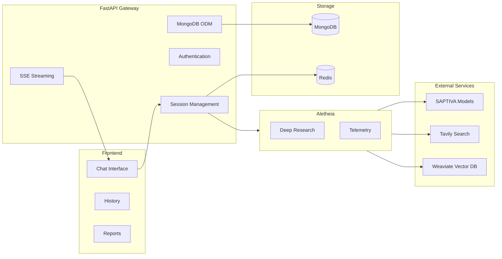

# Copilotos Bridge

ChatGPT-style conversational interface for SAPTIVA language models with integrated Deep Research capabilities.

## Overview

**Production-Ready Features:**
- **ChatGPT-Style UX**: Complete ChatGPT-inspired interface with hierarchical model selector, conversation history, and modern interactions
- **Real SAPTIVA Integration**: Direct connection to SAPTIVA language models (no demo/mock responses)
- **Advanced Chat Features**: File attachments, message actions (copy, regenerate), streaming responses, keyboard shortcuts
- **Deep Research**: Integrated Aletheia orchestrator for comprehensive research with source traceability
- **Enterprise Security**: JWT authentication, session management, and secure API key handling
- **Full Accessibility**: Complete keyboard navigation, ARIA labels, and responsive design

## Requirements

- Node.js >= 18.0.0
- Python >= 3.10
- MongoDB >= 6.0
- Redis >= 6.2
- Docker and Docker Compose
- pnpm >= 8.0 (recommended) or npm

## Architecture



## Getting Started

### 1. Clone and Setup

```bash
git clone <repository-url>
cd copilotos-bridge
cp envs/.env.local.example envs/.env.local
```

### 2. Configure Environment

Edit `envs/.env.local` with your API keys:

```bash
# Authentication
JWT_SECRET_KEY=your-secret-key-here

# SAPTIVA Integration
SAPTIVA_API_KEY=your-saptiva-api-key

# Database URLs
MONGODB_URL=mongodb://localhost:27017/copilotos
REDIS_URL=redis://localhost:6379/0

# CORS Configuration
CORS_ORIGINS=http://localhost:3000
ALLOWED_HOSTS=localhost,127.0.0.1,web,api
```

### 3. Start Services

```bash
make dev
```

### 4. Create Demo User

```bash
# Option 1: Using make command
make create-demo-user

# Option 2: Direct script execution
./create-demo-user

# Option 3: Manual script execution
./scripts/create-demo-user.sh
```

This creates a demo user with credentials:
- **Username**: demo_admin
- **Email**: demo@saptiva.ai
- **Password**: ChangeMe123

The script automatically:
- Waits for the API to be ready
- Creates the user via API endpoint
- Handles existing user scenarios
- Tests login functionality
- Provides direct links to access the application

### 5. Access Application

- **Frontend**: http://localhost:3000
- **API**: http://localhost:8001
- **Health Check**: http://localhost:8001/api/health

## API Endpoints

### Core Endpoints
- `POST /api/chat` - Send message to LLM
- `POST /api/deep-research` - Start research task, returns task_id
- `GET /api/stream/{task_id}` - Server-Sent Events for task progress
- `GET /api/report/{task_id}` - Download research report and artifacts
- `GET /api/history/{chat_id}` - Retrieve conversation history
- `POST /api/auth/login` - User authentication
- `POST /api/auth/register` - User registration

## Development Commands

```bash
# View all available commands
make help

# Development
make dev                     # Start development environment
make logs                    # View service logs
make stop                    # Stop all services
make clean                   # Clean Docker resources

# Testing
make test                    # Run all tests
make test-unit              # Run unit tests
make test-integration       # Run integration tests
make test-e2e               # Run end-to-end tests
make lint                    # Run code linters
make security               # Run security scans

# User Management
make create-demo-user       # Create demo user for testing
make list-users             # List all database users
make delete-demo-user       # Remove demo user

# Containers
make shell-api              # Access API container shell
make shell-web              # Access web container shell

# Docker
make build                  # Build all images
make docker-push            # Push images to registry
make docker-clean           # Clean Docker resources
```

## Project Structure

```
copilotos-bridge/
├── apps/
│   ├── web/                # Next.js frontend
│   │   ├── src/components/ # React components
│   │   ├── src/lib/        # Utilities and configuration
│   │   └── src/styles/     # Design system tokens
│   └── api/                # FastAPI backend
│       ├── src/routers/    # API route handlers
│       ├── src/models/     # Database models
│       └── src/services/   # Business logic
├── infra/
│   └── docker-compose.yml  # Service definitions
├── envs/
│   └── .env.local          # Environment variables
└── Makefile                # Development commands
```

## Data Storage

- **MongoDB**: User accounts, chat sessions, messages, task tracking
- **Redis**: Session management and response caching
- **MinIO/S3**: Research artifacts and reports (via Aletheia)

## Technology Stack

- **Frontend**: Next.js 14, TypeScript, Tailwind CSS, Zustand
- **Backend**: FastAPI, Pydantic, Beanie ODM
- **Database**: MongoDB, Redis
- **AI Integration**: SAPTIVA API, Aletheia orchestrator
- **Infrastructure**: Docker, Docker Compose
- **Testing**: Playwright, pytest

## Troubleshooting

### Common Issues

#### API Connection Errors
```bash
# Check service status
docker ps
docker logs infra-api

# Restart services
make stop && make dev

# Verify connectivity
curl http://localhost:8001/api/health
```

#### Database Connection Issues
```bash
# Check database services
docker logs infra-mongodb
docker logs infra-redis

# Test database connectivity
docker exec -it infra-mongodb mongosh
docker exec infra-redis redis-cli ping
```

#### Authentication Issues
```bash
# Test login endpoint
curl -X POST http://localhost:8001/api/auth/login \
  -H "Content-Type: application/json" \
  -d '{"identifier": "demo_admin", "password": "ChangeMe123!"}'

# Check user exists
make list-users

# Recreate demo user if needed
make delete-demo-user && make create-demo-user
```

#### Frontend Build Issues
```bash
# Clean and rebuild
make clean
make build
make dev
```

### ⚠️ Production Mode Only

**BREAKING CHANGE**: This system no longer supports demo mode. `SAPTIVA_API_KEY` is **required** for operation.

- **Production Ready**: All mock/demo functionality has been removed
- **Real Responses Only**: All chat responses come directly from SAPTIVA servers
- **Automatic Configuration**: API key is loaded automatically from environment variables or database
- **Fast Failure**: System fails immediately if API key is not configured

#### API Key Configuration Priority:
1. **Database** (configured via admin UI) - highest priority
2. **Environment Variable** (`SAPTIVA_API_KEY`)
3. **No Fallback** - system will not start without valid configuration

#### For Production Deployment:
See `DEPLOYMENT.md` for comprehensive production setup guide.

## 🎨 User Experience Features

This application implements a comprehensive ChatGPT-style user experience:

### UX-001: Hierarchical Model Selector
- **Smart Organization**: Models grouped by Provider → Family → Variant
- **Quick Access**: Presets for Rapid, Accurate, and Creative workflows
- **Search**: Global model search with `Cmd/Ctrl+K`
- **Compact Design**: Pill format showing "Provider/Model (context) ▾"

### UX-002: Advanced Conversation Management
- **Sidebar Toggle**: `Cmd/Ctrl+B` to collapse/expand
- **Hover Actions**: Rename, pin, and delete conversations on hover
- **Inline Editing**: Click to rename conversations directly
- **Smart Organization**: Pinned conversations stay at top

### UX-003: Integrated Composer Actions
- **One-Click Tools**: Access 6 integrated actions via '+' button
- **Keyboard Shortcut**: `Alt+N` to open actions menu
- **Smart Menu**: Contextual actions (files, research, analysis, connectors)
- **Quick Access**: Upload files, trigger deep research, analyze documents

### UX-004: File Attachment System
- **Drag & Drop**: Natural file attachment workflow
- **Format Support**: PDF, images, documents, code files, notebooks
- **Progress Tracking**: Real-time upload progress with validation
- **Smart Limits**: 20MB per file, 5 files max, with clear error messaging

### UX-005: Message Enhancement
- **Streaming Cursor**: Animated cursor during AI response generation
- **Action Buttons**: Copy, regenerate, and stop streaming on hover
- **Rich Metadata**: Token count, latency, and model information
- **Research Integration**: Direct access to research reports and sources

### UX-006: Full Accessibility
- **Keyboard Navigation**: Complete keyboard-only operation support
- **Screen Reader**: Comprehensive ARIA labels and semantic markup
- **Focus Management**: Proper focus handling and visual indicators
- **Shortcuts**: All major functions accessible via keyboard shortcuts

## Contributing

1. Fork the repository
2. Create a feature branch
3. Make changes and add tests
4. Run the test suite: `make test`
5. Submit a pull request

## License

MIT License
