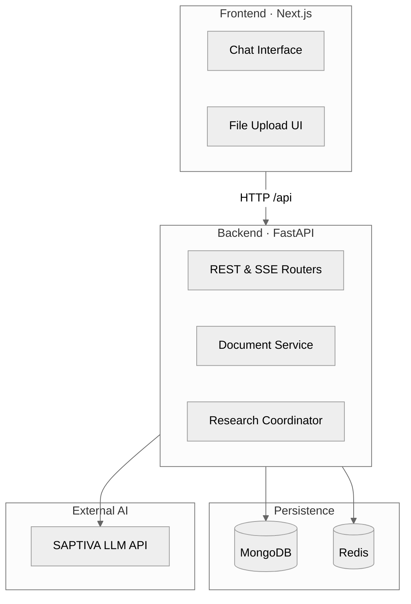

# Saptiva OctaviOS Chat

[](https://opensource.org/licenses/Apache-2.0)
[](https://www.docker.com/)
[](https://nodejs.org/)
[](https://www.python.org/)
[](#security-architecture)

OctaviOS Chat provides a production-ready conversational interface for SAPTIVA language models with integrated document review and enterprise-grade security.

## Features
- **Conversational UI**: ChatGPT-style interface with model selection, conversation history, and streaming responses.
- **Document Reviewer**: Upload PDFs and images to ask questions about their content.
- **SAPTIVA Integration**: Direct integration with the SAPTIVA API.
- **Security-First**: JWT authentication, rate limiting, and hardened containers.
- **Docker-First**: Consistent development and production environments.

## Quick Start

1.  **Setup the project:**
    ```bash
    make setup
    ```
    This interactive command will configure your environment, install dependencies, and generate necessary secrets. For non-interactive environments, use `make setup-quick`.

2.  **Start the development services:**
    ```bash
    make dev
    ```
    This will start the Next.js frontend, FastAPI backend, MongoDB, and Redis containers.

3.  **Create a demo user:**
    ```bash
    make create-demo-user
    ```
    This creates a test user with the credentials `demo` / `Demo1234`.

4.  **Open the application:**
    Visit [http://localhost:3000](http://localhost:3000) in your browser.

For common issues, see the [Troubleshooting Guide](docs/TROUBLESHOOTING.md).

## Project Structure

```
octavios-bridge/
├── apps/
│   ├── web/                # Next.js frontend application
│   └── api/                # FastAPI backend application
├── infra/
│   └── docker-compose.yml  # Service orchestration
├── envs/
│   └── .env.local.example  # Environment variable template
├── scripts/
│   └── ...                 # Automation and utility scripts
├── docs/
│   └── ...                 # Documentation
└── Makefile                # Development automation
```

## Architecture

The project uses a monorepo structure with a Next.js frontend and a FastAPI backend. Data is persisted in MongoDB, with Redis used for caching and session management.


For a more detailed architecture overview, see the [Architecture Documentation](docs/arquitectura/).

## Development

### Prerequisites
- Docker and Docker Compose 20.10+
- Node.js 18+
- Python 3.10+
- pnpm 8+

### Workflow
1.  Create a feature branch: `git checkout -b feature/my-feature`
2.  Run validations: `make test`, `make lint`
3.  Commit your changes with a conventional commit message: `git commit -m "feat: describe change"`

### Useful Commands
- `make help`: List all available commands.
- `make logs`: Tail the logs of all running services.
- `make test-all`: Run the complete test suite.
- `make clean`: Stop and remove all containers.
- `make shell-api` / `make shell-web`: Open a shell inside the API or web container.

## Deployment

The recommended deployment method is using the automated `deploy-tar` script, which handles building, transferring, and deploying the application.

```bash
make deploy-tar
```

For more advanced deployment options, see the [Deployment Documentation](docs/deployment/README.md).

## Observability

The project includes an optional observability stack with Prometheus, Grafana, and Loki.

```bash
# Start the monitoring stack
make obs-up

# Stop the monitoring stack
make obs-down
```
Dashboards will be available at:
- **Grafana**: [http://localhost:3001](http://localhost:3001)
- **Prometheus**: [http://localhost:9090](http://localhost:9090)

For more details, see the [Observability Documentation](docs/observability/README.md).