# Saptiva OctaviOS Chat

[](LICENSE)
[](https://www.docker.com/)
[](https://nodejs.org/)
[](https://www.python.org/)
[](https://fastapi.tiangolo.com/)
[](https://nextjs.org/)

> Plataforma conversacional lista para producción con chat streaming, RAG, auditoría COPILOTO_414 y herramientas MCP sobre FastAPI + Next.js.

## Tabla de contenidos
- [Saptiva OctaviOS Chat](#saptiva-octavios-chat)
  - [Tabla de contenidos](#tabla-de-contenidos)
  - [Resumen rápido](#resumen-rápido)
  - [Arquitectura Plugin-First (Micro-Kernel)](#arquitectura-plugin-first-micro-kernel)
    - [Filosofía de Diseño](#filosofía-de-diseño)
    - [Diagrama de Containers y Dependencias](#diagrama-de-containers-y-dependencias)
    - [Service Dependency Chain](#service-dependency-chain)
    - [Beneficios de Plugin-First](#beneficios-de-plugin-first)
    - [Comunicación entre Plugins](#comunicación-entre-plugins)
    - [Ports and URLs](#ports-and-urls)
    - [Referencias de Código](#referencias-de-código)
  - [Visión de alto nivel](#visión-de-alto-nivel)
    - [Mapa de arquitectura (alto nivel)](#mapa-de-arquitectura-alto-nivel)
    - [Contenedores principales](#contenedores-principales)
    - [Integraciones y observabilidad](#integraciones-y-observabilidad)
  - [Stack y capacidades](#stack-y-capacidades)
    - [Plataforma conversacional](#plataforma-conversacional)
    - [Documentos y RAG](#documentos-y-rag)
    - [Cumplimiento COPILOTO\_414](#cumplimiento-copiloto_414)
    - [Integración Audit File + Canvas (OpenCanvas)](#integración-audit-file--canvas-opencanvas)
    - [Model Context Protocol (MCP)](#model-context-protocol-mcp)
    - [Seguridad y observabilidad](#seguridad-y-observabilidad)
  - [Arquitectura](#arquitectura)
    - [Frontend (Next.js 14)](#frontend-nextjs-14)
    - [Backend (FastAPI + MCP)](#backend-fastapi--mcp)
    - [Integración Frontend ↔ Backend](#integración-frontend--backend)
    - [Flujo de chat (secuencia)](#flujo-de-chat-secuencia)
    - [Pipeline de ingestión y auditoría](#pipeline-de-ingestión-y-auditoría)
    - [Flujo de Audit Command + Canvas](#flujo-de-audit-command--canvas)
    - [Lazy loading MCP (descubrimiento → invocación)](#lazy-loading-mcp-descubrimiento--invocación)
  - [Inicio rápido](#inicio-rápido)
    - [Prerrequisitos](#prerrequisitos)
    - [1. Configuración inicial](#1-configuración-inicial)
    - [2. Levantar entorno](#2-levantar-entorno)
    - [3. Usuario demo](#3-usuario-demo)
    - [4. Verificación rápida](#4-verificación-rápida)
  - [Flujo de documentos y auditoría](#flujo-de-documentos-y-auditoría)
  - [Herramientas MCP](#herramientas-mcp)
  - [Frontend](#frontend)
  - [Backend](#backend)
  - [Pruebas y calidad](#pruebas-y-calidad)
      - [Ejecutar módulos o casos específicos](#ejecutar-módulos-o-casos-específicos)
    - [Cómo correr pruebas](#cómo-correr-pruebas)
    - [Dónde agregar nuevas pruebas](#dónde-agregar-nuevas-pruebas)
  - [Observabilidad y DevOps](#observabilidad-y-devops)
  - [Estructura del repositorio](#estructura-del-repositorio)
  - [Documentación adicional](#documentación-adicional)
  - [Solución de problemas](#solución-de-problemas)
  - [Contribuir](#contribuir)
  - [Licencia y soporte](#licencia-y-soporte)

## Resumen rápido
- **Arquitectura Plugin-First (Micro-Kernel)**: Core ligero orquesta plugins públicos (File Manager) y privados (Capital414) como microservicios independientes.
- Chat multi-modelo (Turbo, Cortex, Ops, etc.) con SSE y chain-of-responsibility (`apps/backend/src/routers/chat/endpoints/message_endpoints.py`).
- Integración MCP oficial (FastMCP) con lazy loading y telemetría (`apps/backend/src/mcp/server.py`).
- Pipeline documental: subida segura, cache Redis y extracción multi-tier antes del RAG (`apps/backend/src/services/document_service.py`).
- COPILOTO_414 coordina auditores de disclaimer, formato, logos, tipografía, gramática y consistencia semántica (`plugins/capital414-private/src/validation_coordinator.py`).
- Frontend Next.js 14 + Zustand con herramientas de archivos, research y UI accesible (`apps/web/src/lib/stores/chat-store.ts`).
- Seguridad empresarial: JWT con revocación en Redis, rate limiting y políticas CSP en Nginx (`apps/backend/src/middleware/auth.py`).

## Arquitectura Plugin-First (Micro-Kernel)

OctaviOS usa arquitectura **Plugin-First**: núcleo mínimo que orquesta y plugins aislados para escalar y versionar sin fricción.

### Filosofía de Diseño

- **Antes (monolito)**: un solo backend manejaba chat, archivos, auditorías, embeddings y storage; cada cambio implicaba rebuild total.
- **Ahora (plugin-first)**: core ligero para chat/auth; plugins públicos reutilizables (File Manager, browsing, memory); plugins privados con lógica Capital414 o asesoría bancaria.

### Diagrama de Containers y Dependencias

```mermaid
%%{init: {'theme': 'base', 'themeVariables': {'primaryColor': '#0f172a','primaryBorderColor': '#38bdf8','primaryTextColor': '#0f172a','lineColor': '#111827','textColor': '#111827','secondaryColor': '#ffffff','secondaryBorderColor': '#cbd5e1','secondaryTextColor': '#0f172a','tertiaryColor': '#f8fafc','tertiaryBorderColor': '#cbd5e1','tertiaryTextColor': '#0f172a'}}}%%
flowchart TB
    subgraph Frontend["🎨 Frontend Layer"]
        web["Next.js 14 Web<br/>Port: 3000<br/>Zustand + React Query"]:::frontend
    end

    subgraph Core["⚙️ Core Layer (Kernel)"]
        backend["Backend Core<br/>Port: 8000<br/>Chat · Auth · Orchestration"]:::core
    end

    subgraph PublicPlugins["🔌 Public Plugins (Open Source Ready)"]
        filemanager["File Manager Plugin<br/>Port: 8001<br/>Upload · Download · Extract"]:::plugin_public
    end

    subgraph PrivatePlugins["🔒 Private Plugins (Proprietary)"]
        capital414["Capital414 Auditor<br/>Port: 8002<br/>COPILOTO_414 Compliance"]:::plugin_private
    end

    subgraph Infrastructure["🗄️ Infrastructure Layer"]
        mongo[("MongoDB<br/>Port: 27017<br/>Sessions · Messages")]:::infra
        redis[("Redis<br/>Port: 6379<br/>Cache · JWT Blacklist")]:::infra
        minio[("MinIO<br/>Port: 9000<br/>S3 Object Storage")]:::infra
        qdrant[("Qdrant<br/>Port: 6333<br/>Vector Database")]:::infra
        languagetool["LanguageTool<br/>Port: 8010<br/>Grammar Check"]:::infra
    end

    %% User to Frontend
    user((👤 User)) --> web

    %% Frontend to Core
    web -->|"HTTP/SSE"| backend

    %% Core depends on Public Plugins
    backend -.->|"Depends on<br/>(health check)"| filemanager

    %% Private Plugins depend on Public Plugins
    capital414 -.->|"Depends on<br/>(health check)"| filemanager

    %% Backend to Infrastructure
    backend --> mongo
    backend --> redis

    %% File Manager to Infrastructure
    filemanager --> minio
    filemanager --> redis

    %% Capital414 to Infrastructure
    capital414 --> languagetool
    capital414 -->|"HTTP Client"| filemanager

    %% Core to Private Plugins (optional MCP integration)
    backend -.->|"MCP Protocol<br/>(optional)"| capital414

    classDef frontend fill:#c7f0ff,stroke:#0ea5e9,color:#0f172a
    classDef core fill:#ffe0a3,stroke:#f59e0b,color:#0f172a
    classDef plugin_public fill:#c6f6d5,stroke:#16a34a,color:#0f172a
    classDef plugin_private fill:#fed7e2,stroke:#fb7185,color:#0f172a
    classDef infra fill:#e5e7eb,stroke:#94a3b8,color:#0f172a
```



### Service Dependency Chain

La cadena de dependencias garantiza inicio ordenado:

```
1. Infrastructure Layer
   └─> MongoDB, Redis, MinIO, Qdrant, LanguageTool (parallel start)

2. Public Plugins Layer
   └─> File Manager (depends on: MinIO healthy, Redis healthy)

3. Core Layer
   └─> Backend (depends on: MongoDB healthy, Redis healthy, File Manager healthy)

4. Private Plugins Layer
   └─> Capital414 Auditor (depends on: File Manager healthy, LanguageTool healthy)

5. Frontend Layer
   └─> Next.js Web (depends on: Backend healthy)
```

### Beneficios de Plugin-First

| Ventaja | Descripción |
|---------|-------------|
| **Desacoplamiento** | Plugins se desarrollan, prueban y despliegan independientemente |
| **Escalabilidad Horizontal** | Escalar solo el plugin que necesita más recursos (ej: File Manager) |
| **Open Source Ready** | Plugins públicos pueden liberarse sin exponer lógica de negocio |
| **Hot Swap** | Reemplazar implementaciones (ej: MinIO File Manager → Google Drive Plugin) |
| **Ownership Claro** | Cada plugin tiene un owner, CI/CD y versioning independiente |

### Comunicación entre Plugins

**HTTP Client Pattern** (Actual):
- Core y Capital414 tienen `FileManagerClient` que consume File Manager via HTTP REST
- Ejemplo: `await file_manager_client.download_to_temp(minio_key)` en Capital414

**MCP Protocol** (Futuro - Opcional):
- Plugins pueden exponerse como MCP servers para mayor flexibilidad
- Core puede descubrir y consumir herramientas de plugins via MCP lazy loading

### Ports and URLs

| Service | Port | Internal URL | External URL |
|---------|------|--------------|--------------|
| Frontend (Next.js) | 3000 | - | http://localhost:3000 |
| Backend Core | 8000 | http://backend:8000 | http://localhost:8000 |
| File Manager | 8001 | http://file-manager:8001 | http://localhost:8001 |
| Capital414 | 8002 | http://file-auditor:8002 | http://localhost:8002 |
| MongoDB | 27017 | mongodb://<mongo-host>:27017 | - |
| Redis | 6379 | redis://<redis-host>:6379 | - |
| MinIO | 9000 | http://minio:9000 | http://localhost:9000 |
| MinIO Console | 9001 | - | http://localhost:9001 |
| Qdrant | 6333 | http://qdrant:6333 | http://localhost:6333 |
| LanguageTool | 8010 | http://languagetool:8010 | - |

### Referencias de Código

| Componente | Path |
|------------|------|
| Backend Core | `apps/backend/` |
| File Manager Plugin | `plugins/public/file-manager/` |
| Capital414 Plugin | `plugins/capital414-private/` |
| Backend FileManagerClient | `apps/backend/src/services/file_manager_client.py` |
| Capital414 FileManagerClient | `plugins/capital414-private/src/clients/file_manager.py` |
| Docker Compose | `infra/docker-compose.yml` |

### Comunicación entre Servicios (Código)

La arquitectura Plugin-First usa **HTTP Client Pattern** y **MCP Protocol** para comunicación inter-servicios. Aquí ejemplos de código real:

#### Backend Core → File Manager Plugin (HTTP Client)

```python
# apps/backend/src/services/file_manager_client.py
from httpx import AsyncClient, Timeout
from structlog import get_logger

logger = get_logger(__name__)

class FileManagerClient:
    def __init__(self, base_url: str = "http://file-manager:8001"):
        self.base_url = base_url
        self.client = AsyncClient(timeout=Timeout(30.0))

    async def upload_file(
        self,
        file: UploadFile,
        user_id: str,
        session_id: str
    ) -> dict:
        """Upload file to File Manager Plugin via HTTP."""
        logger.info("Uploading file to File Manager", filename=file.filename)

        files = {"file": (file.filename, file.file, file.content_type)}
        data = {"user_id": user_id, "session_id": session_id}

        response = await self.client.post(
            f"{self.base_url}/upload",
            files=files,
            data=data
        )
        response.raise_for_status()
        return response.json()

    async def download_file(self, minio_key: str) -> bytes:
        """Download file from File Manager Plugin."""
        logger.info("Downloading file from File Manager", minio_key=minio_key)

        response = await self.client.get(
            f"{self.base_url}/download/{minio_key}"
        )
        response.raise_for_status()
        return response.content
```

**Uso en Backend Core**:
```python
# apps/backend/src/routers/files.py
from services.file_manager_client import get_file_manager_client

@router.post("/upload")
async def upload_file_endpoint(
    file: UploadFile = File(...),
    fm_client: FileManagerClient = Depends(get_file_manager_client)
):
    # Backend Core delega a File Manager Plugin
    result = await fm_client.upload_file(file, user_id, session_id)
    return result
```

#### Backend Core → Capital414 Plugin (MCP Protocol)

```python
# apps/backend/src/mcp/client.py
from mcp import ClientSession
from structlog import get_logger

logger = get_logger(__name__)

class MCPClient:
    def __init__(self, server_url: str = "http://file-auditor:8002"):
        self.server_url = server_url
        self.session = ClientSession(server_url)

    async def call_tool(
        self,
        tool_name: str,
        arguments: dict
    ) -> dict:
        """Invoke MCP tool on Capital414 Plugin."""
        logger.info("Invoking MCP tool", tool_name=tool_name)

        result = await self.session.call_tool(
            name=tool_name,
            arguments=arguments
        )
        return result
```

**Uso en Backend Core**:
```python
# apps/backend/src/routers/chat.py
from mcp.client import get_mcp_client

@router.post("/chat")
async def chat_endpoint(
    message: str,
    mcp_client: MCPClient = Depends(get_mcp_client)
):
    # Detectar comando de auditoría
    if message.startswith("Auditar archivo:"):
        # Backend Core delega a Capital414 Plugin vía MCP
        result = await mcp_client.call_tool(
            tool_name="audit_document_full",
            arguments={"minio_key": doc_key, "policy_id": "copiloto_414"}
        )
        return result
```

#### Capital414 Plugin → File Manager Plugin (HTTP Client)

```python
# plugins/capital414-private/src/clients/file_manager.py
from httpx import AsyncClient

class FileManagerClient:
    def __init__(self, base_url: str = "http://file-manager:8001"):
        self.base_url = base_url
        self.client = AsyncClient()

    async def download_to_temp(self, minio_key: str) -> str:
        """Download PDF from File Manager for audit processing."""
        response = await self.client.get(
            f"{self.base_url}/download/{minio_key}"
        )
        response.raise_for_status()

        # Save to temp file for audit processing
        temp_path = f"/tmp/{minio_key}"
        with open(temp_path, "wb") as f:
            f.write(response.content)

        return temp_path
```

**Uso en Capital414 Plugin**:
```python
# plugins/capital414-private/src/handlers/audit_handler.py
from clients.file_manager import get_file_manager_client

class AuditCommandHandler:
    def __init__(self, fm_client: FileManagerClient):
        self.fm_client = fm_client

    async def handle(self, doc_key: str):
        # Capital414 consume File Manager Plugin para obtener PDF
        pdf_path = await self.fm_client.download_to_temp(doc_key)

        # Ejecutar auditoría con PDF local
        report = await self.coordinator.validate_document(pdf_path)
        return report
```

**Ventajas de esta arquitectura**:
- **Desacoplamiento**: Cada servicio solo conoce la URL del otro, no sus implementaciones
- **Testabilidad**: Fácil mockear `FileManagerClient` o `MCPClient` en tests
- **Escalabilidad**: Cada plugin puede tener múltiples réplicas detrás de un load balancer
- **Dependency Inversion**: Backend Core depende de abstracciones (interfaces), no de implementaciones concretas

## Visión de alto nivel

Vista macro de los componentes: primero un mapa de patrones/contendores y luego vistas específicas de contenedores e integraciones.

### Mapa de arquitectura (alto nivel)
Arquitectura **Plugin-First** en una vista: Core ligero que delega en plugins y comparte patrones transversales (Chain of Responsibility, Builder, HTTP Client, MCP).

```mermaid
%%{init: {'theme': 'base', 'themeVariables': {'primaryColor': '#0f172a','primaryBorderColor': '#38bdf8','primaryTextColor': '#0f172a','lineColor': '#111827','textColor': '#111827','secondaryColor': '#ffffff','secondaryBorderColor': '#cbd5e1','secondaryTextColor': '#0f172a','tertiaryColor': '#f8fafc','tertiaryBorderColor': '#cbd5e1','tertiaryTextColor': '#0f172a'}}}%%
flowchart TB
    user((Usuarios)):::dark --> web["Frontend<br/>Next.js 14 + React Query<br/>Port 3000"]:::frontend

    web --> core["Backend Core (Kernel)<br/>Chat · Auth · Orchestration<br/>Port 8000"]:::core

    core --> filemanager["File Manager Plugin<br/>Upload · Download · Extract<br/>Port 8001"]:::plugin_public
    core -.->|"MCP Protocol"| capital414["Capital414 Plugin<br/>COPILOTO_414 Audits<br/>Port 8002"]:::plugin_private

    capital414 -->|"HTTP Client"| filemanager

    subgraph "Core Services"
        chat_svc["ChatService<br/>Chain of Responsibility"]:::light
        file_client["FileManagerClient<br/>HTTP Client Pattern"]:::light
    end

    subgraph "File Manager Services"
        minio_ops["MinIO Operations<br/>S3 Compatible"]:::light
        extraction["Text Extraction<br/>pypdf → SDK → OCR"]:::light
    end

    subgraph "Capital414 Services"
        coordinator["ValidationCoordinator<br/>8 Auditores Paralelos"]:::light
        fm_client["FileManagerClient<br/>Download PDFs"]:::light
    end

    core --> chat_svc
    core --> file_client
    filemanager --> minio_ops
    filemanager --> extraction
    capital414 --> coordinator
    capital414 --> fm_client

    file_client -.->|"Delega"| filemanager
    fm_client -.->|"Delega"| filemanager

    chat_svc --> persistence[(MongoDB · Redis<br/>Sessions · Messages<br/>JWT Blacklist)]:::infra
    minio_ops --> storage[(MinIO S3<br/>Documents · Reports<br/>Thumbnails)]:::infra
    coordinator --> persistence
    coordinator --> storage

    chat_svc --> observability["Observability<br/>Prometheus · OTel<br/>Structlog"]:::gray
    filemanager --> observability
    capital414 --> observability

    classDef dark fill:#0f172a,stroke:#38bdf8,color:#e2e8f0;
    classDef frontend fill:#c7f0ff,stroke:#0ea5e9,color:#0f172a;
    classDef core fill:#ffe0a3,stroke:#f59e0b,color:#0f172a;
    classDef plugin_public fill:#c6f6d5,stroke:#16a34a,color:#0f172a;
    classDef plugin_private fill:#fed7e2,stroke:#fb7185,color:#0f172a;
    classDef light fill:#ffffff,stroke:#cbd5e1,color:#0f172a;
    classDef infra fill:#e5e7eb,stroke:#94a3b8,color:#0f172a;
    classDef gray fill:#f8fafc,stroke:#cbd5e1,color:#0f172a;
```



**Arquitectura en acción**:
- Frontend (3000) conversa con el Core (8000) por REST/SSE.
- Core delega archivos a File Manager (8001) y auditorías a Capital414 (8002) vía HTTP/MCP.
- Mongo/Redis cubren sesiones y cache; MinIO guarda archivos y reportes.
- Observabilidad única con Prometheus + OTel + structlog en todos los servicios.

### Contenedores principales
Vista detallada de la **arquitectura Plugin-First**: core liviano y plugins especializados.

```mermaid
%%{init: {'theme': 'base', 'themeVariables': {'primaryColor': '#0f172a','primaryBorderColor': '#38bdf8','primaryTextColor': '#0f172a','lineColor': '#111827','textColor': '#111827','secondaryColor': '#ffffff','secondaryBorderColor': '#cbd5e1','secondaryTextColor': '#0f172a','tertiaryColor': '#f8fafc','tertiaryBorderColor': '#cbd5e1','tertiaryTextColor': '#0f172a'}}}%%
flowchart TB
    user((Usuarios)):::light --> web_ui

    subgraph Frontend["🔵 Frontend (Next.js 14 + App Router) - Port 3000"]
        web_ui["ChatView<br/>ChatMessage<br/>CompactChatComposer"]:::frontend
        web_components["PreviewAttachment<br/>ThumbnailImage<br/>CodeBlock"]:::frontend
        web_clients["HTTP/SSE Clients<br/>+ Zustand Stores<br/>React Query"]:::frontend
    end

    web_ui --> web_components
    web_components --> web_clients
    web_clients --> gateway

    subgraph Core["🟢 Backend Core (Kernel) - Port 8000"]
        gateway["Gateway Middleware<br/>Auth JWT + Blacklist<br/>CORS · RateLimit<br/>Telemetry"]:::core

        subgraph Handlers["Request Handlers (Thin Layer)"]
            chat_router["Chat Router<br/>StreamingHandler<br/>SSE Response"]:::core
            file_router["File Router<br/>Delegates to File Manager"]:::core
            audit_router["Audit Router<br/>Delegates to Capital414"]:::core
        end

        subgraph CoreServices["Core Services (Orchestration Only)"]
            chat_service["ChatService<br/>LLM Orchestration"]:::core
            fm_client["FileManagerClient<br/>HTTP Client Pattern"]:::core
            session_mgr["SessionManager<br/>Auth · Context"]:::core
        end
    end

    gateway --> chat_router
    gateway --> file_router
    gateway --> audit_router

    chat_router --> chat_service
    file_router --> fm_client
    audit_router -.->|"MCP Protocol"| capital414_service

    subgraph FileManager["🟠 File Manager Plugin (Public) - Port 8001"]
        fm_routes["Upload · Download<br/>Extract · Thumbnails"]:::plugin_public
        fm_extraction["Multi-tier Extraction<br/>pypdf → PDF SDK → OCR"]:::plugin_public
        fm_minio["MinIO Client<br/>S3 Operations"]:::plugin_public
    end

    fm_client -->|"HTTP Client"| fm_routes
    fm_routes --> fm_extraction
    fm_extraction --> fm_minio

    subgraph Capital414["🔴 Capital414 Plugin (Private) - Port 8002"]
        capital414_service["MCP Server<br/>Tool: audit_document_full"]:::plugin_private
        validation_coord["ValidationCoordinator<br/>COPILOTO_414<br/>Orchestrator Pattern"]:::plugin_private
        auditores["8 Auditores Paralelos<br/>Disclaimer · Format · Grammar<br/>Typography · Logo · Color · Entity · Semantic"]:::plugin_private
        c414_fm_client["FileManagerClient<br/>Download PDF for Audit"]:::plugin_private
    end

    capital414_service --> validation_coord
    validation_coord --> auditores
    auditores --> c414_fm_client
    c414_fm_client -->|"HTTP Client"| fm_routes

    subgraph Infrastructure["⚙️ Infrastructure Layer"]
        mongo[(MongoDB + Beanie<br/>Sessions · Messages<br/>Documents · Reports)]:::infra
        redis[(Redis<br/>Cache · JWT Blacklist<br/>MCP Registry · Sessions)]:::infra
        minio[(MinIO S3<br/>Documents · Reports<br/>Thumbnails · PDFs)]:::infra
        languagetool["LanguageTool<br/>Grammar Auditor"]:::infra
    end

    chat_service --> mongo
    chat_service --> redis
    session_mgr --> redis
    fm_minio --> minio
    validation_coord --> mongo
    auditores --> languagetool

    classDef frontend fill:#c7f0ff,stroke:#0ea5e9,color:#0f172a;
    classDef core fill:#ffe0a3,stroke:#f59e0b,color:#0f172a;
    classDef plugin_public fill:#c6f6d5,stroke:#16a34a,color:#0f172a;
    classDef plugin_private fill:#fed7e2,stroke:#fb7185,color:#0f172a;
    classDef infra fill:#e5e7eb,stroke:#94a3b8,color:#0f172a;
```



**Flujo Plugin-First** (resumen):
1. Frontend → Core (8000).
2. Core delega: archivos a File Manager (8001), auditorías a Capital414 (8002) vía HTTP/MCP.
3. File Manager gestiona upload/extract/thumbnails contra MinIO/Redis.
4. Capital414 orquesta auditores COPILOTO_414 y consume File Manager.
5. Infra común (Mongo, Redis, MinIO, LanguageTool) compartida por quien la necesita.

**Por qué sirve**: Core liviano, plugins escalan y versionan aparte, File Manager es open-source ready y Capital414 queda aislado con su ciclo propio.

### Integraciones y observabilidad
Diagrama que muestra la **integración Plugin-First** con servicios externos, persistencia distribuida, y observabilidad centralizada.

```mermaid
%%{init: {'theme': 'base', 'themeVariables': {'primaryColor': '#0f172a','primaryBorderColor': '#38bdf8','primaryTextColor': '#0f172a','lineColor': '#111827','textColor': '#111827','secondaryColor': '#ffffff','secondaryBorderColor': '#cbd5e1','secondaryTextColor': '#0f172a','tertiaryColor': '#f8fafc','tertiaryBorderColor': '#cbd5e1','tertiaryTextColor': '#0f172a'}}}%%
flowchart TB
    subgraph Core["🟢 Backend Core (Port 8000)"]
        chat_core["ChatService<br/>StreamingHandler<br/>SSE Events"]:::core
        auth_core["Auth Service<br/>JWT + Blacklist<br/>Session Mgmt"]:::core
        fm_client_core["FileManagerClient<br/>HTTP Client"]:::core
    end

    subgraph FileManager["🟠 File Manager Plugin (Port 8001)"]
        fm_service["Upload/Download/Extract<br/>Multi-tier Extraction<br/>Thumbnail Generation"]:::plugin_public
    end

    subgraph Capital414["🔴 Capital414 Plugin (Port 8002)"]
        audit_service["MCP Server<br/>COPILOTO_414"]:::plugin_private
        validation_coord["ValidationCoordinator<br/>8 Auditores Streaming"]:::plugin_private
    end

    subgraph External["🌐 Servicios Externos"]
        saptiva["SAPTIVA LLMs<br/>Turbo · Cortex · Ops"]:::external
        aletheia["Aletheia Research<br/>Deep Research API"]:::external
        languagetool["LanguageTool<br/>Grammar Checking"]:::external
        smtp["SMTP Service<br/>Email Notifications"]:::external
    end

    subgraph Storage["💾 Almacenamiento Distribuido"]
        mongo["MongoDB<br/>Core: Sessions · Messages<br/>Capital414: Reports"]:::infra
        redis["Redis<br/>Core: Cache · JWT Blacklist<br/>FileManager: Extract Cache"]:::infra
        minio["MinIO S3<br/>FileManager: Files · Thumbnails<br/>Capital414: Reports"]:::infra
    end

    subgraph Observability["📊 Stack de Observabilidad"]
        prom["Prometheus<br/>Request Metrics<br/>MCP Invocations"]:::infra
        otel["OpenTelemetry<br/>Distributed Traces<br/>Spans"]:::infra
        logs["Structlog<br/>JSON Logs<br/>Context Info"]:::infra
        grafana["Grafana<br/>Dashboards<br/>Alerting"]:::infra
    end

    %% Plugin-First Communication
    chat_core -->|"HTTP Client"| fm_service
    fm_client_core -->|"HTTP Client"| fm_service
    chat_core -.->|"MCP Protocol"| audit_service
    audit_service --> validation_coord
    validation_coord -->|"HTTP Client"| fm_service

    %% External Service Connections
    chat_core --> saptiva
    chat_core --> aletheia
    validation_coord --> languagetool
    fm_service --> smtp

    %% Storage Connections (Distributed)
    chat_core --> mongo
    chat_core --> redis
    auth_core --> redis
    fm_service --> minio
    fm_service --> redis
    validation_coord --> mongo
    validation_coord --> minio

    %% Observability (Centralized)
    chat_core --> prom
    chat_core --> otel
    chat_core --> logs
    fm_service --> prom
    fm_service --> logs
    audit_service --> otel
    validation_coord --> logs

    prom --> grafana
    otel --> grafana
    logs --> grafana

    classDef core fill:#ffe0a3,stroke:#f59e0b,color:#0f172a;
    classDef plugin_public fill:#c6f6d5,stroke:#16a34a,color:#0f172a;
    classDef plugin_private fill:#fed7e2,stroke:#fb7185,color:#0f172a;
    classDef external fill:#ddd6fe,stroke:#7c3aed,color:#0f172a;
    classDef infra fill:#e5e7eb,stroke:#94a3b8,color:#0f172a;
```



**Claves de integración**:
- Core (8000) solo orquesta chat/auth y clientes HTTP/MCP; no ejecuta operaciones pesadas.
- File Manager (8001) maneja upload/download/extract multi-tier y thumbnails contra MinIO/Redis.
- Capital414 (8002) corre COPILOTO_414 con 8 auditores en paralelo y baja PDFs vía File Manager.
- Externos: SAPTIVA, Aletheia, LanguageTool, SMTP; observabilidad única con Prometheus + OTel + structlog + Grafana.
- Patrones: Chain of Responsibility en chat, Builder para respuestas, adapter MCP/HTTP, reaper de storage y coordinador de auditores.

## Stack y capacidades

### Plataforma conversacional
- **Streaming + fallback**: SSE via `StreamingHandler` y respuestas síncronas con builder de mensajes (`apps/backend/src/routers/chat/handlers/streaming_handler.py`).
- **Contexto inteligente**: `ChatService` recupera historial Beanie, normaliza herramientas y arma prompts para SAPTIVA (`apps/backend/src/services/chat_service.py`).
- **UI reactiva**: Zustand gestiona selección de chat, modelos y herramientas con hidratación SWR (`apps/web/src/lib/stores/chat-store.ts`).

### Documentos y RAG
- **Ingesta segura**: archivos se guardan en disco temporal con límites de tamaño y "reaper" (`apps/backend/src/services/storage.py`).
- **Persistencia primaria**: objetos se escriben en MinIO con rutas por usuario/chat y metadatos (`apps/backend/src/services/minio_storage.py`).
- **Cache de texto**: Redis almacena extractos 1h y valida ownership antes de usarlos en prompts (`apps/backend/src/services/document_service.py`).
- **RAG con Qdrant Vector DB**: Sistema completo de búsqueda semántica usando Qdrant como base de datos vectorial (`apps/backend/src/services/qdrant_service.py`):
  - **Embeddings**: Modelo `paraphrase-multilingual-MiniLM-L12-v2` (384 dimensiones) para generación de embeddings
  - **Chunking inteligente**: 500 tokens por chunk con 100 tokens de overlap (20%) para preservar contexto
  - **Búsqueda semántica**: Cosine similarity con threshold configurable (0.7 por defecto)
  - **Aislamiento de contexto**: Filtrado obligatorio por `session_id` para prevenir fugas de información entre conversaciones
  - **Estrategias adaptativas**: `SemanticSearchStrategy` y `OverviewStrategy` para diferentes tipos de consultas
  - **Herramienta MCP**: `get_segments` (`apps/backend/src/mcp/tools/get_segments.py`) expone búsqueda semántica como herramienta productiva
  - **Orquestación**: `AdaptiveRetrievalOrchestrator` selecciona estrategia óptima según tipo de query

### Cumplimiento COPILOTO_414
- **Arquitectura**: Plugin privado independiente (`plugins/capital414-private/`) corriendo en puerto 8002
- **Coordinador**: `ValidationCoordinator` ejecuta 8 auditores en paralelo de forma asíncrona
- **Auditores**: Disclaimer, Format, Typography, Grammar, Logo, Color, Entity, Semantic
- **Comunicación**: Backend invoca via MCP protocol o HTTP Client
- **File Handling**: Plugin consume `file-manager` plugin para descargar PDFs temporales
- **Persistencia**: Reportes se guardan en MongoDB + MinIO con políticas dinámicas
- **Ubicación**: `plugins/capital414-private/src/validation_coordinator.py`

### Integración Audit File + Canvas (OpenCanvas)

Auditoría COPILOTO_414 con panel lateral tipo OpenCanvas: el chat recibe el resumen humano y el canvas muestra el reporte técnico.

**Flujo resumido**:
1. Usuario envía `"Auditar archivo: filename.pdf"`.
2. `AuditCommandHandler` (`plugins/capital414-private/src/handlers/audit_handler.py`) detecta el comando y descarga el PDF desde File Manager.
3. `ValidationCoordinator` ejecuta 8 auditores en paralelo (disclaimer, format, typography, grammar, logo, color, entity, semantic).
4. Se generan dos salidas: `generate_human_summary()` para chat y `format_executive_summary_as_markdown()` para canvas (`apps/backend/src/services/summary_formatter.py`).
5. Se crea un `Artifact` con el reporte técnico y se devuelve en `tool_invocations` (`plugins/capital414-private/src/handlers/audit_handler.py:168-176`).
6. Frontend renderiza el resumen en chat y abre `CanvasPanel` (`apps/web/src/components/canvas/canvas-panel.tsx`) con el artifact vía `CanvasContext`.

**Separación de contenidos**:

| Ubicación | Contenido | Propósito | Formato |
|-----------|-----------|-----------|---------|
| **Chat** | Human Summary | Resumen conversacional | Texto plano con emoji |
| **Canvas** | Technical Report | Hallazgos + severidades + páginas | Markdown estructurado |

**Arquitectura de Artifacts**:

```python
# apps/backend/src/models/artifact.py
class Artifact(Document):
    id: str                          # UUID
    user_id: str                     # Owner
    chat_session_id: Optional[str]   # Associated chat
    title: str                       # "Reporte de Auditoría: filename.pdf"
    type: ArtifactType              # MARKDOWN | CODE | GRAPH
    content: Union[str, Dict]        # Technical report (Markdown)
    versions: List[ArtifactVersion] # Version history
```

**Beneficios del Canvas**:
- ✅ Chat limpio con resumen ejecutivo; detalles técnicos viven en el canvas.
- ✅ Canvas mantiene contexto por chat y se cierra al cambiar de conversación.
- ✅ Artifacts versionan reportes y soportan markdown, código o gráficos.

**Ejemplo de Tool Invocation**:

```json
{
  "decision_metadata": {
    "audit": true,
    "validation_report_id": "report-uuid",
    "tool_invocations": [
      {
        "tool_name": "create_artifact",
        "result": {
          "id": "artifact-uuid",
          "title": "Reporte de Auditoría: document.pdf",
          "type": "markdown"
        }
      }
    ]
  }
}
```

**Referencias de código**:
- Backend Handler: `plugins/capital414-private/src/handlers/audit_handler.py:168-176` (creación artifact)
- Frontend Context: `apps/web/src/context/CanvasContext.tsx`
- Canvas Panel: `apps/web/src/components/canvas/canvas-panel.tsx`
- Summary Formatter: `apps/backend/src/services/summary_formatter.py`

### Model Context Protocol (MCP)
- Servidor FastMCP único con 5 herramientas productivas (`apps/backend/src/mcp/server.py`).
- Adaptador HTTP asegura auth y telemetría (`apps/backend/src/mcp/fastapi_adapter.py`).
- Lazy routing reduce el contexto (discover → load → invoke) (`apps/backend/src/mcp/lazy_routes.py`).
- Cliente frontend expone list/get/invoke/health con cancelaciones (`apps/web/src/lib/mcp/client.ts`).
- **Buenas prácticas Anthropic**:
  - `Tool.invoke` valida JSON Schema y normaliza errores (`apps/backend/src/mcp/tool.py`), evitando prompts mal formados.
  - Scopes `mcp:tools.*` / `mcp:admin.*` derivados de `MCP_ADMIN_USERS` protegen rutas sensibles (`apps/backend/src/mcp/security.py`).
  - Telemetría y rate limiting dedicados para rutas `/mcp/lazy/*` (Observer pattern) + métricas Prometheus (`apps/backend/src/mcp/metrics.py`).
  - Versionado centralizado (`apps/backend/src/mcp/versioning.py`) y compatibilidad hacia atrás en los contratos `schema_version`.
  - Herramientas documentadas con esquemas y ejemplos (`apps/backend/src/mcp/tools/*`) y cubiertas por `make test-mcp`, `make test-mcp-marker`.
  - Checklist Senior AI: valida scopes antes de montar la herramienta, instrumenta cada invocación (`metrics_collector.track_invocation`), agrega tracing en `FastMCPAdapter`, y prueba rutas `discover/load/invoke` con `scripts/test_mcp_tools.sh`.

### Seguridad y observabilidad
- **JWT + lista negra** en Redis (`apps/backend/src/middleware/auth.py`, `apps/backend/src/services/cache_service.py`).
- **Rate limiting** por IP y cabeceras de control (`apps/backend/src/middleware/rate_limit.py`).
- **Secret manager** opcional y computed fields (`apps/backend/src/core/config.py`).
- **Telemetry + tracing** con OTEL/Prometheus/structlog (`apps/backend/src/core/telemetry.py`).
- **Scopes MCP**: define `MCP_ADMIN_USERS` (usernames o correos separados por comas) para otorgar scopes `mcp:admin.*` en rutas sensibles (`/mcp/lazy/stats`, `/unload`), mientras el resto conserva sólo `mcp:tools.*`.

## Arquitectura

Tres vistas complementarias: frontend, backend y cómo se comunican. Cada diagrama resalta los módulos principales y el patrón de diseño aplicado.

### Frontend (Next.js 14)

Arquitectura reactiva moderna con React Query + Zustand, optimistic updates, y eliminación de race conditions.

**Stack**:
- **React Query**: Server state management (caching, deduplicación, SWR)
- **Zustand**: UI state (streaming, optimistic updates) con selectores para evitar re-renders innecesarios (`useFilesStore`).
- **Pure Functions**: Business logic (file-policies.ts)
- **TypeScript**: Type safety end-to-end

**Capacidades Optimistas**:
- **Mensajes inmediatos**: Latencia <10ms al enviar.
- **Archivos enriquecidos**: Previsualización instantánea con metadatos completos (nombre, tamaño, tipo) sin estado "loading".
- **Herramientas**: Indicadores de herramientas activas visibles inmediatamente en el mensaje optimista.
- **Status Tracking**: Feedback visual de estado "sending" sincronizado automáticamente.

**Arquitectura Reactiva**:

```mermaid
%%{init: {'theme': 'base', 'themeVariables': {'primaryColor': '#0f172a','primaryBorderColor': '#38bdf8','primaryTextColor': '#0f172a','lineColor': '#111827','textColor': '#111827','secondaryColor': '#ffffff','secondaryBorderColor': '#cbd5e1','secondaryTextColor': '#0f172a'}}}%%
flowchart TB
    User[("👤 Usuario")]:::user

    subgraph UI["Capa de Presentación"]
        ChatView["ChatView Component"]:::ui
        MessageList["Message List"]:::ui
        ChatInput["Chat Input"]:::ui
    end

    subgraph Reactive["Capa Reactiva (Hooks)"]
        useChatMessages["useChatMessages<br/>(React Query)"]:::reactive
        useChatMetadata["useChatMetadata<br/>(Metadata)"]:::reactive
        useSendMessage["useSendMessage<br/>(Optimistic)"]:::reactive
    end

    subgraph Cache["React Query Cache"]
        QueryCache["Query Cache<br/>60s staleTime<br/>SWR pattern"]:::cache
    end

    subgraph Sync["Zustand Sync Layer"]
        ChatStore["chat-store<br/>(UI State)"]:::sync
        setMessages["setMessages()"]:::sync
        setHydrated["setHydratedStatus()"]:::sync
    end

    subgraph Network["Network Layer"]
        APIClient["API Client<br/>(HTTP + SSE)"]:::network
    end

    Backend[("🔌 FastAPI Backend")]:::backend

    User -->|"Envía mensaje"| ChatInput
    ChatInput -->|"mutate()"| useSendMessage
    useSendMessage -->|"Optimistic Update<br/>(T=0ms)"| QueryCache
    QueryCache -->|"Sync"| setMessages
    setMessages --> ChatStore
    ChatStore -->|"Reactivo"| MessageList

    ChatView -->|"useQuery()"| useChatMessages
    useChatMessages -->|"Fetch"| APIClient
    APIClient -->|"GET /history"| Backend
    Backend -->|"Messages[]"| APIClient
    APIClient -->|"Cache"| QueryCache
    QueryCache -->|"Sync"| setHydrated

    ChatView -->|"Metadata"| useChatMetadata
    useChatMetadata -->|"Read"| ChatStore

    classDef user fill:#c7f0ff,stroke:#0ea5e9,color:#0f172a;
    classDef ui fill:#c7f0ff,stroke:#0ea5e9,color:#0f172a;
    classDef reactive fill:#f8fafc,stroke:#cbd5e1,color:#0f172a;
    classDef cache fill:#e5e7eb,stroke:#94a3b8,color:#0f172a;
    classDef sync fill:#f8fafc,stroke:#cbd5e1,color:#0f172a;
    classDef network fill:#c6f6d5,stroke:#16a34a,color:#0f172a;
    classDef backend fill:#ffe0a3,stroke:#f59e0b,color:#0f172a;
```



**Capas de la Arquitectura**:

1. **Presentación**: Componentes React (ChatView, MessageList, ChatInput)
2. **Reactiva**: Hooks especializados (useChatMessages, useChatMetadata, useSendMessage)
3. **Cache**: React Query (60s staleTime, SWR, deduplicación)
4. **Sync**: Zustand (UI state, streaming, persistencia)
5. **Network**: API Client (HTTP + SSE streaming)

**Flujo Temporal (Optimistic Updates)**:

| Tiempo | Acción | Resultado |
|--------|--------|-----------|
| T=0ms | User click "Send" | `useSendMessage.mutate()` |
| T=10ms | Optimistic update | UI muestra mensaje ✅ |
| T=50ms | API call | POST /api/chat (streaming) |
| T=150ms | First chunk | Assistant message aparece |
| T=300ms | Stream complete | Invalidate cache |
| T=350ms | Server sync | Replace temp ID → real ID |

**Métricas**:

| Métrica | Antes | Después | Mejora |
|---------|-------|---------|--------|
| Latencia percibida | ~300ms | <10ms | **-97%** |
| Race conditions | 3 | 0 | **-100%** |
| Fetches redundantes | 5-10 | 1-2 | **-80%** |
| Sources of truth | 4 | 1 | **-75%** |

**Documentación**: Ver [OPTIMISTIC_UPDATES.md](apps/web/OPTIMISTIC_UPDATES.md) para implementación completa.


**Arquitectura frontend detallada por capas**:

1. **App Router (Next.js 14)**: Enrutamiento con Server Components, rutas dinámicas para chat, páginas de auth y proxies API que reescriben a backend.

2. **Chat Interface**:
   - **ChatView** orquesta toda la UI con handler SSE integrado y limpieza agresiva de adjuntos.
   - **Logic**: Manejo robusto de estados de carga para chats borradores (`draft`) y temporales, evitando bloqueos de UI.
   - **Message Display**: ChatMessage con thumbnails/audit, StreamingMessage con typing real-time, FileReviewMessage y MessageAuditCard para COPILOTO_414
   - **Message Input**: CompactChatComposer con auto-submit para auditoría, PreviewAttachment con botón de audit, ThumbnailImage con fetch autenticado
   - **Content Display**: MarkdownMessage con syntax highlighting y CodeBlock con detección de lenguaje

3. **Zustand State**: 4 stores especializados (chat, files, research, auth) con persistencia, hidratación y sincronización optimista.

4. **Network Layer**:
   - **apiClient** con Axios, interceptors JWT, auto-retry y manejo de errores
   - **mcpClient** para descubrir/cargar/invocar herramientas MCP con cancelación
   - **SSE Handler** con EventSource, reconnect automático y parsing de eventos

5. **Custom Hooks**: useOptimizedChat (batching + debounce), useAuditFlow (trigger + progress), useFileUpload (multipart + eventos).

Todo implementa **State Pattern** (Zustand), **Gateway Pattern** (clients), **Observer Pattern** (SSE), y **Strategy Pattern** (message handlers).

### Backend Core + Plugins (Plugin-First Architecture)
Arquitectura **Plugin-First** mostrando Backend Core (Kernel ligero) delegando operaciones especializadas a plugins independientes.

```mermaid
%%{init: {'theme': 'base', 'themeVariables': {'primaryColor': '#0f172a','primaryBorderColor': '#38bdf8','primaryTextColor': '#0f172a','lineColor': '#111827','textColor': '#111827','secondaryColor': '#ffffff','secondaryBorderColor': '#cbd5e1','secondaryTextColor': '#0f172a','tertiaryColor': '#f8fafc','tertiaryBorderColor': '#cbd5e1','tertiaryTextColor': '#0f172a'}}}%%
flowchart TB
    client[HTTP/SSE Client]:::gray --> middleware

    subgraph BackendCore["🟢 Backend Core (Port 8000) - Kernel Ligero"]
        subgraph Middleware["Middleware Stack"]
            middleware["Gateway → Auth → RateLimit → Cache → Telemetry"]:::core
        end

        middleware --> routers

        subgraph Routers["API Routers (Thin Layer)"]
            chat_r["Chat Routes<br/>/api/chat · /api/sessions"]:::core
            files_r["File Routes<br/>/api/files/* (delegates)"]:::core
            audit_r["Audit Routes<br/>/api/audit/* (delegates)"]:::core
            auth_r["Auth Routes<br/>/api/auth/*"]:::core
        end

        routers --> chat_r
        routers --> files_r
        routers --> audit_r
        routers --> auth_r

        subgraph CoreServices["Core Services (Orchestration Only)"]
            chat_svc["ChatService<br/>Builder Pattern<br/>LLM Orchestration"]:::core
            fm_client["FileManagerClient<br/>HTTP Client Pattern"]:::core
            session_svc["SessionService<br/>Auth · Context"]:::core
        end

        chat_r --> chat_svc
        files_r --> fm_client
        audit_r -.->|"MCP Protocol"| capital414_mcp
        auth_r --> session_svc
    end

    subgraph FileManagerPlugin["🟠 File Manager Plugin (Port 8001) - Public"]
        fm_api["REST API<br/>/upload · /download · /extract"]:::plugin_public

        subgraph FileManagerServices["File Manager Services"]
            extraction["Multi-tier Extraction<br/>pypdf → PDF SDK → OCR"]:::plugin_public
            thumbnails["Thumbnail Generation<br/>Image Processing"]:::plugin_public
            fm_minio["MinIO Client<br/>S3 Operations"]:::plugin_public
        end

        fm_api --> extraction
        fm_api --> thumbnails
        extraction --> fm_minio
        thumbnails --> fm_minio
    end

    fm_client -->|"HTTP Client"| fm_api

    subgraph Capital414Plugin["🔴 Capital414 Plugin (Port 8002) - Private"]
        capital414_mcp["MCP Server<br/>Tool: audit_document_full"]:::plugin_private

        subgraph COPILOTO["COPILOTO_414"]
            validator["ValidationCoordinator<br/>Orchestrator Pattern"]:::plugin_private
            auditores["8 Auditors Parallel<br/>Disclaimer · Format · Grammar<br/>Typography · Logo · Color<br/>Entity · Semantic"]:::plugin_private
        end

        c414_fm_client["FileManagerClient<br/>Download PDF"]:::plugin_private

        capital414_mcp --> validator
        validator --> auditores
        auditores --> c414_fm_client
    end

    c414_fm_client -->|"HTTP Client"| fm_api

    subgraph Persistence["💾 Persistence (Ports & Adapters)"]
        mongo[("MongoDB<br/>Core: Sessions · Messages<br/>Capital414: Reports")]:::infra
        redis[("Redis<br/>Core: Cache · JWT Blacklist<br/>FileManager: Extract Cache")]:::infra
        minio[("MinIO S3<br/>FileManager: Files · Thumbs<br/>Capital414: Reports")]:::infra
    end

    chat_svc --> mongo
    chat_svc --> redis
    session_svc --> redis
    middleware --> redis
    fm_minio --> minio
    validator --> mongo

    subgraph External["🌐 External APIs"]
        saptiva["SAPTIVA LLMs<br/>Turbo · Cortex · Ops"]:::external
        aletheia["Aletheia Research<br/>Deep Research"]:::external
        languagetool["LanguageTool<br/>Grammar Checking"]:::external
    end

    chat_svc --> saptiva
    chat_svc --> aletheia
    auditores --> languagetool

    class Routers routers;
    classDef core fill:#ffe0a3,stroke:#f59e0b,color:#0f172a;
    classDef plugin_public fill:#c6f6d5,stroke:#16a34a,color:#0f172a;
    classDef plugin_private fill:#fed7e2,stroke:#fb7185,color:#0f172a;
    classDef external fill:#ddd6fe,stroke:#7c3aed,color:#0f172a;
    classDef infra fill:#e5e7eb,stroke:#94a3b8,color:#0f172a;
    classDef gray fill:#f8fafc,stroke:#cbd5e1,color:#0f172a;
    classDef routers fill:#ffe0a3,stroke:#f59e0b,color:#ffffff;
```



**Capa a capa**:
- **Core 8000**: middleware (auth, rate-limit, cache, telemetry), routers delgados y servicios de orquestación. No ejecuta trabajos pesados.
- **File Manager 8001**: REST `/upload|download|extract`, extracción multi-tier + thumbnails, persiste en MinIO/Redis.
- **Capital414 8002**: MCP tool `audit_document_full`, ValidationCoordinator con 8 auditores, descarga PDFs vía File Manager y persiste reportes en Mongo/MinIO.

**Ventajas**: core simple, plugins escalan y versionan aparte, File Manager publicable, Capital414 aislado y con inversión de dependencias (HTTP/MCP).

**Patrones clave**: HTTP Client inter-plugin, MCP tools, Builder en ChatService, Orchestrator en ValidationCoordinator, adapters de persistencia, micro-kernel para separar concerns.

### Integración Frontend ↔ Backend
Conexiones clave: REST, SSE y MCP; se incluyen dependencias externas (LLMs y herramientas) y dónde se instrumenta.


Este diagrama resume la interacción **cliente-servidor**: Next.js usa REST para acciones cortas, SSE para streaming y MCP para herramientas avanzadas. FastAPI actúa como gateway y delega en ChatService/FastMCP; Redis y Mongo aportan contexto persistente; telemetría captura métricas y trazas en ambos entrypoints.

`infra/docker-compose.yml` levanta todos los servicios (Mongo, Redis, FastAPI, Next.js, MinIO, LanguageTool, Playwright y Nginx opcional) con healthchecks y perfiles.

### Flujo de chat (secuencia)

Secuencia completa del envío de un mensaje streaming desde el cliente hasta SAPTIVA y de regreso mediante SSE.


Funcionamiento: el request crea un `ChatContext`, el `StreamingHandler` lanza un iterador SSE y `ChatService` decide la estrategia (Chain of Responsibility). SAPTIVA devuelve tokens que viajan como eventos SSE, se persisten en Mongo y finalmente se manda `event:done`, garantizando idempotencia y consistencia temporal.

### Pipeline de ingestión y auditoría

Secuencia de subida de archivos, persistencia y ejecución del coordinador COPILOTO_414.


Pipeline en etapas: Upload → Persistencia → Cache → Auditoría. Dropzone valida tipo/tamaño, Storage limita y limpia, File Manager persiste en MinIO/Redis, y ValidationCoordinator orquesta los auditores antes de responder a la UI.

### Flujo de Audit Command + Canvas (Plugin-First)

Secuencia completa desde el comando "Auditar archivo:" hasta la renderización dual (chat + canvas) mostrando la **arquitectura Plugin-First**.


**Flujo resumido**:
- Core detecta el comando y lo delega vía MCP a Capital414.
- Capital414 baja el PDF desde File Manager, ejecuta 8 auditores y genera resumen humano + reporte técnico (markdown).
- Se crea un Artifact con el reporte, se inyecta en `tool_invocations` y el frontend lo pinta: chat muestra el resumen, canvas el reporte.

### Lazy loading MCP (descubrimiento → invocación)

Flujo HTTP que sigue el frontend para descubrir, cargar e invocar herramientas MCP sin cargar todo el contexto.


Funcionamiento: el `MCPClient` implementa un ciclo Discover → Load → Invoke. El módulo `Discover` expone un registro ligero, `Loader` materializa la herramienta bajo demanda (Lazy Loading) y `Invoker` la ejecuta envolviendo la llamada con autenticación y telemetría. El caché evita cargar specs completas en cada request, logrando el 98 % de reducción de contexto declarado.

## Inicio rápido

### Prerrequisitos
- Docker 20.10+, Docker Compose v2
- Python 3.11 (para scripts y tests locales)
- Node.js 18+ y pnpm 8+

### 1. Configuración inicial
```bash
make setup         # asistente interactivo (variables en envs/.env)
# o
make setup-quick   # valores por defecto (CI/CD)
```

### 2. Levantar entorno
```bash
make dev
# Usa docker compose -p capital414-chat (contenedores: capital414-chat-api, -web, etc.)
```
Servicios:
- Frontend http://localhost:3000
- Backend http://localhost:8000/api
- MinIO http://localhost:9001 (console)
- Mongo/Redis/LangTool corren en la misma red docker.

### 3. Usuario demo
```bash
make create-demo-user
```
Credenciales: `demo / Demo1234`.

### 4. Verificación rápida
```bash
make verify
```
Ejecuta health checks de contenedores, API, DB y frontend.

## Flujo de documentos y auditoría
1. Upload validado en dropzone → FastAPI guarda y envía a MinIO con metadatos en Mongo.
2. Redis cachea texto; Qdrant guarda embeddings para RAG (`document_processing_service.py`).
3. `get_segments` expone la búsqueda semántica como herramienta MCP.
4. Comando "Auditar archivo" dispara `AuditCommandHandler` + `ValidationCoordinator` (8 auditores) y genera resumen humano + reporte técnico.
5. Se crea un Artifact con el reporte (referenciado en `tool_invocations`) y el canvas lo renderiza; la UI limpia adjuntos tras responder.

> **Nota RAG**: Sistema completo con Qdrant vector DB (embeddings 384-dim usando `paraphrase-multilingual-MiniLM-L12-v2`, cosine similarity con threshold 0.7, chunking inteligente con 500 tokens/chunk y 100 tokens overlap para preservar contexto). Ver configuración detallada en `docs/RAG_CONFIGURATION.md`.

## Herramientas MCP
| Herramienta | Categoría | Descripción | Entrada principal |
|-------------|-----------|-------------|-------------------|
| `audit_file` | Compliance | Ejecuta COPILOTO_414 con selección de política y auditores opcionales | `doc_id`, `policy_id`, flags |
| `excel_analyzer` | Datos | Perfilado, agregaciones y validaciones de planillas | `doc_id`, `operations`, `aggregate_columns` |
| `viz_tool` | Insights | Genera voz narrativa + gráficos ligeros a partir de tablas | `prompt`, `data_source` |
| `deep_research` | Investigación | Orquesta iteraciones con Aletheia y devuelve hallazgos+fuentes | `query`, `depth`, `max_iterations` |
| `extract_document_text` | RAG | Extrae texto multi-tier con cache TTL configurable | `doc_id`, `method`, `page_numbers` |

Todas viven en `apps/backend/src/mcp/server.py` y comparten telemetría/seguridad gracias al adaptador FastAPI.

## Frontend
- Next.js 14 (app router) con Tailwind, React Server Components y streaming UI (`apps/web/src/app/...`).
- Estado global con múltiples stores persistidos (chat, archivos, research, settings) (`apps/web/src/lib/stores`).
- Cliente MCP y API con abort controllers, logging y retries (`apps/web/src/lib/mcp/client.ts`, `apps/web/src/lib/api-client.ts`).
- Componentes accesibles y testados (jest + Testing Library) para chat composer, adjuntos y listas virtualizadas (`apps/web/src/components/chat`).

## Backend
- FastAPI modular con routers especializados (`apps/backend/src/routers`).
- Diseño por dominios + patrones (builder, strategy, chain-of-responsibility) en chat y sesión (`apps/backend/src/domain`, `apps/backend/src/services`).
- Integraciones externas encapsuladas (SAPTIVA, Aletheia, MinIO, LanguageTool).
- Base de datos con Beanie ODM, índices y validaciones (`apps/backend/src/models`).

## Pruebas y calidad

El proyecto se valida principalmente desde el `Makefile`, lo que encapsula entornos y dependencias (Docker Compose, .venv, pnpm). Los comandos más usados:

| Comando | Alcance | Qué hace |
|---------|---------|----------|
| `make test-all` | Full suite (Docker) | Ejecuta `test-api` + `test-web` + `test-sh` dentro de contenedores; ideal antes de PR. |
| `make test` | Alias rápido | Invoca `test-api` + `test-web` + `test-sh` manteniendo los contenedores ya levantados. |
| `make test-api` | API (contenedor `capital414-chat-api`) | Corre `pytest` con cobertura; acepta `FILE=...` y `ARGS=...` para casos específicos. |
| `make test-unit-host` | API (host/.venv) | Ejecuta pytest desde `.venv`, útil cuando no quieres depender de Docker. |
| `make test-web` | Frontend | Lanza `pnpm test` en el contenedor `capital414-chat-web`; soporta `FILE` y `ARGS`. |
| `make test-e2e` | Playwright | Corre la carpeta `tests/` usando la stack en marcha (`make dev`). |
| `make test-mcp` | MCP | Suite dedicada (unit + integration); ver variantes `test-mcp-lazy`, `test-mcp-marker`, `test-mcp-diff`. |
| `make lint` / `make lint-fix` | Calidad | Ruff + ESLint; `lint-fix` aplica autofixes seguros. |
| `make verify` | Todo en uno | Lint + pruebas + healthchecks básicos, pensado para CI local. |

#### Ejecutar módulos o casos específicos
- **Backend (contenedor)** (`Makefile:1480-1487`):
  ```bash
  make test-api FILE="tests/unit/test_chat_service.py::TestChatService::test_tool_merge"
  make test-api ARGS="-k redis_cache"
  make test-api-file FILE=test_health.py
  ```
  - `FILE`: ruta o selector pytest (acepta `::Clase::test_case`).
  - `ARGS`: flags extra para pytest (`-k slow`, `-m "not integration"`, etc.).
- **Backend (host/.venv)** (`Makefile:1516-1522`):
  ```bash
  make test-unit-host FILE="tests/unit/test_chat_service.py"
  make test-unit-host ARGS="-k streaming"
  ```
  Útil cuando los contenedores no están levantados o necesitas depurar con IPDB.
- **MCP avanzado** (`Makefile:1539-1607`):
  ```bash
  make test-mcp-marker MARKER=mcp_security
  make test-mcp-diff BASE=main
  make test-mcp-lazy
  ```
  Útil para validar sólo herramientas MCP modificadas, comparar contra main o ejercitar lazy loading.
- **Frontend** (`Makefile:1490-1497`):
  ```bash
  make test-web FILE="components/chat/__tests__/Composer.test.tsx"
  make test-web ARGS="--runInBand"
  ```

### Cómo correr pruebas
1. **Preparar entorno**  
   ```bash
   make dev        # Levanta stack local (Mongo, Redis, API, Web...)
   make shell-api  # (opcional) si quieres entrar al contenedor api
   ```
2. **Backend (pytest)**  
   - Contenedores: `make test-api` (usa `capital414-chat-api`) o `make test` para correr API + web en un solo paso.  
   - Host/.venv: `make test-unit-host ARGS="-k streaming"` cuando necesites debugear sin Docker.  
   - Casos MCP: `make test-mcp`, `make test-mcp-lazy` o `make test-mcp-integration`.
3. **Frontend (jest)**  
   ```bash
   make test-web          # contenedor
   # o directamente dentro de apps/web:
   cd apps/web && pnpm test
   ```
4. **End-to-end / Playwright**  
   ```bash
   make test-e2e
   # Genera reportes en playwright-report/
   ```
5. **Lint & format**  
   ```bash
   make lint          # verifica Python + TS
   make lint:fix      # aplica autofixes
   ```

### Dónde agregar nuevas pruebas
- **API**: `apps/backend/tests/unit` para unitarias puras, `apps/backend/tests/integration` para pruebas con Mongo/Redis (usa fixtures de `conftest.py`), `apps/backend/tests/mcp` para herramientas MCP.
- **Frontend**: `apps/web/src/components/**/__tests__` (Testing Library) o `apps/web/__tests__` para flujos de páginas. Usa `pnpm test -- FileName`.
- **Playwright**: `tests/` agrupa escenarios end-to-end; cada spec se ejecuta contra la stack levantada (`make dev`). Puedes crear nuevos specs y reutilizar fixtures de `tests/utils`.

Consejos:
- `make debug-logs-errors` ayuda cuando un test falla dentro de contenedores.
- Usa `pytest -k <pattern>` desde `apps/backend` si necesitas filtrar una prueba específica (`make shell-api` → `pytest tests/unit/test_chat_service.py -k "happy_path"`).
- Para pruebas que dependen de configuraciones específicas (.env), ajusta `envs/.env.local` y reinicia los servicios con `make reload-env`.

## Observabilidad y DevOps
- Logs estructurados via structlog + OpenTelemetry exporters (`apps/backend/src/core/logging.py`, `apps/backend/src/core/telemetry.py`).
- Dashboards y alertas en `infra/observability/` (Prometheus + Grafana + Alertmanager).
- Makefile con más de 100 objetivos: rebuild, debug, despliegues, backups (`Makefile`).
- Scripts operativos en `scripts/` cubren deploy, rollback, health-check y limpieza de cachés.

**Ciclo de vida recomendado (Makefile)**
- `make dev` ↔ `make stop` ↔ `make restart`: levantar/detener/reiniciar el stack completo (Mongo, Redis, API, Web, MinIO).
- `make logs`, `make logs-api`, `make status`: monitorear contenedores en vivo.
- `make reload-env` y `make reload-env-service SERVICE=api`: recargar variables sin rebuild.
- `make rebuild-api`, `make rebuild-web`, `make rebuild-all`: reconstruir imágenes cuando se tocan dependencias.

## Estructura del repositorio

Vista rápida de carpetas raíz y submódulos más relevantes. La idea es poder ubicar rápidamente API, frontend, infraestructura y documentación técnica.

```
.
├── apps/
│   ├── backend/                 # 🟢 Core (Kernel) - Puerto 8000
│   │   ├── src/
│   │   │   ├── core/            # Config, logging, auth, telemetry
│   │   │   ├── routers/         # FastAPI routers (chat, auth, sessions)
│   │   │   ├── services/        # ChatService, DocumentService, FileManagerClient
│   │   │   ├── mcp/             # MCP client para comunicación con plugins
│   │   │   └── domain/          # ChatContext, builders, message handlers
│   │   ├── tests/               # Unit, integration tests
│   │   └── Dockerfile           # Multi-stage: development + production
│   └── web/                     # 🔵 Frontend - Puerto 3000
│       ├── src/app/             # Next.js App Router
│       ├── src/components/      # Chat UI, canvas, document review
│       ├── src/lib/             # Stores (Zustand), apiClient, MCP client
│       └── __tests__/           # Jest + Testing Library
├── plugins/
│   ├── public/                  # 🟠 Public Plugins (Open Source Ready)
│   │   └── file-manager/        # Puerto 8001 - Upload/Download/Extract
│   │       ├── src/
│   │       │   ├── routers/     # upload.py, download.py, extract.py, health.py
│   │       │   └── services/    # minio_client.py, redis_client.py, extraction_service.py
│   │       ├── Dockerfile
│   │       └── requirements.txt
│   └── capital414-private/      # 🔴 Private Plugins (Proprietary)
│       └── file-auditor/  # Puerto 8002 - COPILOTO_414 Compliance
│           ├── src/
│           │   ├── auditors/    # disclaimer, format, grammar, logo, typography, color
│           │   ├── clients/     # file_manager_client.py (HTTP client)
│           │   └── main.py      # MCP server definition
│           ├── Dockerfile
│           └── requirements.txt
├── docs/                        # 📚 Documentación técnica
│   ├── ARCHITECTURE_MIGRATION.md   # Monolito → Plugin-First explicado
│   ├── TESTING_PLAN.md             # Plan de testing (10 secciones)
│   └── ...
├── infra/                       # 🗄️ Infrastructure
│   ├── docker-compose.yml       # Orchestration (Backend, Plugins, MongoDB, Redis, MinIO, etc.)
│   └── observability/           # Prometheus, Grafana, Alertmanager
├── scripts/                     # 🔧 DevOps scripts
│   └── ...
├── envs/                        # 🔐 Environment variables
│   └── .env                     # Local development config
└── tests/                       # 🧪 End-to-end tests
    └── playwright/              # E2E test suites
```

| Ruta | Propósito | Patrones / Notas |
|------|-----------|------------------|
| `apps/backend/src` | **Core (Kernel)** - Backend ligero solo orquesta chat, auth y sesiones | Clean Architecture (core/routers/services), Chain of Responsibility en chat, Builder para respuestas. Delega a plugins via HTTP/MCP |
| `apps/web/src` | **Frontend** - Next.js 14 con App Router, React Query y Zustand | State pattern en stores, Gateway pattern en `lib/api-client.ts`, Optimistic updates, componentes UI probados |
| `plugins/public/file-manager/` | **Public Plugin** - Infraestructura de archivos (Upload/Download/Extract) | Expone endpoints REST, usa MinIO para storage, Redis para cache, independiente del core |
| `plugins/capital414-private/` | **Private Plugin** - COPILOTO_414 compliance auditing | ValidationCoordinator ejecuta 8 auditores en paralelo, expone MCP tools, consume file-manager via HTTP client |
| `apps/backend/src/services` | **Core Services** - ChatService, DocumentService, FileManagerClient | Strategy pattern para chat, HTTP clients para comunicación con plugins, NO contiene auditores (movidos a plugin) |
| `apps/backend/src/mcp` | **MCP Client** - Comunicación con plugins MCP | Lazy loading, tool discovery, invocación remota de herramientas en plugins |
| `docs/` | Documentación técnica (arquitectura, migración, testing) | ARCHITECTURE_MIGRATION.md explica Monolito → Plugin-First, diagramas Mermaid actualizados |
| `infra/` | Docker Compose, observabilidad | Healthchecks por servicio, dependency chain (Infrastructure → Plugins → Core → Frontend), perfiles dev/prod |
| `scripts/` | Scripts DevOps (deploy, health checks, troubleshooting) | Automatizan tareas repetitivas, testing MCP, validación de servicios |
| `tests/` | Playwright E2E tests | Escenarios end-to-end sobre stack completo (Backend + Plugins + Frontend) |
| `Makefile` | Centro de comandos (120+ targets) | `make dev`, `make test-all`, `make verify`, maneja entornos y perfiles |
| `envs/` | Variables de entorno (.env) | Configuración para desarrollo local, nombres de proyecto actualizados |

Referencias rápidas para navegar código (Plugin-First):
- **Core Backend**: `apps/backend/src/routers/chat` → Endpoints REST/SSE, delega a `domain/message_handlers`
- **File Manager Plugin**: `plugins/public/file-manager/src/routers/` → Upload, download, extract endpoints
- **Capital414 Plugin**: `plugins/capital414-private/src/` → ValidationCoordinator, 8 auditores, MCP tools
- **Plugin Communication**:
  - Backend → File Manager: `apps/backend/src/services/file_manager_client.py` (HTTP client)
  - Capital414 → File Manager: `plugins/capital414-private/src/clients/file_manager_client.py` (HTTP client)
  - Backend → Capital414: `apps/backend/src/mcp/client.py` (MCP protocol)
- **Frontend Stores**: `apps/web/src/lib/stores/` → Zustand state management con React Query
- **Docker Orchestration**: `infra/docker-compose.yml` → Dependency chain + healthchecks (contenedores `capital414-chat-*`)

Tips rápidos:
- Variables y comandos centrales viven en el `Makefile`, por lo que la mayoría de los flujos (setup, dev, verify, debug) son accesibles vía `make`.
- Los entornos (`envs/`) contienen `.env`, `.env.local` y `.env.prod`; el Makefile decide qué cargar según el target.
- Los paquetes compartidos (`backend/`, `packages/`) permiten reutilizar código entre API y otros servicios MCP.

## Documentación adicional
- `docs/ARCHITECTURE.md`: detalle técnico Back/Front/MCP.
- `docs/AUDIT_SYSTEM_ARCHITECTURE.md`: COPILOTO_414 end-to-end.
- `docs/MCP_ARCHITECTURE.md` y `docs/MCP_TOOLS_GUIDE.md`: guías para herramientas.
- `docs/TROUBLESHOOTING.md`: recetas extendidas.

## Solución de problemas
- `make debug-full` para un reporte consolidado.
- `make debug-logs-errors` filtra errores relevantes.
- `make troubleshoot` aplica fixes automáticos frecuentes.
- Problemas comunes cubiertos en `docs/TROUBLESHOOTING.md` y en la sección `scripts/README_MCP_TESTING.md` para flujos MCP.

## Contribuir
1. Crear rama `git checkout -b feature/mi-cambio`.
2. Ejecutar `make dev` y aplicar cambios.
3. `make test-all && make lint` antes del commit.
4. Commits convencionales (`feat:`, `fix:`, `docs:`...).
5. Abrir PR con checklist de pruebas.

## Licencia y soporte
- Apache License 2.0 (ver [LICENSE](LICENSE)).
- Issues y soporte: abrir ticket en GitHub o usar `make troubleshoot` para diagnóstico local.
- Documentación viva en `docs/` y scripts `scripts/*.sh`.

**Hecho con ❤️ por el equipo Saptiva Inc**
