# Saptiva OctaviOS Chat

[](LICENSE)
[](https://www.docker.com/)
[](https://nodejs.org/)
[](https://www.python.org/)

> Production-ready conversational platform with streaming chat, RAG, document auditing, and MCP tools on FastAPI + Next.js.

## Quick Start

```bash
# 1. Setup environment
make setup         # Interactive wizard
make setup-quick   # Quick defaults

# 2. Start services
make dev           # Launches full stack

# 3. Create demo user
make create-demo-user  # Credentials: demo / Demo1234

# 4. Access
# - Frontend: http://localhost:3000
# - Backend: http://localhost:8000/api
# - MinIO Console: http://localhost:9001
```

**Verification**: Run `make verify` to check all services are healthy.

---

## Overview

**Saptiva OctaviOS Chat** is a plugin-first conversational platform built for enterprise production environments:

- **Multi-Model Chat**: Stream from multiple LLM models (Turbo, Cortex, Ops) with SSE
- **Document Intelligence**: Secure upload, multi-tier extraction, Redis caching, and RAG with Qdrant
- **Compliance Auditing**: Document audit system with 8 parallel validators (disclaimer, format, typography, grammar, logos, colors, entities, semantics)
- **MCP Integration**: Official FastMCP implementation with lazy loading and tool discovery
- **Enterprise Security**: JWT auth with Redis blacklist, rate limiting, CSP policies via Nginx
- **Production DevOps**: 100+ Makefile targets, structured logging (structlog), Prometheus/Grafana observability

---

## Architecture: Plugin-First (Micro-Kernel)

OctaviOS uses a **plugin-first architecture**: a lightweight core orchestrates independent plugins that scale and version without friction.

### Design Philosophy

**Before (Monolith)**: Single backend handled chat, files, audits, embeddings, and storage. Every change required a full rebuild.

**Now (Plugin-First)**:
- **Core (Port 8000)**: Lightweight kernel for chat orchestration and auth
- **Public Plugins**: Reusable services (File Manager) ready for open source
- **Private Plugins**: Proprietary business logic (Document Audit, Bank Advisor)

### System Diagram

```mermaid
%%{init: {'theme': 'base', 'themeVariables': {'primaryColor': '#f8fafc','primaryBorderColor': '#38bdf8','primaryTextColor': '#111827','lineColor': '#111827','textColor': '#111827'}}}%%
flowchart TB
    user((👤 User)) --> web[Next.js Web<br/>Port 3000]

    web -->|HTTP/SSE| backend[Backend Core<br/>Port 8000<br/>Chat · Auth · Orchestration]

    backend -->|HTTP Client| filemanager[File Manager Plugin<br/>Port 8001<br/>Upload · Download · Extract]
    backend -.->|MCP Protocol| private[Private Plugin<br/>Port 8002<br/>Document Audit]

    private -->|HTTP Client| filemanager

    backend --> mongo[(MongoDB<br/>Sessions · Messages)]
    backend --> redis[(Redis<br/>Cache · JWT Blacklist)]
    filemanager --> minio[(MinIO<br/>S3 Storage)]
    private --> languagetool[LanguageTool<br/>Grammar Check]

    classDef frontend fill:#c7f0ff,stroke:#0ea5e9,color:#0f172a
    classDef core fill:#ffe0a3,stroke:#f59e0b,color:#0f172a
    classDef plugin fill:#c6f6d5,stroke:#16a34a,color:#0f172a
    classDef plugin_private fill:#fed7e2,stroke:#fb7185,color:#0f172a
    classDef infra fill:#e5e7eb,stroke:#94a3b8,color:#0f172a

    class web frontend
    class backend core
    class filemanager plugin
    class private plugin_private
    class mongo,redis,minio,languagetool infra
```



### Service Dependency Chain

```
1. Infrastructure → MongoDB, Redis, MinIO, Qdrant, LanguageTool
2. Public Plugins → File Manager (depends on: MinIO, Redis)
3. Core Layer → Backend (depends on: MongoDB, Redis, File Manager)
4. Private Plugins → Private Plugin (depends on: File Manager, LanguageTool)
5. Frontend → Next.js (depends on: Backend)
```

### Benefits

| Benefit | Description |
|---------|-------------|
| **Decoupling** | Plugins develop, test, and deploy independently |
| **Horizontal Scaling** | Scale only the plugin that needs more resources |
| **Open Source Ready** | Public plugins can be released without exposing business logic |
| **Hot Swap** | Replace implementations (e.g., MinIO → Google Drive) |
| **Clear Ownership** | Each plugin has independent CI/CD and versioning |

### Port Reference

| Service | Port | Internal URL | External URL |
|---------|------|--------------|--------------|
| Frontend | 3000 | - | http://localhost:3000 |
| Backend Core | 8000 | http://backend:8000 | http://localhost:8000 |
| File Manager | 8001 | http://file-manager:8001 | http://localhost:8001 |
| Private Plugin | 8002 | http://file-auditor:8002 | http://localhost:8002 |
| MongoDB | 27017 | ${MONGODB_URI} | - |
| Redis | 6379 | ${REDIS_URI} | - |
| MinIO | 9000/9001 | http://minio:9000 | http://localhost:9000 |
| Qdrant | 6333 | http://qdrant:6333 | http://localhost:6333 |

**Communication Patterns**: Core and Private Plugin use HTTP Client Pattern to consume File Manager. Private Plugin exposes MCP tools for audit orchestration. See `docs/technical-reference/ARCHITECTURE.md` for detailed patterns and code examples.

---

## Core Capabilities

### Chat Platform
- **Streaming + Fallback**: SSE via StreamingHandler with builder pattern for sync responses
- **Smart Context**: ChatService retrieves Beanie history, normalizes tools, builds prompts for SAPTIVA
- **Reactive UI**: Zustand stores with SWR hydration, optimistic updates (<10ms latency)

### Documents & RAG
- **Secure Ingestion**: Temp disk storage with size limits and automatic cleanup ("reaper")
- **Primary Storage**: MinIO with user/chat path organization and metadata
- **Text Cache**: Redis stores extracts (1h TTL) with ownership validation
- **Vector Search**: Qdrant with multilingual embeddings (384-dim), cosine similarity (0.7 threshold), intelligent chunking (500 tokens/chunk, 100 overlap)
- **Adaptive Strategies**: SemanticSearchStrategy and OverviewStrategy based on query type
- **MCP Tool**: `get_segments` exposes semantic search as productive tool

### Document Audit (Compliance)
- **Architecture**: Independent private plugin (port 8002)
- **Coordinator**: ValidationCoordinator runs 8 parallel async validators
- **Validators**: Disclaimer, Format, Typography, Grammar, Logo, Color, Entity, Semantic
- **Communication**: Backend invokes via MCP protocol or HTTP Client
- **File Handling**: Plugin consumes file-manager for temporary PDF downloads
- **Persistence**: Reports stored in MongoDB + MinIO with dynamic policies

### Audit + Canvas Integration (OpenCanvas)

Document audit with OpenCanvas-style side panel: chat receives human summary, canvas shows technical report.

**Flow**: User sends `"Audit document: file.pdf"` → AuditCommandHandler downloads PDF from File Manager → ValidationCoordinator runs 8 validators → Generates human summary for chat + technical report for canvas → Creates Artifact and returns in `tool_invocations` → Frontend renders summary in chat and opens CanvasPanel with artifact.

| Location | Content | Format |
|----------|---------|--------|
| **Chat** | Human Summary | Plain text with emoji |
| **Canvas** | Technical Report | Structured Markdown with findings |

### Model Context Protocol (MCP)
- **Server**: FastMCP with 5 productive tools and HTTP adapter for auth/telemetry
- **Lazy Loading**: Discover → Load → Invoke pattern reduces context by 98%
- **Frontend Client**: list/get/invoke/health with cancellation support
- **Best Practices**: JSON Schema validation, scope-based security (`mcp:tools.*`, `mcp:admin.*`), Prometheus metrics, versioning with backward compatibility

### Security & Observability
- **JWT + Blacklist**: Redis-backed token revocation
- **Rate Limiting**: Per-IP with configurable thresholds
- **Telemetry**: OpenTelemetry + Prometheus + structlog (JSON logs)
- **MCP Scopes**: Define `MCP_ADMIN_USERS` for admin access to sensitive routes

---

## MCP Tools

| Tool | Category | Description |
|------|----------|-------------|
| `audit_file` | Compliance | Document audit with policy selection and optional validator flags |
| `excel_analyzer` | Data | Profiling, aggregations, and validations for spreadsheets |
| `viz_tool` | Insights | Generates narrative + lightweight charts from tabular data |
| `deep_research` | Research | Orchestrates iterations with Aletheia, returns findings + sources |
| `extract_document_text` | RAG | Multi-tier text extraction with configurable TTL cache |

All tools live in `apps/backend/src/mcp/server.py` with shared telemetry/security via FastAPI adapter.

---

## Frontend Architecture

**Stack**: Next.js 14 App Router + React Query (server state) + Zustand (UI state) + TypeScript

**Reactive Architecture**:
- **Server State**: React Query with 60s staleTime, SWR pattern, automatic deduplication
- **UI State**: Zustand stores with optimistic updates and selective re-renders
- **Network Layer**: API Client (HTTP + SSE streaming) with JWT interceptors

**Optimistic Updates**: Messages appear in UI at T=0ms (97% latency reduction), with automatic rollback on errors. Files show instant previews with full metadata. See `apps/web/OPTIMISTIC_UPDATES.md` for details.

**Key Components**:
- `ChatView`: Orchestrates UI with integrated SSE handler and aggressive attachment cleanup
- `CompactChatComposer`: Auto-submit for audits, file preview with audit button
- `CanvasPanel`: Side panel for technical artifacts (reports, code, graphs)

---

## Backend Architecture

**Core Layer (Port 8000)**:
- **Middleware**: Auth JWT + blacklist, CORS, rate limiting, telemetry
- **Thin Routers**: Chat, files, audit routes delegate to services/plugins
- **Orchestration Services**: ChatService (LLM orchestration), FileManagerClient (HTTP), SessionService

**Plugins**:
- **File Manager (8001)**: REST API for upload/download/extract, multi-tier extraction, thumbnail generation, MinIO/Redis persistence
- **Private Plugin (8002)**: MCP server with `audit_document_full` tool, ValidationCoordinator, 8 parallel validators

**Patterns**: HTTP Client for inter-plugin communication, MCP Protocol for tool invocation, Builder (ChatService), Orchestrator (ValidationCoordinator), Ports & Adapters (persistence)

**External APIs**: SAPTIVA LLMs, Aletheia Research, LanguageTool

---

## Testing

Run tests via Makefile (encapsulates Docker, venv, pnpm):

```bash
# Full test suite (Docker)
make test-all              # API + Web + Shell scripts

# Individual suites
make test-api              # Backend pytest in container
make test-web              # Frontend jest/RTL
make test-e2e              # Playwright E2E tests
make test-mcp              # MCP-specific suite

# Host-based (no Docker)
make test-unit-host        # Pytest in .venv

# Specific tests
make test-api FILE="tests/unit/test_chat_service.py::TestChatService::test_tool_merge"
make test-web FILE="components/chat/__tests__/Composer.test.tsx"

# Quality
make lint                  # Ruff + ESLint
make lint-fix              # Apply autofixes
make verify                # Lint + tests + healthchecks
```

**Test Locations**:
- **Backend**: `apps/backend/tests/{unit,integration,mcp}`
- **Frontend**: `apps/web/src/components/**/__tests__`
- **E2E**: `tests/playwright`

---

## Repository Structure

```
.
├── apps/
│   ├── backend/              # Core (Kernel) - Port 8000
│   │   ├── src/
│   │   │   ├── core/         # Config, auth, telemetry
│   │   │   ├── routers/      # Thin API routers
│   │   │   ├── services/     # Orchestration services
│   │   │   ├── mcp/          # MCP client
│   │   │   └── domain/       # Chat context, builders
│   │   └── tests/
│   └── web/                  # Frontend - Port 3000
│       ├── src/app/          # Next.js App Router
│       ├── src/components/   # Chat UI, canvas
│       └── src/lib/          # Stores, clients
├── plugins/
│   ├── public/
│   │   └── file-manager/     # Port 8001 - Upload/Download/Extract
│   └── private/
│       └── file-auditor/     # Port 8002 - Document Audit
├── docs/                     # Technical documentation
├── infra/                    # Docker Compose, observability
│   ├── docker-compose.yml
│   └── observability/        # Prometheus, Grafana
├── scripts/                  # DevOps automation
├── envs/                     # Environment variables
└── tests/                    # E2E Playwright tests
```

---

## Makefile Commands

**Lifecycle**:
```bash
make dev          # Start full stack
make stop         # Stop all containers
make restart      # Restart services
make dev-rebuild  # Rebuild all images
```

**Development**:
```bash
make logs         # All container logs
make logs-api     # Backend logs only
make status       # Container status
make shell-api    # Enter backend container
```

**Deployment**:
```bash
make deploy-prod            # Deploy to production
make init-bank-advisor      # Initialize Bank Advisor data
```

**Debugging**:
```bash
make debug-full             # Consolidated debug report
make debug-logs-errors      # Filter relevant errors
make troubleshoot           # Auto-fix common issues
```

Over 100 targets available. See `Makefile` or run `make help`.

---

## Documentation

- **Architecture**: `docs/technical-reference/ARCHITECTURE.md` - Technical deep dive
- **Migration**: `docs/ARCHITECTURE_MIGRATION.md` - Monolith → Plugin-First
- **Testing**: `docs/TESTING_PLAN.md` - Comprehensive testing strategy
- **Audit System**: `docs/README_AUDIT.md` - Document audit end-to-end
- **MCP**: `docs/technical-reference/MCP_ARCHITECTURE.md`, `docs/guides/MCP_TESTING_GUIDE.md` - MCP implementation and testing
- **Troubleshooting**: `docs/guides/TROUBLESHOOTING.md` - Common issues and fixes
- **RAG**: `docs/technical-reference/RAG_CONFIGURATION.md` - Vector search configuration
- **Observability**: `docs/technical-reference/OBSERVABILITY_ARCHITECTURE.md` - Monitoring and telemetry
- **Optimistic Updates**: `apps/web/OPTIMISTIC_UPDATES.md` - Frontend reactivity
- **Infrastructure**: `infra/README.md` - Docker Compose architecture

---

## Troubleshooting

```bash
make debug-full              # Consolidated report
make debug-logs-errors       # Error filtering
make troubleshoot            # Auto-fix common issues
```

Common issues covered in `docs/guides/TROUBLESHOOTING.md` and MCP-specific flows in `docs/guides/MCP_TESTING_GUIDE.md`.

---

## Contributing

1. Create feature branch: `git checkout -b feature/my-change`
2. Start dev environment: `make dev`
3. Make changes and test: `make test-all && make lint`
4. Use conventional commits: `feat:`, `fix:`, `docs:`, etc.
5. Open PR with test checklist

---

## License

Apache License 2.0 - See [LICENSE](LICENSE)

For support, open a GitHub issue or run `make troubleshoot` for local diagnostics.

**Built with ❤️ by the Saptiva Inc team**
