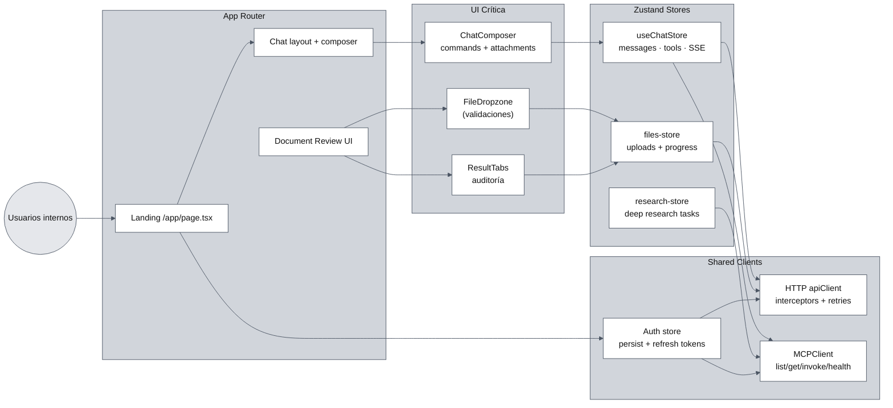
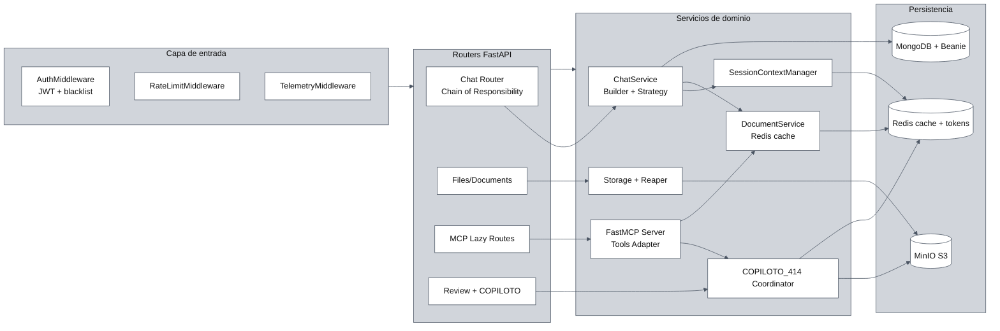

# Saptiva OctaviOS Chat

[](LICENSE)
[](https://www.docker.com/)
[](https://nodejs.org/)
[](https://www.python.org/)
[](https://fastapi.tiangolo.com/)
[](https://nextjs.org/)

> Plataforma conversacional lista para producción con chat streaming, RAG, auditoría COPILOTO_414 y herramientas MCP sobre FastAPI + Next.js.

## Tabla de contenidos
- [Saptiva OctaviOS Chat](#saptiva-octavios-chat)
  - [Tabla de contenidos](#tabla-de-contenidos)
  - [Resumen rápido](#resumen-rápido)
  - [Visión de alto nivel](#visión-de-alto-nivel)
    - [Mapa de arquitectura (alto nivel)](#mapa-de-arquitectura-alto-nivel)
    - [Contenedores principales](#contenedores-principales)
    - [Integraciones y observabilidad](#integraciones-y-observabilidad)
  - [Stack y capacidades](#stack-y-capacidades)
    - [Plataforma conversacional](#plataforma-conversacional)
    - [Documentos y RAG](#documentos-y-rag)
    - [Cumplimiento COPILOTO\_414](#cumplimiento-copiloto_414)
    - [Model Context Protocol (MCP)](#model-context-protocol-mcp)
    - [Seguridad y observabilidad](#seguridad-y-observabilidad)
  - [Arquitectura](#arquitectura)
    - [Frontend (Next.js 14)](#frontend-nextjs-14)
    - [Backend (FastAPI + MCP)](#backend-fastapi--mcp)
    - [Integración Frontend ↔ Backend](#integración-frontend--backend)
    - [Flujo de chat (secuencia)](#flujo-de-chat-secuencia)
    - [Pipeline de ingestión y auditoría](#pipeline-de-ingestión-y-auditoría)
    - [Lazy loading MCP (descubrimiento → invocación)](#lazy-loading-mcp-descubrimiento--invocación)
  - [Inicio rápido](#inicio-rápido)
    - [Prerrequisitos](#prerrequisitos)
    - [1. Configuración inicial](#1-configuración-inicial)
    - [2. Levantar entorno](#2-levantar-entorno)
    - [3. Usuario demo](#3-usuario-demo)
    - [4. Verificación rápida](#4-verificación-rápida)
  - [Flujo de documentos y auditoría](#flujo-de-documentos-y-auditoría)
  - [Herramientas MCP](#herramientas-mcp)
  - [Frontend](#frontend)
  - [Backend](#backend)
  - [Pruebas y calidad](#pruebas-y-calidad)
      - [Ejecutar módulos o casos específicos](#ejecutar-módulos-o-casos-específicos)
    - [Cómo correr pruebas](#cómo-correr-pruebas)
    - [Dónde agregar nuevas pruebas](#dónde-agregar-nuevas-pruebas)
  - [Observabilidad y DevOps](#observabilidad-y-devops)
  - [Estructura del repositorio](#estructura-del-repositorio)
  - [Documentación adicional](#documentación-adicional)
  - [Solución de problemas](#solución-de-problemas)
  - [Contribuir](#contribuir)
  - [Licencia y soporte](#licencia-y-soporte)

## Resumen rápido
- Chat multi-modelo (Turbo, Cortex, Ops, etc.) con SSE y chain-of-responsibility (`apps/api/src/routers/chat/endpoints/message_endpoints.py`).
- Integración MCP oficial (FastMCP) con lazy loading y telemetría (`apps/api/src/mcp/server.py`).
- Pipeline documental: subida segura, cache Redis y extracción multi-tier antes del RAG (`apps/api/src/services/document_service.py`).
- COPILOTO_414 coordina auditores de disclaimer, formato, logos, tipografía, gramática y consistencia semántica (`apps/api/src/services/validation_coordinator.py`).
- Frontend Next.js 14 + Zustand con herramientas de archivos, research y UI accesible (`apps/web/src/lib/stores/chat-store.ts`).
- Seguridad empresarial: JWT con revocación en Redis, rate limiting y políticas CSP en Nginx (`apps/api/src/middleware/auth.py`).

## Visión de alto nivel

Vista macro de los componentes: primero un mapa de patrones/contendores y luego vistas específicas de contenedores e integraciones.

### Mapa de arquitectura (alto nivel)
Diagrama que resume cómo los patrones principales (Chain of Responsibility, Builder, Adapter y Observer) atraviesan los contenedores, incluyendo streaming audit y MCP tools.


Los usuarios llegan al App Router (State pattern con Zustand) que soporta SSE para streaming. FastAPI Gateway aplica autenticación JWT con blacklist, rate limiting e instrumentación. Tres flujos principales: **Chat** con SSE streaming (`Chain of Responsibility` + `Builder`), **MCP** con lazy loading y 5 herramientas productivas (`Adapter`), y **Streaming Audit** con progreso en tiempo real (`Orchestrator`). Todos escriben en persistencia mediante `Ports & Adapters`, mientras la capa `Observer` captura métricas/logs incluyendo telemetría MCP.

### Contenedores principales
Diagrama detallado que muestra el flujo usuario → frontend → backend → servicios de estado, incluyendo componentes nuevos como thumbnails y streaming handlers.


El frontend utiliza componentes especializados (ChatMessage con thumbnails, PreviewAttachment con audit button, CodeBlock para syntax highlighting) que se comunican mediante clientes HTTP/MCP con handlers SSE. El Gateway aplica middleware transversales (Auth JWT con blacklist en Redis, CORS, RateLimit, Telemetry). Tres handlers principales: **Chat** con streaming SSE, **MCP** con lazy loading (98% reducción de contexto), y **Streaming Audit** con progreso en tiempo real de 8 auditores. Los servicios de dominio implementan patrones específicos (Builder, Orchestrator) y toda la persistencia queda abstraída mediante Ports & Adapters en Mongo/Redis/MinIO.

### Integraciones y observabilidad
Diagrama completo que muestra servicios externos (LLMs, herramientas), persistencia, y stack de observabilidad con métricas MCP.


**Arquitectura de integración completa**: El núcleo API integra 4 servicios principales (Chat con SSE streaming, FastMCP con 5 herramientas, COPILOTO_414 con 8 auditores streaming, y Document Service con extracción multi-tier). Se conecta a servicios externos (SAPTIVA LLMs multi-modelo, Aletheia Research, LanguageTool, SMTP), usa almacenamiento triple (MongoDB para datos estructurados, Redis para cache/blacklist/registry, MinIO para archivos/thumbnails), y se monitoriza end-to-end mediante Prometheus (métricas de request + invocaciones MCP), OpenTelemetry (traces distribuidos), Structlog (logs JSON contextuales) y Grafana (dashboards + alertas).

**Patrones y componentes clave**
- *Chain of Responsibility + Strategy*: `apps/api/src/routers/chat/endpoints/message_endpoints.py` delega en `domain/message_handlers` para escoger streaming/simple.
- *Builder Pattern*: `ChatResponseBuilder` compone respuestas enriquecidas con metadatos (`apps/api/src/domain/chat_response_builder.py`).
- *Lazy Loading / Adapter*: `MCPFastAPIAdapter` expone herramientas FastMCP vía REST con telemetría y auth (`apps/api/src/mcp/fastapi_adapter.py`).
- *Background Reaper*: `Storage` elimina documentos expirados/controla uso de disco (`apps/api/src/services/storage.py`).
- *Coordinador + Auditores*: `validation_coordinator.py` orquesta múltiples validadores especializados para COPILOTO_414.

## Stack y capacidades

### Plataforma conversacional
- **Streaming + fallback**: SSE via `StreamingHandler` y respuestas síncronas con builder de mensajes (`apps/api/src/routers/chat/handlers/streaming_handler.py`).
- **Contexto inteligente**: `ChatService` recupera historial Beanie, normaliza herramientas y arma prompts para SAPTIVA (`apps/api/src/services/chat_service.py`).
- **UI reactiva**: Zustand gestiona selección de chat, modelos y herramientas con hidratación SWR (`apps/web/src/lib/stores/chat-store.ts`).

### Documentos y RAG
- **Ingesta segura**: archivos se guardan en disco temporal con límites de tamaño y "reaper" (`apps/api/src/services/storage.py`).
- **Persistencia primaria**: objetos se escriben en MinIO con rutas por usuario/chat y metadatos (`apps/api/src/services/minio_storage.py`).
- **Cache de texto**: Redis almacena extractos 1h y valida ownership antes de usarlos en prompts (`apps/api/src/services/document_service.py`).
- **RAG sin vector DB**: no usamos base vectorial; el contexto se arma con fragmentos curados desde Redis (hasta `MAX_TOTAL_DOC_CHARS`) mediante `DocumentService.extract_content_for_rag_from_cache`, lo que simplifica el despliegue y mantiene control del prompt.

### Cumplimiento COPILOTO_414
- Coordinador async que ejecuta auditores de disclaimer, formato, tipografía, color, logo, gramática y consistencia (`apps/api/src/services/validation_coordinator.py`).
- Las políticas se resuelven dinámicamente y cada hallazgo se serializa a `ValidationReport` (Mongo + MinIO).

### Model Context Protocol (MCP)
- Servidor FastMCP único con 5 herramientas productivas (`apps/api/src/mcp/server.py`).
- Adaptador HTTP asegura auth y telemetría (`apps/api/src/mcp/fastapi_adapter.py`).
- Lazy routing reduce el contexto (discover → load → invoke) (`apps/api/src/mcp/lazy_routes.py`).
- Cliente frontend expone list/get/invoke/health con cancelaciones (`apps/web/src/lib/mcp/client.ts`).
- **Buenas prácticas Anthropic**:
  - `Tool.invoke` valida JSON Schema y normaliza errores (`apps/api/src/mcp/tool.py`), evitando prompts mal formados.
  - Scopes `mcp:tools.*` / `mcp:admin.*` derivados de `MCP_ADMIN_USERS` protegen rutas sensibles (`apps/api/src/mcp/security.py`).
  - Telemetría y rate limiting dedicados para rutas `/mcp/lazy/*` (Observer pattern) + métricas Prometheus (`apps/api/src/mcp/metrics.py`).
  - Versionado centralizado (`apps/api/src/mcp/versioning.py`) y compatibilidad hacia atrás en los contratos `schema_version`.
  - Herramientas documentadas con esquemas y ejemplos (`apps/api/src/mcp/tools/*`) y cubiertas por `make test-mcp`, `make test-mcp-marker`.
  - Checklist Senior AI: valida scopes antes de montar la herramienta, instrumenta cada invocación (`metrics_collector.track_invocation`), agrega tracing en `FastMCPAdapter`, y prueba rutas `discover/load/invoke` con `scripts/test_mcp_tools.sh`.

### Seguridad y observabilidad
- **JWT + lista negra** en Redis (`apps/api/src/middleware/auth.py`, `apps/api/src/services/cache_service.py`).
- **Rate limiting** por IP y cabeceras de control (`apps/api/src/middleware/rate_limit.py`).
- **Secret manager** opcional y computed fields (`apps/api/src/core/config.py`).
- **Telemetry + tracing** con OTEL/Prometheus/structlog (`apps/api/src/core/telemetry.py`).
- **Scopes MCP**: define `MCP_ADMIN_USERS` (usernames o correos separados por comas) para otorgar scopes `mcp:admin.*` en rutas sensibles (`/mcp/lazy/stats`, `/unload`), mientras el resto conserva sólo `mcp:tools.*`.

## Arquitectura

Tres vistas complementarias: frontend, backend y cómo se comunican. Cada diagrama resalta los módulos principales y el patrón de diseño aplicado.

### Frontend (Next.js 14)
Compuesto por App Router + componentes client-side con Zustand como capa de estado y clientes HTTP centralizados.



Los módulos del App Router despachan acciones que terminan en los stores de Zustand (State pattern). Los clientes compartidos implementan un Gateway para REST/MCP con interceptores y reintentos, y los componentes críticos consumen los stores para mantener una UI reactiva sin acoplarse a la red.

### Backend (FastAPI + MCP)
Modulariza el tráfico HTTP en routers, separa negocio en servicios y usa patrones específicos (Chain, Builder, Orchestrator, Adapter).



La capa Entry aplica políticas (Auth, RateLimit, Telemetry), los routers enrutan por dominio y los servicios encapsulan reglas de negocio usando patrones como Builder (ChatService), Strategy (manejadores de chat) y Orchestrator (ValidationCoordinator). La persistencia queda abstraída como Ports (Mongo, Redis, MinIO), manteniendo bajo acoplamiento.

### Integración Frontend ↔ Backend
Conexiones clave: REST, SSE y MCP; se incluyen dependencias externas (LLMs y herramientas) y dónde se instrumenta.


Este diagramas refleja la interacción **cliente-servidor**: Next.js usa REST para acciones cortas, SSE para streaming y MCP para herramientas avanzadas. FastAPI actúa como Gateway y delega en ChatService/FastMCP, mientras Redis y Mongo sirven como contexto persistente. El módulo de telemetría instrumenta ambos entrypoints para tener métricas y trazas en tiempo real.

`infra/docker-compose.yml` levanta todos los servicios (Mongo, Redis, FastAPI, Next.js, MinIO, LanguageTool, Playwright y Nginx opcional) con healthchecks y perfiles.

### Flujo de chat (secuencia)

Secuencia completa del envío de un mensaje streaming desde el cliente hasta SAPTIVA y de regreso mediante SSE.


Funcionamiento: el request crea un `ChatContext`, el `StreamingHandler` lanza un iterador SSE y `ChatService` decide la estrategia (Chain of Responsibility). SAPTIVA devuelve tokens que viajan como eventos SSE, se persisten en Mongo y finalmente se manda `event:done`, garantizando idempotencia y consistencia temporal.

### Pipeline de ingestión y auditoría

Secuencia de subida de archivos, persistencia y ejecución del coordinador COPILOTO_414.


Funcionamiento: se sigue un pipeline en etapas (Upload → Persistencia → Cache → Auditoría). Cada componente aplica validaciones específicas (Dropzone verifica tipos, Storage aplica límites, ValidationCoordinator ejecuta auditores configurables) y usa patrones como Strategy + Orchestrator para combinar hallazgos antes de devolverlos a la UI.

### Lazy loading MCP (descubrimiento → invocación)

Flujo HTTP que sigue el frontend para descubrir, cargar e invocar herramientas MCP sin cargar todo el contexto.


Funcionamiento: el `MCPClient` implementa un ciclo Discover → Load → Invoke. El módulo `Discover` expone un registro ligero, `Loader` materializa la herramienta bajo demanda (Lazy Loading) y `Invoker` la ejecuta envolviendo la llamada con autenticación y telemetría. El caché evita cargar specs completas en cada request, logrando el 98 % de reducción de contexto declarado.

## Inicio rápido

### Prerrequisitos
- Docker 20.10+, Docker Compose v2
- Python 3.11 (para scripts y tests locales)
- Node.js 18+ y pnpm 8+

### 1. Configuración inicial
```bash
make setup         # asistente interactivo (variables en envs/.env)
# o
make setup-quick   # valores por defecto (CI/CD)
```

### 2. Levantar entorno
```bash
make dev
# Usa docker compose -p octavios-chat-capital414 (contenedores: octavios-chat-capital414-api, -web, etc.)
```
Servicios:
- Frontend http://localhost:3000
- Backend http://localhost:8001/api
- MinIO http://localhost:9001 (console)
- Mongo/Redis/LangTool corren en la misma red docker.

### 3. Usuario demo
```bash
make create-demo-user
```
Credenciales: `demo / Demo1234`.

### 4. Verificación rápida
```bash
make verify
```
Ejecuta health checks de contenedores, API, DB y frontend.

## Flujo de documentos y auditoría
1. **Upload**: dropzone valida tipo/tamaño y envía multi-part (`apps/web/src/components/document-review/FileDropzone.tsx`).
2. **Persistencia**: FastAPI guarda streaming en disco, mueve a MinIO y almacena metadatos en Mongo (`apps/api/src/services/storage.py`, `apps/api/src/services/minio_storage.py`).
3. **Cache + OCR**: texto se guarda en Redis; si el PDF carece de texto se usan páginas OCR guardadas (`apps/api/src/services/document_service.py`).
4. **Extracción on-demand**: herramienta `extract_document_text` aplica el fallback pypdf → SDK → OCR antes de responder (`apps/api/src/mcp/server.py`).
5. **Auditoría COPILOTO_414**: coordinador ejecuta auditores paralelos y agrupa hallazgos/políticas (`apps/api/src/services/validation_coordinator.py`).
6. **Revisión visual**: panel de resultados usa pestañas, badges y MCC toggles (`apps/web/src/components/document-review/ResultTabs.tsx`).

> **Nota RAG**: la versión actual no usa base de datos vectorial; el contexto se arma con texto cacheado en Redis (1 h) y truncado por presupuesto de tokens antes de llegar al LLM. El diseño para Pinecone/pgvector vive en `docs/architecture/pdf-rag-flow.md` para una futura iteración.

## Herramientas MCP
| Herramienta | Categoría | Descripción | Entrada principal |
|-------------|-----------|-------------|-------------------|
| `audit_file` | Compliance | Ejecuta COPILOTO_414 con selección de política y auditores opcionales | `doc_id`, `policy_id`, flags |
| `excel_analyzer` | Datos | Perfilado, agregaciones y validaciones de planillas | `doc_id`, `operations`, `aggregate_columns` |
| `viz_tool` | Insights | Genera voz narrativa + gráficos ligeros a partir de tablas | `prompt`, `data_source` |
| `deep_research` | Investigación | Orquesta iteraciones con Aletheia y devuelve hallazgos+fuentes | `query`, `depth`, `max_iterations` |
| `extract_document_text` | RAG | Extrae texto multi-tier con cache TTL configurable | `doc_id`, `method`, `page_numbers` |

Todas viven en `apps/api/src/mcp/server.py` y comparten telemetría/seguridad gracias al adaptador FastAPI.

## Frontend
- Next.js 14 (app router) con Tailwind, React Server Components y streaming UI (`apps/web/src/app/...`).
- Estado global con múltiples stores persistidos (chat, archivos, research, settings) (`apps/web/src/lib/stores`).
- Cliente MCP y API con abort controllers, logging y retries (`apps/web/src/lib/mcp/client.ts`, `apps/web/src/lib/api-client.ts`).
- Componentes accesibles y testados (jest + Testing Library) para chat composer, adjuntos y listas virtualizadas (`apps/web/src/components/chat`).

## Backend
- FastAPI modular con routers especializados (`apps/api/src/routers`).
- Diseño por dominios + patrones (builder, strategy, chain-of-responsibility) en chat y sesión (`apps/api/src/domain`, `apps/api/src/services`).
- Integraciones externas encapsuladas (SAPTIVA, Aletheia, MinIO, LanguageTool).
- Base de datos con Beanie ODM, índices y validaciones (`apps/api/src/models`).

## Pruebas y calidad

El proyecto se valida principalmente desde el `Makefile`, lo que encapsula entornos y dependencias (Docker Compose, .venv, pnpm). Los comandos más usados:

| Comando | Alcance | Qué hace |
|---------|---------|----------|
| `make test-all` | Full suite (Docker) | Ejecuta `test-api` + `test-web` + `test-sh` dentro de contenedores; ideal antes de PR. |
| `make test` | Alias rápido | Invoca `test-api` + `test-web` + `test-sh` manteniendo los contenedores ya levantados. |
| `make test-api` | API (contenedor `octavios-chat-capital414-api`) | Corre `pytest` con cobertura; acepta `FILE=...` y `ARGS=...` para casos específicos. |
| `make test-unit-host` | API (host/.venv) | Ejecuta pytest desde `.venv`, útil cuando no quieres depender de Docker. |
| `make test-web` | Frontend | Lanza `pnpm test` en el contenedor `octavios-chat-capital414-web`; soporta `FILE` y `ARGS`. |
| `make test-e2e` | Playwright | Corre la carpeta `tests/` usando la stack en marcha (`make dev`). |
| `make test-mcp` | MCP | Suite dedicada (unit + integration); ver variantes `test-mcp-lazy`, `test-mcp-marker`, `test-mcp-diff`. |
| `make lint` / `make lint-fix` | Calidad | Ruff + ESLint; `lint-fix` aplica autofixes seguros. |
| `make verify` | Todo en uno | Lint + pruebas + healthchecks básicos, pensado para CI local. |

#### Ejecutar módulos o casos específicos
- **Backend (contenedor)** (`Makefile:1480-1487`):
  ```bash
  make test-api FILE="tests/unit/test_chat_service.py::TestChatService::test_tool_merge"
  make test-api ARGS="-k redis_cache"
  make test-api-file FILE=test_health.py
  ```
  - `FILE`: ruta o selector pytest (acepta `::Clase::test_case`).
  - `ARGS`: flags extra para pytest (`-k slow`, `-m "not integration"`, etc.).
- **Backend (host/.venv)** (`Makefile:1516-1522`):
  ```bash
  make test-unit-host FILE="tests/unit/test_chat_service.py"
  make test-unit-host ARGS="-k streaming"
  ```
  Útil cuando los contenedores no están levantados o necesitas depurar con IPDB.
- **MCP avanzado** (`Makefile:1539-1607`):
  ```bash
  make test-mcp-marker MARKER=mcp_security
  make test-mcp-diff BASE=main
  make test-mcp-lazy
  ```
  Útil para validar sólo herramientas MCP modificadas, comparar contra main o ejercitar lazy loading.
- **Frontend** (`Makefile:1490-1497`):
  ```bash
  make test-web FILE="components/chat/__tests__/Composer.test.tsx"
  make test-web ARGS="--runInBand"
  ```

### Cómo correr pruebas
1. **Preparar entorno**  
   ```bash
   make dev        # Levanta stack local (Mongo, Redis, API, Web...)
   make shell-api  # (opcional) si quieres entrar al contenedor api
   ```
2. **Backend (pytest)**  
   - Contenedores: `make test-api` (usa `octavios-chat-capital414-api`) o `make test` para correr API + web en un solo paso.  
   - Host/.venv: `make test-unit-host ARGS="-k streaming"` cuando necesites debugear sin Docker.  
   - Casos MCP: `make test-mcp`, `make test-mcp-lazy` o `make test-mcp-integration`.
3. **Frontend (jest)**  
   ```bash
   make test-web          # contenedor
   # o directamente dentro de apps/web:
   cd apps/web && pnpm test
   ```
4. **End-to-end / Playwright**  
   ```bash
   make test-e2e
   # Genera reportes en playwright-report/
   ```
5. **Lint & format**  
   ```bash
   make lint          # verifica Python + TS
   make lint:fix      # aplica autofixes
   ```

### Dónde agregar nuevas pruebas
- **API**: `apps/api/tests/unit` para unitarias puras, `apps/api/tests/integration` para pruebas con Mongo/Redis (usa fixtures de `conftest.py`), `apps/api/tests/mcp` para herramientas MCP.
- **Frontend**: `apps/web/src/components/**/__tests__` (Testing Library) o `apps/web/__tests__` para flujos de páginas. Usa `pnpm test -- FileName`.
- **Playwright**: `tests/` agrupa escenarios end-to-end; cada spec se ejecuta contra la stack levantada (`make dev`). Puedes crear nuevos specs y reutilizar fixtures de `tests/utils`.

Consejos:
- `make debug-logs-errors` ayuda cuando un test falla dentro de contenedores.
- Usa `pytest -k <pattern>` desde `apps/api` si necesitas filtrar una prueba específica (`make shell-api` → `pytest tests/unit/test_chat_service.py -k "happy_path"`).
- Para pruebas que dependen de configuraciones específicas (.env), ajusta `envs/.env.local` y reinicia los servicios con `make reload-env`.

## Observabilidad y DevOps
- Logs estructurados via structlog + OpenTelemetry exporters (`apps/api/src/core/logging.py`, `apps/api/src/core/telemetry.py`).
- Dashboards y alertas en `infra/observability/` (Prometheus + Grafana + Alertmanager).
- Makefile con más de 100 objetivos: rebuild, debug, despliegues, backups (`Makefile`).
- Scripts operativos en `scripts/` cubren deploy, rollback, health-check y limpieza de cachés.

**Ciclo de vida recomendado (Makefile)**
- `make dev` ↔ `make stop` ↔ `make restart`: levantar/detener/reiniciar el stack completo (Mongo, Redis, API, Web, MinIO).
- `make logs`, `make logs-api`, `make status`: monitorear contenedores en vivo.
- `make reload-env` y `make reload-env-service SERVICE=api`: recargar variables sin rebuild.
- `make rebuild-api`, `make rebuild-web`, `make rebuild-all`: reconstruir imágenes cuando se tocan dependencias.

## Estructura del repositorio

Vista rápida de carpetas raíz y submódulos más relevantes. La idea es poder ubicar rápidamente API, frontend, infraestructura y documentación técnica.

```
.
├── apps
│   ├── api
│   │   ├── src
│   │   │   ├── core/            # Config, logging, auth, telemetry
│   │   │   ├── routers/         # FastAPI routers (chat, files, MCP…)
│   │   │   ├── services/        # ChatService, ValidationCoordinator, storage
│   │   │   ├── mcp/             # FastMCP server, lazy routes, tools
│   │   │   └── domain/          # ChatContext, builders, handlers
│   │   └── tests/               # Unit, integration, MCP suites
│   └── web
│       ├── src/app/             # Next.js App Router
│       ├── src/components/      # Chat UI, document review, files
│       ├── src/lib/             # Stores (Zustand), apiClient, MCP client
│       └── __tests__/           # Jest + Testing Library
├── backend/                      # Paquetes Python compartidos (MCP base)
├── docs/                         # Arquitectura, auditoría, MCP y planes
├── infra/                        # Docker Compose, Nginx, observabilidad
├── packages/                     # Librerías TS compartidas (pnpm workspaces)
├── scripts/                      # Deploy, troubleshooting, herramientas DevOps
└── tests/                        # Playwright y utilidades e2e
```

| Ruta | Propósito | Patrones / Notas |
|------|-----------|------------------|
| `apps/api/src` | Backend FastAPI, integra Chat + MCP + COPILOTO_414 | Clean Architecture (core/routers/services), Chain of Responsibility en chat, Builder para respuestas |
| `apps/web/src` | Frontend Next.js 14 con App Router y Zustand | State pattern en stores, Gateway pattern en `lib/api-client.ts`, componentes UI críticos probados |
| `apps/api/src/mcp` | Servidor FastMCP, herramientas (audit_file, excel_analyzer, etc.) y rutas lazy | Adapter hacia FastAPI, Lazy loading para reducir contexto, integración con telemetría |
| `apps/api/src/services` | Servicios de dominio (ChatService, ValidationCoordinator, Storage, etc.) | Strategy + Orchestrator para chat/auditorías, integración con MinIO, Redis y SAPTIVA |
| `docs/` | Documentación detallada (ARCHITECTURE, MCP, auditoría, planes de migración) | Diagramas Mermaid, reportes de fases, guías operativas |
| `infra/` | Docker Compose, Nginx, observabilidad, pipelines de despliegue | Healthchecks por servicio, perfiles dev/prod, dashboards Prometheus/Grafana |
| `scripts/` | Scripts bash/python para deploy, salud, limpieza, testing MCP | Automatizan tareas repetitivas (`make troubleshoot`, `deploy.sh`, etc.) |
| `tests/` | Suites Playwright/E2E y utilidades adicionales | Escenarios end-to-end sobre el stack completo |
| `Makefile` | Centro de comandos para contenedores, pruebas, seguridad, CI | Agrupa +120 targets (`make dev`, `make test-mcp`, `make test-api-file FILE=...`) y aplica políticas de entornos |
| `envs/` | Variables locales, demo y producción (`.env`, `.env.local`, `.env.prod`) | El Makefile carga el archivo correcto según el target evitando mezclar credenciales |
| `packages/` | Librerías TypeScript reutilizables (pnpm workspace) | UI tokens, hooks compartidos y clientes base |

Referencias rápidas para navegar código:
- `apps/api/src/routers/chat` contiene los endpoints REST/SSE; cada handler llama a estrategias en `apps/api/src/domain/message_handlers`.
- `apps/api/src/mcp` se divide en `tool.py` (contratos), `lazy_routes.py` (discover/load/invoke) y `tools/*` (implementaciones concretas).
- `apps/web/src/lib` concentra stores Zustand, clientes HTTP/MCP y hooks reutilizables (imperativo revisar aquí antes de duplicar lógica en componentes).
- `infra/docker-compose*.yml` define perfiles y nombres de contenedor (`octavios-chat-capital414-*`) usados por el Makefile.

Tips rápidos:
- Variables y comandos centrales viven en el `Makefile`, por lo que la mayoría de los flujos (setup, dev, verify, debug) son accesibles vía `make`.
- Los entornos (`envs/`) contienen `.env`, `.env.local` y `.env.prod`; el Makefile decide qué cargar según el target.
- Los paquetes compartidos (`backend/`, `packages/`) permiten reutilizar código entre API y otros servicios MCP.

## Documentación adicional
- `docs/ARCHITECTURE.md`: detalle técnico Back/Front/MCP.
- `docs/AUDIT_SYSTEM_ARCHITECTURE.md`: COPILOTO_414 end-to-end.
- `docs/MCP_ARCHITECTURE.md` y `docs/MCP_TOOLS_GUIDE.md`: guías para herramientas.
- `docs/TROUBLESHOOTING.md`: recetas extendidas.

## Solución de problemas
- `make debug-full` para un reporte consolidado.
- `make debug-logs-errors` filtra errores relevantes.
- `make troubleshoot` aplica fixes automáticos frecuentes.
- Problemas comunes cubiertos en `docs/TROUBLESHOOTING.md` y en la sección `scripts/README_MCP_TESTING.md` para flujos MCP.

## Contribuir
1. Crear rama `git checkout -b feature/mi-cambio`.
2. Ejecutar `make dev` y aplicar cambios.
3. `make test-all && make lint` antes del commit.
4. Commits convencionales (`feat:`, `fix:`, `docs:`...).
5. Abrir PR con checklist de pruebas.

## Licencia y soporte
- Apache License 2.0 (ver [LICENSE](LICENSE)).
- Issues y soporte: abrir ticket en GitHub o usar `make troubleshoot` para diagnóstico local.
- Documentación viva en `docs/` y scripts `scripts/*.sh`.

**Hecho con ❤️ por el equipo Saptiva Inc**
