# Copilotos Bridge

ChatGPT-style conversational interface for SAPTIVA language models with integrated Deep Research capabilities.

## 🚀 Overview

**Production-Ready Features:**
- **ChatGPT-Style UX**: Complete ChatGPT-inspired interface with hierarchical model selector, conversation history, and modern interactions
- **Real SAPTIVA Integration**: Direct connection to SAPTIVA language models (no demo/mock responses)
- **Advanced Chat Features**: File attachments, message actions (copy, regenerate), streaming responses, keyboard shortcuts
- **Deep Research**: Integrated Aletheia orchestrator for comprehensive research with source traceability
- **Enterprise Security**: JWT authentication, session management, and secure API key handling
- **Full Accessibility**: Complete keyboard navigation, ARIA labels, and responsive design

## 🧰 Requirements

- Node.js >= 18.0.0
- Python >= 3.10
- MongoDB >= 6.0
- Redis >= 6.2
- Docker and Docker Compose
- pnpm >= 8.0 (recommended) or npm

## 🏗️ Architecture

The bridge combines a Next.js conversation client, a FastAPI orchestration layer, and AI/research providers. Redis accelerates hot paths (sessions, rate limiting, streaming cursors) while MongoDB stores durable chat, research, and audit history.

```mermaid
%%{init: {'theme':'neutral','flowchart':{'curve':'basis'}}}%%
flowchart TB
  subgraph Client["Frontend · Next.js"]
    UI["Chat Interface\n(React components)"]
    State["State Stores & Hooks\n(Zustand, custom hooks)"]
    Streamer["Streaming Bridge\n(SSE listeners)"]
    UI --> State
    State --> Streamer
  end

  subgraph Gateway["Backend · FastAPI"]
    Auth["Auth & Rate Limit Middleware"]
    Router["REST & SSE Routers"]
    Coordinator["Research Coordinator\n(SAPTIVA ⇄ Aletheia)"]
    History["History Service\n(Chat · Research timeline)"]
    CacheSvc["Redis Cache Client"]
    Router --> Coordinator
    Router --> History
    History --> CacheSvc
  end

  subgraph Data["Persistence"]
    Mongo[("MongoDB\nBeanie ODM")]
    Redis[("Redis\nCaching · Rate limits")]
  end

  subgraph External["External AI & Search"]
    Saptiva["SAPTIVA LLM API"]
    Aletheia["Aletheia Orchestrator"]
    Tavily["Tavily Search"]
    Weaviate["Weaviate Vector DB"]
  end

  Client -->|HTTP /api| Gateway
  Gateway -->|JWT + SSE| Client
  Gateway --> Mongo
  Gateway --> Redis
  Coordinator --> Saptiva
  Coordinator --> Aletheia
  Aletheia --> Tavily
  Aletheia --> Weaviate
  Aletheia --> Saptiva

  classDef client fill:#3358ff,stroke:#1c2f73,color:#ffffff;
  classDef gateway fill:#2f9e44,stroke:#186429,color:#ffffff;
  classDef data fill:#fab005,stroke:#c47a02,color:#111111;
  classDef external fill:#868e96,stroke:#495057,color:#ffffff,stroke-dasharray: 4 3;
  class UI,State,Streamer client;
  class Auth,Router,Coordinator,History,CacheSvc gateway;
  class Mongo,Redis data;
  class Saptiva,Aletheia,Tavily,Weaviate external;
```



### 🔄 Conversation & Research Flow

The following sequence shows how a user message is processed, routed between SAPTIVA chat and Aletheia deep research, and streamed back to the client.


### 🗄️ Data Persistence Map

MongoDB collections and their relationships capture chats, research tasks, and unified history; Redis holds ephemeral indices referenced by the services above.


### 🚢 Deployment Topology

Two deployment paths coexist: local development via Docker Compose and production releases using the standalone web image fronted by Nginx while the API continues to run under Compose profiles or managed infrastructure.


## 🏁 Getting Started

### 1. Clone and Setup

```bash
git clone <repository-url>
cd copilotos-bridge
cp envs/.env.local.example envs/.env.local
```

### 2. Configure Environment

Edit `envs/.env.local` with your API keys:

```bash
# Authentication
JWT_SECRET_KEY=your-secret-key-here

# SAPTIVA Integration
SAPTIVA_API_KEY=your-saptiva-api-key

# Database URLs
MONGODB_URL=mongodb://localhost:27017/copilotos
REDIS_URL=redis://localhost:6379/0

# CORS Configuration
CORS_ORIGINS=http://localhost:3000
ALLOWED_HOSTS=localhost,127.0.0.1,web,api
```

### 3. Start Services

```bash
make dev
```

> The Makefile wraps Docker Compose using the definitions in `infra/docker-compose.yml`, so you get the full stack with a single command.

### 4. Create Demo User

```bash
# Option 1: Using make command
make create-demo-user

# Option 2: Direct script execution
python scripts/create-demo-user.py

# Option 3: Manual script execution
./scripts/create-demo-user.sh
```

This creates a demo user with credentials:
- **Username**: demo_admin
- **Email**: demo@saptiva.ai
- **Password**: ChangeMe123!

The script automatically:
- Waits for the API to be ready
- Creates the user via API endpoint
- Handles existing user scenarios
- Tests login functionality
- Provides direct links to access the application

### 5. Access Application

- **Frontend**: http://localhost:3000
- **API**: http://localhost:8001
- **Health Check**: http://localhost:8001/api/health

## API Endpoints

### Core Endpoints
- `POST /api/chat` - Send message to LLM
- `POST /api/deep-research` - Start research task, returns task_id
- `GET /api/stream/{task_id}` - Server-Sent Events for task progress
- `GET /api/report/{task_id}` - Download research report and artifacts
- `GET /api/history/{chat_id}` - Retrieve conversation history
- `POST /api/auth/login` - User authentication
- `POST /api/auth/register` - User registration

## Development Commands

```bash
# View all available commands
make help

# Development
make dev                     # Start development environment
make logs                    # View service logs
make stop                    # Stop all services
make clean                   # Clean Docker resources

# Testing
make test                    # Run all tests
make test-unit              # Run unit tests
make test-integration       # Run integration tests
make test-e2e               # Run end-to-end tests
make lint                    # Run code linters
make security               # Run security scans

# User Management
make create-demo-user       # Create demo user for testing
make list-users             # List all database users
make delete-demo-user       # Remove demo user

# Containers
make shell-api              # Access API container shell
make shell-web              # Access web container shell

# Docker
make build                  # Build all images
make push                   # Push images to registry
make clean                  # Clean Docker resources
```

## Project Structure

```
copilotos-bridge/
├── apps/
│   ├── web/                # Next.js frontend
│   │   ├── deployment/     # Standalone Docker build assets
│   │   ├── src/components/ # React components
│   │   ├── src/lib/        # Utilities and configuration
│   │   └── src/styles/     # Design system tokens
│   └── api/                # FastAPI backend
│       ├── src/routers/    # API route handlers
│       ├── src/models/     # Database models
│       └── src/services/   # Business logic
├── infra/
│   └── docker-compose.yml  # Service definitions
├── envs/
│   └── .env.local          # Environment variables
└── Makefile                # Development commands
```

## Data Storage

- **MongoDB**: User accounts, chat sessions, messages, task tracking
- **Redis**: Session management and response caching
- **MinIO/S3**: Research artifacts and reports (via Aletheia)

## Technology Stack

- **Frontend**: Next.js 14, TypeScript, Tailwind CSS, Zustand
- **Backend**: FastAPI, Pydantic, Beanie ODM
- **Database**: MongoDB, Redis
- **AI Integration**: SAPTIVA API, Aletheia orchestrator
- **Infrastructure**: Docker, Docker Compose
- **Testing**: Playwright, pytest

## 🛠️ Troubleshooting

### Common Issues

#### API Connection Errors
```bash
# Check service status
docker ps
docker logs infra-api

# Restart services
make stop && make dev

# Verify connectivity
curl http://localhost:8001/api/health
```

#### Database Connection Issues
```bash
# Check database services
docker logs infra-mongodb
docker logs infra-redis

# Test database connectivity
docker exec -it infra-mongodb mongosh
docker exec infra-redis redis-cli ping
```

#### Authentication Issues
```bash
# Test login endpoint
curl -X POST http://localhost:8001/api/auth/login \
  -H "Content-Type: application/json" \
  -d '{"identifier": "demo_admin", "password": "ChangeMe123!"}'

# Check user exists
make list-users

# Recreate demo user if needed
make delete-demo-user && make create-demo-user
```

#### Frontend Build Issues
```bash
# Clean and rebuild
make clean
make build
make dev
```

### ⚠️ Production Mode Only

**BREAKING CHANGE**: This system no longer supports demo mode. `SAPTIVA_API_KEY` is **required** for operation.

- **Production Ready**: All mock/demo functionality has been removed
- **Real Responses Only**: All chat responses come directly from SAPTIVA servers
- **Automatic Configuration**: API key is loaded automatically from environment variables or database
- **Fast Failure**: System fails immediately if API key is not configured

#### API Key Configuration Priority:
1. **Database** (configured via admin UI) - highest priority
2. **Environment Variable** (`SAPTIVA_API_KEY`)
3. **No Fallback** - system will not start without valid configuration

#### For Production Deployment:
See `DEPLOYMENT.md` for comprehensive production setup guide.

## 🎨 User Experience Features

This application implements a comprehensive ChatGPT-style user experience:

### UX-001: Hierarchical Model Selector
- **Smart Organization**: Models grouped by Provider → Family → Variant
- **Quick Access**: Presets for Rapid, Accurate, and Creative workflows
- **Search**: Global model search with `Cmd/Ctrl+K`
- **Compact Design**: Pill format showing "Provider/Model (context) ▾"

### UX-002: Advanced Conversation Management
- **Sidebar Toggle**: `Cmd/Ctrl+B` to collapse/expand
- **Hover Actions**: Rename, pin, and delete conversations on hover
- **Inline Editing**: Click to rename conversations directly
- **Smart Organization**: Pinned conversations stay at top

### UX-003: Integrated Composer Actions
- **One-Click Tools**: Access 6 integrated actions via '+' button
- **Keyboard Shortcut**: `Alt+N` to open actions menu
- **Smart Menu**: Contextual actions (files, research, analysis, connectors)
- **Quick Access**: Upload files, trigger deep research, analyze documents

### UX-004: File Attachment System
- **Drag & Drop**: Natural file attachment workflow
- **Format Support**: PDF, images, documents, code files, notebooks
- **Progress Tracking**: Real-time upload progress with validation
- **Smart Limits**: 20MB per file, 5 files max, with clear error messaging

### UX-005: Message Enhancement
- **Streaming Cursor**: Animated cursor during AI response generation
- **Action Buttons**: Copy, regenerate, and stop streaming on hover
- **Rich Metadata**: Token count, latency, and model information
- **Research Integration**: Direct access to research reports and sources

### UX-006: Full Accessibility
- **Keyboard Navigation**: Complete keyboard-only operation support
- **Screen Reader**: Comprehensive ARIA labels and semantic markup
- **Focus Management**: Proper focus handling and visual indicators
- **Shortcuts**: All major functions accessible via keyboard shortcuts

## 🚀 Production Deployment

### Prerequisites for Production

- Linux server with Docker and Docker Compose
- Nginx web server for reverse proxy
- SSL certificates (Let's Encrypt recommended)
- Domain name configured with proper DNS
- Production environment variables configured

### 1. Server Setup and Build

```bash
# Clone repository on production server
git clone <repository-url> /home/user/copilotos-bridge
cd /home/user/copilotos-bridge

# Configure production environment
cp envs/.env.prod.example envs/.env.prod
# Edit envs/.env.prod with production values

# Build production version locally (with proper API URL)
NEXT_PUBLIC_API_URL=https://your-domain.com/api NODE_ENV=production npm run build

# Create deployment package (default: copilotos-bridge-prod.tar.gz)
make package-web
```

### 2. Docker Container Deployment

```bash
# Extract files on production server
tar -xzf copilotos-bridge-prod.tar.gz

# Build production Docker image (default tag: copilotos-web-prod)
make build-web-standalone

# Stop existing container (if any)
docker stop copilotos-web 2>/dev/null || true
docker rm copilotos-web 2>/dev/null || true

# Start new production container
docker run -d \
  --name copilotos-web \
  -p 3000:3000 \
  -e NEXT_PUBLIC_API_URL=https://your-domain.com/api \
  --restart unless-stopped \
  copilotos-web-prod
```

### 3. Nginx Configuration

Create `/etc/nginx/sites-available/your-domain`:

```nginx
server {
    server_name your-domain.com;

    # Security headers
    add_header Strict-Transport-Security "max-age=31536000; includeSubDomains" always;
    add_header X-Frame-Options DENY always;
    add_header X-Content-Type-Options nosniff always;
    add_header X-XSS-Protection "1; mode=block" always;
    add_header Referrer-Policy "strict-origin-when-cross-origin" always;

    # API backend
    location /api/ {
        proxy_pass http://localhost:8001;
        proxy_http_version 1.1;
        proxy_set_header Upgrade $http_upgrade;
        proxy_set_header Connection "upgrade";
        proxy_set_header Host localhost:8001;
        proxy_set_header X-Real-IP $remote_addr;
        proxy_set_header X-Forwarded-For $proxy_add_x_forwarded_for;
        proxy_set_header X-Forwarded-Proto https;
        proxy_read_timeout 300;
        proxy_connect_timeout 60;
        proxy_send_timeout 60;
    }

    # Frontend application
    location / {
        proxy_pass http://localhost:3000;
        proxy_http_version 1.1;
        proxy_set_header Upgrade $http_upgrade;
        proxy_set_header Connection "upgrade";
        proxy_set_header Host localhost:3000;
        proxy_set_header X-Real-IP $remote_addr;
        proxy_set_header X-Forwarded-For $proxy_add_x_forwarded_for;
        proxy_set_header X-Forwarded-Proto https;
        proxy_buffering off;
        proxy_buffer_size 4k;
    }

    listen 443 ssl;
    ssl_certificate /etc/letsencrypt/live/your-domain.com/fullchain.pem;
    ssl_certificate_key /etc/letsencrypt/live/your-domain.com/privkey.pem;
    include /etc/letsencrypt/options-ssl-nginx.conf;
    ssl_dhparam /etc/letsencrypt/ssl-dhparams.pem;
}

server {
    if ($host = your-domain.com) {
        return 301 https://$host$request_uri;
    }

    server_name your-domain.com;
    listen 80;
    return 404;
}
```

Enable the site:
```bash
sudo ln -s /etc/nginx/sites-available/your-domain /etc/nginx/sites-enabled/
sudo nginx -t
sudo systemctl reload nginx
```

### 4. SSL Certificate Setup

```bash
# Install Certbot
sudo apt update
sudo apt install certbot python3-certbot-nginx

# Generate certificate
sudo certbot --nginx -d your-domain.com

# Verify auto-renewal
sudo certbot renew --dry-run
```

### 5. Production Health Checks

```bash
# Verify container is running
docker ps | grep copilotos-web

# Check application response
curl -s -o /dev/null -w "%{http_code}" https://your-domain.com

# Monitor container logs
docker logs copilotos-web --tail=50 -f

# Check system resources
docker stats copilotos-web
```

### 6. Zero-Downtime Deployment Process

For production updates with minimal downtime:

```bash
# 1. Build new version locally
NEXT_PUBLIC_API_URL=https://your-domain.com/api NODE_ENV=production npm run build

# 2. Create new deployment package with custom filename
WEB_PACKAGE_OUTPUT=copilotos-bridge-update.tar.gz make package-web

# 3. Transfer to production server
scp copilotos-bridge-update.tar.gz user@server:/home/user/

# 4. On production server - extract and build new image
cd /home/user/copilotos-bridge && tar -xzf copilotos-bridge-update.tar.gz
WEB_IMAGE_NAME=copilotos-web-new make build-web-standalone

# 5. Start new container with temporary name
docker run -d --name copilotos-web-new -p 3001:3000 \
  -e NEXT_PUBLIC_API_URL=https://your-domain.com/api \
  copilotos-web-new

# 6. Test new container
curl -s -o /dev/null -w "%{http_code}" http://localhost:3001

# 7. Update nginx to point to new container temporarily
sudo sed -i 's/localhost:3000/localhost:3001/' /etc/nginx/sites-available/your-domain
sudo nginx -t && sudo systemctl reload nginx

# 8. Stop old container and start new one on port 3000
docker stop copilotos-web && docker rm copilotos-web
docker stop copilotos-web-new
docker run -d --name copilotos-web -p 3000:3000 \
  -e NEXT_PUBLIC_API_URL=https://your-domain.com/api \
  --restart unless-stopped \
  copilotos-web-new

# 9. Restore nginx configuration
sudo sed -i 's/localhost:3001/localhost:3000/' /etc/nginx/sites-available/your-domain
sudo nginx -t && sudo systemctl reload nginx

# 10. Clean up
docker rm copilotos-web-new 2>/dev/null || true
rm copilotos-bridge-update.tar.gz
```

### 7. Monitoring and Maintenance

```bash
# Monitor application logs
docker logs copilotos-web --tail=100 -f

# Check resource usage
htop
df -h
free -h

# Backup important data (if applicable)
docker exec copilotos-mongodb mongodump --out /backup/$(date +%Y%m%d)

# Update system packages (schedule during maintenance windows)
sudo apt update && sudo apt upgrade -y
sudo reboot  # if kernel updates
```

### Environment Variables for Production

Key environment variables in `envs/.env.prod`:

```bash
# Domain and API Configuration
DOMAIN=your-domain.com
NEXT_PUBLIC_API_URL=https://your-domain.com/api
NODE_ENV=production

# API Keys
SAPTIVA_API_KEY=your-production-api-key
SAPTIVA_BASE_URL=https://api.saptiva.com

# Database Configuration
MONGODB_USER=prod_user
MONGODB_PASSWORD=secure_password
MONGODB_DATABASE=copilotos_prod
REDIS_PASSWORD=secure_redis_password

# Security
JWT_SECRET_KEY=production-jwt-secret-very-secure-key
SECRET_KEY=production-session-secret-key

# Performance
RATE_LIMIT_REQUESTS_PER_MINUTE=100
MAX_FILE_SIZE=52428800
LOG_LEVEL=info
```

### Troubleshooting Production Issues

```bash
# Check container health
docker inspect copilotos-web | grep -A 10 '"Health"'

# Debug nginx configuration
sudo nginx -t
sudo systemctl status nginx

# Monitor system resources
top
iostat 1
nethogs

# Check SSL certificate
sudo certbot certificates
openssl x509 -in /etc/letsencrypt/live/your-domain.com/cert.pem -text -noout

# Application-specific debugging
curl -v https://your-domain.com/api/health
docker exec copilotos-web ps aux
```

## 🤝 Contributing

1. Fork the repository
2. Create a feature branch
3. Make changes and add tests
4. Run the test suite: `make test`
5. Submit a pull request

## 📄 License

MIT License
