# Saptiva OctaviOS Chat

[](LICENSE)
[](https://www.docker.com/)
[](https://nodejs.org/)
[](https://www.python.org/)
[](https://fastapi.tiangolo.com/)
[](https://nextjs.org/)

> Plataforma conversacional lista para producción con chat streaming, RAG, auditoría COPILOTO_414 y herramientas MCP sobre FastAPI + Next.js.

## Tabla de contenidos
- [Saptiva OctaviOS Chat](#saptiva-octavios-chat)
  - [Tabla de contenidos](#tabla-de-contenidos)
  - [Resumen rápido](#resumen-rápido)
  - [Arquitectura Plugin-First (Micro-Kernel)](#arquitectura-plugin-first-micro-kernel)
    - [Filosofía de Diseño](#filosofía-de-diseño)
    - [Diagrama de Containers y Dependencias](#diagrama-de-containers-y-dependencias)
    - [Service Dependency Chain](#service-dependency-chain)
    - [Beneficios de Plugin-First](#beneficios-de-plugin-first)
    - [Comunicación entre Plugins](#comunicación-entre-plugins)
    - [Ports and URLs](#ports-and-urls)
    - [Referencias de Código](#referencias-de-código)
  - [Visión de alto nivel](#visión-de-alto-nivel)
    - [Mapa de arquitectura (alto nivel)](#mapa-de-arquitectura-alto-nivel)
    - [Contenedores principales](#contenedores-principales)
    - [Integraciones y observabilidad](#integraciones-y-observabilidad)
  - [Stack y capacidades](#stack-y-capacidades)
    - [Plataforma conversacional](#plataforma-conversacional)
    - [Documentos y RAG](#documentos-y-rag)
    - [Cumplimiento COPILOTO\_414](#cumplimiento-copiloto_414)
    - [Integración Audit File + Canvas (OpenCanvas)](#integración-audit-file--canvas-opencanvas)
    - [Model Context Protocol (MCP)](#model-context-protocol-mcp)
    - [Seguridad y observabilidad](#seguridad-y-observabilidad)
  - [Arquitectura](#arquitectura)
    - [Frontend (Next.js 14)](#frontend-nextjs-14)
    - [Backend (FastAPI + MCP)](#backend-fastapi--mcp)
    - [Integración Frontend ↔ Backend](#integración-frontend--backend)
    - [Flujo de chat (secuencia)](#flujo-de-chat-secuencia)
    - [Pipeline de ingestión y auditoría](#pipeline-de-ingestión-y-auditoría)
    - [Flujo de Audit Command + Canvas](#flujo-de-audit-command--canvas)
    - [Lazy loading MCP (descubrimiento → invocación)](#lazy-loading-mcp-descubrimiento--invocación)
  - [Inicio rápido](#inicio-rápido)
    - [Prerrequisitos](#prerrequisitos)
    - [1. Configuración inicial](#1-configuración-inicial)
    - [2. Levantar entorno](#2-levantar-entorno)
    - [3. Usuario demo](#3-usuario-demo)
    - [4. Verificación rápida](#4-verificación-rápida)
  - [Flujo de documentos y auditoría](#flujo-de-documentos-y-auditoría)
  - [Herramientas MCP](#herramientas-mcp)
  - [Frontend](#frontend)
  - [Backend](#backend)
  - [Pruebas y calidad](#pruebas-y-calidad)
      - [Ejecutar módulos o casos específicos](#ejecutar-módulos-o-casos-específicos)
    - [Cómo correr pruebas](#cómo-correr-pruebas)
    - [Dónde agregar nuevas pruebas](#dónde-agregar-nuevas-pruebas)
  - [Observabilidad y DevOps](#observabilidad-y-devops)
  - [Estructura del repositorio](#estructura-del-repositorio)
  - [Documentación adicional](#documentación-adicional)
  - [Solución de problemas](#solución-de-problemas)
  - [Contribuir](#contribuir)
  - [Licencia y soporte](#licencia-y-soporte)

## Resumen rápido
- **Arquitectura Plugin-First (Micro-Kernel)**: Core ligero orquesta plugins públicos (File Manager) y privados (Capital414) como microservicios independientes.
- Chat multi-modelo (Turbo, Cortex, Ops, etc.) con SSE y chain-of-responsibility (`apps/backend/src/routers/chat/endpoints/message_endpoints.py`).
- Integración MCP oficial (FastMCP) con lazy loading y telemetría (`apps/backend/src/mcp/server.py`).
- Pipeline documental: subida segura, cache Redis y extracción multi-tier antes del RAG (`apps/backend/src/services/document_service.py`).
- COPILOTO_414 coordina auditores de disclaimer, formato, logos, tipografía, gramática y consistencia semántica (`apps/backend/src/services/validation_coordinator.py`).
- Frontend Next.js 14 + Zustand con herramientas de archivos, research y UI accesible (`apps/web/src/lib/stores/chat-store.ts`).
- Seguridad empresarial: JWT con revocación en Redis, rate limiting y políticas CSP en Nginx (`apps/backend/src/middleware/auth.py`).

## Arquitectura Plugin-First (Micro-Kernel)

OctaviOS utiliza una arquitectura **Plugin-First** (también conocida como Micro-Kernel) que separa la infraestructura en tres capas:

### Filosofía de Diseño

**Antes (Monolito)**: Un solo backend manejaba chat, archivos, auditorías, embeddings y almacenamiento. Cambios en una funcionalidad requerían rebuild completo.

**Ahora (Plugin-First)**:
- **Core (Kernel)**: Backend ligero que solo orquesta chat, usuarios y conexiones
- **Plugins Públicos**: Infraestructura reutilizable (File Manager, Web Browsing, Memory) - Open Source ready
- **Plugins Privados**: Lógica de negocio propietaria (Capital414 Auditor, Bank Advisor)

### Diagrama de Containers y Dependencias

```mermaid
%%{init: {'theme': 'base', 'themeVariables': {'primaryColor': '#111111','primaryBorderColor': '#4b5563','primaryTextColor': '#4b5563','lineColor': '#4b5563','secondaryColor': '#ffffff','secondaryBorderColor': '#4b5563','secondaryTextColor': '#111111','tertiaryColor': '#d1d5db','tertiaryBorderColor': '#4b5563','tertiaryTextColor': '#111111'}}}%%
flowchart TB
    subgraph Frontend["🎨 Frontend Layer"]
        web["Next.js 14 Web<br/>Port: 3000<br/>Zustand + React Query"]:::frontend
    end

    subgraph Core["⚙️ Core Layer (Kernel)"]
        backend["Backend Core<br/>Port: 8000<br/>Chat · Auth · Orchestration"]:::core
    end

    subgraph PublicPlugins["🔌 Public Plugins (Open Source Ready)"]
        filemanager["File Manager Plugin<br/>Port: 8003<br/>Upload · Download · Extract"]:::plugin_public
    end

    subgraph PrivatePlugins["🔒 Private Plugins (Proprietary)"]
        capital414["Capital414 Auditor<br/>Port: 8002<br/>COPILOTO_414 Compliance"]:::plugin_private
    end

    subgraph Infrastructure["🗄️ Infrastructure Layer"]
        mongo[("MongoDB<br/>Port: 27017<br/>Sessions · Messages")]:::infra
        redis[("Redis<br/>Port: 6379<br/>Cache · JWT Blacklist")]:::infra
        minio[("MinIO<br/>Port: 9000<br/>S3 Object Storage")]:::infra
        qdrant[("Qdrant<br/>Port: 6333<br/>Vector Database")]:::infra
        languagetool["LanguageTool<br/>Port: 8010<br/>Grammar Check"]:::infra
    end

    %% User to Frontend
    user((👤 User)) --> web

    %% Frontend to Core
    web -->|"HTTP/SSE"| backend

    %% Core depends on Public Plugins
    backend -.->|"Depends on<br/>(health check)"| filemanager

    %% Private Plugins depend on Public Plugins
    capital414 -.->|"Depends on<br/>(health check)"| filemanager

    %% Backend to Infrastructure
    backend --> mongo
    backend --> redis

    %% File Manager to Infrastructure
    filemanager --> minio
    filemanager --> redis

    %% Capital414 to Infrastructure
    capital414 --> languagetool
    capital414 -->|"HTTP Client"| filemanager

    %% Core to Private Plugins (optional MCP integration)
    backend -.->|"MCP Protocol<br/>(optional)"| capital414

    classDef frontend fill:#3b82f6,stroke:#1e40af,color:#ffffff
    classDef core fill:#10b981,stroke:#059669,color:#ffffff
    classDef plugin_public fill:#f59e0b,stroke:#d97706,color:#111111
    classDef plugin_private fill:#ef4444,stroke:#dc2626,color:#ffffff
    classDef infra fill:#6b7280,stroke:#4b5563,color:#ffffff
```



### Service Dependency Chain

La cadena de dependencias garantiza inicio ordenado:

```
1. Infrastructure Layer
   └─> MongoDB, Redis, MinIO, Qdrant, LanguageTool (parallel start)

2. Public Plugins Layer
   └─> File Manager (depends on: MinIO healthy, Redis healthy)

3. Core Layer
   └─> Backend (depends on: MongoDB healthy, Redis healthy, File Manager healthy)

4. Private Plugins Layer
   └─> Capital414 Auditor (depends on: File Manager healthy, LanguageTool healthy)

5. Frontend Layer
   └─> Next.js Web (depends on: Backend healthy)
```

### Beneficios de Plugin-First

| Ventaja | Descripción |
|---------|-------------|
| **Desacoplamiento** | Plugins se desarrollan, prueban y despliegan independientemente |
| **Escalabilidad Horizontal** | Escalar solo el plugin que necesita más recursos (ej: File Manager) |
| **Open Source Ready** | Plugins públicos pueden liberarse sin exponer lógica de negocio |
| **Hot Swap** | Reemplazar implementaciones (ej: MinIO File Manager → Google Drive Plugin) |
| **Ownership Claro** | Cada plugin tiene un owner, CI/CD y versioning independiente |

### Comunicación entre Plugins

**HTTP Client Pattern** (Actual):
- Core y Capital414 tienen `FileManagerClient` que consume File Manager via HTTP REST
- Ejemplo: `await file_manager_client.download_to_temp(minio_key)` en Capital414

**MCP Protocol** (Futuro - Opcional):
- Plugins pueden exponerse como MCP servers para mayor flexibilidad
- Core puede descubrir y consumir herramientas de plugins via MCP lazy loading

### Ports and URLs

| Service | Port | Internal URL | External URL |
|---------|------|--------------|--------------|
| Frontend (Next.js) | 3000 | - | http://localhost:3000 |
| Backend Core | 8000 | http://backend:8000 | http://localhost:8000 |
| File Manager | 8003 | http://file-manager:8003 | http://localhost:8003 |
| Capital414 | 8002 | http://capital414-auditor:8002 | http://localhost:8002 |
| MongoDB | 27017 | mongodb://mongodb:27017 | - |
| Redis | 6379 | redis://redis:6379 | - |
| MinIO | 9000 | http://minio:9000 | http://localhost:9000 |
| MinIO Console | 9001 | - | http://localhost:9001 |
| Qdrant | 6333 | http://qdrant:6333 | http://localhost:6333 |
| LanguageTool | 8010 | http://languagetool:8010 | - |

### Referencias de Código

| Componente | Path |
|------------|------|
| Backend Core | `apps/backend/` |
| File Manager Plugin | `plugins/public/file-manager/` |
| Capital414 Plugin | `plugins/capital414-private/` |
| Backend FileManagerClient | `apps/backend/src/clients/file_manager.py` |
| Capital414 FileManagerClient | `plugins/capital414-private/src/clients/file_manager.py` |
| Docker Compose | `infra/docker-compose.yml` |

## Visión de alto nivel

Vista macro de los componentes: primero un mapa de patrones/contendores y luego vistas específicas de contenedores e integraciones.

### Mapa de arquitectura (alto nivel)
Diagrama que resume cómo los patrones principales (Chain of Responsibility, Builder, Adapter y Observer) atraviesan los contenedores, incluyendo streaming audit y MCP tools.

```mermaid
%%{init: {'theme': 'base', 'themeVariables': {'primaryColor': '#111111','primaryBorderColor': '#4b5563','primaryTextColor': '#f9fafb','lineColor': '#4b5563','secondaryColor': '#ffffff','secondaryBorderColor': '#4b5563','secondaryTextColor': '#111111','tertiaryColor': '#d1d5db','tertiaryBorderColor': '#4b5563','tertiaryTextColor': '#111111'}}}%%
flowchart TB
    user((Usuarios internos)):::dark --> web["Next.js 14<br/>App Router + Zustand<br/>SSE Streaming"]:::light
    web --> gateway["FastAPI Gateway<br/>Auth JWT + Blacklist<br/>Rate limit · Telemetry"]:::light

    gateway --> chat["Chat Router<br/>Chain of Responsibility<br/>SSE Events"]:::light
    gateway --> mcp["FastMCP Adapter<br/>Lazy Loading<br/>5 Tools Productivas"]:::light
    gateway --> audit_stream["Streaming Audit Handler<br/>Real-time Progress<br/>SSE Events"]:::light

    chat --> builder["ChatResponseBuilder<br/>Builder Pattern"]:::light
    mcp --> tools["MCP Tools<br/>audit_file · excel_analyzer<br/>viz_tool · deep_research<br/>extract_document_text"]:::light
    audit_stream --> coordinator["COPILOTO_414 Coordinator<br/>8 Auditores Especializados"]:::light

    builder --> persistence[(Mongo · Redis · MinIO<br/>Ports & Adapters<br/>JWT Blacklist · Cache)]:::gray
    tools --> persistence
    coordinator --> persistence

    gateway --> observers["Observer Layer<br/>Prometheus · OTel · Structlog<br/>MCP Metrics"]:::light
    mcp --> observers
    audit_stream --> observers

    classDef dark fill:#111111,stroke:#4b5563,color:#f9fafb;
    classDef light fill:#ffffff,stroke:#4b5563,color:#111111;
    classDef gray fill:#e5e7eb,stroke:#4b5563,color:#111111;
```



Los usuarios llegan al App Router (State pattern con Zustand) que soporta SSE para streaming. FastAPI Gateway aplica autenticación JWT con blacklist, rate limiting e instrumentación. Tres flujos principales: **Chat** con SSE streaming (`Chain of Responsibility` + `Builder`), **MCP** con lazy loading y 5 herramientas productivas (`Adapter`), y **Streaming Audit** con progreso en tiempo real (`Orchestrator`). Todos escriben en persistencia mediante `Ports & Adapters`, mientras la capa `Observer` captura métricas/logs incluyendo telemetría MCP.

### Contenedores principales
Diagrama detallado que muestra el flujo usuario → frontend → backend → servicios de estado, incluyendo componentes nuevos como thumbnails y streaming handlers.


El frontend utiliza componentes especializados (ChatMessage con thumbnails, PreviewAttachment con audit button, CodeBlock para syntax highlighting) que se comunican mediante clientes HTTP/MCP con handlers SSE. El Gateway aplica middleware transversales (Auth JWT con blacklist en Redis, CORS, RateLimit, Telemetry). Tres handlers principales: **Chat** con streaming SSE, **MCP** con lazy loading (98% reducción de contexto), y **Streaming Audit** con progreso en tiempo real de 8 auditores. Los servicios de dominio implementan patrones específicos (Builder, Orchestrator) y toda la persistencia queda abstraída mediante Ports & Adapters en Mongo/Redis/MinIO.

### Integraciones y observabilidad
Diagrama completo que muestra servicios externos (LLMs, herramientas), persistencia, y stack de observabilidad con métricas MCP.

```mermaid
%%{init: {'theme': 'base', 'themeVariables': {'primaryColor': '#111111','primaryBorderColor': '#4b5563','primaryTextColor': '#f9fafb','lineColor': '#4b5563','secondaryColor': '#ffffff','secondaryBorderColor': '#4b5563','secondaryTextColor': '#111111','tertiaryColor': '#d1d5db','tertiaryBorderColor': '#4b5563','tertiaryTextColor': '#111111'}}}%%
flowchart TB
    subgraph Core["Núcleo API (FastAPI + FastMCP)"]
        chat_core["Chat Service<br/>StreamingHandler<br/>SSE Events"]:::dark
        mcp_core["FastMCP Server<br/>5 Tools Productivas<br/>Lazy Loading"]:::dark
        audit_core["COPILOTO_414<br/>8 Auditores Streaming<br/>ValidationCoordinator"]:::dark
        doc_core["Document Service<br/>Extraction Multi-tier<br/>Thumbnail Generation"]:::dark
    end

    subgraph External["Servicios Externos"]
        saptiva["SAPTIVA LLMs<br/>Turbo · Cortex · Ops"]:::gray
        aletheia["Aletheia Research<br/>Deep Research API"]:::gray
        languagetool["LanguageTool<br/>Grammar Checking"]:::gray
        smtp["SMTP Service<br/>Email Notifications"]:::gray
    end

    subgraph Storage["Almacenamiento"]
        mongo["MongoDB<br/>Sessions · Messages<br/>Documents · Reports"]:::gray
        redis["Redis<br/>Cache · JWT Blacklist<br/>MCP Registry"]:::gray
        minio["MinIO S3<br/>Files · Reports<br/>Thumbnails"]:::gray
    end

    subgraph Observability["Stack de Observabilidad"]
        prom["Prometheus<br/>Request Metrics<br/>MCP Invocations"]:::gray
        otel["OpenTelemetry<br/>Distributed Traces<br/>Spans"]:::gray
        logs["Structlog<br/>JSON Logs<br/>Context Info"]:::gray
        grafana["Grafana<br/>Dashboards<br/>Alerting"]:::gray
    end

    chat_core --> saptiva
    chat_core --> aletheia
    mcp_core --> saptiva
    mcp_core --> doc_core
    audit_core --> languagetool
    doc_core --> smtp

    chat_core --> mongo
    chat_core --> redis
    mcp_core --> redis
    doc_core --> minio
    doc_core --> redis
    audit_core --> mongo
    audit_core --> minio

    chat_core --> prom
    chat_core --> otel
    chat_core --> logs
    mcp_core --> prom
    mcp_core --> otel
    audit_core --> logs
    doc_core --> logs

    prom --> grafana
    otel --> grafana

    classDef dark fill:#111111,stroke:#4b5563,color:#f9fafb;
    classDef light fill:#ffffff,stroke:#4b5563,color:#111111;
    classDef gray fill:#e5e7eb,stroke:#4b5563,color:#111111;
```



**Arquitectura de integración completa**: El núcleo API integra 4 servicios principales (Chat con SSE streaming, FastMCP con 5 herramientas, COPILOTO_414 con 8 auditores streaming, y Document Service con extracción multi-tier). Se conecta a servicios externos (SAPTIVA LLMs multi-modelo, Aletheia Research, LanguageTool, SMTP), usa almacenamiento triple (MongoDB para datos estructurados, Redis para cache/blacklist/registry, MinIO para archivos/thumbnails), y se monitoriza end-to-end mediante Prometheus (métricas de request + invocaciones MCP), OpenTelemetry (traces distribuidos), Structlog (logs JSON contextuales) y Grafana (dashboards + alertas).

**Patrones y componentes clave**
- *Chain of Responsibility + Strategy*: `apps/backend/src/routers/chat/endpoints/message_endpoints.py` delega en `domain/message_handlers` para escoger streaming/simple.
- *Builder Pattern*: `ChatResponseBuilder` compone respuestas enriquecidas con metadatos (`apps/backend/src/domain/chat_response_builder.py`).
- *Lazy Loading / Adapter*: `MCPFastAPIAdapter` expone herramientas FastMCP vía REST con telemetría y auth (`apps/backend/src/mcp/fastapi_adapter.py`).
- *Background Reaper*: `Storage` elimina documentos expirados/controla uso de disco (`apps/backend/src/services/storage.py`).
- *Coordinador + Auditores*: `validation_coordinator.py` orquesta múltiples validadores especializados para COPILOTO_414.

## Stack y capacidades

### Plataforma conversacional
- **Streaming + fallback**: SSE via `StreamingHandler` y respuestas síncronas con builder de mensajes (`apps/backend/src/routers/chat/handlers/streaming_handler.py`).
- **Contexto inteligente**: `ChatService` recupera historial Beanie, normaliza herramientas y arma prompts para SAPTIVA (`apps/backend/src/services/chat_service.py`).
- **UI reactiva**: Zustand gestiona selección de chat, modelos y herramientas con hidratación SWR (`apps/web/src/lib/stores/chat-store.ts`).

### Documentos y RAG
- **Ingesta segura**: archivos se guardan en disco temporal con límites de tamaño y "reaper" (`apps/backend/src/services/storage.py`).
- **Persistencia primaria**: objetos se escriben en MinIO con rutas por usuario/chat y metadatos (`apps/backend/src/services/minio_storage.py`).
- **Cache de texto**: Redis almacena extractos 1h y valida ownership antes de usarlos en prompts (`apps/backend/src/services/document_service.py`).
- **RAG con Qdrant Vector DB**: Sistema completo de búsqueda semántica usando Qdrant como base de datos vectorial (`apps/backend/src/services/qdrant_service.py`):
  - **Embeddings**: Modelo `paraphrase-multilingual-MiniLM-L12-v2` (384 dimensiones) para generación de embeddings
  - **Chunking inteligente**: 500 tokens por chunk con 100 tokens de overlap (20%) para preservar contexto
  - **Búsqueda semántica**: Cosine similarity con threshold configurable (0.7 por defecto)
  - **Aislamiento de contexto**: Filtrado obligatorio por `session_id` para prevenir fugas de información entre conversaciones
  - **Estrategias adaptativas**: `SemanticSearchStrategy` y `OverviewStrategy` para diferentes tipos de consultas
  - **Herramienta MCP**: `get_segments` (`apps/backend/src/mcp/tools/get_segments.py`) expone búsqueda semántica como herramienta productiva
  - **Orquestación**: `AdaptiveRetrievalOrchestrator` selecciona estrategia óptima según tipo de query

### Cumplimiento COPILOTO_414
- Coordinador async que ejecuta auditores de disclaimer, formato, tipografía, color, logo, gramática y consistencia (`apps/backend/src/services/validation_coordinator.py`).
- Las políticas se resuelven dinámicamente y cada hallazgo se serializa a `ValidationReport` (Mongo + MinIO).

### Integración Audit File + Canvas (OpenCanvas)

Sistema de auditoría con visualización en canvas lateral inspirado en OpenCanvas de OpenAI. Permite ejecutar auditorías COPILOTO_414 y visualizar resultados técnicos detallados sin saturar el chat.

**Flujo de Auditoría con Canvas**:

1. **Trigger**: Usuario escribe `"Auditar archivo: filename.pdf"` en el chat
2. **Handler**: `AuditCommandHandler` (`apps/backend/src/domain/audit_handler.py`) intercepta el comando usando Chain of Responsibility
3. **Ejecución**: Se ejecuta `validate_document()` con 8 auditores paralelos (disclaimer, format, typography, grammar, logo, color, entity, semantic)
4. **Generación Dual de Contenido**:
   - **Human Summary** (para chat): Resumen conversacional y no técnico generado por `generate_human_summary()` (`apps/backend/src/services/summary_formatter.py`)
   - **Technical Report** (para canvas): Reporte técnico completo en Markdown generado por `format_executive_summary_as_markdown()`
5. **Creación de Artifact**: Se crea un `Artifact` (modelo Beanie) con tipo `MARKDOWN` conteniendo el reporte técnico completo
6. **Metadata Injection**: El handler incluye `tool_invocations` con `create_artifact` en `decision_metadata` (línea 215-224)
7. **Frontend Detection**: El componente `ChatMessage` detecta `tool_invocations` en metadata y extrae `artifact.id`
8. **Canvas Rendering**:
   - `CanvasContext` (`apps/web/src/context/CanvasContext.tsx`) gestiona estado del canvas
   - `CanvasPanel` (`apps/web/src/components/canvas/canvas-panel.tsx`) renderiza el artifact usando `MarkdownRenderer`
   - `AuditDetailView` muestra el reporte técnico completo con tabs, badges de severidad y descarga de PDF

**Separación de Contenidos (Dual Summary)**:

| Ubicación | Contenido | Propósito | Formato |
|-----------|-----------|-----------|---------|
| **Chat** | Human Summary | Resumen amigable, no técnico, conversacional | Texto plano con emoji |
| **Canvas** | Technical Report | Reporte detallado con findings, severidades, páginas | Markdown estructurado |

**Arquitectura de Artifacts**:

```python
# apps/backend/src/models/artifact.py
class Artifact(Document):
    id: str                          # UUID
    user_id: str                     # Owner
    chat_session_id: Optional[str]   # Associated chat
    title: str                       # "Reporte de Auditoría: filename.pdf"
    type: ArtifactType              # MARKDOWN | CODE | GRAPH
    content: Union[str, Dict]        # Technical report (Markdown)
    versions: List[ArtifactVersion] # Version history
```

**Beneficios del Canvas**:

- ✅ **Experiencia de usuario limpia**: Chat muestra solo resumen ejecutivo, canvas muestra detalles técnicos
- ✅ **Contexto preservado**: Canvas permanece abierto mientras el usuario navega el chat
- ✅ **Ownership por chat**: Canvas se cierra automáticamente al cambiar de conversación (líneas 47-65 CanvasContext)
- ✅ **Versionado**: Los artifacts mantienen historial de versiones para iteraciones
- ✅ **Extensibilidad**: El sistema de artifacts soporta markdown, código y gráficos (preparado para futuras expansiones)

**Ejemplo de Tool Invocation**:

```json
{
  "decision_metadata": {
    "audit": true,
    "validation_report_id": "report-uuid",
    "tool_invocations": [
      {
        "tool_name": "create_artifact",
        "result": {
          "id": "artifact-uuid",
          "title": "Reporte de Auditoría: document.pdf",
          "type": "markdown"
        }
      }
    ]
  }
}
```

**Referencias de código**:
- Backend Handler: `apps/backend/src/domain/audit_handler.py:168-176` (creación artifact)
- Frontend Context: `apps/web/src/context/CanvasContext.tsx`
- Canvas Panel: `apps/web/src/components/canvas/canvas-panel.tsx`
- Summary Formatter: `apps/backend/src/services/summary_formatter.py`

### Model Context Protocol (MCP)
- Servidor FastMCP único con 5 herramientas productivas (`apps/backend/src/mcp/server.py`).
- Adaptador HTTP asegura auth y telemetría (`apps/backend/src/mcp/fastapi_adapter.py`).
- Lazy routing reduce el contexto (discover → load → invoke) (`apps/backend/src/mcp/lazy_routes.py`).
- Cliente frontend expone list/get/invoke/health con cancelaciones (`apps/web/src/lib/mcp/client.ts`).
- **Buenas prácticas Anthropic**:
  - `Tool.invoke` valida JSON Schema y normaliza errores (`apps/backend/src/mcp/tool.py`), evitando prompts mal formados.
  - Scopes `mcp:tools.*` / `mcp:admin.*` derivados de `MCP_ADMIN_USERS` protegen rutas sensibles (`apps/backend/src/mcp/security.py`).
  - Telemetría y rate limiting dedicados para rutas `/mcp/lazy/*` (Observer pattern) + métricas Prometheus (`apps/backend/src/mcp/metrics.py`).
  - Versionado centralizado (`apps/backend/src/mcp/versioning.py`) y compatibilidad hacia atrás en los contratos `schema_version`.
  - Herramientas documentadas con esquemas y ejemplos (`apps/backend/src/mcp/tools/*`) y cubiertas por `make test-mcp`, `make test-mcp-marker`.
  - Checklist Senior AI: valida scopes antes de montar la herramienta, instrumenta cada invocación (`metrics_collector.track_invocation`), agrega tracing en `FastMCPAdapter`, y prueba rutas `discover/load/invoke` con `scripts/test_mcp_tools.sh`.

### Seguridad y observabilidad
- **JWT + lista negra** en Redis (`apps/backend/src/middleware/auth.py`, `apps/backend/src/services/cache_service.py`).
- **Rate limiting** por IP y cabeceras de control (`apps/backend/src/middleware/rate_limit.py`).
- **Secret manager** opcional y computed fields (`apps/backend/src/core/config.py`).
- **Telemetry + tracing** con OTEL/Prometheus/structlog (`apps/backend/src/core/telemetry.py`).
- **Scopes MCP**: define `MCP_ADMIN_USERS` (usernames o correos separados por comas) para otorgar scopes `mcp:admin.*` en rutas sensibles (`/mcp/lazy/stats`, `/unload`), mientras el resto conserva sólo `mcp:tools.*`.

## Arquitectura

Tres vistas complementarias: frontend, backend y cómo se comunican. Cada diagrama resalta los módulos principales y el patrón de diseño aplicado.

### Frontend (Next.js 14)

Arquitectura reactiva moderna con React Query + Zustand, optimistic updates, y eliminación de race conditions.

**Stack**:
- **React Query**: Server state management (caching, deduplicación, SWR)
- **Zustand**: UI state (streaming, optimistic updates) con selectores para evitar re-renders innecesarios (`useFilesStore`).
- **Pure Functions**: Business logic (file-policies.ts)
- **TypeScript**: Type safety end-to-end

**Capacidades Optimistas**:
- **Mensajes inmediatos**: Latencia <10ms al enviar.
- **Archivos enriquecidos**: Previsualización instantánea con metadatos completos (nombre, tamaño, tipo) sin estado "loading".
- **Herramientas**: Indicadores de herramientas activas visibles inmediatamente en el mensaje optimista.
- **Status Tracking**: Feedback visual de estado "sending" sincronizado automáticamente.

**Arquitectura Reactiva**:

```mermaid
flowchart TB
    User[("👤 Usuario")]

    subgraph UI["Capa de Presentación"]
        ChatView["ChatView Component"]
        MessageList["Message List"]
        ChatInput["Chat Input"]
    end

    subgraph Reactive["Capa Reactiva (Hooks)"]
        useChatMessages["useChatMessages<br/>(React Query)"]
        useChatMetadata["useChatMetadata<br/>(Metadata)"]
        useSendMessage["useSendMessage<br/>(Optimistic)"]
    end

    subgraph Cache["React Query Cache"]
        QueryCache["Query Cache<br/>60s staleTime<br/>SWR pattern"]
    end

    subgraph Sync["Zustand Sync Layer"]
        ChatStore["chat-store<br/>(UI State)"]
        setMessages["setMessages()"]
        setHydrated["setHydratedStatus()"]
    end

    subgraph Network["Network Layer"]
        APIClient["API Client<br/>(HTTP + SSE)"]
    end

    Backend[("🔌 FastAPI Backend")]

    User -->|"Envía mensaje"| ChatInput
    ChatInput -->|"mutate()"| useSendMessage
    useSendMessage -->|"Optimistic Update<br/>(T=0ms)"| QueryCache
    QueryCache -->|"Sync"| setMessages
    setMessages --> ChatStore
    ChatStore -->|"Reactivo"| MessageList

    ChatView -->|"useQuery()"| useChatMessages
    useChatMessages -->|"Fetch"| APIClient
    APIClient -->|"GET /history"| Backend
    Backend -->|"Messages[]"| APIClient
    APIClient -->|"Cache"| QueryCache
    QueryCache -->|"Sync"| setHydrated

    ChatView -->|"Metadata"| useChatMetadata
    useChatMetadata -->|"Read"| ChatStore

    style User fill:#e3f2fd
    style Backend fill:#fff3e0
    style QueryCache fill:#f3e5f5
    style ChatStore fill:#e8f5e9
```



**Capas de la Arquitectura**:

1. **Presentación**: Componentes React (ChatView, MessageList, ChatInput)
2. **Reactiva**: Hooks especializados (useChatMessages, useChatMetadata, useSendMessage)
3. **Cache**: React Query (60s staleTime, SWR, deduplicación)
4. **Sync**: Zustand (UI state, streaming, persistencia)
5. **Network**: API Client (HTTP + SSE streaming)

**Flujo Temporal (Optimistic Updates)**:

| Tiempo | Acción | Resultado |
|--------|--------|-----------|
| T=0ms | User click "Send" | `useSendMessage.mutate()` |
| T=10ms | Optimistic update | UI muestra mensaje ✅ |
| T=50ms | API call | POST /api/chat (streaming) |
| T=150ms | First chunk | Assistant message aparece |
| T=300ms | Stream complete | Invalidate cache |
| T=350ms | Server sync | Replace temp ID → real ID |

**Métricas**:

| Métrica | Antes | Después | Mejora |
|---------|-------|---------|--------|
| Latencia percibida | ~300ms | <10ms | **-97%** |
| Race conditions | 3 | 0 | **-100%** |
| Fetches redundantes | 5-10 | 1-2 | **-80%** |
| Sources of truth | 4 | 1 | **-75%** |

**Documentación**: Ver [OPTIMISTIC_UPDATES.md](apps/web/OPTIMISTIC_UPDATES.md) para implementación completa.


**Arquitectura frontend detallada por capas**:

1. **App Router (Next.js 14)**: Enrutamiento con Server Components, rutas dinámicas para chat, páginas de auth y proxies API que reescriben a backend.

2. **Chat Interface**:
   - **ChatView** orquesta toda la UI con handler SSE integrado y limpieza agresiva de adjuntos.
   - **Logic**: Manejo robusto de estados de carga para chats borradores (`draft`) y temporales, evitando bloqueos de UI.
   - **Message Display**: ChatMessage con thumbnails/audit, StreamingMessage con typing real-time, FileReviewMessage y MessageAuditCard para COPILOTO_414
   - **Message Input**: CompactChatComposer con auto-submit para auditoría, PreviewAttachment con botón de audit, ThumbnailImage con fetch autenticado
   - **Content Display**: MarkdownMessage con syntax highlighting y CodeBlock con detección de lenguaje

3. **Zustand State**: 4 stores especializados (chat, files, research, auth) con persistencia, hidratación y sincronización optimista.

4. **Network Layer**:
   - **apiClient** con Axios, interceptors JWT, auto-retry y manejo de errores
   - **mcpClient** para descubrir/cargar/invocar herramientas MCP con cancelación
   - **SSE Handler** con EventSource, reconnect automático y parsing de eventos

5. **Custom Hooks**: useOptimizedChat (batching + debounce), useAuditFlow (trigger + progress), useFileUpload (multipart + eventos).

Todo implementa **State Pattern** (Zustand), **Gateway Pattern** (clients), **Observer Pattern** (SSE), y **Strategy Pattern** (message handlers).

### Backend (FastAPI + MCP)
Arquitectura server-side simplificada mostrando el flujo principal desde middleware hasta persistencia, con énfasis en servicios core y MCP.

```mermaid
%%{init: {'theme': 'base', 'themeVariables': {'primaryColor': '#111111','primaryBorderColor': '#4b5563','primaryTextColor': '#f9fafb','lineColor': '#4b5563','secondaryColor': '#ffffff','secondaryBorderColor': '#4b5563','secondaryTextColor': '#111111','tertiaryColor': '#d1d5db','tertiaryBorderColor': '#4b5563','tertiaryTextColor': '#111111'}}}%%
flowchart TB
    client[HTTP/SSE Client]:::gray --> middleware

    subgraph Middleware["Middleware Stack"]
        middleware["Gateway → Auth → RateLimit → Cache → Telemetry"]:::dark
    end

    middleware --> routers

    subgraph Routers["API Routers"]
        chat_r["Chat Routes<br/>/api/chat · /api/sessions"]:::light
        files_r["File Routes<br/>/api/files/* · /api/documents/*"]:::light
        mcp_r["MCP Routes<br/>/mcp/lazy/* · /mcp/admin/*"]:::dark
        auth_r["Auth Routes<br/>/api/auth/*"]:::light
    end

    routers --> chat_r
    routers --> files_r
    routers --> mcp_r
    routers --> auth_r

    subgraph Processing["Processing Layer"]
        handlers["Request Handlers<br/>Streaming · Message · Audit"]:::dark

        subgraph CoreServices["Core Services"]
            chat_svc["ChatService<br/>Builder Pattern"]:::light
            doc_svc["DocumentService<br/>pypdf→SDK→OCR"]:::light
        end

        subgraph COPILOTO["COPILOTO_414"]
            validator["ValidationCoordinator<br/>8 Auditors Parallel"]:::light
        end

        subgraph MCP["MCP Server"]
            mcp_core["FastMCP Core<br/>5 Tools · Lazy Load"]:::light
        end
    end

    chat_r --> handlers
    files_r --> doc_svc
    mcp_r --> mcp_core

    handlers --> chat_svc
    handlers --> validator
    mcp_core --> validator
    mcp_core --> doc_svc

    subgraph Storage["Storage Layer"]
        storage_svc["Storage Services<br/>MinIO · Thumbnails · Email"]:::light
    end

    doc_svc --> storage_svc
    validator --> storage_svc

    subgraph Persistence["Persistence (Ports & Adapters)"]
        mongo[("MongoDB<br/>Sessions · Docs · Reports")]:::gray
        redis[("Redis<br/>Cache · Tokens · Registry")]:::gray
        minio[("MinIO S3<br/>Files · Reports · Thumbs")]:::gray
    end

    chat_svc --> mongo
    chat_svc --> redis
    doc_svc --> mongo
    doc_svc --> redis
    validator --> mongo
    storage_svc --> minio
    mcp_core --> redis
    middleware --> redis

    subgraph External["External APIs"]
        saptiva["SAPTIVA LLMs"]:::gray
        aletheia["Aletheia"]:::gray
        languagetool["LanguageTool"]:::gray
    end

    chat_svc --> saptiva
    mcp_core --> aletheia
    validator --> languagetool

    classDef dark fill:#111111,stroke:#4b5563,color:#f9fafb;
    classDef light fill:#ffffff,stroke:#4b5563,color:#111111;
    classDef gray fill:#e5e7eb,stroke:#4b5563,color:#111111;
```



**Arquitectura backend simplificada en 6 capas**:

1. **Middleware Stack**: Gateway ASGI → Auth JWT + Blacklist → RateLimit → CacheControl → Telemetry - Todas las políticas transversales en una capa unificada

2. **API Routers**: 4 grupos principales (Chat, Files, MCP, Auth) - Enrutamiento por dominio con validaciones

3. **Processing Layer**:
   - **Request Handlers**: Streaming (SSE), Message (Strategy), Audit (Progress)
   - **Core Services**: ChatService (Builder pattern), DocumentService (multi-tier extraction pypdf→SDK→OCR)
   - **COPILOTO_414**: ValidationCoordinator con 8 auditores paralelos (Disclaimer, Format, Grammar, Logo, Typography, Color, Entity, Semantic)
   - **MCP Server**: FastMCP core con 5 herramientas productivas + lazy loading (98% reducción contexto)

4. **Storage Layer**: Servicios de almacenamiento (MinIO operations, Thumbnail generation, Email delivery) - Abstracción de operaciones de storage

5. **Persistence (Ports & Adapters)**:
   - **MongoDB**: Sessions, Messages, Documents, Reports (Beanie ODM)
   - **Redis**: Cache (1h TTL), JWT Blacklist, MCP Registry, Session State
   - **MinIO S3**: Files, Audit Reports, Thumbnails (organized by user/chat)

6. **External APIs**: SAPTIVA LLMs (Turbo/Cortex/Ops), Aletheia Research, LanguageTool

**Patrones clave**: Chain of Responsibility (routing), Builder (ChatService), Strategy (handlers), Orchestrator (COPILOTO_414), Adapter (MCP), Lazy Loading (tools), Ports & Adapters (persistence).

### Integración Frontend ↔ Backend
Conexiones clave: REST, SSE y MCP; se incluyen dependencias externas (LLMs y herramientas) y dónde se instrumenta.


Este diagramas refleja la interacción **cliente-servidor**: Next.js usa REST para acciones cortas, SSE para streaming y MCP para herramientas avanzadas. FastAPI actúa como Gateway y delega en ChatService/FastMCP, mientras Redis y Mongo sirven como contexto persistente. El módulo de telemetría instrumenta ambos entrypoints para tener métricas y trazas en tiempo real.

`infra/docker-compose.yml` levanta todos los servicios (Mongo, Redis, FastAPI, Next.js, MinIO, LanguageTool, Playwright y Nginx opcional) con healthchecks y perfiles.

### Flujo de chat (secuencia)

Secuencia completa del envío de un mensaje streaming desde el cliente hasta SAPTIVA y de regreso mediante SSE.


Funcionamiento: el request crea un `ChatContext`, el `StreamingHandler` lanza un iterador SSE y `ChatService` decide la estrategia (Chain of Responsibility). SAPTIVA devuelve tokens que viajan como eventos SSE, se persisten en Mongo y finalmente se manda `event:done`, garantizando idempotencia y consistencia temporal.

### Pipeline de ingestión y auditoría

Secuencia de subida de archivos, persistencia y ejecución del coordinador COPILOTO_414.


Funcionamiento: se sigue un pipeline en etapas (Upload → Persistencia → Cache → Auditoría). Cada componente aplica validaciones específicas (Dropzone verifica tipos, Storage aplica límites, ValidationCoordinator ejecuta auditores configurables) y usa patrones como Strategy + Orchestrator para combinar hallazgos antes de devolverlos a la UI.

### Flujo de Audit Command + Canvas

Secuencia completa desde el comando "Auditar archivo:" hasta la renderización dual (chat + canvas).

```mermaid
%%{init: {'theme': 'base', 'themeVariables': {'actorBorder': '#4b5563','actorBkg': '#f9fafb','actorTextColor': '#111111','signalColor': '#4b5563','signalTextColor': '#111111','activationBorderColor': '#4b5563','activationBkgColor': '#d1d5db','sequenceNumberColor': '#4b5563'}}}%%
sequenceDiagram
    participant User as Usuario
    participant Chat as ChatView
    participant API as POST /api/chat
    participant Handler as AuditCommandHandler
    participant Coordinator as ValidationCoordinator
    participant MinIO as MinIO Storage
    participant Formatter as SummaryFormatter
    participant ArtifactDB as Artifact Model
    participant Canvas as Canvas Panel

    User->>Chat: "Auditar archivo: doc.pdf"
    Chat->>API: POST con mensaje + file_ids
    API->>Handler: can_handle() → True
    Handler->>Handler: _find_target_document()
    Handler->>MinIO: materialize_document()
    MinIO-->>Handler: pdf_path
    Handler->>Coordinator: validate_document(8 auditores)
    Coordinator-->>Handler: ValidationReport

    Note over Handler,Formatter: Generación Dual de Contenido
    Handler->>Formatter: generate_human_summary()
    Formatter-->>Handler: "✅ Auditoría completada..."
    Handler->>Formatter: format_executive_summary_as_markdown()
    Formatter-->>Handler: Technical Report (Markdown)

    Handler->>ArtifactDB: Artifact.insert()
    ArtifactDB-->>Handler: artifact.id

    Handler-->>API: ChatProcessingResult {<br/>  content: human_summary,<br/>  metadata: {<br/>    tool_invocations: [{<br/>      tool_name: "create_artifact",<br/>      result: {id, title, type}<br/>    }]<br/>  }<br/>}

    API-->>Chat: Response with metadata

    Note over Chat,Canvas: Frontend Detection & Rendering
    Chat->>Chat: Detecta tool_invocations
    Chat->>Chat: Renderiza human_summary
    Chat->>Canvas: openCanvas(artifact_id)
    Canvas->>ArtifactDB: GET /api/artifacts/{id}
    ArtifactDB-->>Canvas: {content: technical_report}
    Canvas->>Canvas: MarkdownRenderer(technical_report)
    Canvas-->>User: Panel lateral con reporte técnico
```



**Flujo explicado**:

1. **Detección**: `AuditCommandHandler.can_handle()` detecta comando "Auditar archivo:" usando Chain of Responsibility
2. **Materialización**: Documento se descarga de MinIO si no existe localmente
3. **Validación**: `ValidationCoordinator` ejecuta 8 auditores en paralelo (disclaimer, format, typography, grammar, logo, color, entity, semantic)
4. **Generación Dual**:
   - `generate_human_summary()`: Resumen conversacional para chat (sin jerga técnica)
   - `format_executive_summary_as_markdown()`: Reporte técnico completo para canvas
5. **Persistencia**: Se crea `Artifact` con el reporte técnico y se guarda en MongoDB
6. **Metadata Injection**: `tool_invocations` con `create_artifact` se incluye en `decision_metadata`
7. **Frontend Detection**: `ChatMessage` detecta `tool_invocations` y extrae `artifact.id`
8. **Canvas Rendering**: `CanvasPanel` obtiene el artifact y renderiza el contenido técnico usando `MarkdownRenderer`

**Resultado**: Usuario ve resumen amigable en el chat y detalles técnicos completos en el panel lateral sin saturar la conversación.

### Lazy loading MCP (descubrimiento → invocación)

Flujo HTTP que sigue el frontend para descubrir, cargar e invocar herramientas MCP sin cargar todo el contexto.


Funcionamiento: el `MCPClient` implementa un ciclo Discover → Load → Invoke. El módulo `Discover` expone un registro ligero, `Loader` materializa la herramienta bajo demanda (Lazy Loading) y `Invoker` la ejecuta envolviendo la llamada con autenticación y telemetría. El caché evita cargar specs completas en cada request, logrando el 98 % de reducción de contexto declarado.

## Inicio rápido

### Prerrequisitos
- Docker 20.10+, Docker Compose v2
- Python 3.11 (para scripts y tests locales)
- Node.js 18+ y pnpm 8+

### 1. Configuración inicial
```bash
make setup         # asistente interactivo (variables en envs/.env)
# o
make setup-quick   # valores por defecto (CI/CD)
```

### 2. Levantar entorno
```bash
make dev
# Usa docker compose -p octavios-chat-capital414 (contenedores: octavios-chat-capital414-api, -web, etc.)
```
Servicios:
- Frontend http://localhost:3000
- Backend http://localhost:8000/api
- MinIO http://localhost:9001 (console)
- Mongo/Redis/LangTool corren en la misma red docker.

### 3. Usuario demo
```bash
make create-demo-user
```
Credenciales: `demo / Demo1234`.

### 4. Verificación rápida
```bash
make verify
```
Ejecuta health checks de contenedores, API, DB y frontend.

## Flujo de documentos y auditoría
1. **Upload**: dropzone valida tipo/tamaño y envía multi-part (`apps/web/src/components/document-review/FileDropzone.tsx`).
2. **Persistencia**: FastAPI guarda streaming en disco, mueve a MinIO y almacena metadatos en Mongo (`apps/backend/src/services/storage.py`, `apps/backend/src/services/minio_storage.py`).
3. **Cache + Embeddings**: texto se guarda en Redis (1h TTL); chunks se convierten a embeddings y se almacenan en Qdrant para búsqueda semántica (`apps/backend/src/services/document_processing_service.py`).
4. **Extracción RAG**: herramienta `get_segments` usa búsqueda semántica en Qdrant para recuperar chunks relevantes según la query del usuario (`apps/backend/src/mcp/tools/get_segments.py`).
5. **Auditoría via Chat Command**: comando "Auditar archivo: filename.pdf" ejecuta `AuditCommandHandler` con 8 auditores paralelos vía `ValidationCoordinator` (`apps/backend/src/domain/audit_handler.py`, `apps/backend/src/services/validation_coordinator.py`).
6. **Generación Dual de Contenido**: se genera resumen humano para chat y reporte técnico para canvas (`apps/backend/src/services/summary_formatter.py`).
7. **Artifact Creation**: reporte técnico se persiste como `Artifact` con metadata `tool_invocations` para detección frontend (`apps/backend/src/domain/audit_handler.py:168-176`).
8. **Canvas Rendering**: `CanvasPanel` detecta artifact en metadata y renderiza el reporte técnico en panel lateral resizable (`apps/web/src/components/canvas/canvas-panel.tsx`).
9. **Limpieza**: `ChatView` aplica una limpieza agresiva de adjuntos tras la respuesta exitosa, asegurando que no queden archivos huérfanos en la UI (`useFiles` con selectores).

> **Nota RAG**: Sistema completo con Qdrant vector DB (embeddings 384-dim usando `paraphrase-multilingual-MiniLM-L12-v2`, cosine similarity con threshold 0.7, chunking inteligente con 500 tokens/chunk y 100 tokens overlap para preservar contexto). Ver configuración detallada en `docs/RAG_CONFIGURATION.md`.

## Herramientas MCP
| Herramienta | Categoría | Descripción | Entrada principal |
|-------------|-----------|-------------|-------------------|
| `audit_file` | Compliance | Ejecuta COPILOTO_414 con selección de política y auditores opcionales | `doc_id`, `policy_id`, flags |
| `excel_analyzer` | Datos | Perfilado, agregaciones y validaciones de planillas | `doc_id`, `operations`, `aggregate_columns` |
| `viz_tool` | Insights | Genera voz narrativa + gráficos ligeros a partir de tablas | `prompt`, `data_source` |
| `deep_research` | Investigación | Orquesta iteraciones con Aletheia y devuelve hallazgos+fuentes | `query`, `depth`, `max_iterations` |
| `extract_document_text` | RAG | Extrae texto multi-tier con cache TTL configurable | `doc_id`, `method`, `page_numbers` |

Todas viven en `apps/backend/src/mcp/server.py` y comparten telemetría/seguridad gracias al adaptador FastAPI.

## Frontend
- Next.js 14 (app router) con Tailwind, React Server Components y streaming UI (`apps/web/src/app/...`).
- Estado global con múltiples stores persistidos (chat, archivos, research, settings) (`apps/web/src/lib/stores`).
- Cliente MCP y API con abort controllers, logging y retries (`apps/web/src/lib/mcp/client.ts`, `apps/web/src/lib/api-client.ts`).
- Componentes accesibles y testados (jest + Testing Library) para chat composer, adjuntos y listas virtualizadas (`apps/web/src/components/chat`).

## Backend
- FastAPI modular con routers especializados (`apps/backend/src/routers`).
- Diseño por dominios + patrones (builder, strategy, chain-of-responsibility) en chat y sesión (`apps/backend/src/domain`, `apps/backend/src/services`).
- Integraciones externas encapsuladas (SAPTIVA, Aletheia, MinIO, LanguageTool).
- Base de datos con Beanie ODM, índices y validaciones (`apps/backend/src/models`).

## Pruebas y calidad

El proyecto se valida principalmente desde el `Makefile`, lo que encapsula entornos y dependencias (Docker Compose, .venv, pnpm). Los comandos más usados:

| Comando | Alcance | Qué hace |
|---------|---------|----------|
| `make test-all` | Full suite (Docker) | Ejecuta `test-api` + `test-web` + `test-sh` dentro de contenedores; ideal antes de PR. |
| `make test` | Alias rápido | Invoca `test-api` + `test-web` + `test-sh` manteniendo los contenedores ya levantados. |
| `make test-api` | API (contenedor `octavios-chat-capital414-api`) | Corre `pytest` con cobertura; acepta `FILE=...` y `ARGS=...` para casos específicos. |
| `make test-unit-host` | API (host/.venv) | Ejecuta pytest desde `.venv`, útil cuando no quieres depender de Docker. |
| `make test-web` | Frontend | Lanza `pnpm test` en el contenedor `octavios-chat-capital414-web`; soporta `FILE` y `ARGS`. |
| `make test-e2e` | Playwright | Corre la carpeta `tests/` usando la stack en marcha (`make dev`). |
| `make test-mcp` | MCP | Suite dedicada (unit + integration); ver variantes `test-mcp-lazy`, `test-mcp-marker`, `test-mcp-diff`. |
| `make lint` / `make lint-fix` | Calidad | Ruff + ESLint; `lint-fix` aplica autofixes seguros. |
| `make verify` | Todo en uno | Lint + pruebas + healthchecks básicos, pensado para CI local. |

#### Ejecutar módulos o casos específicos
- **Backend (contenedor)** (`Makefile:1480-1487`):
  ```bash
  make test-api FILE="tests/unit/test_chat_service.py::TestChatService::test_tool_merge"
  make test-api ARGS="-k redis_cache"
  make test-api-file FILE=test_health.py
  ```
  - `FILE`: ruta o selector pytest (acepta `::Clase::test_case`).
  - `ARGS`: flags extra para pytest (`-k slow`, `-m "not integration"`, etc.).
- **Backend (host/.venv)** (`Makefile:1516-1522`):
  ```bash
  make test-unit-host FILE="tests/unit/test_chat_service.py"
  make test-unit-host ARGS="-k streaming"
  ```
  Útil cuando los contenedores no están levantados o necesitas depurar con IPDB.
- **MCP avanzado** (`Makefile:1539-1607`):
  ```bash
  make test-mcp-marker MARKER=mcp_security
  make test-mcp-diff BASE=main
  make test-mcp-lazy
  ```
  Útil para validar sólo herramientas MCP modificadas, comparar contra main o ejercitar lazy loading.
- **Frontend** (`Makefile:1490-1497`):
  ```bash
  make test-web FILE="components/chat/__tests__/Composer.test.tsx"
  make test-web ARGS="--runInBand"
  ```

### Cómo correr pruebas
1. **Preparar entorno**  
   ```bash
   make dev        # Levanta stack local (Mongo, Redis, API, Web...)
   make shell-api  # (opcional) si quieres entrar al contenedor api
   ```
2. **Backend (pytest)**  
   - Contenedores: `make test-api` (usa `octavios-chat-capital414-api`) o `make test` para correr API + web en un solo paso.  
   - Host/.venv: `make test-unit-host ARGS="-k streaming"` cuando necesites debugear sin Docker.  
   - Casos MCP: `make test-mcp`, `make test-mcp-lazy` o `make test-mcp-integration`.
3. **Frontend (jest)**  
   ```bash
   make test-web          # contenedor
   # o directamente dentro de apps/web:
   cd apps/web && pnpm test
   ```
4. **End-to-end / Playwright**  
   ```bash
   make test-e2e
   # Genera reportes en playwright-report/
   ```
5. **Lint & format**  
   ```bash
   make lint          # verifica Python + TS
   make lint:fix      # aplica autofixes
   ```

### Dónde agregar nuevas pruebas
- **API**: `apps/backend/tests/unit` para unitarias puras, `apps/backend/tests/integration` para pruebas con Mongo/Redis (usa fixtures de `conftest.py`), `apps/backend/tests/mcp` para herramientas MCP.
- **Frontend**: `apps/web/src/components/**/__tests__` (Testing Library) o `apps/web/__tests__` para flujos de páginas. Usa `pnpm test -- FileName`.
- **Playwright**: `tests/` agrupa escenarios end-to-end; cada spec se ejecuta contra la stack levantada (`make dev`). Puedes crear nuevos specs y reutilizar fixtures de `tests/utils`.

Consejos:
- `make debug-logs-errors` ayuda cuando un test falla dentro de contenedores.
- Usa `pytest -k <pattern>` desde `apps/backend` si necesitas filtrar una prueba específica (`make shell-api` → `pytest tests/unit/test_chat_service.py -k "happy_path"`).
- Para pruebas que dependen de configuraciones específicas (.env), ajusta `envs/.env.local` y reinicia los servicios con `make reload-env`.

## Observabilidad y DevOps
- Logs estructurados via structlog + OpenTelemetry exporters (`apps/backend/src/core/logging.py`, `apps/backend/src/core/telemetry.py`).
- Dashboards y alertas en `infra/observability/` (Prometheus + Grafana + Alertmanager).
- Makefile con más de 100 objetivos: rebuild, debug, despliegues, backups (`Makefile`).
- Scripts operativos en `scripts/` cubren deploy, rollback, health-check y limpieza de cachés.

**Ciclo de vida recomendado (Makefile)**
- `make dev` ↔ `make stop` ↔ `make restart`: levantar/detener/reiniciar el stack completo (Mongo, Redis, API, Web, MinIO).
- `make logs`, `make logs-api`, `make status`: monitorear contenedores en vivo.
- `make reload-env` y `make reload-env-service SERVICE=api`: recargar variables sin rebuild.
- `make rebuild-api`, `make rebuild-web`, `make rebuild-all`: reconstruir imágenes cuando se tocan dependencias.

## Estructura del repositorio

Vista rápida de carpetas raíz y submódulos más relevantes. La idea es poder ubicar rápidamente API, frontend, infraestructura y documentación técnica.

```
.
├── apps
│   ├── api
│   │   ├── src
│   │   │   ├── core/            # Config, logging, auth, telemetry
│   │   │   ├── routers/         # FastAPI routers (chat, files, MCP…)
│   │   │   ├── services/        # ChatService, ValidationCoordinator, storage
│   │   │   ├── mcp/             # FastMCP server, lazy routes, tools
│   │   │   └── domain/          # ChatContext, builders, handlers
│   │   └── tests/               # Unit, integration, MCP suites
│   └── web
│       ├── src/app/             # Next.js App Router
│       ├── src/components/      # Chat UI, document review, files
│       ├── src/lib/             # Stores (Zustand), apiClient, MCP client
│       └── __tests__/           # Jest + Testing Library
├── backend/                      # Paquetes Python compartidos (MCP base)
├── docs/                         # Arquitectura, auditoría, MCP y planes
├── infra/                        # Docker Compose, Nginx, observabilidad
├── packages/                     # Librerías TS compartidas (pnpm workspaces)
├── scripts/                      # Deploy, troubleshooting, herramientas DevOps
└── tests/                        # Playwright y utilidades e2e
```

| Ruta | Propósito | Patrones / Notas |
|------|-----------|------------------|
| `apps/backend/src` | Backend FastAPI, integra Chat + MCP + COPILOTO_414 | Clean Architecture (core/routers/services), Chain of Responsibility en chat, Builder para respuestas |
| `apps/web/src` | Frontend Next.js 14 con App Router y Zustand | State pattern en stores, Gateway pattern en `lib/api-client.ts`, componentes UI críticos probados |
| `apps/backend/src/mcp` | Servidor FastMCP, herramientas (audit_file, excel_analyzer, etc.) y rutas lazy | Adapter hacia FastAPI, Lazy loading para reducir contexto, integración con telemetría |
| `apps/backend/src/services` | Servicios de dominio (ChatService, ValidationCoordinator, Storage, etc.) | Strategy + Orchestrator para chat/auditorías, integración con MinIO, Redis y SAPTIVA |
| `docs/` | Documentación detallada (ARCHITECTURE, MCP, auditoría, planes de migración) | Diagramas Mermaid, reportes de fases, guías operativas |
| `infra/` | Docker Compose, Nginx, observabilidad, pipelines de despliegue | Healthchecks por servicio, perfiles dev/prod, dashboards Prometheus/Grafana |
| `scripts/` | Scripts bash/python para deploy, salud, limpieza, testing MCP | Automatizan tareas repetitivas (`make troubleshoot`, `deploy.sh`, etc.) |
| `tests/` | Suites Playwright/E2E y utilidades adicionales | Escenarios end-to-end sobre el stack completo |
| `Makefile` | Centro de comandos para contenedores, pruebas, seguridad, CI | Agrupa +120 targets (`make dev`, `make test-mcp`, `make test-api-file FILE=...`) y aplica políticas de entornos |
| `envs/` | Variables locales, demo y producción (`.env`, `.env.local`, `.env.prod`) | El Makefile carga el archivo correcto según el target evitando mezclar credenciales |
| `packages/` | Librerías TypeScript reutilizables (pnpm workspace) | UI tokens, hooks compartidos y clientes base |

Referencias rápidas para navegar código:
- `apps/backend/src/routers/chat` contiene los endpoints REST/SSE; cada handler llama a estrategias en `apps/backend/src/domain/message_handlers`.
- `apps/backend/src/mcp` se divide en `tool.py` (contratos), `lazy_routes.py` (discover/load/invoke) y `tools/*` (implementaciones concretas).
- `apps/web/src/lib` concentra stores Zustand, clientes HTTP/MCP y hooks reutilizables (imperativo revisar aquí antes de duplicar lógica en componentes).
- `infra/docker-compose*.yml` define perfiles y nombres de contenedor (`octavios-chat-capital414-*`) usados por el Makefile.

Tips rápidos:
- Variables y comandos centrales viven en el `Makefile`, por lo que la mayoría de los flujos (setup, dev, verify, debug) son accesibles vía `make`.
- Los entornos (`envs/`) contienen `.env`, `.env.local` y `.env.prod`; el Makefile decide qué cargar según el target.
- Los paquetes compartidos (`backend/`, `packages/`) permiten reutilizar código entre API y otros servicios MCP.

## Documentación adicional
- `docs/ARCHITECTURE.md`: detalle técnico Back/Front/MCP.
- `docs/AUDIT_SYSTEM_ARCHITECTURE.md`: COPILOTO_414 end-to-end.
- `docs/MCP_ARCHITECTURE.md` y `docs/MCP_TOOLS_GUIDE.md`: guías para herramientas.
- `docs/TROUBLESHOOTING.md`: recetas extendidas.

## Solución de problemas
- `make debug-full` para un reporte consolidado.
- `make debug-logs-errors` filtra errores relevantes.
- `make troubleshoot` aplica fixes automáticos frecuentes.
- Problemas comunes cubiertos en `docs/TROUBLESHOOTING.md` y en la sección `scripts/README_MCP_TESTING.md` para flujos MCP.

## Contribuir
1. Crear rama `git checkout -b feature/mi-cambio`.
2. Ejecutar `make dev` y aplicar cambios.
3. `make test-all && make lint` antes del commit.
4. Commits convencionales (`feat:`, `fix:`, `docs:`...).
5. Abrir PR con checklist de pruebas.

## Licencia y soporte
- Apache License 2.0 (ver [LICENSE](LICENSE)).
- Issues y soporte: abrir ticket en GitHub o usar `make troubleshoot` para diagnóstico local.
- Documentación viva en `docs/` y scripts `scripts/*.sh`.

**Hecho con ❤️ por el equipo Saptiva Inc**
