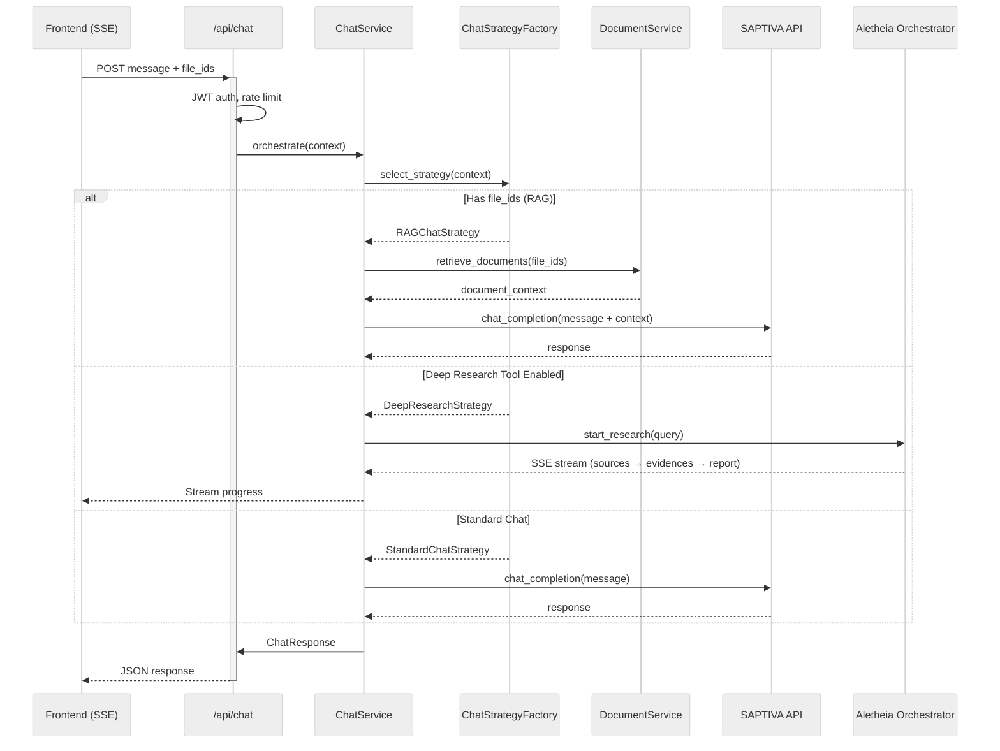
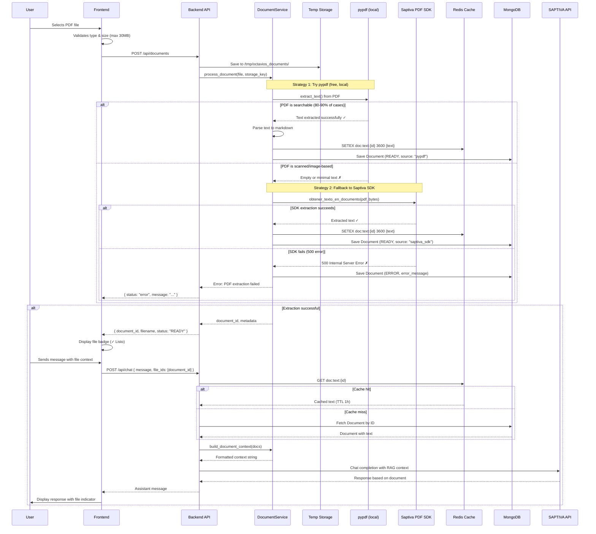
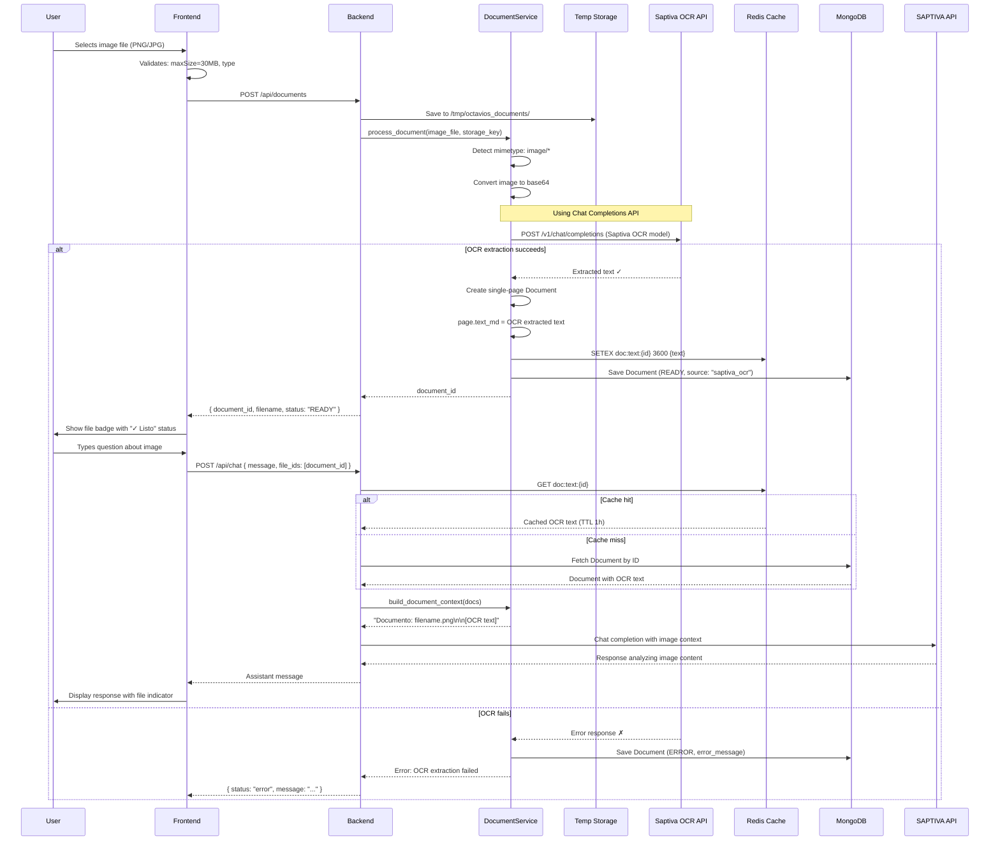

### Conversation and Research Flow

The sequence below shows how a user message is processed, optionally including document context, routed between SAPTIVA chat and Aletheia deep research, and streamed back to the client.



---

## Core Features

### 1. Multi-turn Conversations with File Context Persistence

Files uploaded in a conversation are automatically included in all subsequent messages without re-uploading.

**Implementation:**
- `ChatSession.attached_file_ids: List[str]` stores file references at session level
- Chat router merges request `file_ids` with session `attached_file_ids` using deduplication
- Backend automatically includes document context in LLM prompts

```python
# Backend merge logic (chat.py:142-181)
all_file_ids = list(dict.fromkeys(request_file_ids + session_file_ids))
```

### 2. Minimalismo Funcional (UI Philosophy)

Clean, non-redundant interface following "less is more" principles:
- ✅ Files automatically used when uploaded (no toggle)
- ✅ Single entry point for tools (+ button menu)
- ✅ Implicit intent over explicit controls

### 3. Document Intelligence (RAG)

Supports PDF and image analysis with:
- Multi-page PDF parsing with table detection
- OCR for images (Tesseract with Spanish + English)
- Vector-based semantic search
- Source attribution in responses

### 4. Deep Research Orchestration

Integrated Aletheia research engine with:
- Progress streaming (sources → evidences → report)
- Real-time updates via SSE
- Source tracking and citation
- Wizard UI for research scope configuration

### 5. Accessibility-First Design

- ARIA labels and live regions
- Full keyboard navigation (Enter, Shift+Enter, Escape)
- Screen reader announcements
- Responsive layouts (mobile, tablet, desktop)


---

## Document Processing

### PDF Analysis Flow



**Key Files:**
- Frontend upload: `apps/web/src/hooks/useFiles.ts:85-120`
- Backend processing: `apps/api/src/services/document_service.py:150-250`
- OCR integration: `apps/api/src/services/document_service.py:200-220`

### Image Analysis Flow (OCR)



**OCR Configuration:**
- **Model**: `Saptiva OCR` (via Chat Completions API)
- **Endpoint**: `/v1/chat/completions/`
- **Method**: Multimodal prompt with base64-encoded image
- **Languages**: Automatic detection (Spanish + English optimized)
- **Cache**: Redis 1-hour TTL for extracted text
- **Location**: `apps/api/src/services/document_service.py:200-220`

**Image Requirements:**
- **Formats**: PNG, JPG, JPEG
- **Max size**: 30MB
- **Resolution**: Recommended 300 DPI for best OCR accuracy
- **Encoding**: Base64 data URI format (`data:image/png;base64,...`)

---

## Development Setup

### Python Virtual Environment (.venv)

The project uses a Python virtual environment (`.venv`) for local development and testing. This allows you to run tests and development tools on your host machine without relying on Docker containers.

#### When to Use .venv

Use `.venv` for:
- **Integration/E2E Tests**: Running tests that need to connect to services via host-mapped ports
- **Local Development**: Fast iteration without Docker overhead
- **IDE Integration**: Better IntelliSense, debugging, and code navigation
- **Pre-commit Hooks**: Running linters and formatters locally

**Continue using Docker** for:
- **Running the Application**: API, web, and all services
- **Unit Tests**: Tests that run inside the container with mocked dependencies
- **Production-like Environment**: Ensuring consistency with deployed environment

#### Setup Virtual Environment

The virtual environment is automatically managed by the Makefile:

```bash
# Quick setup (creates .venv and installs dependencies)
make venv-install

# Or run specific setup targets that include venv
make setup-quick          # Full quick setup
make setup-interactive    # Interactive setup
```

**Manual setup** (if needed):

```bash
cd apps/api

# Create virtual environment
python3 -m venv .venv

# Activate (Linux/macOS)
source .venv/bin/activate

# Activate (Windows)
.venv\Scripts\activate

# Install dependencies
pip install -r requirements.txt -r requirements-dev.txt

# Deactivate when done
deactivate
```

#### Running Tests with .venv

```bash
# E2E tests (uses .venv automatically)
make test-e2e

# Integration tests (from host with .venv)
make test-integration

# Or manually activate and run
source apps/api/.venv/bin/activate
pytest apps/api/tests/integration/ -v
```

**Port Mappings for Host Testing:**
- MongoDB: `localhost:27018` → `mongodb:27017` (container)
- Redis: `localhost:6380` → `redis:6379` (container)
- API: `localhost:8001` → `api:8001` (container)

These mappings are configured in `docker-compose.yml` and `tests/integration/conftest.py`.

#### IDE Configuration

**VS Code** (`apps/api/.vscode/settings.json`):
```json
{
  "python.defaultInterpreterPath": "${workspaceFolder}/.venv/bin/python",
  "python.testing.pytestEnabled": true,
  "python.testing.pytestArgs": ["tests"]
}
```

**PyCharm**:
1. File → Settings → Project → Python Interpreter
2. Add Interpreter → Existing Environment
3. Select `apps/api/.venv/bin/python`

#### Updating Dependencies

```bash
# Update .venv after requirements.txt changes
make venv-install

# Or manually
source apps/api/.venv/bin/activate
pip install -r requirements.txt -r requirements-dev.txt
```

#### Troubleshooting

**Issue**: `ModuleNotFoundError` when running tests from host

**Solution**: Ensure .venv is activated and dependencies installed:
```bash
make venv-install
source apps/api/.venv/bin/activate
pytest tests/integration/ -v
```

---

**Issue**: Tests fail with "Connection refused" to MongoDB/Redis

**Solution**: Ensure Docker services are running and use correct host ports:
```bash
# Start services
make dev

# Verify services
docker ps | grep octavios

# Check port mappings
docker compose ps
```

---

**Issue**: `.venv` is too large or corrupted

**Solution**: Remove and recreate:
```bash
rm -rf apps/api/.venv
make venv-install
```
