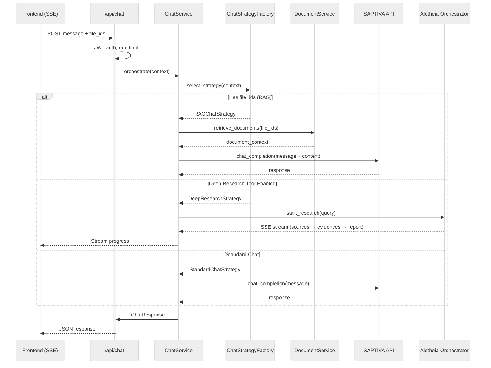
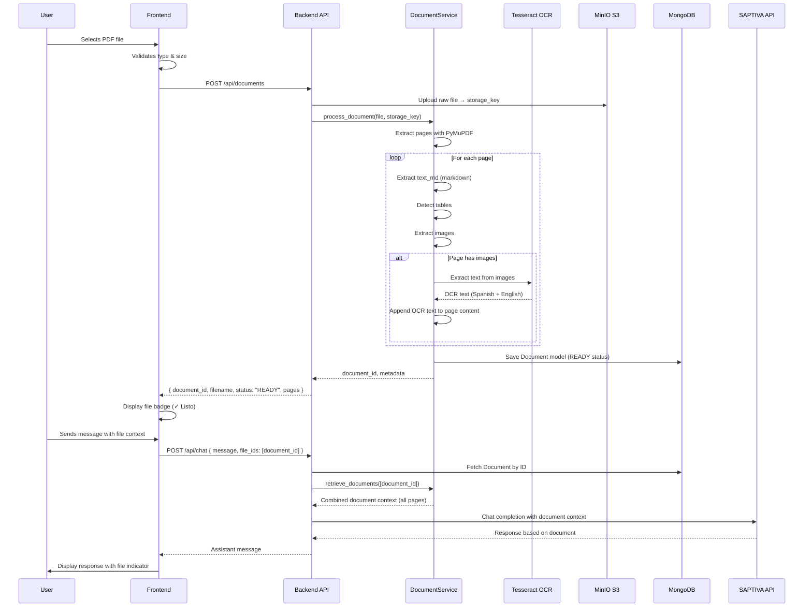
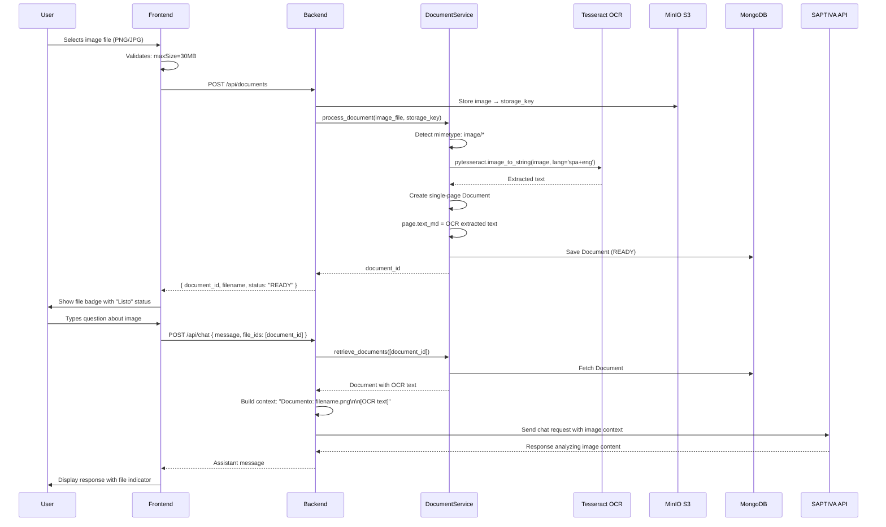

### Conversation and Research Flow

The sequence below shows how a user message is processed, optionally including document context, routed between SAPTIVA chat and Aletheia deep research, and streamed back to the client.



---

## Core Features

### 1. Multi-turn Conversations with File Context Persistence

Files uploaded in a conversation are automatically included in all subsequent messages without re-uploading.

**Implementation:**
- `ChatSession.attached_file_ids: List[str]` stores file references at session level
- Chat router merges request `file_ids` with session `attached_file_ids` using deduplication
- Backend automatically includes document context in LLM prompts

```python
# Backend merge logic (chat.py:142-181)
all_file_ids = list(dict.fromkeys(request_file_ids + session_file_ids))
```

### 2. Minimalismo Funcional (UI Philosophy)

Clean, non-redundant interface following "less is more" principles:
- ✅ Files automatically used when uploaded (no toggle)
- ✅ Single entry point for tools (+ button menu)
- ✅ Implicit intent over explicit controls

### 3. Document Intelligence (RAG)

Supports PDF and image analysis with:
- Multi-page PDF parsing with table detection
- OCR for images (Tesseract with Spanish + English)
- Vector-based semantic search
- Source attribution in responses

### 4. Deep Research Orchestration

Integrated Aletheia research engine with:
- Progress streaming (sources → evidences → report)
- Real-time updates via SSE
- Source tracking and citation
- Wizard UI for research scope configuration

### 5. Accessibility-First Design

- ARIA labels and live regions
- Full keyboard navigation (Enter, Shift+Enter, Escape)
- Screen reader announcements
- Responsive layouts (mobile, tablet, desktop)


---

## Document Processing

### PDF Analysis Flow



**Key Files:**
- Frontend upload: `apps/web/src/hooks/useFiles.ts:85-120`
- Backend processing: `apps/api/src/services/document_service.py:150-250`
- OCR integration: `apps/api/src/services/document_service.py:200-220`

### Image Analysis Flow (OCR)



**OCR Configuration:**
- Languages: Spanish + English (`lang='spa+eng'`)
- Engine mode: Default (PSM 3 - fully automatic page segmentation)
- Location: `apps/api/src/services/document_service.py:200-220`

**Image Requirements:**
- Formats: PNG, JPG, JPEG
- Max size: 30MB
- Resolution: Recommended 300 DPI for best OCR accuracy

