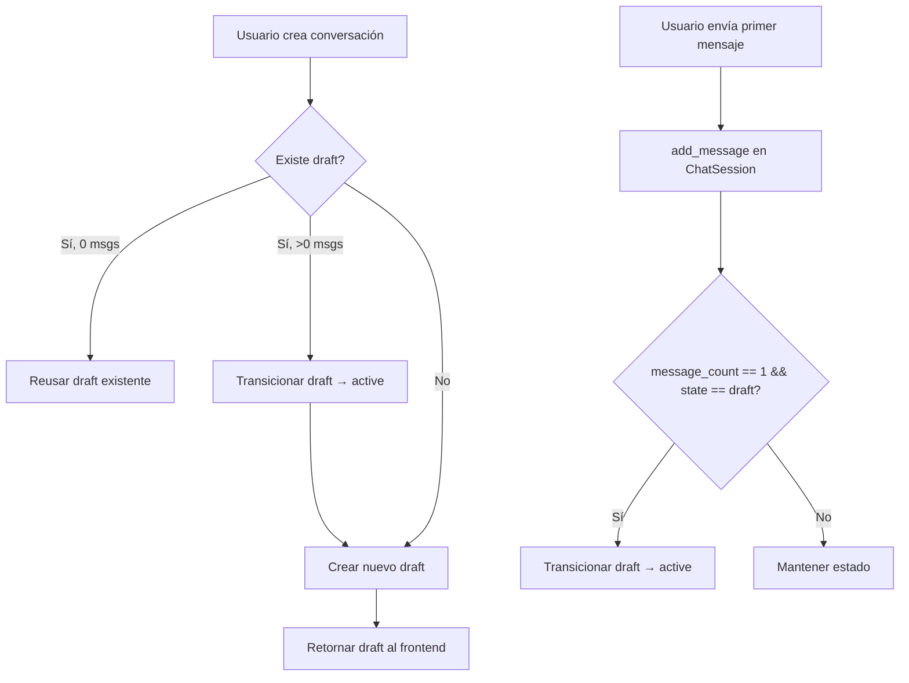
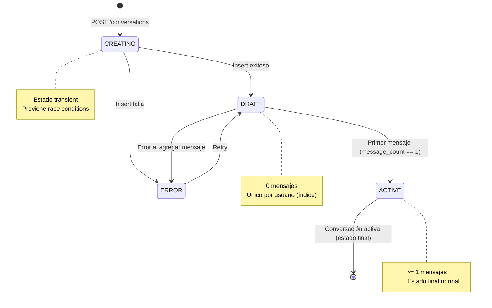

# Gestión de Estados de Conversación

## Problema Actual

### Estados Inconsistentes en BD
```
- None: 70 conversaciones (código legacy sin campo `state`)
- active: 9 conversaciones (código nuevo)
- draft: 1 conversación (código nuevo)
```

### Flujo Actual (POST /api/conversations)



## Problemas Identificados

### 1. **Estado None (Legacy)**
- 70 conversaciones sin el campo `state`
- Pydantic schema requiere `state` como Optional, pero no maneja None correctamente
- GET /api/conversations falla al serializar conversaciones legacy

### 2. **Race Conditions**
- Frontend puede llamar POST /conversations múltiples veces
- No hay locking para prevenir drafts duplicados
- El índice único MongoDB ayuda pero causa errores E11000

### 3. **Falta de Validación de Transiciones**
- No hay validación explícita de transiciones válidas
- Estados pueden ser modificados directamente en la BD
- No hay logs de transiciones inválidas

### 4. **Estado "CREATING" no usado**
- Definido en el enum pero nunca asignado
- Podría prevenir race conditions

## Solución Propuesta

### 1. **Migración de Datos Legacy**

Migrar todas las conversaciones `state: None` → `active`:

```python
# Conversaciones sin estado son consideradas activas
await db.chat_sessions.update_many(
    {"$or": [{"state": None}, {"state": {"$exists": False}}]},
    {"$set": {"state": "active", "updated_at": datetime.utcnow()}}
)
```

### 2. **Schema Pydantic Robusto**

Actualizar `schemas/chat.py` para manejar None:

```python
from pydantic import field_validator

class ChatSession(BaseModel):
    state: Optional[ConversationState] = ConversationState.ACTIVE

    @field_validator('state', mode='before')
    @classmethod
    def default_state_if_none(cls, v):
        """Legacy conversations without state are treated as active"""
        return v if v is not None else ConversationState.ACTIVE.value
```

### 3. **Máquina de Estados con Validación**

Agregar método en `models/chat.py`:

```python
class ChatSession(Document):
    # ... existing fields ...

    VALID_TRANSITIONS = {
        ConversationState.CREATING: [ConversationState.DRAFT, ConversationState.ERROR],
        ConversationState.DRAFT: [ConversationState.ACTIVE, ConversationState.ERROR],
        ConversationState.ACTIVE: [],  # Terminal state
        ConversationState.ERROR: [ConversationState.DRAFT],  # Allow retry
    }

    async def transition_state(self, new_state: ConversationState, reason: str = None):
        """
        Safely transition conversation state with validation.

        Args:
            new_state: Target state
            reason: Human-readable reason for logging

        Raises:
            ValueError: If transition is invalid
        """
        current = self.state or ConversationState.ACTIVE  # Handle None

        # Check if transition is valid
        valid_next = self.VALID_TRANSITIONS.get(current, [])
        if new_state not in valid_next and current != new_state:
            raise ValueError(
                f"Invalid state transition: {current.value} → {new_state.value}"
            )

        logger.info(
            "State transition",
            chat_id=self.id,
            from_state=current.value,
            to_state=new_state.value,
            reason=reason or "not_specified",
            message_count=self.message_count
        )

        self.state = new_state
        self.updated_at = datetime.utcnow()
        await self.save()
```

### 4. **Uso de Estado CREATING**

En `routers/conversations.py` POST endpoint:

```python
# Crear conversación en estado CREATING primero
conversation = ChatSessionModel(
    id=conversation_id,
    title=title,
    user_id=user_id,
    state=ConversationState.CREATING,  # Start in transient state
    message_count=0,
    settings={"model": request.model}
)

try:
    await conversation.insert()

    # Transition to DRAFT after successful insert
    await conversation.transition_state(
        ConversationState.DRAFT,
        reason="conversation_created_successfully"
    )

except DuplicateKeyError:
    # Handle race condition gracefully
    logger.warning("Duplicate conversation creation attempt", user_id=user_id)
    existing = await ChatSessionModel.find_one(
        ChatSessionModel.user_id == user_id,
        ChatSessionModel.state == ConversationState.DRAFT
    )
    if existing:
        return ConversationResponse.from_model(existing)
    raise
```

### 5. **Actualizar add_message()**

En `models/chat.py`:

```python
async def add_message(self, role: MessageRole, content: str, **kwargs) -> ChatMessage:
    """Add a new message to this chat session"""
    message = ChatMessage(
        chat_id=self.id,
        role=role,
        content=content,
        **kwargs
    )
    await message.insert()

    # Update session stats
    self.message_count += 1
    self.updated_at = datetime.utcnow()

    # P0-BE-UNIQ-EMPTY: Transition from DRAFT to ACTIVE on first message
    if self.message_count == 1 and self.state == ConversationState.DRAFT:
        await self.transition_state(
            ConversationState.ACTIVE,
            reason="first_message_received"
        )
    else:
        await self.save()

    # ... rest of the method ...
```

## Flujo Mejorado



## Métricas y Monitoreo

### Logs Estructurados

Todos los cambios de estado deben ser logged:

```json
{
  "event": "state_transition",
  "chat_id": "uuid",
  "user_id": "uuid",
  "from_state": "draft",
  "to_state": "active",
  "reason": "first_message_received",
  "message_count": 1,
  "timestamp": "2025-10-01T01:00:00Z"
}
```

### Queries de Monitoreo

```python
# Conversaciones huérfanas en CREATING (> 5 min)
orphaned_creating = await ChatSessionModel.find(
    ChatSessionModel.state == ConversationState.CREATING,
    ChatSessionModel.created_at < datetime.utcnow() - timedelta(minutes=5)
).to_list()

# Drafts con mensajes (estado inconsistente)
inconsistent_drafts = await ChatSessionModel.find(
    ChatSessionModel.state == ConversationState.DRAFT,
    ChatSessionModel.message_count > 0
).to_list()
```

## Testing

### Unit Tests

```python
async def test_state_transition_draft_to_active():
    """Test valid transition from DRAFT to ACTIVE"""
    session = ChatSessionModel(state=ConversationState.DRAFT)
    await session.transition_state(ConversationState.ACTIVE, "test")
    assert session.state == ConversationState.ACTIVE

async def test_invalid_transition_raises():
    """Test invalid transition raises ValueError"""
    session = ChatSessionModel(state=ConversationState.ACTIVE)
    with pytest.raises(ValueError, match="Invalid state transition"):
        await session.transition_state(ConversationState.DRAFT)
```

### Integration Tests

```python
async def test_concurrent_conversation_creation():
    """Test that concurrent POST /conversations handles race condition"""
    # Simulate 3 concurrent requests
    tasks = [
        create_conversation(user_id="test-user")
        for _ in range(3)
    ]
    results = await asyncio.gather(*tasks, return_exceptions=True)

    # Should all return the same draft ID
    successful = [r for r in results if not isinstance(r, Exception)]
    assert len(set(r.id for r in successful)) == 1
```

## Rollout Plan

### Fase 1: Migración de Datos (Completado ✅)
- [x] Migrar drafts huérfanos con mensajes → active
- [x] Migrar ready → active
- [ ] Migrar None → active (70 conversaciones)

### Fase 2: Código Defensivo
- [ ] Agregar validator en Pydantic schema para manejar None
- [ ] Agregar método `transition_state()` con validación
- [ ] Actualizar GET /conversations para filtrar estados inválidos

### Fase 3: Usar Estado CREATING
- [ ] Modificar POST /conversations para usar CREATING
- [ ] Agregar manejo de duplicados mejorado
- [ ] Agregar timeout para limpiar CREATINGs huérfanos

### Fase 4: Monitoreo
- [ ] Agregar dashboards para distribución de estados
- [ ] Alertas para estados inconsistentes
- [ ] Cleanup job para conversaciones huérfanas

## Referencias

- MongoDB Unique Partial Index: `unique_draft_per_user`
- Código: `apps/api/src/models/chat.py:95-96`
- Endpoint: `apps/api/src/routers/conversations.py:184-227`
