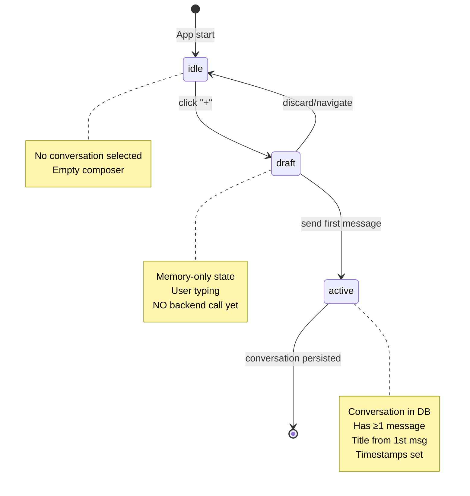

# Progressive Commitment Pattern: Eliminar Drafts Fantasma

**Fecha**: 2025-09-30
**Estado**: 🔨 En implementación (Fase 1: Fundamentos completada)
**Prioridad**: P0 - Crítico UX
**Épica**: Gestión de Conversaciones sin Estado Fantasma

---

## 📋 Resumen Ejecutivo

Implementación de máquina de estados para conversaciones que elimina la creación prematura de drafts vacíos en el backend. Las conversaciones solo se persisten cuando el usuario envía el primer mensaje real, siguiendo el principio de **progressive commitment** (compromiso progresivo).

### Problema Actual

```
❌ Flujo Actual (Problemático):
Usuario click "+" → POST /api/conversations → DB insert → Item vacío en lista
                        ↓
              "Nueva conversación" (sin mensajes)
                        ↓
              Usuario navega/cierra → Draft fantasma permanece
```

**Síntomas**:
- Items "Nueva conversación" vacíos en el sidebar
- Conversaciones con `message_count=0` y `created_at` pero sin contenido
- Timestamps mostrando "just now" para conversaciones vacías
- Drafts que no se eliminan al navegar
- Inserción errática en la lista (salto al fondo, desaparición)

### Solución Propuesta

```
✅ Flujo Nuevo (Progressive Commitment):
Usuario click "+" → Set draft mode (memoria) → Enfoca composer
                                    ↓
                         Usuario escribe mensaje
                                    ↓
                         Usuario envía 1er mensaje
                                    ↓
                    POST /api/conversations + mensaje
                                    ↓
                    Conversación con título real + timestamps
```

**Beneficios**:
- ✅ Cero drafts fantasma en DB
- ✅ Títulos reales desde primer mensaje
- ✅ Timestamps correctos (null hasta mensaje)
- ✅ Lista limpia, ordenada y predecible
- ✅ Menor carga cognitiva del usuario

---

## 🎯 Criterios de Aceptación

| # | Criterio | Implementación | Estado |
|---|----------|----------------|--------|
| 1 | Ya no aparece "Nueva conversación" vacía en el sidebar | ConversationList filter | ⏳ Pendiente |
| 2 | El botón "+" no crea items; solo enfoca el composer | ChatView.handleStartNewChat() | ⏳ Pendiente |
| 3 | Un chat se crea solo al enviar el primer mensaje | store.sendFirstMessage() | ⏳ Pendiente |
| 4 | El título es la primera frase del primer mensaje del usuario (máx. 40 chars) | deriveTitleFromMessage() | ✅ Completado |
| 5 | El timestamp no muestra "just now" en vacíos; muestra "—" hasta tener mensaje | ConversationList render | ⏳ Pendiente |
| 6 | El orden en la lista es estable por last_message_at | ConversationList sort | ⏳ Pendiente |
| 7 | Eliminar una conversación vacía no la recrea | No-op (no persisten vacías) | ⏳ Pendiente |
| 8 | No hay "salto al fondo y desaparición" al insertar; claves React correctas | ConversationList keys | ⏳ Pendiente |
| 9 | Tests unit/integration/e2e pasando | Test suite | ⏳ Pendiente |

---

## 🏗️ Arquitectura: Máquina de Estados

### Diagrama de Estados



### Transiciones Detalladas

| Estado Actual | Evento | Estado Siguiente | Side Effects |
|---------------|--------|------------------|--------------|
| `idle` | `click_new_chat` | `draft` | `set({ draft: { isDraftMode: true } })` |
| `draft` | `type_message` | `draft` | `set({ draft: { draftText } })` |
| `draft` | `send_message` | `active` | `POST /conversations + message`, set timestamps |
| `draft` | `navigate_away` | `idle` | `set({ draft: INITIAL_DRAFT_STATE })` |
| `draft` | `click_new_chat` (again) | `draft` | No-op, ya en draft |
| `active` | `delete_chat` (sin mensajes) | N/A | No debería existir (invariante) |
| `active` | `delete_chat` (con mensajes) | `idle` | `DELETE /conversations/:id` |

### Invariantes del Sistema

1. **Nunca persistir una conversación vacía**: `message_count = 0 ⇒ NO existe en DB`
2. **Draft vive solo en memoria**: No en `localStorage`, no en backend hasta primer mensaje
3. **Título siempre derivado**: Jamás "Nueva conversación" en conversaciones activas
4. **Timestamps null-safe**: `first_message_at = null ⇒ mostrar "—"`, no "just now"
5. **Orden predecible**: Sort por `last_message_at ?? first_message_at ?? created_at` DESC
6. **Claves React estables**: Usar `conversation.id`, nunca índices de array

---

## 📁 Estructura de Datos

### Tipos TypeScript

```typescript
// apps/web/src/lib/types.ts
export interface ChatSession {
  id: string
  title: string
  created_at: string
  updated_at: string
  first_message_at: string | null  // ✅ NUEVO: null hasta primer mensaje
  last_message_at: string | null   // ✅ NUEVO: null hasta primer mensaje
  message_count: number
  model: string
  preview?: string
  pinned?: boolean
  state?: ConversationState
}

// apps/web/src/lib/conversation-utils.ts
export interface DraftConversation {
  isDraftMode: boolean
  draftText: string
  draftModel?: string
}

export const INITIAL_DRAFT_STATE: DraftConversation = {
  isDraftMode: false,
  draftText: '',
  draftModel: undefined,
}
```

### Estado Zustand

```typescript
// apps/web/src/lib/store.ts
interface AppState {
  // ... existing state ...

  // ✅ NUEVO: Draft conversation state
  draft: DraftConversation
}

interface AppActions {
  // ✅ NUEVO: Draft actions
  openDraft: () => void
  discardDraft: () => void
  setDraftText: (text: string) => void
  isDraftMode: () => boolean
  sendFirstMessage: (text: string) => Promise<void>
}
```

### Backend Model (Python)

```python
# apps/api/src/models/chat.py
from datetime import datetime

class ChatSession(Document):
    id: str = Field(default_factory=lambda: str(uuid4()), alias="_id")
    title: str
    created_at: datetime = Field(default_factory=datetime.utcnow)
    updated_at: datetime = Field(default_factory=datetime.utcnow)

    # ✅ NUEVO: Timestamps de mensajes
    first_message_at: Optional[datetime] = None  # Seteado al primer mensaje
    last_message_at: Optional[datetime] = None   # Seteado en cada mensaje

    message_count: int = 0
    # ... resto de campos ...
```

---

## 🔧 Implementación Detallada

### 1. Utilidad de Título (✅ Completado)

**Archivo**: `apps/web/src/lib/conversation-utils.ts`

```typescript
export function deriveTitleFromMessage(text: string): string {
  if (!text || typeof text !== 'string') {
    return 'Nueva conversación'
  }

  // Strip Markdown: **, *, _, `, #, >, [], ()
  let plain = text.replace(/[`*_#>\[\]\(\)]/g, '')

  // Normalize whitespace
  plain = plain.replace(/\s+/g, ' ').trim()

  if (!plain) {
    return 'Nueva conversación'
  }

  // Truncate to 40 chars with ellipsis
  const maxLength = 40
  if (plain.length <= maxLength) {
    return plain
  }

  return plain.slice(0, maxLength - 1) + '…'
}
```

**Tests**:
```typescript
describe('deriveTitleFromMessage', () => {
  it('strips markdown formatting', () => {
    expect(deriveTitleFromMessage('**How** do I deploy this?'))
      .toBe('How do I deploy this?')
  })

  it('truncates long text to 40 chars', () => {
    const long = 'This is a very long question about something complex and detailed'
    expect(deriveTitleFromMessage(long))
      .toBe('This is a very long question about s…')
  })

  it('normalizes whitespace', () => {
    expect(deriveTitleFromMessage('Hello    world\n\nthere'))
      .toBe('Hello world there')
  })
})
```

### 2. Store: Draft State Machine (🔨 En progreso)

**Archivo**: `apps/web/src/lib/store.ts`

```typescript
export const useAppStore = create<AppState & AppActions>()(
  devtools(
    persist(
      (set, get) => ({
        // Initial state
        draft: INITIAL_DRAFT_STATE,
        // ... resto del estado ...

        // ✅ Draft actions
        openDraft: () => {
          set({
            draft: { isDraftMode: true, draftText: '', draftModel: get().selectedModel },
            currentChatId: null,
            messages: [],
          })
          logDebug('Draft mode activated')
        },

        discardDraft: () => {
          set({ draft: INITIAL_DRAFT_STATE })
          logDebug('Draft discarded')
        },

        setDraftText: (text: string) => {
          set((state) => ({
            draft: { ...state.draft, draftText: text }
          }))
        },

        isDraftMode: () => {
          return get().draft.isDraftMode
        },

        // ✅ Create conversation ONLY on first message
        sendFirstMessage: async (text: string) => {
          const state = get()
          if (!state.draft.isDraftMode || !text.trim()) {
            logWarn('sendFirstMessage called but not in draft mode or empty text')
            return
          }

          try {
            // 1. Derive title from first message
            const title = deriveTitleFromMessage(text)
            const now = new Date().toISOString()

            // 2. Create conversation with real title + timestamps
            const response = await apiClient.createConversation({
              title,
              model: state.draft.draftModel || state.selectedModel,
            })

            logDebug('Conversation created on first message', {
              chatId: response.id,
              title,
              firstMessageAt: now,
            })

            // 3. Send the actual message
            const messageResponse = await apiClient.sendChatMessage({
              message: text,
              chat_id: response.id,
              model: state.draft.draftModel || state.selectedModel,
              temperature: state.settings.temperature,
              max_tokens: state.settings.maxTokens,
              stream: state.settings.streamEnabled,
              tools_enabled: state.toolsEnabled,
            })

            // 4. Update state: exit draft, set chat ID
            set({
              draft: INITIAL_DRAFT_STATE,
              currentChatId: response.id,
              messages: [
                {
                  id: Date.now().toString(),
                  content: text,
                  role: 'user',
                  timestamp: now,
                },
                {
                  id: messageResponse.message_id,
                  content: messageResponse.content,
                  role: 'assistant',
                  timestamp: messageResponse.created_at,
                  model: messageResponse.model,
                  tokens: messageResponse.tokens,
                  latency: messageResponse.latency_ms,
                },
              ],
            })

            // 5. Reload sessions to get updated list
            await get().loadChatSessions()

          } catch (error) {
            logError('Failed to create conversation on first message:', error)
            toast.error('Error al crear la conversación')
            throw error
          }
        },

        // ... resto de acciones ...
      }),
      { /* persist config */ }
    )
  )
)
```

### 3. ChatView: Refactorizar handleStartNewChat (⏳ Pendiente)

**Archivo**: `apps/web/src/app/chat/_components/ChatView.tsx`

```typescript
// ANTES (crea conversación inmediatamente):
const handleStartNewChat = React.useCallback(async () => {
  let tempId: string | null = null
  try {
    tempId = createConversationOptimistic()
    setCurrentChatId(tempId)
    clearMessages()

    const realConversation = await apiClient.createConversation({
      title: 'Nueva conversación',  // ❌ Título genérico
      model: selectedModel || 'SAPTIVA_CORTEX'
    })

    reconcileConversation(tempId, realConversation)
    setCurrentChatId(realConversation.id)
  } catch (error) {
    // ...
  }
}, [...])

// DESPUÉS (solo abre draft):
const handleStartNewChat = React.useCallback(() => {
  openDraft()  // ✅ Solo activa modo draft, no backend
  logDebug('New chat started in draft mode')
}, [openDraft])
```

### 4. ChatView: Enviar Mensaje (⏳ Pendiente)

```typescript
const handleSendMessage = React.useCallback(async (text: string) => {
  const state = get()

  // Detectar si estamos en draft mode
  if (state.draft.isDraftMode) {
    // ✅ Primer mensaje: crear conversación
    await sendFirstMessage(text)
  } else {
    // ✅ Mensaje subsecuente: usar lógica existente
    await sendMessage(text)
  }
}, [sendFirstMessage, sendMessage])
```

### 5. ConversationList: Ordenar y Filtrar (⏳ Pendiente)

**Archivo**: `apps/web/src/components/chat/ConversationList.tsx`

```typescript
const sortedSessions = React.useMemo(() => {
  // ✅ Filtrar conversaciones vacías (no deberían existir, pero defensivo)
  const validSessions = sessions.filter(s =>
    s.message_count > 0 && s.first_message_at
  )

  // ✅ Ordenar por last_message_at, luego first_message_at, luego created_at
  const sorted = validSessions.sort((a, b) => {
    const aTime = a.last_message_at || a.first_message_at || a.created_at
    const bTime = b.last_message_at || b.first_message_at || b.created_at
    return new Date(bTime).getTime() - new Date(aTime).getTime()
  })

  // Separar pinned
  const pinned = sorted.filter(s => s.pinned)
  const unpinned = sorted.filter(s => !s.pinned)

  return [...pinned, ...unpinned]
}, [sessions])
```

**Timestamp Display**:

```typescript
// ✅ Mostrar "—" si no hay mensajes aún
{conv.first_message_at ? (
  <TimeAgo date={conv.last_message_at || conv.first_message_at} />
) : (
  <span className="text-text-muted">—</span>
)}
```

---

## 🧪 Testing

### Unit Tests

**Archivo**: `apps/web/src/lib/__tests__/conversation-utils.test.ts`

```typescript
import { deriveTitleFromMessage, isConversationEmpty, shouldPersistConversation } from '../conversation-utils'

describe('conversation-utils', () => {
  describe('deriveTitleFromMessage', () => {
    it('strips Markdown formatting', () => {
      expect(deriveTitleFromMessage('**Bold** and *italic*')).toBe('Bold and italic')
    })

    it('truncates to 40 characters with ellipsis', () => {
      const long = 'A'.repeat(50)
      const result = deriveTitleFromMessage(long)
      expect(result).toHaveLength(40)
      expect(result).toEndWith('…')
    })

    it('normalizes whitespace', () => {
      expect(deriveTitleFromMessage('Hello    \n\n  world')).toBe('Hello world')
    })

    it('returns default for empty strings', () => {
      expect(deriveTitleFromMessage('')).toBe('Nueva conversación')
      expect(deriveTitleFromMessage('   ')).toBe('Nueva conversación')
    })
  })

  describe('isConversationEmpty', () => {
    it('returns true when no messages', () => {
      expect(isConversationEmpty(0, null)).toBe(true)
    })

    it('returns false when has messages', () => {
      expect(isConversationEmpty(1, '2025-09-30T00:00:00Z')).toBe(false)
    })
  })

  describe('shouldPersistConversation', () => {
    it('returns false for empty conversations', () => {
      expect(shouldPersistConversation(0, null)).toBe(false)
    })

    it('returns true for conversations with messages', () => {
      expect(shouldPersistConversation(1, '2025-09-30T00:00:00Z')).toBe(true)
    })
  })
})
```

### Integration Tests (RTL)

**Archivo**: `apps/web/src/app/chat/__tests__/ChatView.test.tsx`

```typescript
import { render, screen, fireEvent, waitFor } from '@testing-library/react'
import { ChatView } from '../_components/ChatView'

describe('ChatView - Progressive Commitment', () => {
  it('clicking "+" does not create conversation in backend', async () => {
    const createConversationSpy = jest.spyOn(apiClient, 'createConversation')

    render(<ChatView />)

    const newChatButton = screen.getByLabelText(/nueva conversación/i)
    fireEvent.click(newChatButton)

    // ✅ No debe llamar al backend inmediatamente
    expect(createConversationSpy).not.toHaveBeenCalled()

    // ✅ Debe enfocar el composer
    const composer = screen.getByRole('textbox')
    expect(composer).toHaveFocus()
  })

  it('sending first message creates conversation with derived title', async () => {
    const createConversationSpy = jest.spyOn(apiClient, 'createConversation')

    render(<ChatView />)

    const newChatButton = screen.getByLabelText(/nueva conversación/i)
    fireEvent.click(newChatButton)

    const composer = screen.getByRole('textbox')
    fireEvent.change(composer, { target: { value: 'How do I deploy this app?' } })

    const sendButton = screen.getByRole('button', { name: /send/i })
    fireEvent.click(sendButton)

    await waitFor(() => {
      expect(createConversationSpy).toHaveBeenCalledWith({
        title: 'How do I deploy this app?',  // ✅ Título derivado
        model: expect.any(String),
      })
    })
  })
})
```

### E2E Tests (Playwright)

**Archivo**: `apps/web/e2e/new-conversation.spec.ts`

```typescript
import { test, expect } from '@playwright/test'

test.describe('New Conversation Flow', () => {
  test('should not show empty conversation in sidebar', async ({ page }) => {
    await page.goto('/chat')

    // Click "+" button
    await page.click('[aria-label="Nueva conversación"]')

    // Check sidebar - should NOT show "Nueva conversación" item
    const sidebar = page.locator('[role="navigation"]')
    const emptyConversation = sidebar.locator('text=Nueva conversación')
    await expect(emptyConversation).not.toBeVisible()

    // Composer should be focused
    const composer = page.locator('[role="textbox"]')
    await expect(composer).toBeFocused()
  })

  test('should create conversation with real title on first message', async ({ page }) => {
    await page.goto('/chat')

    await page.click('[aria-label="Nueva conversación"]')

    const composer = page.locator('[role="textbox"]')
    await composer.fill('What is the capital of France?')
    await page.click('[aria-label="Send message"]')

    // Wait for conversation to appear in sidebar
    const sidebar = page.locator('[role="navigation"]')
    await expect(sidebar.locator('text=What is the capital of France?')).toBeVisible()

    // Should NOT show "Nueva conversación"
    await expect(sidebar.locator('text=Nueva conversación')).not.toBeVisible()
  })
})
```

---

## 📦 Plan de Rollout

### Fase 1: Fundamentos ✅ (Completado)
- [x] Tipos extendidos: `first_message_at`, `last_message_at`
- [x] Utilidades: `deriveTitleFromMessage()`, `DraftConversation`
- [x] Documentación completa

### Fase 2: Frontend State (En curso 🔨)
- [ ] Store: Implementar acciones draft
- [ ] Store: `sendFirstMessage()`
- [ ] ChatView: Refactorizar `handleStartNewChat()`
- [ ] ChatView: Detectar draft mode en envío

### Fase 3: UI Components
- [ ] ConversationList: Filtrar y ordenar
- [ ] ConversationList: Timestamps null-safe
- [ ] ConversationList: Claves React estables

### Fase 4: Backend
- [ ] Modelo: Agregar campos `first_message_at`, `last_message_at`
- [ ] Endpoint: Actualizar POST /conversations
- [ ] Migración: Limpiar drafts vacíos existentes

### Fase 5: Testing & QA
- [ ] Unit tests
- [ ] Integration tests (RTL)
- [ ] E2E tests (Playwright)
- [ ] Manual QA

---

## 🔍 Monitoreo y Telemetría

### Eventos a Trackear

```typescript
// Telemetry events
analytics.track('chat_draft_opened', {
  timestamp: Date.now(),
})

analytics.track('chat_created_on_first_message', {
  conversation_id: response.id,
  title_length: title.length,
  message_length: text.length,
  time_in_draft_ms: Date.now() - draftOpenedAt,
})

analytics.track('chat_draft_discarded', {
  draft_text_length: state.draft.draftText.length,
  reason: 'navigation' | 'user_action',
})
```

### Métricas de Éxito

- **Drafts fantasma**: Debe ser 0 después de despliegue
- **Conversaciones con título real**: 100% (excluir "Nueva conversación")
- **Tiempo promedio en draft**: <30 segundos
- **Tasa de descarte de drafts**: <20%

---

## 🚧 Riesgos y Mitigaciones

| Riesgo | Impacto | Probabilidad | Mitigación |
|--------|---------|--------------|------------|
| Drafts existentes en DB | Medio | Alta | Migración que limpia `message_count=0` |
| Usuarios con draft abierto durante deploy | Bajo | Baja | `discardDraft()` en invalidación de contexto |
| Race condition en primer mensaje | Alto | Media | Mutex/debounce en `sendFirstMessage()` |
| Backwards compatibility con backend viejo | Alto | Baja | Campos `first_message_at` nullable |

---

## 📚 Referencias

### Principios de Diseño

- **Progressive Commitment**: Nielsen Norman Group - "Prevent errors by not committing users to irreversible actions"
- **Cognitive Load Theory**: Eliminar estados fantasma reduce carga mental
- **Estoicismo aplicado**: Controlar inputs (cuándo persistir), aceptar eventos externos

### Código Relacionado

- State Management: `apps/web/src/lib/store.ts`
- Backend Models: `apps/api/src/models/chat.py`
- Conversation State Machine: `docs/CONVERSATION-STATE-MANAGEMENT.md`

---

## ✅ Checklist Final

- [x] Documentación completa
- [x] Tipos extendidos
- [x] Utilidad `deriveTitleFromMessage()`
- [ ] Store: Draft state machine
- [ ] Store: `sendFirstMessage()`
- [ ] ChatView refactorizado
- [ ] ConversationList actualizado
- [ ] Backend: Timestamps en modelo
- [ ] Backend: Migración
- [ ] Tests: Unit
- [ ] Tests: Integration
- [ ] Tests: E2E
- [ ] Deploy a staging
- [ ] QA manual
- [ ] Deploy a producción

---

**Última actualización**: 2025-09-30
**Responsable**: Engineering Team
**Revisores**: Product, UX, Backend Lead
