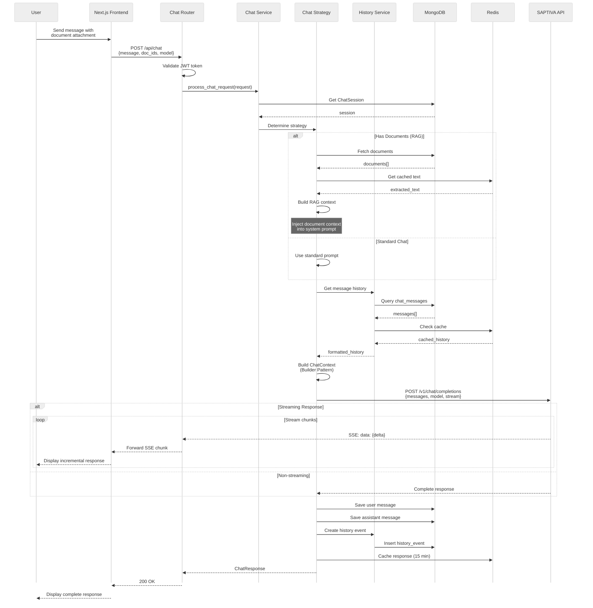
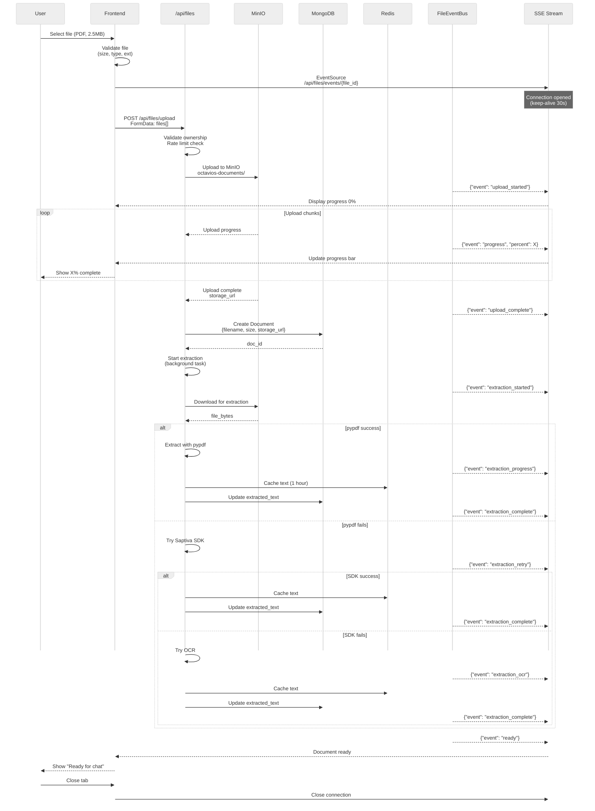
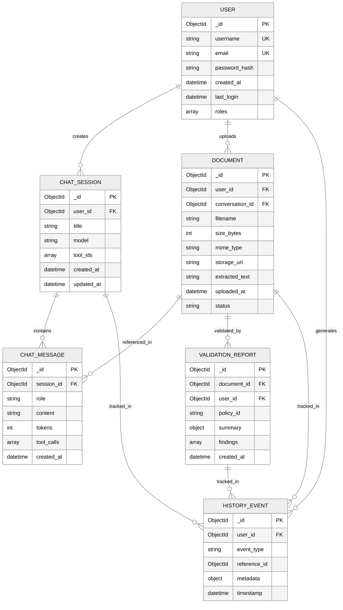
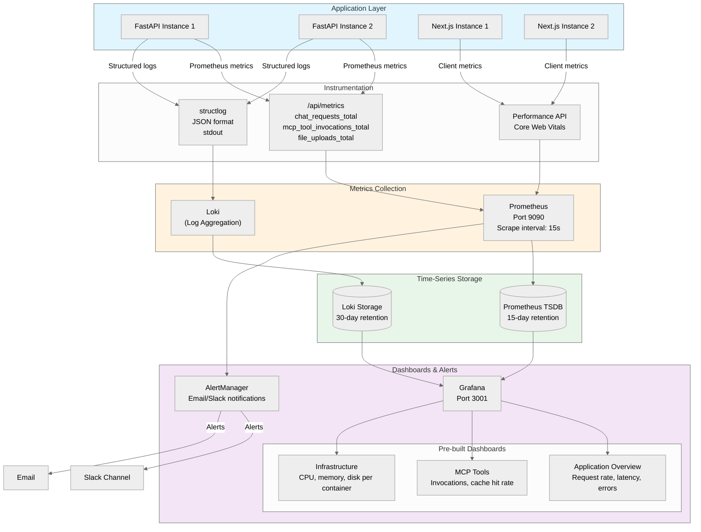

# OctaviOS Chat - Architecture Diagrams

Comprehensive architecture diagrams for the OctaviOS Chat platform, including MCP lazy loading, COPILOTO_414, document processing, and deployment.

---

## Table of Contents

1. [System Overview](#1-system-overview)
2. [Container Architecture](#2-container-architecture)
3. [MCP Lazy Loading Architecture](#3-mcp-lazy-loading-architecture)
4. [COPILOTO_414 Validation Flow](#4-copiloto_414-validation-flow)
5. [Document Extraction Pipeline](#5-document-extraction-pipeline)
6. [Chat Flow with RAG](#6-chat-flow-with-rag)
7. [Authentication & Authorization](#7-authentication--authorization)
8. [File Upload with SSE](#8-file-upload-with-sse)
9. [Deep Research Workflow](#9-deep-research-workflow)
10. [Deployment Architecture](#10-deployment-architecture)
11. [Data Models](#11-data-models)
12. [Observability Stack](#12-observability-stack)

---

## 1. System Overview

High-level architecture showing all major components and data flows.

```mermaid
%%{init: {'theme':'neutral','flowchart':{'curve':'basis'}}}%%
flowchart TB
    subgraph Client["🖥️ Client Layer"]
        Browser["Web Browser"]
        MobileApp["Mobile App<br/>(Future)"]
    end

    subgraph Frontend["🎨 Frontend - Next.js 14"]
        AppRouter["App Router<br/>(SSR + SSG)"]
        ChatUI["Chat Interface<br/>(Zustand Store)"]
        FileUpload["File Upload<br/>(SSE Progress)"]
        ReviewUI["Document Review<br/>(RAG Interface)"]
        MCPClient["MCP Client<br/>(Lazy Loading)"]
    end

    subgraph Gateway["🚪 API Gateway"]
        Nginx["Nginx<br/>(Reverse Proxy)"]
        RateLimit["Rate Limiter<br/>(100 req/min)"]
    end

    subgraph Backend["🔧 Backend - FastAPI"]
        AuthMW["Auth Middleware<br/>(JWT Validation)"]
        TelemetryMW["Telemetry<br/>(Prometheus)"]

        subgraph Routers["REST API Routers"]
            ChatRouter["Chat Router<br/>(/api/chat)"]
            FileRouter["File Router<br/>(/api/files)"]
            MCPRouter["MCP Router<br/>(/api/mcp)"]
            HistoryRouter["History Router<br/>(/api/history)"]
        end

        subgraph Services["Business Logic Services"]
            ChatService["Chat Service<br/>(Strategy Pattern)"]
            DocService["Document Service<br/>(3-tier Extraction)"]
            ValidationCoord["Validation Coordinator<br/>(COPILOTO_414)"]
            ResearchCoord["Research Coordinator<br/>(Aletheia)"]
        end

        subgraph MCP["MCP Layer"]
            LazyRegistry["Lazy Registry<br/>(~98% reduction)"]
            ToolCache["Tool Cache<br/>(In-Memory)"]
            Tools["5 Production Tools"]
        end
    end

    subgraph Storage["💾 Persistence Layer"]
        MongoDB[("MongoDB 7.0<br/>(Beanie ODM)<br/>6 Collections")]
        Redis[("Redis 7.2<br/>(Cache + Sessions)<br/>1-hour TTL")]
        MinIO[("MinIO<br/>(S3 Storage)<br/>PDF/Images")]
    end

    subgraph External["🌐 External Services"]
        Saptiva["SAPTIVA API<br/>(Turbo/Cortex/Ops)"]
        Aletheia["Aletheia<br/>(Deep Research)"]
        LangTool["LanguageTool<br/>(Grammar Check)"]
    end

    Browser --> AppRouter
    AppRouter --> ChatUI
    AppRouter --> FileUpload
    AppRouter --> ReviewUI
    AppRouter --> MCPClient

    ChatUI --> Nginx
    FileUpload --> Nginx
    ReviewUI --> Nginx
    MCPClient --> Nginx

    Nginx --> RateLimit
    RateLimit --> AuthMW
    AuthMW --> TelemetryMW

    TelemetryMW --> Routers

    ChatRouter --> ChatService
    FileRouter --> DocService
    MCPRouter --> LazyRegistry
    HistoryRouter --> ChatService

    ChatService --> MongoDB
    DocService --> MongoDB
    DocService --> Redis
    DocService --> MinIO
    ValidationCoord --> MongoDB

    LazyRegistry --> ToolCache
    ToolCache --> Tools

    ChatService --> Saptiva
    DocService --> Saptiva
    Tools --> Aletheia
    ValidationCoord --> LangTool

    style MCP fill:#e1f5ff
    style COPILOTO_414 fill:#fff3e0
    style Storage fill:#e8f5e9
    style External fill:#fce4ec
```



---

## 2. Container Architecture

Detailed view of Docker containers, volumes, and networks.

```mermaid
%%{init: {'theme':'neutral'}}%%
graph TB
    subgraph DockerHost["🐳 Docker Host"]
        subgraph Network["octavios-network (bridge)"]

            subgraph WebContainer["web (Next.js)"]
                NextDev["next dev<br/>Port 3000<br/>node_user"]
                NextVol["/app (volume mount)"]
            end

            subgraph APIContainer["api (FastAPI)"]
                Uvicorn["uvicorn --reload<br/>Port 8000<br/>api_user"]
                APIVol["/app (volume mount)"]
            end

            subgraph MongoContainer["mongodb (MongoDB 7.0)"]
                Mongod["mongod<br/>Port 27017"]
                MongoData[("/data/db<br/>(volume)")]
            end

            subgraph RedisContainer["redis (Redis 7.2)"]
                RedisServer["redis-server<br/>Port 6379"]
                RedisData[("/data<br/>(volume)")]
            end

            subgraph MinIOContainer["minio (MinIO)"]
                MinIOServer["minio server<br/>Port 9000/9001"]
                MinIOData[("/data<br/>(volume)")]
            end

            subgraph LangToolContainer["languagetool"]
                LangToolServer["LanguageTool<br/>Port 8081"]
            end

            subgraph NginxContainer["nginx (Production)"]
                NginxServer["nginx<br/>Port 80/443"]
                NginxConf[("/etc/nginx/conf.d<br/>(volume)")]
            end
        end

        subgraph Volumes["📦 Persistent Volumes"]
            MongoVol["mongodb_data"]
            RedisVol["redis_data"]
            MinioVol["minio_data"]
            NextCache["next_cache"]
        end
    end

    WebContainer -.->|HTTP| APIContainer
    APIContainer -.->|TCP| MongoContainer
    APIContainer -.->|TCP| RedisContainer
    APIContainer -.->|HTTP| MinIOContainer
    APIContainer -.->|HTTP| LangToolContainer
    NginxContainer -.->|proxy| WebContainer
    NginxContainer -.->|proxy| APIContainer

    MongoData -.-> MongoVol
    RedisData -.-> RedisVol
    MinIOData -.-> MinioVol
    NextVol -.-> NextCache

    style WebContainer fill:#e3f2fd
    style APIContainer fill:#fff3e0
    style MongoContainer fill:#e8f5e9
    style RedisContainer fill:#fce4ec
    style MinIOContainer fill:#f3e5f5
    style LangToolContainer fill:#fff9c4
```



---

## 3. MCP Lazy Loading Architecture

Optimized tool loading that reduces context usage by ~98%.

```mermaid
%%{init: {'theme':'neutral','sequence':{'mirrorActors':false}}}%%
sequenceDiagram
    participant Client as Client/Agent
    participant Routes as Lazy Routes
    participant Registry as LazyToolRegistry
    participant Cache as Tool Cache
    participant Disk as Disk (tools/)
    participant Tool as Tool Instance

    Note over Client,Tool: Phase 1: Discovery (~2KB total)

    Client->>Routes: GET /mcp/lazy/discover
    Routes->>Registry: discover_tools()
    Registry->>Disk: Scan directory (filenames only)
    Disk-->>Registry: [audit_file.py, excel_analyzer.py, ...]
    Registry->>Registry: Create ToolMetadata<br/>(NO import)
    Registry-->>Routes: Minimal metadata<br/>(50 bytes per tool)
    Routes-->>Client: {"tools": [{"name": "audit_file", "loaded": false}, ...]}

    Note over Client,Tool: ✅ Context Saved: 150KB → 2KB (98% reduction)

    Note over Client,Tool: Phase 2: On-Demand Loading

    Client->>Routes: POST /mcp/lazy/invoke<br/>{"tool": "audit_file"}
    Routes->>Registry: invoke(request)
    Registry->>Cache: Check if loaded
    Cache-->>Registry: NOT FOUND

    Registry->>Disk: import src.mcp.tools.audit_file
    Disk-->>Registry: AuditFileTool class
    Registry->>Tool: AuditFileTool()
    Tool-->>Registry: tool_instance
    Registry->>Cache: Store(audit_file, tool_instance)

    Registry->>Tool: invoke(payload, context)
    Tool-->>Registry: ToolInvokeResponse
    Registry-->>Routes: response
    Routes-->>Client: {"success": true, "result": {...}}

    Note over Client,Tool: Phase 3: Cached Invocation (~0.1ms)

    Client->>Routes: POST /mcp/lazy/invoke<br/>{"tool": "audit_file"}
    Routes->>Registry: invoke(request)
    Registry->>Cache: Check if loaded
    Cache-->>Registry: FOUND (cache hit!)
    Registry->>Tool: invoke(payload, context)
    Tool-->>Registry: response
    Registry-->>Routes: response
    Routes-->>Client: {"success": true, ...}

    Note over Registry,Cache: ✅ No import needed<br/>✅ ~100x faster
```



### Lazy Loading Benefits

| Metric | Eager Loading | Lazy Loading | Improvement |
|--------|---------------|--------------|-------------|
| **Initial Context** | ~150KB | ~2KB | **98.7% ⬇️** |
| **Startup Time** | ~800ms | ~50ms | **16x faster** |
| **Memory (idle)** | 150KB | 2KB | **98.7% ⬇️** |
| **First Invoke** | ~10ms | ~30ms | Acceptable trade-off |
| **Cached Invoke** | ~10ms | ~0.1ms | **100x faster** |

---

## 4. COPILOTO_414 Validation Flow

Automated document compliance with 4 parallel auditors.

```mermaid
%%{init: {'theme':'neutral','flowchart':{'curve':'basis'}}}%%
flowchart TB
    Start([Client: POST /mcp/tools/invoke<br/>audit_file])

    Start --> AuthCheck{Auth Valid?}
    AuthCheck -->|No| Reject([401 Unauthorized])
    AuthCheck -->|Yes| LoadTool[Lazy Registry:<br/>Load audit_file tool]

    LoadTool --> GetDoc[Fetch Document<br/>from MongoDB]
    GetDoc --> DocExists{Doc Exists?}
    DocExists -->|No| NotFound([404 Not Found])
    DocExists -->|Yes| CheckOwner{Owner Match?}
    CheckOwner -->|No| Forbidden([403 Forbidden])
    CheckOwner -->|Yes| LoadPolicy[Load Validation Policy<br/>from policies.yaml]

    LoadPolicy --> PolicyType{Policy Type}
    PolicyType -->|auto| InferPolicy[Infer policy from<br/>document content]
    PolicyType -->|414-std| UseStd[Use CAPITAL_414_STANDARD]
    PolicyType -->|414-strict| UseStrict[Use CAPITAL_414_STRICT]

    InferPolicy --> CreateCoord
    UseStd --> CreateCoord
    UseStrict --> CreateCoord

    CreateCoord[Create ValidationCoordinator]

    CreateCoord --> ParallelAudit[Run 4 Auditors in Parallel]

    subgraph Auditors["Parallel Execution (asyncio.gather)"]
        Disclaimer[Disclaimer Auditor<br/>Fuzzy Text Match<br/>threshold: 0.85]
        Format[Format Auditor<br/>PyMuPDF<br/>fonts, colors, layout]
        Grammar[Grammar Auditor<br/>LanguageTool API<br/>spelling, grammar]
        Logo[Logo Auditor<br/>OpenCV<br/>template matching]
    end

    ParallelAudit --> Disclaimer
    ParallelAudit --> Format
    ParallelAudit --> Grammar
    ParallelAudit --> Logo

    Disclaimer --> Aggregate[Aggregate Findings]
    Format --> Aggregate
    Grammar --> Aggregate
    Logo --> Aggregate

    Aggregate --> Classify[Classify by Severity<br/>error, warning, info]
    Classify --> CreateReport[Create ValidationReport]
    CreateReport --> SaveMongo[Save to MongoDB<br/>validation_reports]
    SaveMongo --> CreateMessage[Create ChatMessage<br/>with summary]
    CreateMessage --> UpdateHistory[Update HistoryEvent]
    UpdateHistory --> Metrics[Increment Prometheus<br/>mcp_tool_invocations_total]

    Metrics --> Response([Return ToolInvokeResponse<br/>success: true<br/>result: {summary, findings}])

    style Auditors fill:#fff3e0
    style Aggregate fill:#e8f5e9
    style Response fill:#e1f5ff
```

### Auditor Details

| Auditor | Technology | Validation Checks | Response Time |
|---------|-----------|-------------------|---------------|
| **Disclaimer** | FuzzyWuzzy | Legal text presence, similarity score | ~50ms |
| **Format** | PyMuPDF | Fonts (Arial/Helvetica), colors (hex codes), margins | ~200ms |
| **Grammar** | LanguageTool | Spelling errors, grammar issues, style | ~500ms |
| **Logo** | OpenCV | Template matching, position, size | ~150ms |

**Total Duration**: ~500ms (parallel execution)

---

## 5. Document Extraction Pipeline

3-tier fallback strategy for text extraction.

```mermaid
%%{init: {'theme':'neutral','flowchart':{'curve':'basis'}}}%%
flowchart LR
    Upload[File Upload<br/>POST /api/files/upload]

    Upload --> Store[Store in MinIO<br/>octavios-documents]
    Store --> CreateDoc[Create Document<br/>in MongoDB]
    CreateDoc --> CheckCache{Check Redis<br/>Cache}

    CheckCache -->|Hit| ReturnCached[Return Cached Text<br/>1-hour TTL]
    CheckCache -->|Miss| Tier1

    subgraph Extraction["3-Tier Extraction Pipeline"]
        Tier1[Tier 1: pypdf<br/>Fast, most PDFs]
        Tier1 --> Success1{Success?}
        Success1 -->|Yes| Cache1[Cache in Redis]
        Success1 -->|No| Tier2[Tier 2: Saptiva PDF SDK<br/>Complex PDFs]

        Tier2 --> Success2{Success?}
        Success2 -->|Yes| Cache2[Cache in Redis]
        Success2 -->|No| Tier3[Tier 3: OCR (Tesseract)<br/>Scanned Documents]

        Tier3 --> Success3{Success?}
        Success3 -->|Yes| Cache3[Cache in Redis]
        Success3 -->|No| Error[Extraction Failed]
    end

    Cache1 --> UpdateDoc[Update Document.extracted_text]
    Cache2 --> UpdateDoc
    Cache3 --> UpdateDoc

    UpdateDoc --> Metadata[Add Metadata<br/>char_count, word_count, method]
    Metadata --> SSE[Emit SSE Event<br/>/api/files/events/{id}]

    SSE --> Complete([Extraction Complete])
    Error --> FailSSE[Emit Error Event]
    FailSSE --> Failed([Extraction Failed])

    style Tier1 fill:#c8e6c9
    style Tier2 fill:#fff9c4
    style Tier3 fill:#ffccbc
    style Cache1 fill:#e1f5ff
    style Cache2 fill:#e1f5ff
    style Cache3 fill:#e1f5ff
```

### Extraction Performance

| Tier | Success Rate | Avg Time | Use Case |
|------|--------------|----------|----------|
| **pypdf** | ~70% | 50-100ms | Clean, digital PDFs |
| **Saptiva SDK** | ~25% | 200-500ms | Complex layouts, tables |
| **OCR (Tesseract)** | ~5% | 2-5s | Scanned images, poor quality |

---

## 6. Chat Flow with RAG

Complete chat request flow with document context injection.



---

## 7. Authentication & Authorization

JWT-based authentication with refresh tokens.

```mermaid
%%{init: {'theme':'neutral','flowchart':{'curve':'basis'}}}%%
flowchart TB
    Login[POST /api/auth/login<br/>{identifier, password}]

    Login --> ValidUser{User Exists?}
    ValidUser -->|No| InvalidCred([401: Invalid credentials])
    ValidUser -->|Yes| CheckPass{Password<br/>Correct?}
    CheckPass -->|No| InvalidCred
    CheckPass -->|Yes| GenTokens[Generate Tokens]

    GenTokens --> AccessToken[Access Token<br/>JWT, 15 min expiry]
    GenTokens --> RefreshToken[Refresh Token<br/>JWT, 7 days expiry]

    AccessToken --> StoreRedis[Store in Redis<br/>access:user_id]
    RefreshToken --> StoreRedis

    StoreRedis --> SetCookie[Set HttpOnly Cookie<br/>refresh_token]
    SetCookie --> Response([200 OK<br/>{access_token, user}])

    Response --> UserRequest[User makes request<br/>with Authorization header]

    UserRequest --> AuthMW{Auth Middleware<br/>Validate JWT}
    AuthMW -->|Invalid| Unauthorized([401 Unauthorized])
    AuthMW -->|Expired| CheckRefresh{Has Refresh<br/>Token?}
    AuthMW -->|Valid| AllowRequest[Allow Request]

    CheckRefresh -->|No| Unauthorized
    CheckRefresh -->|Yes| RefreshEndpoint[POST /api/auth/refresh]

    RefreshEndpoint --> ValidRefresh{Refresh Token<br/>Valid?}
    ValidRefresh -->|No| Unauthorized
    ValidRefresh -->|Yes| GenNewAccess[Generate New<br/>Access Token]

    GenNewAccess --> StoreRedis
    GenNewAccess --> ReturnNew([200 OK<br/>{access_token}])
    ReturnNew --> UserRequest

    style AccessToken fill:#c8e6c9
    style RefreshToken fill:#fff9c4
    style AllowRequest fill:#e1f5ff
```

---

## 8. File Upload with SSE

Real-time progress tracking via Server-Sent Events.



---

## 9. Deep Research Workflow

Multi-step research with Aletheia integration.

```mermaid
%%{init: {'theme':'neutral','flowchart':{'curve':'basis'}}}%%
flowchart TB
    Start[POST /api/deep-research<br/>{query, depth, max_iterations}]

    Start --> CreateTask[Create Task<br/>status: pending]
    CreateTask --> SaveMongo[Save to MongoDB<br/>tasks collection]

    SaveMongo --> ReturnTaskID([Return task_id<br/>status: pending])
    ReturnTaskID --> BackgroundJob[Background Job Starts]

    BackgroundJob --> UpdateStatus[Update status:<br/>in_progress]
    UpdateStatus --> DetermineDepth{Depth Level}

    DetermineDepth -->|shallow| Iter2[Max 2 iterations]
    DetermineDepth -->|medium| Iter3[Max 3 iterations]
    DetermineDepth -->|deep| Iter5[Max 5 iterations]

    Iter2 --> Loop
    Iter3 --> Loop
    Iter5 --> Loop

    subgraph Loop["Iteration Loop"]
        CallAletheia[Call Aletheia API<br/>/v1/research]
        ProcessResults[Process Results<br/>aggregate data]
        CheckComplete{Max Iterations<br/>or Complete?}
    end

    Loop --> CallAletheia
    CallAletheia --> ProcessResults
    ProcessResults --> CheckComplete

    CheckComplete -->|No| CallAletheia
    CheckComplete -->|Yes| Finalize[Finalize Results]

    Finalize --> SaveResults[Save to MongoDB<br/>research_results]
    SaveResults --> UpdateComplete[Update task status:<br/>completed]

    UpdateComplete --> NotifyUser[Emit SSE event<br/>/api/deep-research/events]
    NotifyUser --> Done([Research Complete])

    subgraph ClientPolling["Client Polling"]
        Poll[GET /api/deep-research/{task_id}]
        CheckStatus{Status?}
        CheckStatus -->|pending| Wait[Wait 1s]
        CheckStatus -->|in_progress| Wait
        CheckStatus -->|completed| Retrieve[GET /api/deep-research/{task_id}/results]
        CheckStatus -->|failed| ShowError[Display error]
        Wait --> Poll
    end

    style Loop fill:#fff3e0
    style ClientPolling fill:#e1f5ff
```

---

## 10. Deployment Architecture

Production deployment with high availability.

```mermaid
%%{init: {'theme':'neutral','flowchart':{'curve':'basis'}}}%%
flowchart TB
    subgraph Internet["🌐 Internet"]
        Users["Users<br/>(Web Browsers)"]
    end

    subgraph CloudProvider["☁️ Cloud Provider (AWS/GCP/Azure)"]
        subgraph LoadBalancer["Load Balancer (L7)"]
            ALB["Application LB<br/>HTTPS (443)<br/>SSL Termination"]
        end

        subgraph DMZ["DMZ - Public Subnet"]
            Nginx1["Nginx 1<br/>(Reverse Proxy)"]
            Nginx2["Nginx 2<br/>(Reverse Proxy)"]
        end

        subgraph AppTier["Application Tier - Private Subnet"]
            Web1["Next.js 1<br/>(SSR)"]
            Web2["Next.js 2<br/>(SSR)"]
            API1["FastAPI 1<br/>(Python 3.11)"]
            API2["FastAPI 2<br/>(Python 3.11)"]
        end

        subgraph DataTier["Data Tier - Private Subnet"]
            MongoRS["MongoDB Replica Set<br/>(3 nodes)<br/>Primary + Secondary + Arbiter"]
            RedisCluster["Redis Cluster<br/>(3 nodes)<br/>Master + Replicas"]
            MinIOCluster["MinIO Cluster<br/>(4 nodes)<br/>Erasure Coding"]
        end

        subgraph ServiceTier["Service Tier"]
            LangTool["LanguageTool<br/>(Stateless)"]
            Prometheus["Prometheus<br/>(Metrics)"]
            Grafana["Grafana<br/>(Dashboards)"]
        end

        subgraph Backups["Backup Storage"]
            S3["S3 / Cloud Storage<br/>(Daily Backups)<br/>30-day retention"]
        end
    end

    subgraph External["External APIs"]
        Saptiva["SAPTIVA API<br/>(LLM Service)"]
        Aletheia["Aletheia<br/>(Research Service)"]
    end

    Users -->|HTTPS| ALB
    ALB -->|HTTP| Nginx1
    ALB -->|HTTP| Nginx2

    Nginx1 -->|/| Web1
    Nginx1 -->|/api| API1
    Nginx2 -->|/| Web2
    Nginx2 -->|/api| API2

    Web1 -.->|SSR requests| API1
    Web2 -.->|SSR requests| API2

    API1 --> MongoRS
    API2 --> MongoRS
    API1 --> RedisCluster
    API2 --> RedisCluster
    API1 --> MinIOCluster
    API2 --> MinIOCluster
    API1 --> LangTool
    API2 --> LangTool

    API1 -->|HTTPS| Saptiva
    API2 -->|HTTPS| Saptiva
    API1 -->|HTTPS| Aletheia
    API2 -->|HTTPS| Aletheia

    API1 --> Prometheus
    API2 --> Prometheus
    Prometheus --> Grafana

    MongoRS -.->|Daily backup| S3
    RedisCluster -.->|Snapshot| S3
    MinIOCluster -.->|Replication| S3

    style DMZ fill:#ffebee
    style AppTier fill:#e1f5ff
    style DataTier fill:#e8f5e9
    style ServiceTier fill:#fff3e0
    style Backups fill:#f3e5f5
```



### Deployment Specs

| Component | Replicas | CPU | Memory | Storage |
|-----------|----------|-----|--------|---------|
| **Nginx** | 2 | 0.5 | 512MB | - |
| **Next.js** | 2 | 1.0 | 1GB | - |
| **FastAPI** | 2 | 2.0 | 2GB | - |
| **MongoDB** | 3 (RS) | 2.0 | 4GB | 100GB SSD |
| **Redis** | 3 (Cluster) | 1.0 | 2GB | 20GB SSD |
| **MinIO** | 4 (EC) | 1.0 | 2GB | 500GB SSD |
| **LanguageTool** | 1 | 1.0 | 1GB | - |

**Total Resources**: 8 vCPU, 16GB RAM, 620GB Storage

---

## 11. Data Models

MongoDB collections and relationships.



---

## 12. Observability Stack

Monitoring and metrics collection.



### Key Metrics

**Application Metrics**:
- `chat_requests_total` - Total chat requests (counter)
- `chat_request_duration_seconds` - Request latency (histogram)
- `file_uploads_total` - File upload counter
- `mcp_tool_invocations_total{tool="audit_file"}` - Tool usage counter

**Infrastructure Metrics**:
- `container_cpu_usage_seconds_total` - CPU usage per container
- `container_memory_usage_bytes` - Memory usage
- `mongodb_connections_current` - Active MongoDB connections
- `redis_connected_clients` - Redis client count

**Alert Rules**:
- High error rate (>5% for 5 minutes)
- API response time >2s (p95)
- MongoDB replica set degraded
- Disk usage >85%

---

## Summary

This architecture supports:

✅ **Scalability**: Horizontal scaling for web, API, and data tiers
✅ **High Availability**: Replica sets, load balancing, health checks
✅ **Performance**: Redis caching, lazy loading (~98% reduction), CDN
✅ **Security**: JWT auth, rate limiting, encrypted secrets, HTTPS
✅ **Observability**: Prometheus metrics, structured logs, Grafana dashboards
✅ **Maintainability**: Hot reload, comprehensive tests, documentation

**Next Steps**:
1. Implement auto-scaling based on load
2. Add CDN for static assets
3. Set up blue-green deployments
4. Implement distributed tracing (OpenTelemetry)
5. Add rate limiting at application layer
