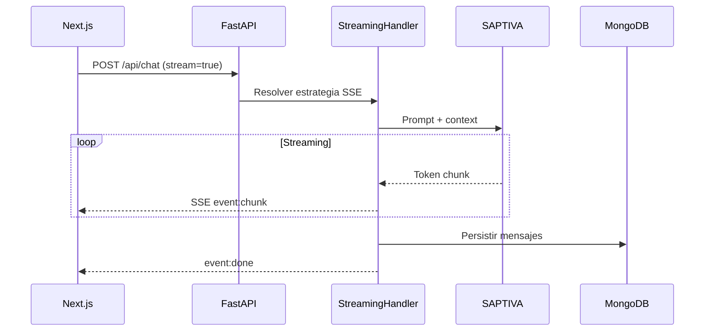
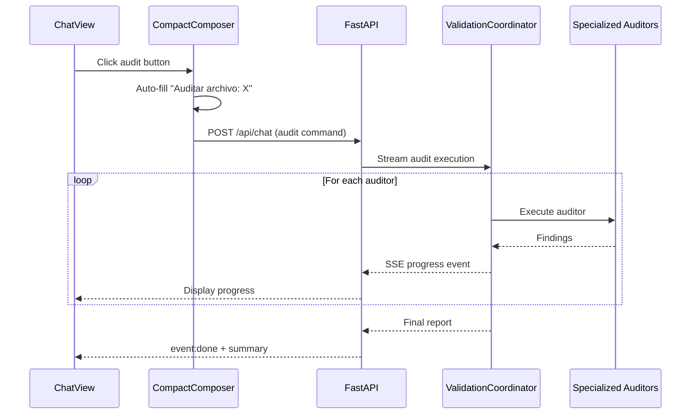
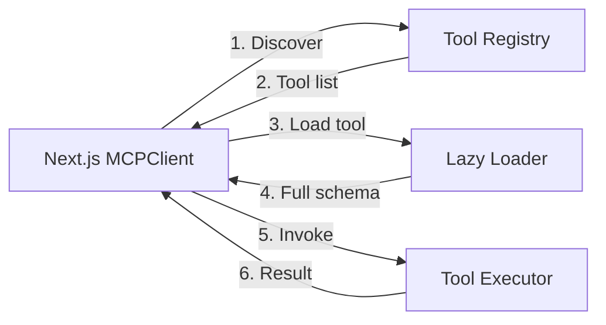

# Estado Actual de la Arquitectura - Saptiva OctaviOS Chat

**Fecha de actualización**: Noviembre 2025
**Versión**: 3.0 (MCP + Streaming Audit)

## Resumen Ejecutivo

Saptiva OctaviOS Chat es una plataforma conversacional empresarial lista para producción que combina:
- **Chat multi-modelo** con streaming SSE y soporte para múltiples LLMs de SAPTIVA
- **Model Context Protocol (MCP)** con 5 herramientas productivas y lazy loading
- **Sistema de auditoría COPILOTO_414** con streaming en tiempo real
- **Frontend Next.js 14** con App Router y Zustand para gestión de estado
- **Backend FastAPI** con arquitectura limpia y patrones de diseño empresariales

## Arquitectura de Alto Nivel

### Stack Tecnológico

```
Frontend:
- Next.js 14 (App Router)
- React 18 + TypeScript
- Zustand (state management)
- Tailwind CSS + shadcn/ui
- Server-Sent Events (SSE)

Backend:
- FastAPI 0.109+
- Python 3.11+
- FastMCP (Model Context Protocol)
- Beanie ODM (MongoDB)
- Redis (cache + tokens)
- MinIO (S3-compatible storage)

Servicios Externos:
- SAPTIVA LLMs (Turbo, Cortex, Ops)
- Aletheia Research API
- LanguageTool (grammar checking)
```

### Componentes Principales

#### 1. Frontend (Next.js 14)

**Ubicación**: `apps/web/`

**Características clave**:
- App Router con rutas dinámicas
- Componentes client-side con estado Zustand
- Clientes HTTP centralizados con interceptores
- Soporte SSE para streaming
- Thumbnails con autenticación
- Preview de archivos con botón de auditoría

**Stores Zustand**:
- `chat-store.ts`: Gestión de mensajes, herramientas y streaming
- `files-store.ts`: Subida de archivos y progreso
- `research-store.ts`: Tareas de investigación profunda
- `auth-store.ts`: Autenticación y tokens

**Componentes críticos**:
- `ChatMessage.tsx`: Display de mensajes con thumbnails
- `PreviewAttachment.tsx`: Preview de archivos con audit button
- `CompactChatComposer.tsx`: Composer con auto-submit para auditoría
- `ThumbnailImage.tsx`: Carga de thumbnails autenticados
- `CodeBlock.tsx`: Syntax highlighting para código

#### 2. Backend (FastAPI)

**Ubicación**: `apps/api/`

**Estructura modular**:
```
src/
├── core/           # Config, logging, auth, telemetry
├── routers/        # FastAPI routers (chat, files, MCP, auth)
├── services/       # Servicios de dominio
├── mcp/            # Model Context Protocol
├── domain/         # ChatContext, builders, handlers
├── models/         # Beanie ODM models
└── middleware/     # Auth, rate limit, telemetry
```

**Patrones de diseño aplicados**:
- **Chain of Responsibility**: Message handlers en chat
- **Builder Pattern**: ChatResponseBuilder para respuestas
- **Strategy Pattern**: Chat strategies (standard, RAG)
- **Adapter Pattern**: FastMCP adapter para HTTP
- **Orchestrator Pattern**: ValidationCoordinator
- **Lazy Loading**: MCP tool discovery/loading

#### 3. Model Context Protocol (MCP)

**Ubicación**: `apps/api/src/mcp/`

**Herramientas productivas**:

| Herramienta | Propósito | Entradas |
|-------------|-----------|----------|
| `audit_file` | Ejecuta COPILOTO_414 con políticas configurables | doc_id, policy_id, flags |
| `excel_analyzer` | Análisis de datos de planillas Excel | doc_id, operations |
| `viz_tool` | Generación de narrativa + visualizaciones | prompt, data_source |
| `deep_research` | Investigación iterativa con Aletheia | query, depth, max_iterations |
| `extract_document_text` | Extracción multi-tier con cache | doc_id, method, pages |

**Características MCP**:
- Lazy loading con reducción del 98% de contexto
- Security con scopes basados en roles (`mcp:tools.*`, `mcp:admin.*`)
- Telemetría integrada con Prometheus
- Versionado con backward compatibility
- Rate limiting dedicado

**Rutas lazy**:
- `GET /api/mcp/lazy/discover`: Lista ligera de herramientas
- `GET /api/mcp/lazy/tools/:tool`: Carga schema bajo demanda
- `POST /api/mcp/lazy/invoke`: Ejecuta herramienta
- `GET /api/mcp/lazy/health`: Health check

#### 4. Sistema de Auditoría COPILOTO_414

**Ubicación**: `apps/api/src/services/validation_coordinator.py`

**Auditores especializados**:
1. **Disclaimer Auditor**: Fuzzy matching de textos legales
2. **Format Auditor**: Análisis de fuentes, colores, imágenes (PyMuPDF)
3. **Grammar Auditor**: Spelling y gramática (LanguageTool)
4. **Logo Auditor**: Template matching con OpenCV
5. **Typography Auditor**: Consistencia tipográfica
6. **Color Palette Auditor**: Validación de paleta corporativa
7. **Entity Consistency Auditor**: Coherencia de entidades
8. **Semantic Consistency Auditor**: Análisis semántico

**Políticas configurables**:
- `apps/api/src/config/policies.yaml`
- Resolución dinámica basada en cliente/documento
- Selección granular de auditores

**Streaming audit**:
- Progreso en tiempo real vía SSE
- Eventos: `validation_start`, `auditor_start`, `auditor_complete`, `validation_complete`
- Manejo robusto de errores con fallback

#### 5. Gestión de Documentos y RAG

**Pipeline de documentos**:
```
Upload → Storage (disk) → MinIO → MongoDB (metadata) → Redis (cache)
                                                      ↓
                                                   Extraction
                                                      ↓
                                              pypdf → SDK → OCR
```

**Ubicaciones clave**:
- `apps/api/src/services/storage.py`: Upload con límites
- `apps/api/src/services/minio_storage.py`: S3-compatible storage
- `apps/api/src/services/document_service.py`: Extracción + cache
- `apps/api/src/services/document_extraction.py`: Fallback multi-tier

**Características**:
- Cache Redis con TTL de 1 hora
- Extracción bajo demanda
- Ownership validation
- Thumbnail generation
- No usa vector DB (contexto directo desde cache)

## Flujos Principales

### 1. Chat con Streaming



### 2. Auditoría Streaming



### 3. MCP Lazy Loading



## Seguridad

### Autenticación y Autorización

**JWT con blacklist en Redis**:
- Access tokens (15 min expiry)
- Refresh tokens (7 días)
- Blacklist en logout
- Middleware: `apps/api/src/middleware/auth.py`

**Password reset**:
- Tokens temporales en MongoDB
- Email service integrado
- Expiración de 1 hora

**Scopes MCP**:
- `mcp:tools.*`: Usuarios normales
- `mcp:admin.*`: Usuarios admin (definidos en `MCP_ADMIN_USERS`)

### Rate Limiting

**Middleware**: `apps/api/src/middleware/rate_limit.py`
- Por IP address
- Por usuario autenticado
- Límites configurables
- Headers `X-RateLimit-*`

### CORS y CSP

**CORS**: `apps/api/src/core/config.py`
- Origins permitidos configurables
- Credentials support

**CSP**: Nginx configuration (producción)

## Persistencia

### MongoDB (Beanie ODM)

**Collections**:
- `chat_sessions`: Sesiones de conversación
- `chat_messages`: Mensajes individuales
- `documents`: Metadatos de archivos
- `history_events`: Timeline unificado
- `validation_reports`: Reportes de auditoría
- `password_reset`: Tokens de reset
- `users`: Usuarios del sistema

**Índices críticos**:
- `chat_sessions`: `user_id`, `updated_at`
- `chat_messages`: `chat_id`, `timestamp`
- `documents`: `user_id`, `filename`
- `validation_reports`: `document_id`, `created_at`

### Redis

**Uso**:
1. Cache de texto extraído (1h TTL)
2. Blacklist de tokens JWT
3. Session context temporal
4. MCP tool discovery cache
5. Rate limiting counters

**Keys pattern**:
- `extract:text:{doc_id}`: Texto extraído
- `token:blacklist:{jti}`: JWT blacklist
- `session:context:{session_id}`: Contexto temporal
- `mcp:tools:registry`: Cache de herramientas

### MinIO (S3)

**Buckets**:
- `documents`: PDFs y archivos subidos
- `audit-reports`: Reportes de auditoría
- `thumbnails`: Previews de documentos

**Path structure**:
- `documents/{user_id}/{chat_id}/{file_id}.{ext}`
- `audit-reports/{user_id}/{report_id}.md`
- `thumbnails/{user_id}/{file_id}.jpg`

## Observabilidad

### Logging

**Structured logging con structlog**:
- JSON format
- Contextual information
- Request IDs
- User IDs
- Performance metrics

**Ubicación**: `apps/api/src/core/logging.py`

### Telemetría

**OpenTelemetry + Prometheus**:
- Request duration histograms
- Error rates
- MCP invocation metrics
- Database operation latency
- Cache hit rates

**Ubicación**: `apps/api/src/core/telemetry.py`

### Health Checks

**Endpoints**:
- `GET /api/health`: API health
- `GET /api/mcp/lazy/health`: MCP health

**Verificaciones**:
- MongoDB connection
- Redis connection
- External APIs (SAPTIVA, Aletheia)

## Testing

### Backend (pytest)

**Estructura**:
```
tests/
├── unit/              # Tests unitarios
├── integration/       # Tests de integración
├── mcp/              # Tests de MCP tools
├── performance/      # Benchmarks
├── middleware/       # Tests de middleware
├── routers/          # Tests de routers
└── services/         # Tests de servicios
```

**Markers**:
- `@pytest.mark.mcp`: Tests MCP
- `@pytest.mark.mcp_security`: Tests de seguridad MCP
- `@pytest.mark.integration`: Tests de integración
- `@pytest.mark.slow`: Tests lentos

**Comandos**:
- `make test-api`: Todos los tests API
- `make test-mcp`: Tests MCP
- `make test-mcp-lazy`: Tests lazy loading
- `make test-unit-host`: Tests locales sin Docker

### Frontend (Jest + Testing Library)

**Ubicación**: `apps/web/src/components/**/__tests__`

**Tests**:
- Componentes de chat
- Stores Zustand
- Hooks personalizados
- API clients

**Comandos**:
- `make test-web`: Todos los tests frontend
- `pnpm test`: Tests locales

### E2E (Playwright)

**Ubicación**: `tests/`

**Escenarios**:
- Login flow
- Chat conversation
- File upload
- Document audit
- MCP tool invocation

**Comando**: `make test-e2e`

## Mejoras Recientes (v3.0)

### Streaming Audit
- ✅ Soporte completo para auditoría en tiempo real
- ✅ Eventos SSE con progreso granular
- ✅ Manejo robusto de errores
- ✅ Fallback a modo no-streaming

### MCP Integration
- ✅ 5 herramientas productivas
- ✅ Lazy loading con 98% reducción de contexto
- ✅ Security con scopes
- ✅ Telemetría completa
- ✅ 40+ tests MCP

### Frontend Enhancements
- ✅ Thumbnails autenticados
- ✅ Preview con audit button
- ✅ Auto-submit para comandos de auditoría
- ✅ CodeBlock component
- ✅ Mejor error handling

### Bug Fixes
- ✅ AttributeError en streaming (file_ids → document_ids)
- ✅ Grammar auditor severity parsing
- ✅ MinIO storage fallback
- ✅ File attachment display
- ✅ TypeScript build issues

## Próximos Pasos

### Corto Plazo
1. **Vector DB integration**: Pinecone o pgvector para RAG mejorado
2. **Advanced MCP tools**: Nuevas herramientas especializadas
3. **Performance optimization**: Cache warming, query optimization
4. **UI improvements**: Dark mode, accessibility enhancements

### Medio Plazo
1. **Multi-tenancy**: Soporte para múltiples organizaciones
2. **Advanced analytics**: Dashboard de métricas
3. **Webhook system**: Notificaciones en tiempo real
4. **Mobile app**: React Native client

### Largo Plazo
1. **AI agent framework**: Autonomous agents con MCP
2. **Custom model fine-tuning**: Modelos especializados
3. **Enterprise SSO**: SAML, OAuth2
4. **Global deployment**: Multi-region support

## Referencias

### Documentación Técnica
- `docs/architecture/ARCHITECTURE.md`: Detalles de arquitectura
- `docs/architecture/AUDIT_SYSTEM_ARCHITECTURE.md`: Sistema COPILOTO_414
- `docs/features/mcp/MCP_ARCHITECTURE.md`: Arquitectura MCP
- `docs/guides/MCP_TESTING_GUIDE.md`: Guía de testing MCP

### Guías Operativas
- `docs/guides/GETTING_STARTED.md`: Setup inicial
- `docs/guides/TROUBLESHOOTING.md`: Solución de problemas
- `docs/guides/ADVANCED_LOCAL_SETUP.md`: Setup avanzado
- `docs/guides/deployment-guide.md`: Deployment

### Reportes
- `docs/bugfixes/STREAMING_ATTRIBUTEERROR_FIX.md`: Fix de streaming
- `docs/bugfixes/PHASE2_MCP_IMPLEMENTATION_COMPLETE.md`: Fase 2 MCP
- `docs/reports/CHAT_FLOW_AUDIT_REPORT.md`: Auditoría de flujo

---

**Mantenido por**: Equipo de Ingeniería Saptiva
**Última actualización**: Noviembre 2025
**Versión del sistema**: 3.0.0
