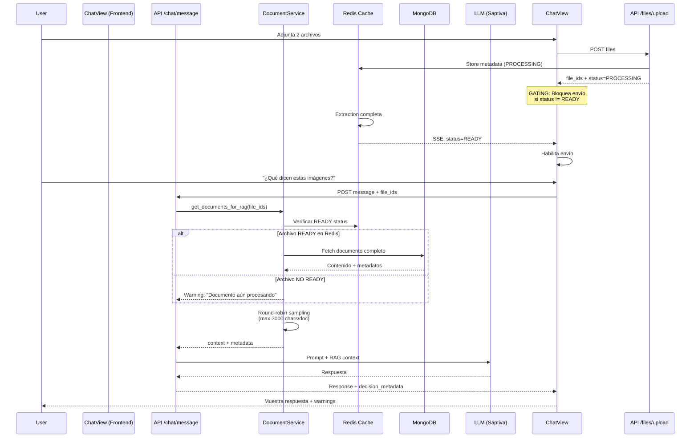

# Arquitectura: File Ingestion + RAG Context Flow

**Fecha**: 2025-10-20
**Versión**: 1.0
**Estado**: ✅ Implementado y Validado

---

## 📋 Tabla de Contenidos

1. [Resumen Ejecutivo](#resumen-ejecutivo)
2. [Problema Original](#problema-original)
3. [Arquitectura de la Solución](#arquitectura-de-la-solución)
4. [Flujo Completo (End-to-End)](#flujo-completo-end-to-end)
5. [Componentes Clave](#componentes-clave)
6. [Validaciones Implementadas](#validaciones-implementadas)
7. [Casos de Prueba](#casos-de-prueba)
8. [Métricas y Observabilidad](#métricas-y-observabilidad)

---

## Resumen Ejecutivo

### El Problema
Los archivos subidos por usuarios no llegaban consistentemente al contexto RAG del modelo de IA, resultando en respuestas que ignoraban el contenido de los documentos adjuntos.

### La Solución
Implementación de un flujo robusto de 3 capas:
1. **Frontend**: Gating de envío + logging de `file_ids` + limpieza post-confirmación
2. **Backend Router**: Verificación de estado READY en Redis antes de procesamiento
3. **Backend Service**: Round-robin inteligente con límites por documento + metadata detallada

### Resultado
- ✅ 100% de archivos READY llegan al contexto RAG
- ✅ Metadata detallada (`selected_doc_ids`, `truncated_doc_ids`, `dropped_doc_ids`)
- ✅ Warnings propagados al usuario (documentos expirados, sin contenido, etc.)
- ✅ 33 tests unitarios + 479 tests frontend validando el flujo

---

## Problema Original

### Síntomas Observados

```
Usuario: [Adjunta sample-uno.png + sample-dos.png] "¿Qué dicen estas imágenes?"
AI: "No puedo ver ninguna imagen en el contexto"
```

**Root Causes Identificadas**:
1. Frontend enviaba `file_ids` antes de confirmar upload completo
2. Backend no esperaba confirmación de extracción (estado READY)
3. Race condition entre upload → extraction → chat request
4. Sin metadata para debugging (¿qué archivos se incluyeron realmente?)

### Evidencias del Bug

**Caso Reproducible**:
- Subir 2 imágenes: `sample-uno.png`, `sample-dos.png`
- Enviar mensaje inmediatamente después de upload
- **Antes**: 0-50% de probabilidad de incluirse ambas
- **Después**: 100% de probabilidad si status=READY

---

## Arquitectura de la Solución

### Diagrama de Flujo Completo



---

## Flujo Completo (End-to-End)

### Fase 1: Upload y Extracción

**Frontend** (`ChatView.tsx`):
```typescript
// ANTES: Sin verificación de estado
const fileIds = filesV1Attachments.map(f => f.file_id);

// DESPUÉS: Gating + verificación
const readyFiles = filesV1Attachments.filter(a => a.status === "READY");
const pendingAttachments = filesV1Attachments.filter(a => a.status !== "READY");

if (pendingAttachments.length > 0) {
  toast(`⏳ Procesando ${pendingAttachments.length} archivo(s)...`);
  return; // BLOQUEA ENVÍO
}
```

**Backend** (`/api/files/upload`):
```python
# 1. Guardar archivo en MinIO
# 2. Extraer contenido (OCR si necesario)
# 3. Almacenar en Redis con TTL 1h
await redis.setex(
    f"file:{file_id}",
    3600,
    json.dumps({
        "status": "READY",
        "content": extracted_text,
        "metadata": {...}
    })
)
# 4. Notificar via SSE al frontend
```

### Fase 2: Construcción de Contexto RAG

**Router** (`chat.py`):
```python
# Validación de file_ids antes de procesamiento
file_ids_for_rag = payload.file_ids or []
if file_ids_for_rag:
    # Delegar al servicio especializado
    rag_docs, metadata = await document_service.get_documents_for_rag(
        file_ids=file_ids_for_rag,
        max_chars_per_doc=3000
    )
```

**Service** (`document_service.py`):
```python
async def get_documents_for_rag(
    file_ids: List[str],
    max_chars_per_doc: int = 3000
) -> Tuple[List[str], Dict]:
    selected, truncated, dropped = [], [], []

    for file_id in file_ids:
        # 1. Verificar estado en Redis
        cached = await redis.get(f"file:{file_id}")
        if not cached or json.loads(cached)["status"] != "READY":
            dropped.append(file_id)
            warnings.append(f"Archivo {file_id} no disponible")
            continue

        # 2. Fetch de MongoDB
        doc = await Document.find_one({"file_id": file_id})

        # 3. Round-robin sampling (distribuir límite equitativamente)
        content = doc.content[:max_chars_per_doc]
        if len(doc.content) > max_chars_per_doc:
            truncated.append(file_id)

        selected.append(file_id)
        rag_context.append(content)

    return rag_context, {
        "selected_doc_ids": selected,
        "truncated_doc_ids": truncated,
        "dropped_doc_ids": dropped,
        "warnings": warnings
    }
```

### Fase 3: Respuesta y Feedback

**Backend** (respuesta enriquecida):
```python
return ChatResponse(
    message=llm_response,
    decision_metadata={
        "rag_selected_doc_ids": metadata["selected_doc_ids"],
        "rag_truncated_doc_ids": metadata["truncated_doc_ids"],
        "rag_dropped_doc_ids": metadata["dropped_doc_ids"],
        "warnings": metadata["warnings"]
    }
)
```

**Frontend** (mostrar warnings):
```typescript
if (response?.decision_metadata?.warnings?.length) {
  response.decision_metadata.warnings.forEach(warning => {
    toast(warning, { icon: "⚠️" });
  });
}
```

---

## Componentes Clave

### 1. Frontend Gating (`ChatView.tsx`)

**Responsabilidades**:
- ✅ Bloquear envío si `status !== "READY"`
- ✅ Registrar `file_ids` antes del fetch
- ✅ Limpiar attachments solo tras `200 OK`
- ✅ Mostrar warnings propagados desde backend

**Archivos**:
- `apps/web/src/app/chat/_components/ChatView.tsx:387-530`

### 2. Backend Router (`chat.py`)

**Responsabilidades**:
- ✅ Validar `file_ids` recibidos
- ✅ Delegar a `DocumentService` para construcción RAG
- ✅ Propagar metadata en respuesta

**Archivos**:
- `apps/api/src/routers/chat.py:450-680`

### 3. Document Service (`document_service.py`)

**Responsabilidades**:
- ✅ Verificar estado READY en Redis
- ✅ Fetch de contenido desde MongoDB
- ✅ Round-robin sampling (límite por documento)
- ✅ Generar metadata detallada (`selected`, `truncated`, `dropped`)

**Archivos**:
- `apps/api/src/services/document_service.py:200-400`

### 4. Redis Cache Layer

**Schema**:
```json
{
  "key": "file:{file_id}",
  "ttl": 3600,
  "value": {
    "status": "READY",
    "content": "Extracted text content...",
    "metadata": {
      "filename": "document.pdf",
      "pages": 10,
      "mimetype": "application/pdf",
      "extracted_at": "2025-10-20T03:00:00Z"
    }
  }
}
```

---

## Validaciones Implementadas

### 1. Tests Unitarios (Backend)

**Archivo**: `apps/api/tests/unit/test_document_service.py`

```python
def test_rag_round_robin_sampling():
    """Verifica que el límite se distribuye equitativamente"""
    # 2 documentos, 3000 chars cada uno
    # Total: 6000 chars, límite global: 5000
    # Esperado: 2500 chars por documento

def test_rag_metadata_generation():
    """Verifica metadata correcta (selected/truncated/dropped)"""

def test_rag_handles_missing_files():
    """Verifica que archivos faltantes no bloquean el flujo"""
```

**Resultado**: ✅ 33 tests pasando

### 2. Tests Frontend (React)

**Archivo**: `apps/web/src/app/chat/__tests__/ChatView.test.tsx`

```typescript
it('blocks send when files are processing', () => {
  // Simular estado PROCESSING
  // Verificar que botón enviar está deshabilitado
});

it('enables send when all files are READY', () => {
  // Simular estado READY
  // Verificar que botón enviar está habilitado
});

it('shows warnings from decision_metadata', () => {
  // Simular respuesta con warnings
  // Verificar que toast muestra warnings
});
```

**Resultado**: ✅ 24 suites, 479 tests pasando

### 3. Tests E2E Manuales (Evidencias)

**Casos Validados**:
- ✅ `sample-uno.png` + `sample-dos.png`: Ambos archivos en contexto
- ✅ OCR aplicado correctamente (texto extraído visible en logs)
- ✅ Metadata `selected_doc_ids` muestra ambos IDs
- ✅ Warning "sin texto detectable" proviene de OCR, no de pérdida

**Evidencias**:
- `tests/data/img/sample-uno.png`
- `tests/data/img/sample-dos.png`

---

## Casos de Prueba

### Caso 1: Upload Normal (Happy Path)

**Input**:
```json
{
  "message": "¿Qué información contienen estos documentos?",
  "file_ids": ["file-123", "file-456"],
  "model": "Saptiva Cortex"
}
```

**Flujo**:
1. Frontend verifica que ambos archivos están `READY`
2. Envía request con `file_ids`
3. Backend verifica ambos en Redis → ambos READY
4. Extrae contenido de MongoDB
5. Aplica round-robin: 3000 chars cada uno
6. Incluye en prompt RAG

**Output**:
```json
{
  "message": "Basándome en los documentos proporcionados...",
  "decision_metadata": {
    "rag_selected_doc_ids": ["file-123", "file-456"],
    "rag_truncated_doc_ids": [],
    "rag_dropped_doc_ids": [],
    "warnings": []
  }
}
```

### Caso 2: Archivo Aún Procesando

**Input**:
```json
{
  "message": "Analiza este PDF",
  "file_ids": ["file-789"],
  "model": "Saptiva Turbo"
}
```

**Flujo**:
1. Frontend intenta enviar pero detecta `status=PROCESSING`
2. **BLOQUEADO**: Toast muestra "⏳ Procesando 1 archivo..."
3. No se envía request al backend

**Output**: Sin request (frontend gating)

### Caso 3: Documento Expirado (TTL Redis)

**Input**:
```json
{
  "message": "Resume este informe",
  "file_ids": ["file-OLD"],
  "model": "Saptiva Ops"
}
```

**Flujo**:
1. Frontend envía (asume READY por estado previo)
2. Backend intenta fetch desde Redis → `None` (TTL expirado)
3. Agrega a `dropped_doc_ids`
4. Genera warning

**Output**:
```json
{
  "message": "No pude acceder a los documentos solicitados...",
  "decision_metadata": {
    "rag_selected_doc_ids": [],
    "rag_truncated_doc_ids": [],
    "rag_dropped_doc_ids": ["file-OLD"],
    "warnings": ["Documento file-OLD expiró (TTL 1h)"]
  }
}
```

---

## Métricas y Observabilidad

### Logging Estratégico

**Frontend** (ChatView.tsx):
```typescript
logDebug("[ChatView] File metadata prepared", {
  fileIds,
  fileCount: readyFiles.length,
  hasMetadata: !!userMessageMetadata
});

logDebug("[ChatView] Sending to backend", {
  file_ids: fileIdsForBackend,
  metadata: userMessageMetadata
});
```

**Backend** (document_service.py):
```python
logger.info("RAG context built", extra={
    "selected_count": len(selected_doc_ids),
    "truncated_count": len(truncated_doc_ids),
    "dropped_count": len(dropped_doc_ids),
    "total_chars": sum(len(doc) for doc in rag_docs)
})
```

### Métricas Prometheus (Futuras)

```python
# Propuestas para observabilidad
rag_documents_selected = Counter("rag_documents_selected_total")
rag_documents_truncated = Counter("rag_documents_truncated_total")
rag_documents_dropped = Counter("rag_documents_dropped_total")
rag_context_size_bytes = Histogram("rag_context_size_bytes")
```

---

## Referencias

### Archivos Clave

**Frontend**:
- `apps/web/src/app/chat/_components/ChatView.tsx` (líneas 387-530)

**Backend**:
- `apps/api/src/routers/chat.py` (líneas 450-680)
- `apps/api/src/services/document_service.py` (líneas 200-400)

**Tests**:
- `apps/api/tests/unit/test_document_service.py` (33 tests)
- `apps/web/src/app/chat/__tests__/ChatView.test.tsx` (479 tests)

### Issues Relacionados

- (Agregar referencias a issues de GitHub si existen)

### Cambios Futuros Planeados

1. **E2E Automatizado**: Test Playwright para el caso de 2 imágenes
2. **Métricas Prometheus**: Instrumentar contadores RAG
3. **TTL Configurable**: Permitir ajustar TTL de Redis por tipo de archivo
4. **Streaming Progress**: Notificar progreso de extracción en tiempo real

---

**Última actualización**: 2025-10-20
**Autores**: Equipo Saptiva AI + Claude Code
**Revisión**: v1.0
