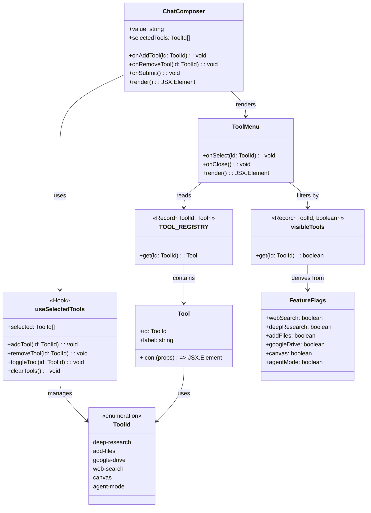
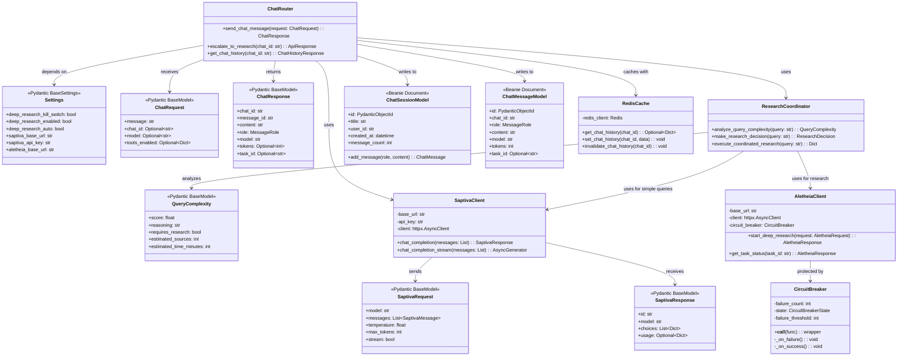

# Diagrama 3: Módulos/Clases (Registry, Adapters, Interfaces)

## Vista de Clases y Módulos

### Frontend Tool Registry (TypeScript)



**Archivos**:
- `apps/web/src/types/tools.tsx` (ToolId, Tool, TOOL_REGISTRY)
- `apps/web/src/lib/feature-flags.ts` (FeatureFlags, visibleTools)
- `apps/web/src/hooks/useSelectedTools.ts` (useSelectedTools hook)
- `apps/web/src/components/chat/ToolMenu/ToolMenu.tsx` (ToolMenu component)
- `apps/web/src/components/chat/ChatComposer/ChatComposer.tsx` (ChatComposer component)

---

### Backend Services Architecture (Python)



**Archivos**:
- `apps/api/src/core/config.py` (Settings)
- `apps/api/src/schemas/chat.py` (ChatRequest, ChatResponse)
- `apps/api/src/routers/chat.py` (ChatRouter)
- `apps/api/src/services/research_coordinator.py` (ResearchCoordinator, QueryComplexity)
- `apps/api/src/services/saptiva_client.py` (SaptivaClient, SaptivaRequest, SaptivaResponse)
- `apps/api/src/services/aletheia_client.py` (AletheiaClient, CircuitBreaker)
- `apps/api/src/models/chat.py` (ChatSessionModel, ChatMessageModel)
- `apps/api/src/core/redis_cache.py` (RedisCache)

---

## Patrones de Diseño Identificados

### 1. Registry Pattern (Frontend)

**Ubicación**: `apps/web/src/types/tools.tsx`

```typescript
export const TOOL_REGISTRY: Record<ToolId, Tool> = {
  'deep-research': {...},
  'add-files': {...},
  'google-drive': {...},
  'web-search': {...},
  canvas: {...},
  'agent-mode': {...},
}
```

**Propósito**:
- **Centralizar** la definición de todas las tools disponibles
- Facilitar agregar nuevas tools sin modificar múltiples componentes
- **Desacoplar** la UI de la lógica de negocio

**Uso**:
```typescript
// Obtener una tool por ID
const tool = TOOL_REGISTRY['deep-research']

// Filtrar tools visibles
const visibleToolsList = Object.values(TOOL_REGISTRY).filter(
  (tool) => visibleTools[tool.id]
)
```

---

### 2. Factory Pattern (Backend - Clients)

**Ubicación**: `apps/api/src/services/saptiva_client.py:350`

```python
_saptiva_client: Optional[SaptivaClient] = None

async def get_saptiva_client() -> SaptivaClient:
    """Obtener instancia singleton del cliente SAPTIVA"""
    global _saptiva_client

    if _saptiva_client is None:
        _saptiva_client = SaptivaClient()
        stored_key = await load_saptiva_api_key()
        if stored_key:
            _saptiva_client.set_api_key(stored_key)

    return _saptiva_client
```

**Propósito**:
- **Reutilizar** la misma instancia del cliente HTTP (connection pooling)
- Evitar crear múltiples clientes por request
- Gestionar configuración y API keys centralizadamente

---

### 3. Strategy Pattern (Research Coordinator)

**Ubicación**: `apps/api/src/services/research_coordinator.py:238`

```python
class ResearchCoordinator:
    async def execute_coordinated_research(
        self, query: str, force_research: bool = False
    ):
        # Analizar complejidad
        complexity = await self.analyze_query_complexity(query)

        # Seleccionar estrategia
        if force_research or complexity.requires_research:
            # Estrategia: Deep Research (Aletheia)
            return await self._execute_deep_research(query)
        else:
            # Estrategia: Simple Chat (Saptiva)
            return await self._execute_simple_chat(query)
```

**Propósito**:
- **Decidir dinámicamente** qué estrategia usar (chat vs research)
- Basarse en análisis de complejidad y preferencias del usuario
- Centralizar la lógica de routing

---

### 4. Circuit Breaker Pattern (Aletheia Client)

**Ubicación**: `apps/api/src/services/aletheia_client.py:48`

```python
class CircuitBreaker:
    """Circuit breaker implementation for external API calls"""

    def __init__(self, failure_threshold: int = 5, recovery_timeout: int = 60):
        self.failure_count = 0
        self.state = CircuitBreakerState.CLOSED

    def __call__(self, func):
        async def wrapper(*args, **kwargs):
            if self.state == CircuitBreakerState.OPEN:
                if self._should_attempt_reset():
                    self.state = CircuitBreakerState.HALF_OPEN
                else:
                    raise Exception("Circuit breaker is OPEN")

            try:
                result = await func(*args, **kwargs)
                self._on_success()
                return result
            except Exception as e:
                self._on_failure()
                raise e

        return wrapper
```

**Propósito**:
- **Proteger** el sistema contra fallos en cascada
- Evitar llamadas a servicios externos no disponibles
- Permitir recuperación automática (HALF_OPEN state)

---

### 5. Repository Pattern (Beanie ODM)

**Ubicación**: `apps/api/src/models/chat.py`

```python
class ChatSession(Document):
    """Chat session model with Beanie ODM"""

    title: str
    user_id: str
    created_at: datetime = Field(default_factory=datetime.utcnow)
    message_count: int = 0

    async def add_message(
        self, role: MessageRole, content: str, **kwargs
    ) -> ChatMessage:
        """Add a message to this chat session"""
        message = ChatMessage(
            chat_id=self.id,
            role=role,
            content=content,
            **kwargs
        )
        await message.insert()

        # Increment message count
        await self.update({"$inc": {"message_count": 1}})

        return message

    class Settings:
        name = "chat_sessions"
```

**Propósito**:
- **Abstraer** la persistencia de datos (MongoDB)
- Proveer métodos de alto nivel (`add_message`)
- Validación automática con Pydantic

---

### 6. Cache-Aside Pattern (Redis Cache)

**Ubicación**: `apps/api/src/core/redis_cache.py`

```python
class RedisCache:
    async def get_chat_history(self, chat_id: str) -> Optional[Dict]:
        """Get cached chat history"""
        key = f"chat_history:{chat_id}"
        cached = await self.redis.get(key)
        if cached:
            return json.loads(cached)
        return None

    async def set_chat_history(self, chat_id: str, data: Dict) -> None:
        """Cache chat history"""
        key = f"chat_history:{chat_id}"
        await self.redis.setex(
            key,
            self.default_ttl,  # 5 minutes
            json.dumps(data, default=str)
        )
```

**Patrón de uso** (en `apps/api/src/routers/chat.py:503`):
```python
# 1. Check cache first
cached_history = await cache.get_chat_history(chat_id)
if cached_history:
    return ChatHistoryResponse(**cached_history)

# 2. Fetch from DB
messages = await ChatMessageModel.find(...).to_list()

# 3. Cache the response
await cache.set_chat_history(chat_id, response_data)
```

---

### 7. Middleware Pattern (FastAPI)

**Ubicación**: `apps/api/src/middleware/auth.py` (implícito en routers)

```python
@router.post("/chat", tags=["chat"])
async def send_chat_message(
    request: ChatRequest,
    http_request: Request,  # FastAPI inyecta Request
    response: Response,
    settings: Settings = Depends(get_settings)
):
    # Middleware ya validó JWT y añadió user_id al state
    user_id = getattr(http_request.state, 'user_id', 'mock-user-id')

    # Headers de no-cache
    response.headers.update(NO_STORE_HEADERS)
    ...
```

**Propósito**:
- **Interceptar** todas las requests para:
  - Validar JWT tokens
  - Añadir `user_id` al request state
  - Logging y telemetría
- Separar concerns (auth vs business logic)

---

## Interfaces y Contratos

### Frontend → Backend (HTTP API)

**Chat Message**:
```typescript
interface ChatRequest {
  message: string
  chat_id?: string
  model?: string
  tools_enabled?: Record<string, boolean>
}

interface ChatResponse {
  chat_id: string
  message_id: string
  content: string
  role: 'assistant'
  model: string
  tokens?: number
  latency_ms?: number
  task_id?: string  // Si es deep research
}
```

**Deep Research**:
```typescript
interface DeepResearchRequest {
  query: string
  research_type?: 'web_search' | 'deep_research'
  chat_id?: string
  stream?: boolean
  params?: {
    depth_level?: 'shallow' | 'medium' | 'deep'
    sources_limit?: number
    ...
  }
}

interface DeepResearchResponse {
  task_id: string
  status: 'pending' | 'running' | 'completed' | 'failed'
  stream_url?: string
  estimated_completion?: string
}
```

---

### Backend → Saptiva LLM

**Request**:
```python
class SaptivaRequest(BaseModel):
    model: str  # "Saptiva Turbo", "Saptiva Cortex"
    messages: List[SaptivaMessage]  # [{"role": "user", "content": "..."}]
    temperature: float = 0.7
    max_tokens: int = 1024
    stream: bool = False
```

**Response**:
```python
class SaptivaResponse(BaseModel):
    id: str
    model: str
    choices: List[Dict[str, Any]]  # [{"message": {"content": "..."}, "finish_reason": "stop"}]
    usage: Optional[Dict[str, Any]]  # {"total_tokens": 256, ...}
```

---

### Backend → Aletheia (Deep Research)

**Request**:
```python
class AletheiaRequest(BaseModel):
    query: str
    task_id: str
    user_id: str
    params: Optional[Dict[str, Any]]  # {depth_level, sources_limit, ...}
```

**Response**:
```python
class AletheiaResponse(BaseModel):
    task_id: str
    status: str  # "pending", "running", "completed", "failed"
    message: str
    data: Optional[Dict[str, Any]]  # Progress, sources, report
```

---

## Estado Actual: Tools sin Adapters Reales

| Tool | Frontend | Backend Endpoint | Adapter/Service | Estado |
|------|----------|------------------|-----------------|--------|
| Web Search | ✅ TOOL_REGISTRY | ❌ N/A | ❌ N/A | Solo UI |
| Deep Research | ✅ TOOL_REGISTRY | ✅ `/api/research/deep` | ✅ AletheiaClient | Deshabilitado |
| Add Files | ✅ TOOL_REGISTRY | ❌ `/api/files/upload` | ❌ N/A | Solo UI |
| Google Drive | ✅ TOOL_REGISTRY | ❌ N/A | ❌ N/A | Solo UI |
| Canvas | ✅ TOOL_REGISTRY | ❌ N/A | ❌ N/A | Solo UI |
| Agent Mode | ✅ TOOL_REGISTRY | ❌ N/A | ❌ N/A | Solo UI |

**Próximos pasos** (fuera de scope):
1. Crear **adapters** para cada tool en el backend
2. Implementar endpoints específicos (`/api/tools/web-search`, `/api/files/upload`)
3. Integrar resultados en el **prompt builder** del LLM
4. Añadir logging y telemetría por tool

---

## Próximo diagrama

→ [Diagrama 4: Flujo PDF→RAG (Propuesta futura)](./pdf-rag-flow.md)
