# Diagrama 1: Arquitectura de Alto Nivel (Componentes)

## Flujo General: Usuario → UI → API → Orquestador → LLM/Research

```mermaid
flowchart TB
    subgraph "Frontend (Next.js)"
        UI[React Chat UI]
        COMPOSER[ChatComposer]
        TOOLMENU[ToolMenu]
        REGISTRY[TOOL_REGISTRY<br/>types/tools.tsx]
        APICLIENT[ApiClient<br/>lib/api-client.ts]
        STORE[Zustand Store<br/>lib/store.ts]
        FLAGS[Feature Flags<br/>lib/feature-flags.ts]
    end

    subgraph "Backend API (FastAPI Python)"
        ROUTER[Chat Router<br/>routers/chat.py]
        MIDDLEWARE[Auth Middleware]
        KILLSWITCH{Kill Switch?<br/>deep_research_kill_switch}
        COORDINATOR[Research Coordinator<br/>services/research_coordinator.py]
        SAPTIVASVC[Saptiva Client<br/>services/saptiva_client.py]
        ALETHEIASVC[Aletheia Client<br/>services/aletheia_client.py]
        CACHE[Redis Cache]
        DB[(MongoDB<br/>Beanie ODM)]
    end

    subgraph "External APIs"
        SAPTIVA[SAPTIVA LLM API<br/>api.saptiva.com]
        ALETHEIA[Aletheia Deep Research<br/>Orquestador de research]
    end

    subgraph "Tools (Estado Actual)"
        WEB_SEARCH[🌐 Web Search<br/>❌ NO IMPLEMENTADO]
        ADD_FILES[📁 Add Files<br/>❌ NO IMPLEMENTADO]
        GDRIVE[☁️ Google Drive<br/>❌ NO IMPLEMENTADO]
        CANVAS[📝 Canvas<br/>❌ NO IMPLEMENTADO]
        AGENT[🤖 Agent Mode<br/>❌ NO IMPLEMENTADO]
        DEEP_RES[🔬 Deep Research<br/>✅ IMPLEMENTADO<br/>❌ DESHABILITADO]
    end

    UI --> COMPOSER
    COMPOSER --> TOOLMENU
    TOOLMENU --> REGISTRY
    REGISTRY -.->|muestra tools| FLAGS

    COMPOSER -->|sendMessage| APICLIENT
    APICLIENT -->|POST /api/chat| ROUTER

    ROUTER --> MIDDLEWARE
    MIDDLEWARE --> KILLSWITCH

    KILLSWITCH -->|TRUE<br/>bypass research| SAPTIVASVC
    KILLSWITCH -->|FALSE<br/>check complexity| COORDINATOR

    COORDINATOR -->|simple query| SAPTIVASVC
    COORDINATOR -->|complex query| ALETHEIASVC

    SAPTIVASVC -->|HTTP POST| SAPTIVA
    ALETHEIASVC -->|HTTP POST| ALETHEIA

    ROUTER --> CACHE
    ROUTER --> DB

    DB -.->|ChatMessage<br/>ChatSession<br/>Task| DB

    REGISTRY -.->|web-search| WEB_SEARCH
    REGISTRY -.->|add-files| ADD_FILES
    REGISTRY -.->|google-drive| GDRIVE
    REGISTRY -.->|canvas| CANVAS
    REGISTRY -.->|agent-mode| AGENT
    REGISTRY -.->|deep-research| DEEP_RES

    style KILLSWITCH fill:#ff6b6b,stroke:#c92a2a,stroke-width:3px,color:#fff
    style DEEP_RES fill:#ff8787,stroke:#c92a2a,stroke-width:2px
    style WEB_SEARCH fill:#868e96,stroke:#495057,stroke-dasharray: 5 5
    style ADD_FILES fill:#868e96,stroke:#495057,stroke-dasharray: 5 5
    style GDRIVE fill:#868e96,stroke:#495057,stroke-dasharray: 5 5
    style CANVAS fill:#868e96,stroke:#495057,stroke-dasharray: 5 5
    style AGENT fill:#868e96,stroke:#495057,stroke-dasharray: 5 5
```



---

## Componentes Clave

### Frontend (Next.js + React)

| Componente | Ruta | Responsabilidad |
|------------|------|-----------------|
| `ChatView` | `apps/web/src/app/chat/_components/ChatView.tsx` | Vista principal del chat, orquesta todos los hooks y estados |
| `ChatInterface` | `apps/web/src/components/chat/ChatInterface.tsx` | Componente de UI que renderiza mensajes y composer |
| `ChatComposer` | `apps/web/src/components/chat/ChatComposer/ChatComposer.tsx` | Input del usuario + botón "+", maneja adjuntos y tools |
| `ToolMenu` | `apps/web/src/components/chat/ToolMenu/ToolMenu.tsx` | Menú desplegable de tools disponibles |
| `TOOL_REGISTRY` | `apps/web/src/types/tools.tsx` | **Registry Pattern**: Define todas las tools con ID, label, Icon |
| `Feature Flags` | `apps/web/src/lib/feature-flags.ts` | Controla visibilidad de tools en UI |
| `ApiClient` | `apps/web/src/lib/api-client.ts` | Axios client para comunicación con Backend |
| `useSelectedTools` | `apps/web/src/hooks/useSelectedTools.ts` | Hook para gestionar tools seleccionadas (add, remove, toggle) |

### Backend (FastAPI + Python)

| Componente | Ruta | Responsabilidad |
|------------|------|-----------------|
| `Chat Router` | `apps/api/src/routers/chat.py` | Endpoints `/api/chat`, `/api/chat/{id}/escalate`, `/api/history/{id}` |
| `Research Coordinator` | `apps/api/src/services/research_coordinator.py` | **Orquestador**: Decide si usar chat simple o deep research basándose en complejidad |
| `Saptiva Client` | `apps/api/src/services/saptiva_client.py` | Cliente HTTP para SAPTIVA LLM (chat_completion, streaming) |
| `Aletheia Client` | `apps/api/src/services/aletheia_client.py` | Cliente HTTP para Deep Research (con circuit breaker) |
| `Auth Middleware` | `apps/api/src/middleware/` | Valida JWT tokens |
| `Redis Cache` | `apps/api/src/core/redis_cache.py` | Cache de historial y research tasks |
| `MongoDB (Beanie)` | `apps/api/src/models/` | ODM para ChatSession, ChatMessage, Task |

### External APIs

| API | URL | Uso |
|-----|-----|-----|
| SAPTIVA LLM | `https://api.saptiva.com` | Generación de respuestas de chat |
| Aletheia | (configurable) | Deep Research orchestrator |

---

## Tool Registry (Frontend)

**Archivo**: `apps/web/src/types/tools.tsx`

```typescript
export type ToolId =
  | 'deep-research'
  | 'add-files'
  | 'google-drive'
  | 'web-search'
  | 'canvas'
  | 'agent-mode'

export const TOOL_REGISTRY: Record<ToolId, Tool> = {
  'deep-research': { id: 'deep-research', label: 'Deep research', Icon: DeepResearchIcon },
  'add-files': { id: 'add-files', label: 'Add files', Icon: AddFilesIcon },
  'google-drive': { id: 'google-drive', label: 'Google Drive', Icon: GoogleDriveIcon },
  'web-search': { id: 'web-search', label: 'Web search', Icon: WebSearchIcon },
  canvas: { id: 'canvas', label: 'Canvas', Icon: CanvasIcon },
  'agent-mode': { id: 'agent-mode', label: 'Agent mode', Icon: AgentModeIcon },
}
```

**Visibilidad controlada por feature flags** (`apps/web/src/lib/feature-flags.ts`):

```typescript
export const visibleTools: Record<ToolId, boolean> = {
  'web-search': featureFlags.webSearch,       // true por defecto
  'deep-research': featureFlags.deepResearch, // true por defecto (pero bloqueado en BE)
  'add-files': featureFlags.addFiles,         // false por defecto
  'google-drive': featureFlags.googleDrive,   // false por defecto
  'canvas': featureFlags.canvas,              // false por defecto
  'agent-mode': featureFlags.agentMode,       // false por defecto
}
```

---

## Kill Switch Architecture

**Propósito**: Prevenir activación accidental de Deep Research (P0-DR-KILL-001).

### Puntos de control

1. **Frontend** (`apps/web/src/components/chat/ToolsPanel.tsx:156`):
   ```typescript
   {!featureFlags?.deep_research_kill_switch && (
     <label className="flex items-start space-x-3">
       <input type="checkbox" checked={config.deepResearch} ... />
       Deep Research
     </label>
   )}
   ```

2. **Backend - Chat Endpoint** (`apps/api/src/routers/chat.py:129`):
   ```python
   if settings.deep_research_kill_switch:
       logger.info("Using simple Saptiva chat (kill switch active)")
       saptiva_response = await saptiva_client.chat_completion(...)
       # Bypass research coordinator
   ```

3. **Backend - Escalate Endpoint** (`apps/api/src/routers/chat.py:363`):
   ```python
   if settings.deep_research_kill_switch:
       raise HTTPException(
           status_code=status.HTTP_410_GONE,
           detail={"error": "Deep Research feature is not available", ...}
       )
   ```

**Configuración** (`.env.production`):
```bash
DEEP_RESEARCH_KILL_SWITCH=true
DEEP_RESEARCH_ENABLED=false
DEEP_RESEARCH_AUTO=false
```

---

## Próximo diagrama

→ [Diagrama 2: Secuencia Chat completa con Tools](./llm-tools-sequence.md)
