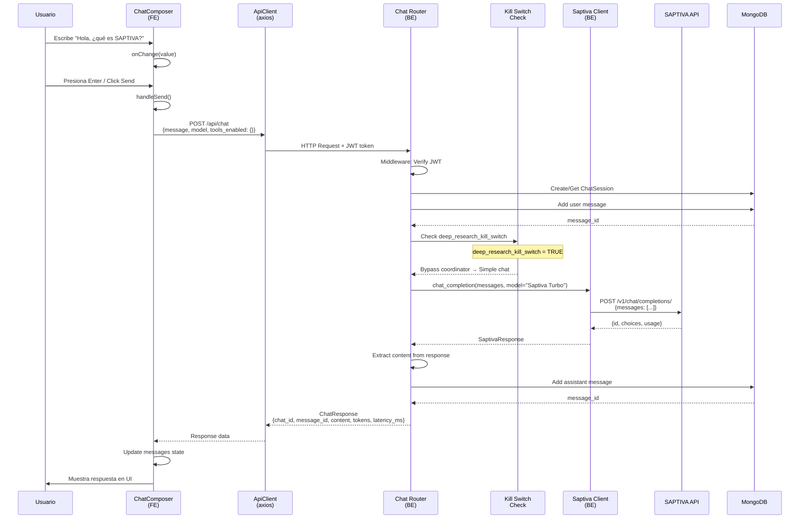
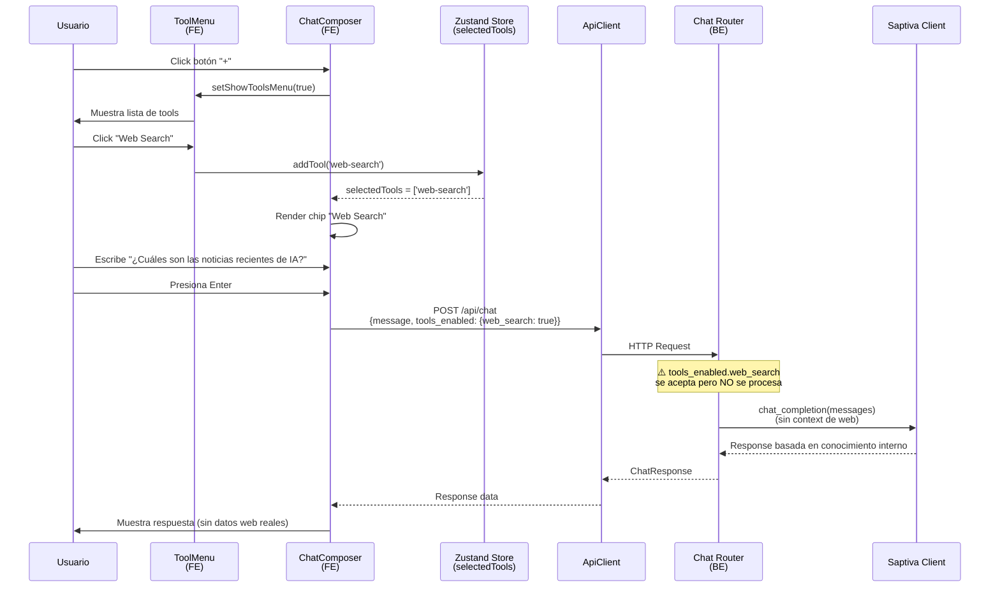
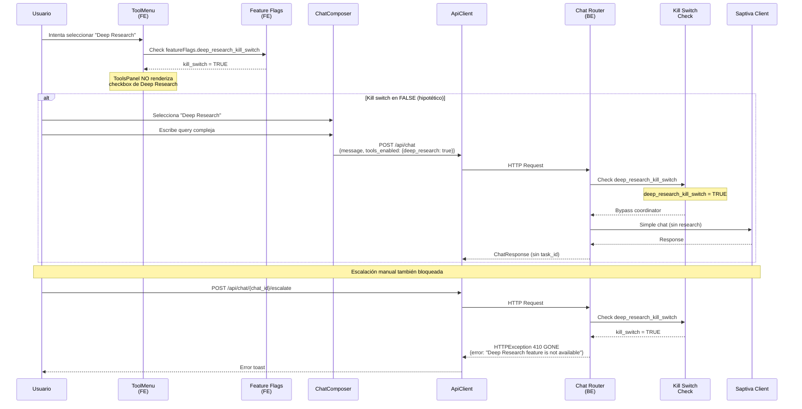
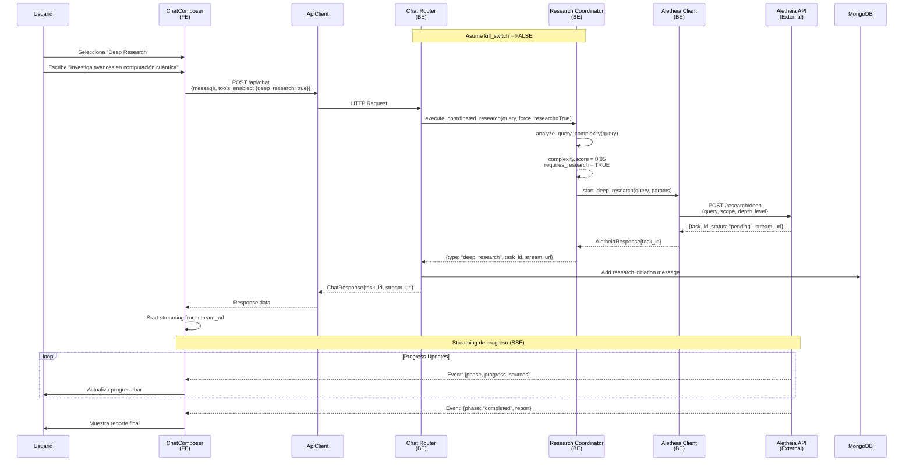
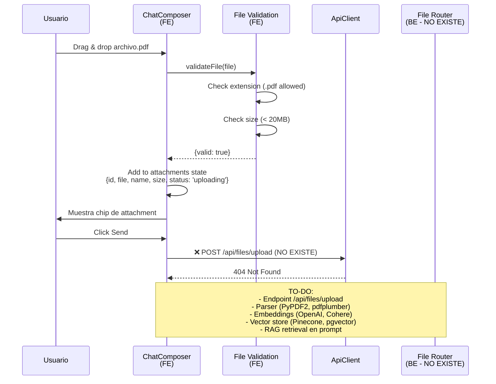

# Diagrama 2: Secuencia Chat Completa con Tools

## Flujo 1: Chat Simple (Sin Tools / Kill Switch Activo)

**Archivos clave**:
- `apps/web/src/components/chat/ChatComposer/ChatComposer.tsx:355-373` (handleSend, handleKeyDown)
- `apps/web/src/lib/api-client.ts:300-350` (sendChatMessage)
- `apps/api/src/routers/chat.py:38-340` (send_chat_message)
- `apps/api/src/services/saptiva_client.py:165-245` (chat_completion)

---

## Flujo 2: Chat con Tool Seleccionada (Web Search - No Implementado)

**Problema actual**: `web_search` es solo un feature flag. **No hay:**
- Endpoint `/api/tools/web-search`
- Servicio de scraping/fetching
- Adaptador que procese el flag

**Archivos clave**:
- `apps/web/src/components/chat/ToolMenu/ToolMenu.tsx:16-42` (renderiza lista de tools)
- `apps/web/src/hooks/useSelectedTools.ts:4-22` (hook para gestionar tools)
- `apps/api/src/schemas/chat.py:90` (acepta tools_enabled pero no procesa)

---

## Flujo 3: Deep Research (Bloqueado por Kill Switch)

**Archivos clave**:
- `apps/web/src/components/chat/ToolsPanel.tsx:49-67` (fetch feature flags)
- `apps/web/src/components/chat/ToolsPanel.tsx:156-190` (conditional render de Deep Research)
- `apps/api/src/routers/chat.py:129-172` (kill switch bypass)
- `apps/api/src/routers/chat.py:362-379` (escalate blocked)

---

## Flujo 4: Deep Research (Si estuviera habilitado - Hipotético)

**Archivos clave (cuando esté habilitado)**:
- `apps/api/src/services/research_coordinator.py:238-300` (make_research_decision)
- `apps/api/src/services/aletheia_client.py` (start_deep_research)
- `apps/web/src/hooks/useDeepResearch.ts` (streaming hook)

---

## Flujo 5: Add Files (PDF) - No Implementado

**Archivos clave**:
- `apps/web/src/components/chat/ChatComposer/ChatComposer.tsx:123-135` (validateFile)
- `apps/web/src/components/chat/ChatComposer/ChatComposer.tsx:467-520` (handleDrop, handleFileSelect)
- **NO EXISTE**: Backend file upload/processing

---

## Resumen de Flows

| Flow | Estado | Kill Switch | Implementación |
|------|--------|-------------|----------------|
| Chat Simple | ✅ Funcional | N/A | Completa |
| Chat + Web Search | ⚠️ Parcial | N/A | Solo UI, sin backend |
| Deep Research | ❌ Bloqueado | ✅ ACTIVO | Backend completo, pero deshabilitado |
| Escalate to Research | ❌ Bloqueado | ✅ ACTIVO | Retorna 410 GONE |
| Add Files (PDF) | ❌ No Implementado | N/A | Solo UI (validación) |
| Google Drive | ❌ No Implementado | N/A | Solo feature flag |
| Canvas | ❌ No Implementado | N/A | Solo feature flag |
| Agent Mode | ❌ No Implementado | N/A | Solo feature flag |

---

## Próximo diagrama

→ [Diagrama 3: Módulos/Clases (Registry, Adapters, Interfaces)](./llm-tools-classes.md)
