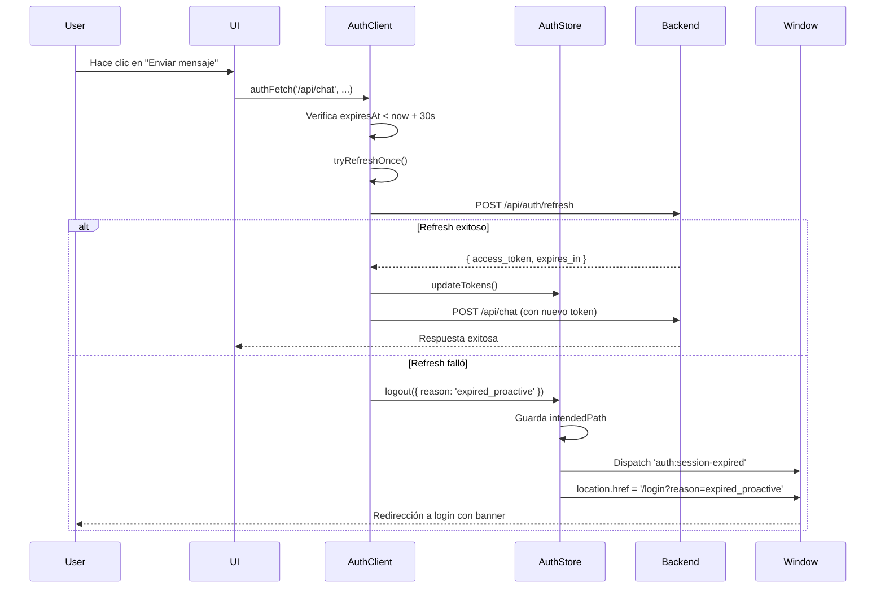
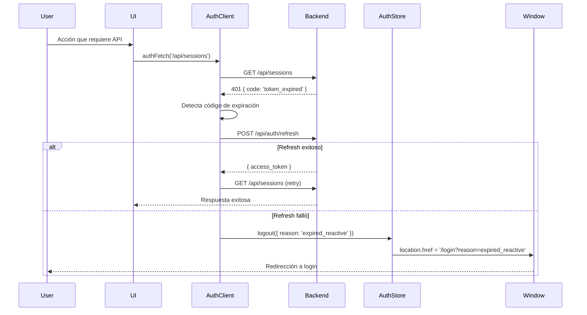
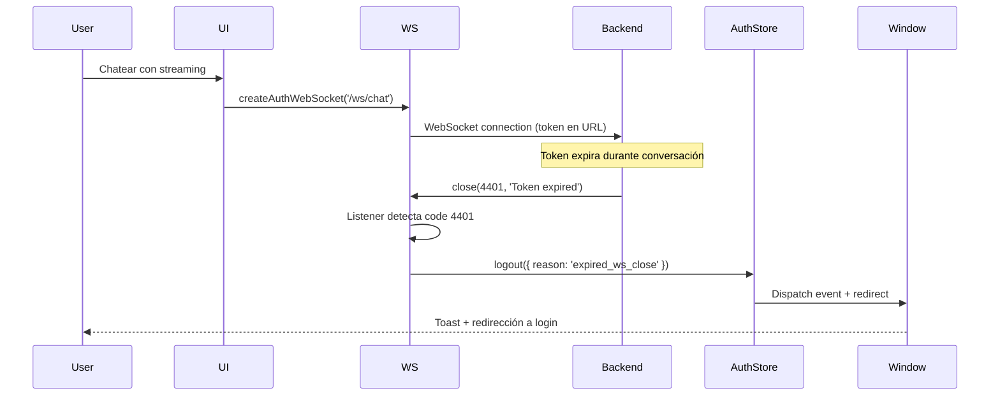
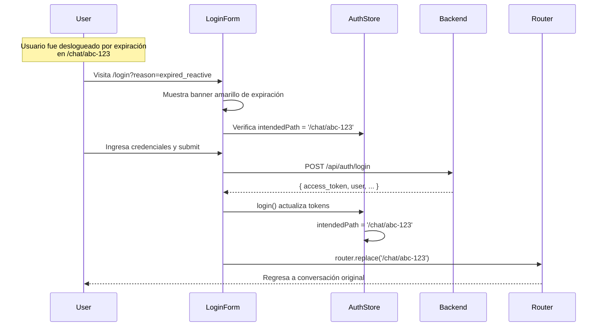

# Manejo Robusto de Expiración de Token

## Descripción General

Sistema completo de detección y manejo automático de expiración de tokens de sesión con logout automático, preservación de rutas y mensajes claros en español.

## Arquitectura

### Backend (FastAPI)

#### Middleware de Autenticación (`apps/api/src/middleware/auth.py`)

**Respuestas Estandarizadas:**
```json
{
  "code": "token_expired|token_invalid|token_revoked|token_missing",
  "message": "Mensaje en español descriptivo"
}
```

**Códigos de Error:**
- `token_expired`: Token JWT expirado (ExpiredSignatureError)
- `token_invalid`: Token con firma inválida o malformado
- `token_revoked`: Token en blacklist de Redis (sesión cerrada)
- `token_missing`: No se envió token de autorización

**Verificación de Revocación:**
- Integración con Redis para verificar tokens en blacklist
- Consulta rápida antes de procesar la solicitud
- Previene uso de tokens revocados manualmente

### Frontend (Next.js/React)

#### 1. AuthClient Unificado (`apps/web/src/lib/auth-client.ts`)

**Detección Proactiva:**
```typescript
// Antes de hacer la llamada HTTP
if (!accessToken || isTokenExpiringSoon(expiresAt)) {
  // Intentar refresh automático
  const refreshed = await tryRefreshOnce()
  if (!refreshed) {
    handleExpiration('proactive')
  }
}
```

**Detección Reactiva:**
```typescript
// Después de recibir 401
if (response.status === 401) {
  const { code } = await extractErrorDetails(response)
  if (EXPIRATION_ERROR_CODES.includes(code)) {
    // Intentar refresh una sola vez
    if (retryOnExpired) {
      const refreshed = await tryRefreshOnce()
      if (refreshed) {
        return authFetch(url, init, { retryOnExpired: false })
      }
    }
    handleExpiration('reactive')
  }
}
```

**Características:**
- Margen de seguridad de 30 segundos antes de expiración
- Un solo intento de refresh para evitar loops
- Refresh in-flight compartido (evita múltiples llamadas simultáneas)
- Manejo de errores específicos por código

#### 2. Interceptores WebSocket/SSE (`apps/web/src/lib/auth-websocket.ts`)

**Detección en Mensajes:**
```typescript
ws.addEventListener('message', (event) => {
  const data = JSON.parse(event.data)
  if (data?.code === 'token_expired') {
    logout({ reason: 'expired_ws_message' })
    ws.close(4401)
  }
})
```

**Detección en Cierre de Conexión:**
```typescript
ws.addEventListener('close', (event) => {
  if (event.code === 4401) {
    logout({ reason: 'expired_ws_close' })
  }
})
```

**Características:**
- Código personalizado 4401 para expiración
- Inyección automática de token en query params
- Listeners para ambos tipos de señales de expiración

#### 3. AuthStore Mejorado (`apps/web/src/lib/auth-store.ts`)

**Logout Robusto:**
```typescript
async logout(opts = {}) {
  const { reason, redirectPath } = opts

  // 1. Llamar backend para blacklist
  await apiClient.logout()

  // 2. Guardar ruta actual para volver después
  const pathToSave = redirectPath || currentPath

  // 3. Limpiar estado local
  set({ ...clearState, intendedPath: pathToSave })

  // 4. Mostrar toast si es por expiración
  if (reason?.includes('expired')) {
    window.dispatchEvent(new CustomEvent('auth:session-expired', {
      detail: { message: 'Tu sesión ha expirado...' }
    }))
  }

  // 5. Redirigir a login con razón
  window.location.href = `/login?reason=${reason}`
}
```

**Actualización de Tokens:**
```typescript
updateTokens(accessToken, expiresIn) {
  set({
    accessToken,
    expiresAt: computeExpiry(expiresIn),
    error: null
  })
}
```

**Gestión de Ruta Intencional:**
```typescript
setIntendedPath(path) {
  set({ intendedPath: path })
}
```

#### 4. Componente de Toast (`apps/web/src/components/ui/SessionExpiredToast.tsx`)

**Características:**
- Escucha eventos `auth:session-expired`
- Auto-desaparece después de 5 segundos
- Diseño con icono de advertencia amarillo
- Mensajes en español
- Posicionado en esquina superior derecha

#### 5. LoginForm Actualizado (`apps/web/src/components/auth/LoginForm.tsx`)

**Banner de Sesión Expirada:**
```tsx
{sessionExpiredMessage && (
  <div className="mb-6 border border-yellow-500/40 bg-yellow-500/10">
    <p>{sessionExpiredMessage}</p>
  </div>
)}
```

**Redirección Post-Login:**
```typescript
useEffect(() => {
  if (accessToken && user) {
    const destination = intendedPath || '/chat'
    router.replace(destination)
  }
}, [accessToken, user, intendedPath])
```

**Detección de Query Param:**
```typescript
useEffect(() => {
  const params = new URLSearchParams(window.location.search)
  const reason = params.get('reason')
  if (reason?.includes('expired')) {
    setSessionExpiredMessage('Tu sesión ha expirado...')
  }
}, [])
```

## Flujos de Usuario

### Flujo 1: Expiración Proactiva (Antes de Llamada HTTP)



### Flujo 2: Expiración Reactiva (Respuesta 401)



### Flujo 3: WebSocket Expira Durante Conexión



### Flujo 4: Login Post-Expiración con Ruta Preservada



## Códigos de Razón de Logout

| Código | Descripción | Origen |
|--------|-------------|---------|
| `expired_proactive` | Token expirando en <30s detectado antes de llamada | AuthClient |
| `expired_reactive` | 401 con `token_expired` recibido de backend | AuthClient |
| `expired_ws_message` | Mensaje WebSocket con `code: 'token_expired'` | WebSocket |
| `expired_ws_close` | WebSocket cerrado con código 4401 | WebSocket |
| `expired_sse` | EventSource recibió señal de expiración | EventSource |

## Mensajes UX en Español

### Toast de Sesión Expirada
- **Mensaje:** "Tu sesión ha expirado. Inicia sesión nuevamente."
- **Tipo:** Advertencia (amarillo)
- **Duración:** 5 segundos

### Banner en Login
- **Mensaje:** "Tu sesión ha expirado. Por favor, inicia sesión nuevamente."
- **Condición:** Query param `?reason=expired_*`
- **Estilo:** Border amarillo con icono de info

### Respuestas Backend
- `token_expired`: "El token ha expirado"
- `token_invalid`: "Token inválido"
- `token_revoked`: "La sesión ha sido revocada"
- `token_missing`: "Token de autenticación requerido"

## Configuración

### Variables de Entorno Backend
```bash
# JWT Settings
JWT_ACCESS_TOKEN_EXPIRE_MINUTES=30  # Duración del access token
JWT_REFRESH_TOKEN_EXPIRE_DAYS=7     # Duración del refresh token
JWT_SECRET_KEY=<secret>              # Clave secreta para firma

# Redis (para blacklist)
REDIS_URL=redis://localhost:6379
```

### Constantes Frontend
```typescript
// apps/web/src/lib/auth-client.ts
const SKEW_SECONDS = 30  // Margen de seguridad antes de expiración

// apps/web/src/lib/auth-websocket.ts
const TOKEN_EXPIRED_WS_CODE = 4401  // Código personalizado WebSocket
```

## Pruebas

### Unitarias Frontend
```typescript
describe('authFetch', () => {
  it('debe intentar refresh si token expira en <30s', async () => {
    // Mock expiresAt = now + 20s
    // Verificar que llama tryRefreshOnce()
  })

  it('debe logout si refresh falla', async () => {
    // Mock refresh retorna 401
    // Verificar que llama logout({ reason: 'expired_proactive' })
  })

  it('debe reintentar exactamente una vez en 401', async () => {
    // Mock primera llamada retorna 401
    // Mock refresh exitoso
    // Verificar que reintenta con retryOnExpired=false
  })
})
```

### E2E (Playwright/Cypress)
```typescript
test('expiración automática y redirección', async ({ page }) => {
  // 1. Login exitoso
  await page.goto('/login')
  await page.fill('[name=identifier]', 'demo')
  await page.fill('[name=password]', 'Demo1234')
  await page.click('button[type=submit]')

  // 2. Navegar a /chat
  await expect(page).toHaveURL('/chat')

  // 3. Simular expiración (mock backend 401)
  await page.route('**/api/sessions', route => {
    route.fulfill({
      status: 401,
      body: JSON.stringify({ code: 'token_expired', message: 'El token ha expirado' })
    })
  })

  // 4. Trigger acción que requiere auth
  await page.click('[data-testid=history-button]')

  // 5. Verificar redirección a login con razón
  await expect(page).toHaveURL(/\/login\?reason=expired/)

  // 6. Verificar banner de sesión expirada
  await expect(page.locator('text=Tu sesión ha expirado')).toBeVisible()
})
```

### Integración Backend
```python
def test_expired_token_returns_401_with_code():
    """Verificar que token expirado retorna 401 con código específico"""
    # Crear token con exp = now - 1 hour
    expired_token = create_token(user_id="123", exp=datetime.now() - timedelta(hours=1))

    # Hacer request con token expirado
    response = client.get("/api/sessions", headers={"Authorization": f"Bearer {expired_token}"})

    # Verificar respuesta
    assert response.status_code == 401
    assert response.json()["code"] == "token_expired"
    assert "expirado" in response.json()["message"].lower()
```

## Criterios de Aceptación (QA)

- [x] **Backend:** Respuestas 401 incluyen código específico (`token_expired`, `token_invalid`, `token_revoked`)
- [x] **Proactivo:** No se hacen llamadas si `exp < now + 30s`, se intenta refresh primero
- [x] **Reactivo:** Al recibir 401 con código de expiración, se intenta refresh una vez
- [x] **Sin Loops:** Solo un refresh in-flight a la vez, máximo un reintento por request
- [x] **Blacklist:** Tokens revocados son verificados en Redis antes de procesar
- [x] **WebSocket:** Cierre con código 4401 o mensaje `token_expired` dispara logout
- [x] **Ruta Preservada:** `intendedPath` se guarda y se usa para redirigir post-login
- [x] **Mensajes Español:** Todos los mensajes UX están en español
- [x] **Toast:** Notificación visible al expirar con auto-dismiss de 5s
- [x] **Banner Login:** Se muestra cuando `?reason=expired_*` en URL

## Mantenimiento

### Agregar Nuevo Código de Error

1. **Backend:** Agregar a `error_messages` en `middleware/auth.py`
2. **Frontend:** Agregar a `ERROR_MESSAGES` en `auth-store.ts`
3. **Frontend:** Agregar a `EXPIRATION_ERROR_CODES` si debe disparar logout

### Modificar Tiempo de Margen Proactivo

```typescript
// apps/web/src/lib/auth-client.ts
const SKEW_SECONDS = 60  // Aumentar a 60 segundos
```

### Personalizar Mensajes de Toast

```typescript
// apps/web/src/lib/auth-store.ts
window.dispatchEvent(new CustomEvent('auth:session-expired', {
  detail: {
    message: 'Mensaje personalizado aquí',
    reason
  }
}))
```

## Solución de Problemas

### Token se refresca pero sigue retornando 401
- **Causa:** Redis no está sincronizado o token en blacklist
- **Solución:** Verificar que `is_token_blacklisted()` funciona correctamente

### Loop infinito de refresh
- **Causa:** `refreshInFlight` no se está limpiando
- **Solución:** Verificar que `finally` block en `tryRefreshOnce()` ejecuta

### No se preserva ruta después de login
- **Causa:** `intendedPath` no se guarda antes de redirect
- **Solución:** Verificar que `logout()` guarda `currentPath` antes de limpiar estado

### WebSocket no detecta expiración
- **Causa:** Backend no envía código 4401 o mensaje `token_expired`
- **Solución:** Implementar en backend señal de expiración en WebSocket close/message

## Referencias

- [Especificación JWT](https://datatracker.ietf.org/doc/html/rfc7519)
- [WebSocket Close Codes](https://www.rfc-editor.org/rfc/rfc6455.html#section-7.4)
- [OAuth 2.0 Token Refresh](https://datatracker.ietf.org/doc/html/rfc6749#section-6)
