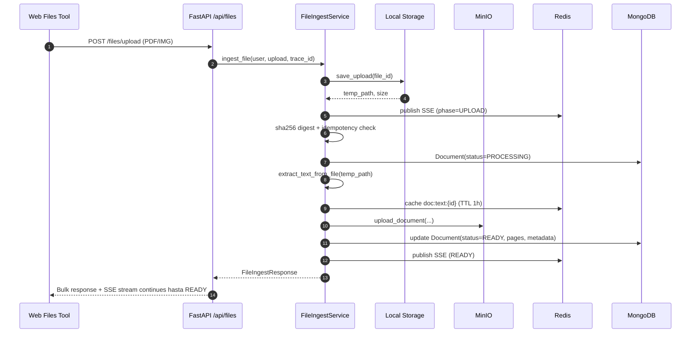
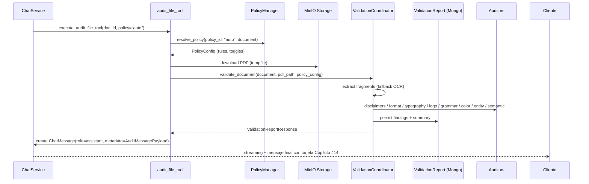

# Copiloto 414

Copiloto 414 es el sistema de auditoría documental integrado dentro de la experiencia de chat de Copilot OS para Capital 414. Esta guía consolida la arquitectura actual, los componentes clave y los flujos que enlazan la carga de archivos, la validación automática y la surfaced de resultados dentro del hilo de conversación.

> Última actualización: 2025-11-04 — basada en commit `10e8c6b` y servicios activos en `apps/api/src/services`.
> Historial previo disponible en el historial de Git (consultar tags/commits anteriores a la consolidación 2025-11-04).

---

## Índice

1. [Visión General](#visión-general)
2. [Equipo y Gobernanza](#equipo-y-gobernanza)
3. [Estado y Roadmap](#estado-y-roadmap)
4. [Arquitectura del Sistema](#arquitectura-del-sistema)
5. [Ingesta de Archivos (Files V1)](#ingesta-de-archivos-files-v1)
6. [Orquestación de Auditoría](#orquestación-de-auditoría)
7. [Integración con el Chat](#integración-con-el-chat)
8. [Modelos y Persistencia](#modelos-y-persistencia)
9. [Configuración, Flags y Deploy](#configuración-flags-y-deploy)
10. [Observabilidad y Métricas](#observabilidad-y-métricas)
11. [Pruebas y QA](#pruebas-y-qa)
12. [Limitaciones y Próximos Pasos](#limitaciones-y-próximos-pasos)

---

## Visión General

- **Propósito**: Validar documentos PDF/imagen de Capital 414 sin salir del chat, mostrando hallazgos como mensajes enriquecidos.
- **Alcance actual**:
  - Adjuntos se procesan vía Files V1 (`/api/files/upload`) con SSE para progreso.
  - Auditorías se disparan manualmente desde el chat (tool `audit-file`).
  - Resultados se persisten en MongoDB (`validation_reports`) y se publican como `ChatMessage` con `metadata` tipada (`AuditMessagePayload`).
  - Contexto de hallazgos se reutiliza en respuestas subsecuentes (RAG + LLM).
- **Infra**: FastAPI + MongoDB + Redis + MinIO (documentos/audit reports) + SAPTIVA LLM + LanguageTool. Nginx expone `/documents/*` y `/audit-reports/*` hacia MinIO con timeouts extendidos para descargas grandes (commit `10e8c6b`).

---

## Equipo y Gobernanza

- **Product Owner (414 Capital)**: Arturo  
- **Tech Partner (Saptiva)**: Carlos  
- **AI Lead**: Jaziel Flores (`apps/api`, heurísticas ML)  
- **Frontend Lead**: Equipo web Next.js (`apps/web`)  
- **Operaciones**: SRE/DevOps (scripts de deploy y monitoreo en `scripts/` e `infra/`)
- **Stakeholders secundarios**: Equipo de compliance 414 (valida hallazgos críticos) y equipo de datos (golden set pendiente)

Decisiones clave se canalizan vía PR en `develop` y flagging server-driven (`/api/features`). Auditorías críticas requieren aprobación del área legal de 414 previo a GA.

---

## Estado y Roadmap

| Iniciativa | Estado | Evidencia |
|------------|--------|-----------|
| Files V1 + SSE + MinIO | 🟢 Completo | `apps/api/src/services/file_ingest.py`, `apps/web/src/hooks/useFiles.ts` |
| Tool `audit-file` y tarjeta en chat | 🟢 Completo | `services/tools/audit_file_tool.py`, `MessageAuditCard.tsx` |
| Manager y detección de políticas | 🟡 Piloto | `services/policy_manager.py`, `policy_detector.py` (414, Banamex) |
| Contexto de validación en RAG | 🔴 Pendiente | `apps/api/src/services/validation_context_formatter.py` listo; falta integración en `apps/api/src/domain/chat_strategy.py` |
| Benchmarks & golden set QA | 🔴 Pendiente | Script base `scripts/test_validation.sh`; falta dataset etiquetado |
| Dashboards observabilidad (Grafana) | 🟡 En progreso | Métricas Prometheus expuestas; dashboards por configurar |

### Próximos hitos
- **P2 hardening**: completar inyección automática de `VALIDATION_CONTEXT` en RAG y añadir `Document.validation_report_id` para lookup directo (hoy se gestiona sólo vía metadata).
- **P3 QA**: generar golden set etiquetado (>20 docs) y automatizar métricas de recall/precision.
- **Rollout**: staging con 5 documentos reales, luego habilitar `policy_auto_detect` en producción con alertas.

---

## Arquitectura del Sistema

```mermaid
flowchart LR
  subgraph Client[Next.js 14 · UI]
    ChatUI[Chat Shell & Mensajes]
    FilesTool[Files Tool · useFiles]
    AuditCard[MessageAuditCard]
    SSEHook[SSE hooks · useOptimizedChat]
  end

  subgraph API[FastAPI · apps/api]
    AuthRouter[/auth]
    ChatRouter[/chat]
    FilesRouter[/files]
    ReviewRouter[/review]
    StreamRouter[/stream]
    ReportsRouter[/reports]
  end

  subgraph Services[Servicios]
    ChatService(ChatService)
    ToolHub(Audit / Tools dispatcher)
    FileIngest(FileIngestService)
    ValidationCoordinator(ValidationCoordinator)
    PolicyManager(PolicyManager & Detector)
    ReviewService(ReviewService)
  end

  subgraph Persistence[Persistencia]
    Mongo[(MongoDB · Beanie)]
    Redis[(Redis Cache)]
    MinIO[(MinIO · documents & audit-reports)]
  end

  subgraph External[Servicios Externos]
    SaptivaLLM[Saptiva LLMs]
    Aletheia[Aletheia (kill switch ON)]
    LanguageTool[LanguageTool API]
  end

  ChatUI -->|POST /api/chat| ChatRouter
  FilesTool -->|POST /api/files/upload| FilesRouter
  SSEHook -->|GET /api/files/events/{id}| FilesRouter
  AuditCard -->|tool invocation| ChatRouter

  ChatRouter --> ChatService
  ChatService --> ToolHub
  ToolHub --> ValidationCoordinator
  ToolHub --> ReviewService
  ChatService --> SaptivaLLM
  ChatService --> Redis
  ChatService --> Mongo

  FilesRouter --> FileIngest
  FileIngest --> MinIO
  FileIngest --> Redis
  FileIngest --> Mongo

  ValidationCoordinator --> PolicyManager
  ValidationCoordinator --> MinIO
  ValidationCoordinator --> Mongo
  ValidationCoordinator --> Redis
  ValidationCoordinator --> LanguageTool

  ReviewRouter --> ReviewService
  ReviewService --> ValidationCoordinator
  ReviewService --> Mongo

  StreamRouter --> Aletheia

  Mongo --> ReportsRouter
  ReportsRouter --> ChatUI
```

**Highlights**
- `apps/api/src/services/file_ingest.py` maneja la ingesta (hash idempotente, streaming al disco, cache en Redis).
- `ValidationCoordinator` invoca auditores especializados (`compliance`, `format`, `typography`, `logo`, `grammar`, `color_palette`, `entity_consistency`, `semantic_consistency`).
- `PolicyManager` + `policy_detector` resuelven `policy_id="auto"` a políticas definidas en `config/policies.yaml`.
- MinIO se usa como origen de verdad para binarios; `storage` local mantiene staging temporal.
- Deep Research permanece deshabilitado (`deep_research_kill_switch=True`) pero los endpoints y SSE están listos si se reactiva.

---

## Ingesta de Archivos (Files V1)



- **Límites**: controlados por `MAX_FILE_SIZE` (env) y rate-limit Redis (5/min por usuario).
- **Cache**: texto plano se almacena en Redis (`doc:text:{id}`) para RAG y auditoría rápida.
- **Persistencia**: páginas se guardan en Mongo (`Document.pages`), binario final en MinIO (`documents/<user>/<chat>/<file>.pdf`).
- **SSE**: `apps/api/src/services/file_events.py` y `useFiles` en FE mantienen progreso.

---

## Orquestación de Auditoría



- **Auditores activos** (carpeta `apps/api/src/services`):
  - `compliance_auditor.py` — disclaimers y cláusulas legales (RapidFuzz).
  - `format_auditor.py` — formatos, números, campos monetarios.
  - `typography_auditor.py`, `color_palette_auditor.py` — diseño corporativo.
  - `logo_auditor.py` — template matching multiescala (OpenCV).
  - `grammar_auditor.py` — LanguageTool API con batch.
  - `entity_consistency_auditor.py` y `semantic_consistency_auditor.py` — consistencia narrativa.
- **Políticas**: `config/policies.yaml` define toggles y pesos; `policy_detector.py` usa heurísticas (logo, keywords, disclaimers) con `confidence_threshold=0.6`.
- **Contexto para LLM**: `validation_context_formatter.py` limita a ~800 tokens y se inyecta desde `RAGChatStrategy` cuando `validation_report_id` está presente.

---

## Integración con el Chat

- **Frontend** (`apps/web/src/components/chat`)
  - `ToolsPanel.tsx` expone tool `audit-file` con toggles por archivo.
  - `AuditProgress.tsx` escucha eventos SSE (`/files/events/{id}`) para mostrar estados `PROCESSING/READY`.
  - `MessageAuditCard.tsx` renderiza `AuditMessagePayload` (resumen, findings, acciones).
  - `useOptimizedChat` gestiona streaming incremental y cancelaciones.
  - `tool-mapping.ts` mantiene compatibilidad entre keys legacy (`copilotoAudit`) y nuevos IDs.
- **Backend**
  - `apps/api/src/routers/chat.py` detecta `tool_calls` y delega en `services/tools`.
  - `audit_file_tool.py` publica mensajes y registra métricas (`audit_message_posted_total`).
  - `history_service.py` conserva el timeline (incluye auditorías y deep research en caso de habilitarse).

---

## Modelos y Persistencia

| Modelo | Archivo | Campos relevantes |
|--------|---------|-------------------|
| `Document` | `apps/api/src/models/document.py` | `status`, `pages`, `minio_key`, `validation_report_id` (si aplica) |
| `ValidationReport` | `apps/api/src/models/validation_report.py` | `findings`, `summary`, `policy_id`, `document_id` |
| `ChatMessage` | `apps/api/src/models/chat.py` | `metadata` opcional con `AuditMessagePayload` |
| `AuditMessagePayload` | `apps/api/src/schemas/audit_message.py` | Tipo base para FE (summary, sample_findings, actions) |
| `Task` | `apps/api/src/models/task.py` | Deep research y auditoría asíncrona (kill switch) |

MongoDB usa índices por `user_id`, `conversation_id` y timestamps. Redis funciona como caché efímero y rate limiter.

---

## Configuración, Flags y Deploy

- **Variables clave** (`envs/.env*.example`).
  - `NEXT_PUBLIC_API_URL` **sin** sufijo `/api` (ajustado en commit `10e8c6b`).
  - `MAX_FILE_SIZE_MB`, `FILES_TTL_DAYS`, `DOCUMENTS_REAPER_INTERVAL_SECONDS` para Files V1.
  - `MINIO_ENDPOINT`, `MINIO_PUBLIC_ENDPOINT`, `MINIO_DEFAULT_PUBLIC_HOST` para descargas.
  - `LANGUAGETOOL_API_URL`, `SAPTIVA_API_KEY`, `DEEP_RESEARCH_KILL_SWITCH`.
- **Nginx** (`infra/nginx/nginx.414.cloudflare.conf`):
  - Nuevas `location /api/files/upload` con timeouts 300s.
  - Proxy directo a MinIO (`/documents/` y `/audit-reports/`) respetando cabeceras Cloudflare.
- **Docker/Deploy**:
  - `apps/web/Dockerfile` genera `.env.production` durante build.
  - `scripts/deploy-cloudflare-414.sh` compila imágenes con API URL correcto y publica a servidor.

---

## Observabilidad y Métricas

- **Logs**: `structlog` con `trace_id` desde headers (`x-trace-id`).
- **Telemetry**: `core/telemetry.py` expone métricas Prometheus (`copiloto_414_validation_seconds_bucket`, `audit_invoked_total{policy_id}`...).
- **Tracing**: OpenTelemetry opcional, instrumentación activada en `main.py` (`instrument_fastapi`).
- **Alertas recomendadas**:
  - Latencia auditoría p95 > 60s.
  - Ratio de errores en `FileEventPayload.status=FAILED`.
  - Uso de disco MinIO > 80% (`MINIO_MAX_DISK_USAGE_PERCENT`).

---

## Pruebas y QA

- **Unitarias**: `apps/api/tests/unit/` cubre auditores (disclaimer, formato, logo, etc.).
- **Integración**: `apps/api/tests/integration/` incluye escenarios de Files V1 y auditoría.
- **Smoke manual** (ver `manual-testing.md` en esta misma carpeta):
  1. Subir PDF 414 con disclaimers correctos → esperar READY <90s.
  2. Ejecutar auditoría con policy auto → revisar resumen correcto.
  3. Preguntar en chat “¿Qué hallazgos críticos hay?” → respuesta incluye contexto.
  4. Descargar reporte desde Mongo/MinIO → URL proxied operativa.
- **Kill switches**: verificar `GET /api/features` refleje flags (`tool_add_files_enabled`, `deep_research_kill_switch`).

---

## Limitaciones y Próximos Pasos

- **Fragments con bounding boxes**: `validation_coordinator` usa fragmentos sintéticos cuando el PDF no contiene texto (TODO implementar `extract_fragments_with_bbox`).
- **Deep Research**: permanece deshabilitado; requiere validar costos/seguridad antes de GA.
- **Policy detector**: heurísticas actualizadas para 414 y Banamex; nuevas políticas requieren ampliar `POLICY_SIGNATURES` y templates.
- **Observabilidad**: faltan dashboards finales en Grafana; métrica `copiloto_414_validation_seconds_bucket` ya expone buckets.
- **Experiencia de usuario**: evaluar reintentos automáticos cuando `doc:text:{id}` vence en Redis.

**Riesgos y mitigaciones**
- **SSE intermitente**: la suscripción `file_events` expira a los 30s sin actividad; mantener heartbeat y fallback a polling si es necesario.
- **Costo OCR**: limitar `MAX_OCR_PAGES` y reutilizar cache Redis/Mongo para evitar reprocesamientos grandes.
- **Logo multiescala**: el auditor usa template matching; continuar calibrando escalas (0.6–1.4x) y mantener set de pruebas con logos alternos.
- **Latencia**: p95 objetivo <45s; monitorizar `copiloto_414_validation_seconds_bucket` y habilitar alerta si se supera 60s.
