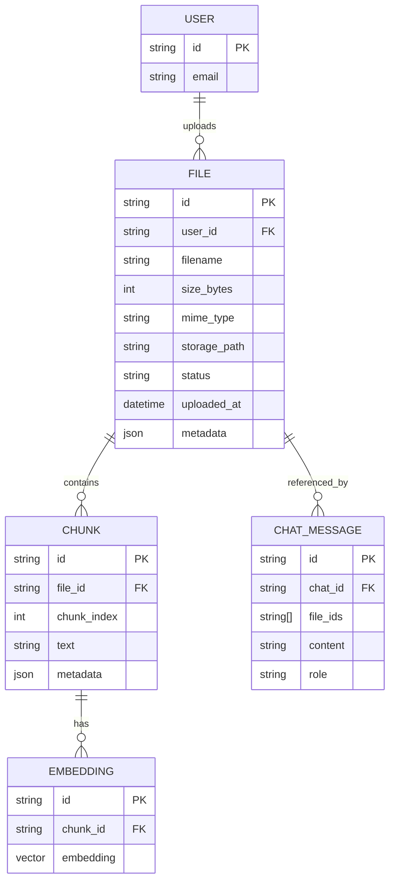

# Diagrama 4: Flujo PDF→RAG (Propuesta Futura)

> ⚠️ **NOTA**: Este flujo **NO está implementado actualmente**. Es una propuesta de arquitectura para implementación futura.

## Visión General

El flujo PDF→RAG (Retrieval Augmented Generation) permite a los usuarios adjuntar documentos PDF que se procesan, indexan y utilizan como contexto adicional para el LLM.

---

## Flujo Completo: Upload → Parse → Embed → Store → Retrieve → Augment

```mermaid
flowchart TB
    subgraph "1. Upload (Frontend)"
        USER[Usuario]
        COMPOSER[ChatComposer]
        VALIDATION[File Validation]
    end

    subgraph "2. Backend Processing"
        UPLOAD_EP[POST /api/files/upload]
        STORAGE[File Storage<br/>S3 / Local FS]
        PARSER[PDF Parser Service<br/>PyPDF2 / pdfplumber]
        CHUNKER[Text Chunker<br/>RecursiveCharacterTextSplitter]
    end

    subgraph "3. Embedding & Indexing"
        EMBED_SVC[Embedding Service<br/>OpenAI / Cohere / sentence-transformers]
        VECTOR_STORE[(Vector Store<br/>Pinecone / Weaviate / pgvector)]
        METADATA_DB[(Metadata DB<br/>MongoDB)]
    end

    subgraph "4. Retrieval (Query Time)"
        CHAT_REQ[Chat Request<br/>with file context]
        RETRIEVER[Retriever Service<br/>semantic search]
        RERANKER[Re-ranker<br/>optional]
    end

    subgraph "5. LLM Augmentation"
        PROMPT_BUILDER[Prompt Builder<br/>inject context]
        SAPTIVA[Saptiva LLM]
        RESPONSE[Response with citations]
    end

    USER -->|Drag & drop PDF| COMPOSER
    COMPOSER --> VALIDATION
    VALIDATION -->|validateFile| VALIDATION

    VALIDATION -->|valid: true| UPLOAD_EP
    UPLOAD_EP --> STORAGE
    UPLOAD_EP --> PARSER

    PARSER -->|extract text| CHUNKER
    CHUNKER -->|chunks[]| EMBED_SVC

    EMBED_SVC -->|embeddings[]| VECTOR_STORE
    EMBED_SVC -->|file metadata| METADATA_DB

    USER -->|Send message| CHAT_REQ
    CHAT_REQ --> RETRIEVER
    RETRIEVER -->|semantic search| VECTOR_STORE
    VECTOR_STORE -->|top K chunks| RETRIEVER
    RETRIEVER --> RERANKER
    RERANKER -->|ranked chunks| PROMPT_BUILDER

    PROMPT_BUILDER -->|augmented prompt| SAPTIVA
    SAPTIVA --> RESPONSE
    RESPONSE -->|with citations| USER

    style UPLOAD_EP fill:#fd7e14,stroke:#e8590c,stroke-width:2px
    style PARSER fill:#fd7e14,stroke:#e8590c,stroke-width:2px
    style EMBED_SVC fill:#fd7e14,stroke:#e8590c,stroke-width:2px
    style VECTOR_STORE fill:#fd7e14,stroke:#e8590c,stroke-width:2px
    style RETRIEVER fill:#fd7e14,stroke:#e8590c,stroke-width:2px
    style PROMPT_BUILDER fill:#fd7e14,stroke:#e8590c,stroke-width:2px

    style USER fill:#339af0,stroke:#1971c2,stroke-width:2px
    style SAPTIVA fill:#51cf66,stroke:#37b24d,stroke-width:2px
```

---

## Paso 1: Upload y Validación (Frontend)

**Componente**: `apps/web/src/components/chat/ChatComposer/ChatComposer.tsx`

### Estado Actual (Ya implementado)

```typescript
// Validación de archivos (líneas 123-135)
const validateFile = (file: File): { valid: boolean; error?: string } => {
  const extension = file.name.split('.').pop()?.toLowerCase()

  if (!extension || !ACCEPTED_FILE_TYPES.includes(extension)) {
    return { valid: false, error: `Tipo de archivo no permitido` }
  }

  if (file.size > MAX_FILE_SIZE_MB * 1024 * 1024) {
    return { valid: false, error: `Archivo muy grande. Máximo ${MAX_FILE_SIZE_MB}MB` }
  }

  return { valid: true }
}

// Manejo de drag & drop (líneas 467-510)
const handleDrop = (e: React.DragEvent) => {
  e.preventDefault()
  if (e.dataTransfer.files) {
    handleFileSelect(e.dataTransfer.files)
  }
}
```

### Lo que falta

- Endpoint `/api/files/upload` que reciba el archivo
- Upload real a storage (S3 o filesystem)

---

## Paso 2: Parsing del PDF (Backend - Por implementar)

**Servicio propuesto**: `apps/api/src/services/pdf_parser.py`

```python
from pypdf import PdfReader
# O alternativa: import pdfplumber

class PdfParserService:
    """Service for parsing PDF files"""

    async def parse_pdf(self, file_path: str) -> Dict[str, Any]:
        """
        Extract text and metadata from PDF

        Returns:
            {
                "text": str,
                "pages": int,
                "metadata": {
                    "title": str,
                    "author": str,
                    "created": datetime
                }
            }
        """
        reader = PdfReader(file_path)

        # Extract text from all pages
        text = ""
        for page in reader.pages:
            text += page.extract_text() + "\n\n"

        # Extract metadata
        metadata = {
            "title": reader.metadata.get("/Title", "Untitled"),
            "author": reader.metadata.get("/Author", "Unknown"),
            "pages": len(reader.pages),
            "created": reader.metadata.get("/CreationDate")
        }

        return {
            "text": text,
            "pages": len(reader.pages),
            "metadata": metadata
        }
```

**Librerías recomendadas**:
- **PyPDF2** / **pypdf**: Ligero, bueno para texto simple
- **pdfplumber**: Mejor para extraer tablas y layouts complejos
- **pymupdf** (fitz): Más rápido, soporta imágenes

---

## Paso 3: Chunking del Texto

**Servicio propuesto**: `apps/api/src/services/text_chunker.py`

```python
from langchain.text_splitter import RecursiveCharacterTextSplitter

class TextChunkerService:
    """Service for chunking text into smaller pieces"""

    def __init__(self, chunk_size: int = 1000, chunk_overlap: int = 200):
        self.splitter = RecursiveCharacterTextSplitter(
            chunk_size=chunk_size,
            chunk_overlap=chunk_overlap,
            length_function=len,
            separators=["\n\n", "\n", " ", ""]
        )

    def chunk_text(self, text: str, metadata: Dict = None) -> List[Dict]:
        """
        Split text into chunks with metadata

        Returns:
            [
                {
                    "text": str,
                    "index": int,
                    "metadata": {...}
                },
                ...
            ]
        """
        chunks = self.splitter.split_text(text)

        return [
            {
                "text": chunk,
                "index": i,
                "metadata": metadata or {}
            }
            for i, chunk in enumerate(chunks)
        ]
```

**Parámetros clave**:
- `chunk_size`: Tamaño máximo del chunk (tokens/caracteres)
- `chunk_overlap`: Solapamiento entre chunks para preservar contexto
- `separators`: Prioridad de separadores (párrafos → líneas → palabras)

---

## Paso 4: Embeddings

**Servicio propuesto**: `apps/api/src/services/embedding_service.py`

```python
from openai import AsyncOpenAI
# O alternativa: from sentence_transformers import SentenceTransformer

class EmbeddingService:
    """Service for generating text embeddings"""

    def __init__(self, provider: str = "openai"):
        self.provider = provider

        if provider == "openai":
            self.client = AsyncOpenAI()
            self.model = "text-embedding-3-small"  # 1536 dimensions
        elif provider == "sentence-transformers":
            from sentence_transformers import SentenceTransformer
            self.model = SentenceTransformer('all-MiniLM-L6-v2')  # 384 dimensions

    async def embed_texts(self, texts: List[str]) -> List[List[float]]:
        """
        Generate embeddings for multiple texts

        Returns:
            List of embedding vectors (each is List[float])
        """
        if self.provider == "openai":
            response = await self.client.embeddings.create(
                input=texts,
                model=self.model
            )
            return [item.embedding for item in response.data]

        elif self.provider == "sentence-transformers":
            embeddings = self.model.encode(texts)
            return embeddings.tolist()
```

**Opciones de providers**:
- **OpenAI**: `text-embedding-3-small` (barato, 1536 dims)
- **Cohere**: `embed-multilingual-v3.0` (multilingüe)
- **Sentence Transformers**: Local, gratis, pero menos potente
- **SAPTIVA Embeddings**: Si existe un modelo propietario

---

## Paso 5: Vector Store

**Servicio propuesto**: `apps/api/src/services/vector_store.py`

### Opción A: Pinecone (Managed)

```python
import pinecone

class PineconeVectorStore:
    """Pinecone vector store for semantic search"""

    def __init__(self, api_key: str, index_name: str):
        pinecone.init(api_key=api_key)
        self.index = pinecone.Index(index_name)

    async def upsert_vectors(
        self,
        vectors: List[Tuple[str, List[float], Dict]]
    ) -> None:
        """
        Insert or update vectors

        Args:
            vectors: [(id, embedding, metadata), ...]
        """
        self.index.upsert(vectors)

    async def search(
        self,
        query_vector: List[float],
        top_k: int = 5,
        filter: Dict = None
    ) -> List[Dict]:
        """
        Semantic search for similar vectors

        Returns:
            [
                {
                    "id": str,
                    "score": float,
                    "metadata": {...}
                },
                ...
            ]
        """
        results = self.index.query(
            vector=query_vector,
            top_k=top_k,
            filter=filter,
            include_metadata=True
        )

        return [
            {
                "id": match.id,
                "score": match.score,
                "metadata": match.metadata
            }
            for match in results.matches
        ]
```

### Opción B: PostgreSQL con pgvector (Self-hosted)

```python
from sqlalchemy import create_engine, Column, String, Integer
from sqlalchemy.ext.declarative import declarative_base
from pgvector.sqlalchemy import Vector

Base = declarative_base()

class DocumentChunk(Base):
    __tablename__ = 'document_chunks'

    id = Column(String, primary_key=True)
    file_id = Column(String, index=True)
    chunk_index = Column(Integer)
    text = Column(String)
    embedding = Column(Vector(1536))  # Dimension de OpenAI
    metadata = Column(JSON)

class PgVectorStore:
    """PostgreSQL with pgvector for semantic search"""

    def __init__(self, connection_string: str):
        self.engine = create_engine(connection_string)
        Base.metadata.create_all(self.engine)

    async def search(
        self,
        query_vector: List[float],
        top_k: int = 5,
        file_id: str = None
    ) -> List[Dict]:
        """
        Semantic search using cosine similarity

        SQL: ORDER BY embedding <=> query_vector
        """
        from sqlalchemy.orm import sessionmaker
        Session = sessionmaker(bind=self.engine)
        session = Session()

        query = session.query(DocumentChunk)

        if file_id:
            query = query.filter(DocumentChunk.file_id == file_id)

        # pgvector operator: <=> (cosine distance)
        query = query.order_by(
            DocumentChunk.embedding.cosine_distance(query_vector)
        ).limit(top_k)

        results = query.all()
        session.close()

        return [
            {
                "id": r.id,
                "text": r.text,
                "metadata": r.metadata
            }
            for r in results
        ]
```

---

## Paso 6: Retrieval (Query Time)

**Servicio propuesto**: `apps/api/src/services/retriever.py`

```python
class RetrieverService:
    """Service for retrieving relevant chunks based on query"""

    def __init__(
        self,
        embedding_service: EmbeddingService,
        vector_store: VectorStore
    ):
        self.embedding_service = embedding_service
        self.vector_store = vector_store

    async def retrieve(
        self,
        query: str,
        top_k: int = 5,
        file_ids: List[str] = None
    ) -> List[Dict]:
        """
        Retrieve top K relevant chunks for a query

        Returns:
            [
                {
                    "text": str,
                    "score": float,
                    "metadata": {...}
                },
                ...
            ]
        """
        # 1. Embed query
        query_vector = await self.embedding_service.embed_texts([query])
        query_vector = query_vector[0]

        # 2. Search in vector store
        results = await self.vector_store.search(
            query_vector=query_vector,
            top_k=top_k,
            filter={"file_id": {"$in": file_ids}} if file_ids else None
        )

        return results
```

---

## Paso 7: Prompt Augmentation

**Servicio propuesto**: `apps/api/src/services/prompt_builder.py`

```python
class PromptBuilderService:
    """Service for building augmented prompts with retrieved context"""

    def build_rag_prompt(
        self,
        user_query: str,
        retrieved_chunks: List[Dict],
        system_prompt: str = None
    ) -> List[Dict[str, str]]:
        """
        Build augmented prompt with context from retrieved chunks

        Returns:
            [
                {"role": "system", "content": "..."},
                {"role": "user", "content": "..."}
            ]
        """
        # Construir contexto de chunks
        context = "\n\n".join([
            f"[Documento: {chunk['metadata'].get('filename', 'unknown')}]\n"
            f"{chunk['text']}"
            for chunk in retrieved_chunks
        ])

        # System prompt con instrucciones
        system_content = system_prompt or (
            "Eres un asistente experto que responde preguntas basándose en documentos proporcionados. "
            "Si la información no está en los documentos, indícalo claramente. "
            "Siempre cita el documento de donde proviene la información."
        )

        # User prompt con contexto + query
        user_content = f"""Contexto de documentos relevantes:

{context}

---

Pregunta del usuario: {user_query}

Responde basándote en el contexto proporcionado. Si la información no está disponible, indícalo."""

        return [
            {"role": "system", "content": system_content},
            {"role": "user", "content": user_content}
        ]
```

---

## Paso 8: Integración en Chat Router

**Modificación propuesta**: `apps/api/src/routers/chat.py`

```python
@router.post("/chat", tags=["chat"])
async def send_chat_message(
    request: ChatRequest,
    http_request: Request,
    response: Response,
    settings: Settings = Depends(get_settings)
):
    """
    Send a chat message with optional file context (RAG)
    """
    user_id = getattr(http_request.state, 'user_id', 'mock-user-id')

    # ... (código existente para crear sesión y añadir mensaje) ...

    # NUEVO: Si hay archivos adjuntos, hacer RAG
    retrieved_context = []
    if request.file_ids:  # Nuevo campo en ChatRequest
        retriever = get_retriever_service()
        retrieved_context = await retriever.retrieve(
            query=request.message,
            file_ids=request.file_ids,
            top_k=5
        )

    # Construir prompt con o sin contexto
    if retrieved_context:
        prompt_builder = PromptBuilderService()
        messages = prompt_builder.build_rag_prompt(
            user_query=request.message,
            retrieved_chunks=retrieved_context
        )
    else:
        # Prompt normal (código existente)
        messages = message_history

    # Llamar a Saptiva con el prompt aumentado
    saptiva_response = await saptiva_client.chat_completion(
        messages=messages,
        model=request.model or "Saptiva Turbo"
    )

    # ... (resto del código existente) ...
```

---

## Endpoints Necesarios (Backend)

| Endpoint | Método | Descripción |
|----------|--------|-------------|
| `/api/files/upload` | POST | Upload PDF, retorna `file_id` |
| `/api/files/{file_id}` | GET | Obtener metadata de archivo |
| `/api/files/{file_id}` | DELETE | Eliminar archivo y sus chunks |
| `/api/files/{file_id}/status` | GET | Estado de procesamiento (parsing, embedding) |
| `/api/chat` (modificado) | POST | Incluir `file_ids[]` en request para RAG |

---

## Diagrama de Datos



---

## Stack Tecnológico Recomendado

### Backend

| Componente | Librería | Justificación |
|------------|----------|---------------|
| PDF Parsing | `pdfplumber` | Mejor soporte para tablas y layouts complejos |
| Text Chunking | `langchain` | RecursiveCharacterTextSplitter con overlap |
| Embeddings | `openai` | API fácil, modelo `text-embedding-3-small` barato |
| Vector Store | `pgvector` (PostgreSQL) | Self-hosted, ya usamos PostgreSQL, escalable |
| File Storage | S3-compatible (MinIO local) | Escalable, compatible con cloud |

### Alternativas

**Embeddings**:
- **Cohere**: Multilingüe, buena calidad
- **Sentence Transformers**: Gratis, local, pero menos potente
- **SAPTIVA Embeddings**: Si existe un modelo propietario

**Vector Store**:
- **Pinecone**: Managed, fácil setup, pero $$
- **Weaviate**: Self-hosted, open-source, GraphQL API
- **Qdrant**: Rust-based, muy rápido, self-hosted

---

## Estimación de Esfuerzo

| Tarea | Esfuerzo | Prioridad |
|-------|----------|-----------|
| Upload endpoint + storage | 2-3 días | Alta |
| PDF parser service | 2 días | Alta |
| Text chunker | 1 día | Alta |
| Embedding service (OpenAI) | 2 días | Alta |
| Vector store (pgvector setup) | 3-4 días | Alta |
| Retriever service | 2 días | Media |
| Prompt builder RAG | 1 día | Media |
| Integración en chat router | 2 días | Media |
| Frontend UI mejoras | 1-2 días | Baja |
| Testing E2E | 3 días | Alta |
| **TOTAL** | **~20 días** (1 persona) | - |

---

## Próximos Pasos

1. **Decisión de arquitectura**: ¿pgvector o Pinecone?
2. **Setup de vector store**: Crear índice, schema
3. **Implementar upload endpoint**: File storage + parsing job
4. **Implementar embedding pipeline**: Async job con Celery/RQ
5. **Integrar retrieval en chat**: Modificar `ChatRequest` schema
6. **Testing con PDFs reales**: Validar calidad de retrieval

---

## Referencias

- [LangChain Text Splitters](https://python.langchain.com/docs/modules/data_connection/document_transformers/)
- [OpenAI Embeddings](https://platform.openai.com/docs/guides/embeddings)
- [pgvector GitHub](https://github.com/pgvector/pgvector)
- [Pinecone Docs](https://docs.pinecone.io/)
- [pdfplumber](https://github.com/jsvine/pdfplumber)

---

**Contacto**: Para preguntas o clarificaciones, consultar con el equipo de arquitectura.
