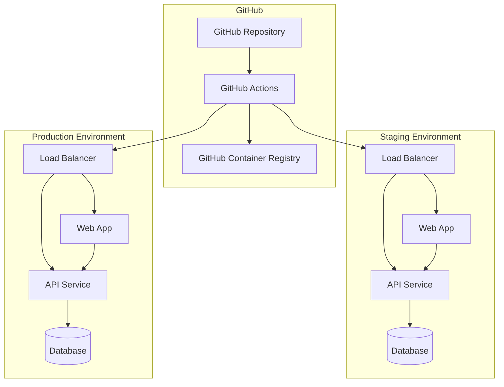

# 🚀 Deployment Guide

Este documento describe el proceso completo de deployment para **SAPTIVA Copilot OS** usando CI/CD automatizado y deployments manuales.

## Arquitectura de Deployment



## 📋 Prerequisites

### Servidor de Destino
- **OS**: Ubuntu 20.04+ o CentOS 8+
- **RAM**: Mínimo 4GB, recomendado 8GB
- **Storage**: Mínimo 50GB SSD
- **Docker**: v20.10+
- **Docker Compose**: v2.0+

### Accesos Requeridos
- SSH access al servidor
- Usuario con permisos sudo o docker group
- Puerto 80, 443, 3000, 8001 abiertos
- Dominio configurado (opcional para producción)

## 🔧 Configuración Inicial

### 1. Configurar Secrets en GitHub

Ve a tu repositorio → Settings → Secrets and variables → Actions

#### Staging Secrets:
```bash
STAGING_HOST=your-staging-server-ip
STAGING_USER=deploy
STAGING_SSH_KEY=your-private-ssh-key
STAGING_DEPLOY_PATH=/opt/copilotos-bridge
STAGING_URL=https://staging.yourdomain.com
STAGING_API_URL=https://api-staging.yourdomain.com
```

#### Production Secrets:
```bash
PRODUCTION_HOST=your-production-server-ip
PRODUCTION_USER=deploy
PRODUCTION_SSH_KEY=your-private-ssh-key
PRODUCTION_DEPLOY_PATH=/opt/copilotos-bridge
PRODUCTION_URL=https://yourdomain.com
PRODUCTION_API_URL=https://api.yourdomain.com
```

#### General Secrets:
```bash
GITHUB_TOKEN=ghp_your_token_with_packages_permission
```

### 2. Configurar Servidor

```bash
# Crear usuario de deployment
sudo useradd -m -s /bin/bash deploy
sudo usermod -aG docker deploy
sudo usermod -aG sudo deploy

# Crear directorios
sudo mkdir -p /opt/copilotos-bridge
sudo mkdir -p /opt/backups
sudo chown -R deploy:deploy /opt/copilotos-bridge
sudo chown -R deploy:deploy /opt/backups

# Configurar SSH key
sudo -u deploy mkdir -p /home/deploy/.ssh
# Copiar tu public key a /home/deploy/.ssh/authorized_keys
```

### 3. Configurar Variables de Entorno

#### Para Staging:
```bash
cp .env.staging.example .env.staging
# Editar valores según tu configuración
```

#### Para Producción:
```bash
cp .env.production.example .env.production
# Editar valores con credenciales seguras
```

## 🤖 CI/CD Automatizado

El pipeline se ejecuta automáticamente en:

### Triggers
- **Push a `develop`**: Deploy a staging
- **Push a `main`**: Deploy a producción
- **Pull Request**: Solo tests y build

### Stages del Pipeline

1. **🧪 Tests & Quality**
   - Lint frontend y backend
   - Tests unitarios
   - Coverage reports
   - Build verification

2. **🔒 Security Scan**
   - Vulnerability scanning con Trivy
   - SARIF upload para GitHub Security

3. **🏗️ Build & Push**
   - Build imágenes Docker multi-arch
   - Push a GitHub Container Registry
   - Caching para builds rápidos

4. **🚀 Deploy**
   - Staging: Deploy automático desde `develop`
   - Production: Deploy automático desde `main`
   - Health checks automáticos

5. **💨 Smoke Tests**
   - Tests E2E post-deployment
   - Verificación de endpoints críticos

## 📋 Deployment Manual

### Staging Deployment

```bash
# Opción 1: Usar script
./scripts/deploy-staging.sh deploy

# Opción 2: Docker Compose directo
docker-compose -f docker-compose.staging.yml up -d
```

### Production Deployment

```bash
# Deployment estándar
./scripts/deploy-production.sh deploy

# Zero-downtime deployment
./scripts/deploy-production.sh deploy-zero-downtime

# Solo backup
./scripts/deploy-production.sh backup

# Health check
./scripts/deploy-production.sh health
```

## 🔄 Rollback

### Automático
```bash
# Staging
./scripts/deploy-staging.sh rollback

# Production
./scripts/deploy-production.sh rollback
```

### Manual
```bash
# Ver backups disponibles
ls -la /opt/backups/copilotos-production/

# Restaurar específico
docker-compose -f docker-compose.prod.yml down
# ... restaurar datos desde backup ...
docker-compose -f docker-compose.prod.yml up -d
```

## 📊 Monitoring

### Health Checks
```bash
# API Health
curl -f http://localhost:8001/api/health

# Web Health
curl -f http://localhost:3000

# Database Health
docker exec copilotos-mongodb-prod mongosh --eval "db.runCommand('ping')"

# Redis Health
docker exec copilotos-redis-prod redis-cli ping
```

### Logs
```bash
# Ver logs de todos los servicios
docker-compose -f docker-compose.prod.yml logs -f

# Logs específicos
docker-compose -f docker-compose.prod.yml logs -f api
docker-compose -f docker-compose.prod.yml logs -f web
```

### Monitoring Continuo
```bash
# Monitor automático
./scripts/deploy-production.sh monitor
```

## 🔧 Troubleshooting

### Problemas Comunes

#### 1. Error de conexión a base de datos
```bash
# Verificar estado
docker-compose -f docker-compose.prod.yml ps

# Reiniciar servicios
docker-compose -f docker-compose.prod.yml restart mongodb

# Verificar logs
docker-compose -f docker-compose.prod.yml logs mongodb
```

#### 2. Error de build de imágenes
```bash
# Limpiar cache Docker
docker system prune -a

# Rebuild manual
docker-compose -f docker-compose.prod.yml build --no-cache
```

#### 3. Error de permisos
```bash
# Verificar ownership
sudo chown -R deploy:deploy /opt/copilotos-bridge

# Verificar permisos Docker
sudo usermod -aG docker deploy
```

#### 4. Error de SSL/TLS
```bash
# Verificar certificados
openssl s_client -connect yourdomain.com:443

# Renovar Let's Encrypt
sudo certbot renew
```

## 🛡️ Security Checklist

### Pre-Production
- [ ] Cambiar todas las contraseñas por defecto
- [ ] Configurar JWT secrets únicos y seguros
- [ ] Configurar CORS origins correctos
- [ ] Activar HTTPS con certificados válidos
- [ ] Configurar firewall (UFW o iptables)
- [ ] Revisar logs de seguridad

### Post-Deployment
- [ ] Verificar health checks
- [ ] Verificar autenticación JWT
- [ ] Test de carga básico
- [ ] Revisar métricas de performance
- [ ] Backup automático funcionando

## 📈 Optimización de Performance

### Base de Datos
```bash
# Optimizar MongoDB
db.runCommand({planCacheClear: "your_collection"})

# Indexes para queries frecuentes
db.chat_sessions.createIndex({user_id: 1, created_at: -1})
db.messages.createIndex({chat_id: 1, timestamp: -1})
```

### Docker
```bash
# Limitar recursos
docker update --memory=1g --cpus=1.0 copilotos-api-prod
docker update --memory=512m --cpus=0.5 copilotos-web-prod
```

### Nginx (Opcional)
```nginx
# /etc/nginx/sites-available/copilotos
server {
    listen 80;
    server_name yourdomain.com;

    location / {
        proxy_pass http://localhost:3000;
        proxy_set_header Host $host;
        proxy_set_header X-Real-IP $remote_addr;
    }

    location /api/ {
        proxy_pass http://localhost:8001;
        proxy_set_header Host $host;
        proxy_set_header X-Real-IP $remote_addr;
    }
}
```

## 📞 Support

### Logs de Deployment
Los logs detallados están disponibles en:
- GitHub Actions: Tab "Actions" en tu repositorio
- Servidor: `/opt/copilotos-bridge/logs/`
- Docker: `docker-compose logs`

### Contacto
Para problemas de deployment, crear issue en el repositorio con:
- Logs completos del error
- Variables de entorno (sin secrets)
- Versión del sistema operativo
- Output de `docker info`
