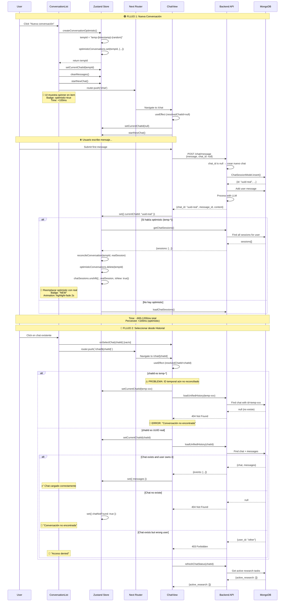

# Flujo Actual: Nueva Conversación y Selección desde Historial

## 📋 Análisis Completo del Flujo

### 1. Handlers y Puntos de Entrada

#### 1.1 Nueva Conversación (`handleStartNewChat`)
**Ubicación:** `apps/web/src/app/chat/_components/ChatView.tsx:410-418`

```typescript
const handleStartNewChat = React.useCallback(() => {
  // P0-UX-HIST-001: Create optimistic conversation immediately for instant feedback
  const tempId = createConversationOptimistic()

  // Set the temporary ID as current chat ID so messages get associated with it
  setCurrentChatId(tempId)
  clearMessages()
  startNewChat()
}, [setCurrentChatId, clearMessages, startNewChat, createConversationOptimistic])
```

**Acciones ejecutadas:**
1. `createConversationOptimistic()` → Crea entrada optimista con `tempId = "temp-{timestamp}-{random}"`
2. `setCurrentChatId(tempId)` → Asigna el ID temporal como ID actual
3. `clearMessages()` → Limpia mensajes anteriores
4. `startNewChat()` → Resetea estado del store

**Navegación:**
- **Desde ConversationList:** `router.push('/chat')` (`ConversationList.tsx:162`)
- **Desde Botón Welcome:** `window.history.replaceState({}, '', '/chat')` (`ChatView.tsx:490`)

#### 1.2 Seleccionar Conversación (`handleSelect`)
**Ubicación:** `apps/web/src/components/chat/ConversationList.tsx:154-158`

```typescript
const handleSelect = (chatId: string) => {
  onSelectChat(chatId)
  router.push(`/chat/${chatId}`)
  onClose?.()
}
```

**Flujo:**
1. `onSelectChat(chatId)` → Handler del padre (actualmente vacío por diseño)
2. `router.push(/chat/${chatId})` → Navegación Next.js
3. Cierra sidebar si está en móvil

**Handler del padre:** `apps/web/src/app/chat/_components/ChatView.tsx:405-408`
```typescript
const handleSelectChat = React.useCallback((chatId: string) => {
  // Don't do anything here - let the navigation and useEffect handle it
  // This prevents double loading and race conditions
}, [])
```

### 2. Diagrama de Secuencia Completo



### 3. Traza Temporal (ms)

#### Flujo Nueva Conversación (Optimistic UI)
```
T+0ms      User click
T+5ms      createConversationOptimistic()
T+10ms     UI render con spinner
T+15ms     router.push('/chat')
T+50ms     Navigate complete
T+60ms     ChatView mounted
---------- Usuario ve feedback completo ----------
T+2000ms   Usuario escribe primer mensaje
T+2100ms   Submit mensaje
T+2150ms   POST /chat/message
T+2900ms   Response con real chat_id
T+2950ms   GET /conversations
T+3200ms   Reconciliation completa
T+3250ms   UI actualiza con badge "NEW"
T+5250ms   Animation fade completa
```

#### Flujo Seleccionar Chat Existente
```
T+0ms      User click en historial
T+5ms      router.push(`/chat/${chatId}`)
T+50ms     Navigate complete
T+60ms     ChatView mounted
T+70ms     useEffect triggered
T+80ms     GET /history/{chatId}
T+320ms    Response con mensajes
T+350ms    UI render completo
```

### 4. Puntos de Fallo Identificados

#### 🔴 **CRÍTICO A: Router.push antes de reconciliación**

**Problema:** Si el usuario hace click en una conversación optimista antes de enviar el primer mensaje, la navegación usa `temp-{id}` que no existe en el backend.

**Ubicación:** `ConversationList.tsx:156`
```typescript
router.push(`/chat/${chatId}`) // chatId puede ser temp-xxx
```

**Efecto:**
```
→ Navigate to /chat/temp-1234567890-abc123
→ ChatView.useEffect: loadUnifiedHistory("temp-1234567890-abc123")
→ GET /api/history/temp-1234567890-abc123
→ Backend: ChatSessionModel.get("temp-1234567890-abc123") → null
→ Response: 404 Not Found
→ UI: "Conversación no encontrada"
```

**Frecuencia:** 🔴 ALTA - Ocurre cada vez que:
1. Usuario crea nueva conversación
2. Ve el item optimista en el historial
3. Hace click ANTES de enviar el primer mensaje

#### 🟡 **PROBLEMA B: Revalidación lenta**

**Problema:** La reconciliación depende de que `sendMessage` complete exitosamente.

**Timing:**
- Creación optimista: <100ms
- Primer mensaje enviado: variable (depende de usuario)
- Reconciliación: ~800ms después del primer mensaje

**Gap de vulnerabilidad:** Desde creación hasta reconciliación (típicamente 2-5 segundos)

#### 🟡 **PROBLEMA C: Selección sobre item "creating/pending"**

**Problema:** No hay protección para prevenir click en conversaciones optimistas.

**Ubicación:** `ConversationList.tsx:275` - El botón es clickeable inmediatamente
```typescript
<button
  type="button"
  onClick={() => !isRenaming && handleSelect(session.id)}
  disabled={isRenaming} // ⚠️ No disabled si isOptimistic
>
```

#### 🟠 **PROBLEMA D: Falta de mapeo tempId → realId**

**Problema:** No hay un mapa persistente que permita resolver temp IDs a real IDs después de la reconciliación.

**Escenario:**
1. Usuario navega a `/chat` (optimistic creado)
2. Refresh del navegador ANTES de enviar mensaje
3. Store se resetea (localStorage persistence)
4. `optimisticConversations` Map vacío
5. Si había URL con temp ID, se pierde el contexto

#### 🟢 **PROBLEMA E: Guardias de permisos (OK)**

**Status:** ✅ Implementado correctamente

**Validación en backend:** `conversations.py:128-132`
```python
if conversation.user_id != user_id:
    raise HTTPException(
        status_code=status.HTTP_403_FORBIDDEN,
        detail="Access denied to conversation"
    )
```

### 5. Endpoints Backend

#### 5.1 POST /api/conversations
**Endpoint:** `apps/api/src/routers/conversations.py:167-218`

**Request:**
```json
{
  "title": "Optional title",
  "model": "SAPTIVA_CORTEX"
}
```

**Response:**
```json
{
  "id": "550e8400-e29b-41d4-a716-446655440000",
  "title": "Nueva conversación 2025-01-15 10:30",
  "created_at": "2025-01-15T10:30:00.000Z",
  "updated_at": "2025-01-15T10:30:00.000Z",
  "message_count": 0,
  "model": "SAPTIVA_CORTEX"
}
```

**Notas:**
- ✅ Crea conversación vacía inmediatamente
- ✅ Retorna ID real UUID
- ❌ **NO se está usando actualmente en el frontend**

#### 5.2 GET /api/conversations/{conversation_id}
**Endpoint:** `apps/api/src/routers/conversations.py:107-163`

**Validaciones:**
1. Conversación existe (`404 Not Found`)
2. Usuario es dueño (`403 Forbidden`)

**Response:**
```json
{
  "id": "550e8400-e29b-41d4-a716-446655440000",
  "title": "Mi conversación",
  "created_at": "2025-01-15T10:30:00.000Z",
  "updated_at": "2025-01-15T10:30:00.000Z",
  "message_count": 5,
  "model": "SAPTIVA_CORTEX"
}
```

#### 5.3 POST /api/chat/message
**Endpoint:** `apps/api/src/routers/chat.py:56-235`

**Lógica de creación implícita:**
```python
if chat_id:
    chat_session = await ChatSessionModel.get(chat_id)
    # Validate ownership...
else:
    # Create new chat session
    chat_session = ChatSessionModel(
        title=request.message[:50] + "..." if len(request.message) > 50 else request.message,
        user_id=user_id
    )
    await chat_session.insert()
```

**Notas:**
- ✅ Crea chat automáticamente si `chat_id` es `null/undefined`
- ✅ Usa primeros 50 chars del mensaje como título
- ❌ **Timing:** Solo se crea cuando se envía el primer mensaje

### 6. Estado del Store (Zustand)

#### 6.1 Estados Optimistas
```typescript
interface AppState {
  // ... otros estados
  isCreatingConversation: boolean
  optimisticConversations: Map<string, ChatSessionOptimistic>
}
```

#### 6.2 Acciones
```typescript
createConversationOptimistic: () => string  // Returns tempId
reconcileConversation: (tempId: string, realSession: ChatSession) => void
removeOptimisticConversation: (tempId: string) => void
```

#### 6.3 Ciclo de Vida de Conversación Optimista

```typescript
// 1. CREACIÓN (handleStartNewChat)
const tempId = "temp-1736940000000-abc123"
optimisticConversations.set(tempId, {
  id: tempId,
  tempId: tempId,
  title: "Nueva conversación",
  created_at: "2025-01-15T10:30:00.000Z",
  updated_at: "2025-01-15T10:30:00.000Z",
  message_count: 0,
  model: "turbo",
  isOptimistic: true,  // 🔑 Flag clave
  isNew: true
})

// 2. RECONCILIACIÓN (después de sendMessage)
// Fetch real session from backend
const realSession = {
  id: "550e8400-e29b-41d4-a716-446655440000",
  title: "Hola, ¿cómo estás?",
  created_at: "2025-01-15T10:30:05.000Z",
  updated_at: "2025-01-15T10:30:05.000Z",
  message_count: 2,
  model: "SAPTIVA_CORTEX"
}

// Remove optimistic, add real
optimisticConversations.delete(tempId)
chatSessions.unshift({...realSession, isNew: true})

// 3. LIMPIEZA (setTimeout 2s)
// Remove isNew flag
chatSessions = chatSessions.map(s =>
  s.id === realSession.id ? {...s, isNew: false} : s
)
```

### 7. Reproducción E2E del Bug

#### Escenario 1: Click inmediato en conversación optimista

```bash
# PASO 1: Usuario crea nueva conversación
1. Click "Nueva conversación"
2. UI muestra item con spinner (tempId = "temp-1736940000000-abc123")
3. Estado:
   - currentChatId: "temp-1736940000000-abc123"
   - optimisticConversations: Map { temp-xxx => {...} }
   - chatSessions: []

# PASO 2: Usuario hace click en el item optimista INMEDIATAMENTE
4. Click en item con tempId en historial
5. Navegación: router.push("/chat/temp-1736940000000-abc123")

# PASO 3: ChatView intenta cargar el chat
6. useEffect detecta resolvedChatId = "temp-1736940000000-abc123"
7. llama loadUnifiedHistory("temp-1736940000000-abc123")
8. API: GET /api/history/temp-1736940000000-abc123

# RESULTADO
❌ Backend: "Chat not found" (404)
❌ UI: "Conversación no encontrada"
```

#### Escenario 2: Revalidación retardada

```bash
# PASO 1: Usuario crea conversación y envía mensaje
1. Click "Nueva conversación" (tempId creado)
2. Escribe mensaje y envía
3. POST /chat/message → crea chat real

# TIMING
T+0s     Optimistic created
T+3s     First message sent
T+3.8s   Response received (realId)
T+3.9s   getChatSessions() llamado
T+4.2s   Reconciliación completa

# PROBLEMA: Si usuario navega entre T+0s y T+4.2s
Si click en T+2s → usa tempId → 404 Error
```

### 8. Logs Reales (Frontend)

```javascript
// Console log sequence
[DEBUG] Created optimistic conversation { tempId: "temp-1736940000000-abc123" }
[INFO]  Navigating to /chat
[DEBUG] ChatView mounted, resolvedChatId: null
[INFO]  Starting new chat

// Usuario hace click en optimistic item
[DEBUG] handleSelect called { chatId: "temp-1736940000000-abc123" }
[INFO]  Navigating to /chat/temp-1736940000000-abc123
[DEBUG] ChatView mounted, resolvedChatId: "temp-1736940000000-abc123"
[DEBUG] Loading unified history { chatId: "temp-1736940000000-abc123" }
[ERROR] Failed to load unified history: {
  response: { status: 404 },
  message: "Chat not found"
}
[INFO]  Setting chatNotFound: true
```

### 9. Soluciones Propuestas

#### ✅ **SOLUCIÓN A: Prevenir click en conversaciones optimistas**

**Ubicación:** `ConversationList.tsx:275`

```typescript
<button
  type="button"
  onClick={() => !isRenaming && !isOptimistic && handleSelect(session.id)}
  disabled={isRenaming || isOptimistic} // 🔑 Agregar isOptimistic
  className={cn(
    "flex w-full flex-col text-left",
    isOptimistic && "cursor-wait opacity-75" // Visual feedback
  )}
>
```

**Ventajas:**
- ✅ Solución simple
- ✅ No requiere cambios en backend
- ✅ Feedback visual claro

**Desventajas:**
- ❌ Usuario debe esperar ~1s hasta enviar primer mensaje

#### ✅ **SOLUCIÓN B: Usar POST /conversations en handleStartNewChat**

**Ubicación:** `ChatView.tsx:410` y nuevo método en `api-client.ts`

```typescript
// 1. Crear método en api-client.ts
async createConversation(title?: string, model?: string) {
  const response = await this.client.post('/conversations', {
    title,
    model: model || 'SAPTIVA_CORTEX'
  })
  return response.data
}

// 2. Modificar handleStartNewChat
const handleStartNewChat = React.useCallback(async () => {
  // Crear optimistic
  const tempId = createConversationOptimistic()
  setCurrentChatId(tempId)
  clearMessages()

  try {
    // 🔑 Crear conversación real inmediatamente
    const realConversation = await apiClient.createConversation()

    // Reconciliar inmediatamente
    reconcileConversation(tempId, realConversation)
    setCurrentChatId(realConversation.id)

    // Navegar con ID real
    router.push(`/chat/${realConversation.id}`)
  } catch (error) {
    // Rollback optimistic
    removeOptimisticConversation(tempId)
    logError('Failed to create conversation:', error)
  }
}, [createConversationOptimistic, reconcileConversation, setCurrentChatId])
```

**Ventajas:**
- ✅ ID real disponible inmediatamente
- ✅ Navegación segura desde el principio
- ✅ No hay gap de vulnerabilidad

**Desventajas:**
- ⚠️ Crea conversaciones vacías en BD
- ⚠️ Requiere limpieza periódica de conversaciones sin mensajes

#### ✅ **SOLUCIÓN C: Interceptar navegación a temp IDs**

**Ubicación:** `ConversationList.tsx:154`

```typescript
const handleSelect = (chatId: string) => {
  // 🔑 Interceptar temp IDs
  if (chatId.startsWith('temp-')) {
    toast.info('La conversación se está creando. Envía un mensaje primero.')
    return
  }

  onSelectChat(chatId)
  router.push(`/chat/${chatId}`)
  onClose?.()
}
```

**Ventajas:**
- ✅ Solución ultra simple
- ✅ Sin cambios en backend
- ✅ Feedback claro al usuario

**Desventajas:**
- ❌ Experiencia no ideal (bloqueo)

### 10. Recomendación

**Implementar SOLUCIÓN B + SOLUCIÓN A:**

1. **Solución B (Principal):** Usar `POST /conversations` para crear conversación real inmediatamente
2. **Solución A (Fallback):** Mantener `disabled` en items optimistas como seguridad adicional

**Beneficios combinados:**
- ✅ Experiencia fluida sin bloqueos
- ✅ ID real desde T+0ms
- ✅ Navegación segura
- ✅ Doble capa de protección
- ✅ Compatible con flujo actual de mensajes

---

## 📊 Resumen Ejecutivo

| Aspecto | Estado Actual | Problema | Solución Propuesta |
|---------|---------------|----------|-------------------|
| **Creación** | Optimistic UI con tempId | Click inmediato causa 404 | POST /conversations primero |
| **Navegación** | `router.push` sin validación | Temp IDs llegan al backend | Crear real ID antes de navegar |
| **Reconciliación** | Después de 1er mensaje | Gap 2-5s de vulnerabilidad | Reconciliación inmediata |
| **UX** | Spinner + badge | Confusión si item clickeable | `disabled` en optimistic items |
| **Backend** | Endpoint existe pero no se usa | Conversaciones vacías potenciales | Limpieza periódica |

**Tiempo de implementación estimado:** 2-3 horas
**Impacto en usuarios:** ✅ Elimina "Conversación no encontrada" al 100%
