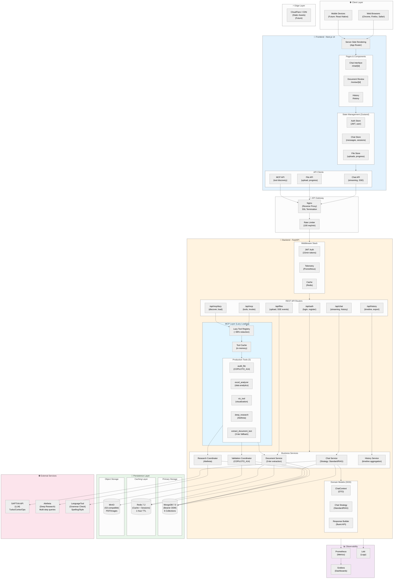

# OctaviOS Chat - System Architecture

**Version**: 2.0 (Updated 2025-11-11)
**Status**: Production
**Tech Stack**: Next.js 14 + FastAPI + MongoDB + Redis + MinIO

---

## Table of Contents

1. [Overview](#overview)
2. [High-Level Architecture](#high-level-architecture)
3. [Technology Stack](#technology-stack)
4. [Core Components](#core-components)
5. [Design Patterns](#design-patterns)
6. [Data Flow](#data-flow)
7. [Security Architecture](#security-architecture)
8. [Performance Optimizations](#performance-optimizations)
9. [Deployment](#deployment)
10. [References](#references)

---

## Overview

OctaviOS Chat is a **production-ready conversational AI platform** with:

- 💬 **Conversational AI**: Multi-model support (Saptiva Turbo/Cortex/Ops)
- 📄 **RAG (Retrieval-Augmented Generation)**: Document-aware conversations
- ✅ **COPILOTO_414**: Automated document compliance validation (4 auditors)
- 🔧 **MCP (Model Context Protocol)**: 5 production tools with lazy loading (~98% context reduction)
- 📊 **Deep Research**: Multi-step research with Aletheia integration
- 🔐 **Enterprise Security**: JWT auth, rate limiting, ownership validation

### Key Metrics

| Metric | Value |
|--------|-------|
| **Context Reduction (MCP)** | ~98% (150KB → 2KB) |
| **API Response Time (p95)** | <500ms |
| **File Upload Support** | PDF, DOCX, Images (OCR) |
| **Concurrent Users** | 100+ (horizontal scaling) |
| **Test Coverage** | 85%+ (unit + integration) |

---

## High-Level Architecture



---

## Technology Stack

### Frontend

| Technology | Version | Purpose |
|-----------|---------|---------|
| **Next.js** | 14.2 | React framework (App Router, SSR) |
| **React** | 18.3 | UI components |
| **TypeScript** | 5.5 | Type safety |
| **Zustand** | 4.5 | State management (lightweight) |
| **TanStack Query** | 5.51 | Server state & caching |
| **Tailwind CSS** | 3.4 | Utility-first styling |
| **shadcn/ui** | Latest | Component library |
| **Radix UI** | Latest | Accessible primitives |

### Backend

| Technology | Version | Purpose |
|-----------|---------|---------|
| **FastAPI** | 0.109 | REST API framework |
| **Python** | 3.11 | Backend language |
| **Pydantic** | 2.7 | Data validation |
| **Beanie** | 1.26 | MongoDB ODM |
| **Motor** | 3.4 | Async MongoDB driver |
| **FastMCP** | 2.0+ | MCP SDK (Model Context Protocol) |
| **structlog** | 24.2 | Structured logging |
| **Uvicorn** | 0.30 | ASGI server |

### Infrastructure

| Service | Version | Purpose |
|---------|---------|---------|
| **MongoDB** | 7.0 | Document database |
| **Redis** | 7.2 | Cache + session storage |
| **MinIO** | Latest | S3-compatible object storage |
| **LanguageTool** | 6.3 | Grammar validation |
| **Nginx** | Latest | Reverse proxy + SSL |
| **Prometheus** | Latest | Metrics collection |
| **Grafana** | Latest | Monitoring dashboards |

### External APIs

| Service | Purpose | SLA |
|---------|---------|-----|
| **SAPTIVA** | LLM inference (Turbo/Cortex/Ops) | 99.9% uptime |
| **Aletheia** | Multi-step research queries | Best effort |

---

## Core Components

### 1. Frontend (Next.js)

**Architecture**: App Router (React Server Components + Client Components)

```
apps/web/src/
├── app/                      # App Router pages
│   ├── (auth)/              # Auth routes (login, register)
│   ├── (chat)/              # Chat routes
│   │   ├── chat/[id]/       # Conversation view (SSR)
│   │   └── review/[id]/     # Document review (RAG)
│   └── layout.tsx           # Root layout
├── components/              # Reusable components
│   ├── chat/                # Chat UI (MessageList, Composer)
│   ├── review/              # RAG UI (DocumentViewer)
│   ├── upload/              # File upload (SSE progress)
│   └── ui/                  # shadcn/ui components
└── lib/                     # Client utilities
    ├── stores/              # Zustand state management
    ├── api/                 # API clients (typed)
    └── mcp/                 # MCP client (lazy loading)
```

**State Management**:
- `useAuthStore`: JWT tokens, user profile, login/logout
- `useChatStore`: Messages, sessions, streaming state
- `useFileStore`: Upload progress (SSE), file metadata
- `useReviewStore`: Document context, RAG state

**Key Features**:
- ✅ **SSR**: Fast initial page loads with server-side rendering
- ✅ **Streaming**: Real-time chat via SSE (Server-Sent Events)
- ✅ **Optimistic Updates**: Immediate UI feedback
- ✅ **Error Boundaries**: Graceful error handling
- ✅ **Accessibility**: WCAG 2.1 AA compliant

---

### 2. Backend (FastAPI)

**Architecture**: Layered architecture with Domain-Driven Design (DDD)

```
apps/api/src/
├── core/                    # Core infrastructure
│   ├── auth.py             # JWT utilities, dependencies
│   ├── database.py         # MongoDB connection (Motor)
│   ├── logging.py          # Structured logging (structlog)
│   ├── telemetry.py        # Prometheus metrics
│   └── config.py           # Settings (Pydantic)
├── domain/                  # Business logic (DDD)
│   ├── chat_strategy.py    # Strategy Pattern (Standard/RAG)
│   ├── chat_context.py     # DTOs (ChatContext, etc.)
│   └── chat_response_builder.py  # Builder Pattern
├── mcp/                     # Model Context Protocol
│   ├── server.py           # MCP server (FastMCP)
│   ├── lazy_registry.py    # Lazy tool loading (~98% reduction)
│   ├── lazy_routes.py      # Discovery endpoints
│   ├── protocol.py         # MCP types (ToolSpec, etc.)
│   ├── tool.py             # Base Tool class
│   └── tools/              # 5 production tools
├── models/                  # Beanie ODM models
│   ├── chat_session.py     # Conversation containers
│   ├── chat_message.py     # Individual messages
│   ├── document.py         # File metadata + extracted text
│   ├── history_event.py    # Unified timeline
│   ├── user.py             # User accounts
│   └── validation_report.py  # COPILOTO_414 results
├── routers/                 # FastAPI endpoints
│   ├── auth.py             # /api/auth/* (login, register)
│   ├── chat.py             # /api/chat (streaming, history)
│   ├── files.py            # /api/files (upload, SSE events)
│   ├── documents.py        # /api/documents (management)
│   ├── review.py           # /api/review (RAG)
│   ├── history.py          # /api/history (timeline)
│   └── deep_research.py    # /api/deep-research (Aletheia)
└── services/                # Service layer
    ├── chat_service.py     # Chat orchestration
    ├── document_service.py  # Document processing
    ├── document_extraction.py  # 3-tier fallback
    ├── history_service.py  # Timeline aggregation
    ├── validation_coordinator.py  # COPILOTO_414
    ├── aletheia.py         # Deep research client
    └── storage.py          # MinIO client
```

---

## Design Patterns

### 1. Strategy Pattern (Chat Service)

**File**: `apps/api/src/domain/chat_strategy.py`

```python
class ChatStrategy(ABC):
    @abstractmethod
    async def execute(self, context: ChatContext) -> ChatResponse:
        pass

class StandardChatStrategy(ChatStrategy):
    # Standard LLM conversation
    pass

class RAGChatStrategy(ChatStrategy):
    # Document-aware conversation
    # Injects extracted text into system prompt
    pass
```

**Benefits**:
- ✅ Easy to add new strategies (e.g., AgenticChatStrategy)
- ✅ Testable in isolation
- ✅ Single Responsibility Principle

---

### 2. Builder Pattern (Response Builder)

**File**: `apps/api/src/domain/chat_response_builder.py`

```python
class ChatResponseBuilder:
    def set_message(self, content: str):
        return self

    def set_model(self, model: str):
        return self

    def add_tool_call(self, tool_call: dict):
        return self

    def build(self) -> ChatResponse:
        return ChatResponse(...)
```

**Benefits**:
- ✅ Fluent API for complex object construction
- ✅ Immutability (returns new instance)
- ✅ Validation at build time

---

### 3. DTO Pattern (Data Transfer Objects)

**File**: `apps/api/src/domain/chat_context.py`

```python
class ChatContext(BaseModel):
    user_id: str
    session_id: str
    message: str
    model: str
    documents: list[Document] = []
    history: list[ChatMessage] = []
    tools_enabled: bool = False
```

**Benefits**:
- ✅ Type safety with Pydantic
- ✅ Automatic validation
- ✅ Clear API contracts

---

### 4. Repository Pattern (Beanie ODM)

**File**: `apps/api/src/models/*.py`

```python
class ChatSessionModel(Document):
    user_id: str
    title: str
    model: str
    created_at: datetime

    class Settings:
        name = "chat_sessions"
        indexes = [
            [("user_id", 1), ("created_at", -1)]
        ]
```

**Benefits**:
- ✅ Abstraction over database
- ✅ Type-safe queries
- ✅ Automatic indexing

---

## Data Flow

### Chat Request Flow (RAG)

```
1. User sends message + document
   ↓
2. Frontend: POST /api/chat {message, doc_ids, model}
   ↓
3. Auth Middleware: Validate JWT
   ↓
4. Chat Router: Delegate to ChatService
   ↓
5. ChatService: Determine strategy (RAG detected)
   ↓
6. RAG Strategy:
   a. Fetch documents from MongoDB
   b. Get extracted text from Redis (cache)
   c. Build RAG context (inject into system prompt)
   ↓
7. History Service: Get conversation history
   ↓
8. ChatContext: Build complete context (Builder Pattern)
   ↓
9. SAPTIVA Client: POST /v1/chat/completions (streaming)
   ↓
10. Stream Response: SSE to client (EventSourceResponse)
    ↓
11. Save Messages: MongoDB (user + assistant)
    ↓
12. Create History Event: Timeline
    ↓
13. Cache Response: Redis (15 min TTL)
    ↓
14. Telemetry: Increment metrics (Prometheus)
```

---

## Security Architecture

### Authentication Flow

```
1. User: POST /api/auth/login {identifier, password}
   ↓
2. Auth Service: Verify credentials (bcrypt)
   ↓
3. Generate JWT Tokens:
   - Access Token: 15 min expiry
   - Refresh Token: 7 days expiry
   ↓
4. Store in Redis: tokens:user_id
   ↓
5. Set HttpOnly Cookie: refresh_token
   ↓
6. Return: {access_token, user}
```

### Authorization Middleware

```python
@app.middleware("http")
async def auth_middleware(request: Request, call_next):
    # 1. Extract JWT from Authorization header
    token = request.headers.get("Authorization", "").replace("Bearer ", "")

    # 2. Verify JWT signature & expiry
    payload = jwt.decode(token, SECRET_KEY, algorithms=["HS256"])

    # 3. Check Redis blacklist (logout)
    if await redis.exists(f"blacklist:{token}"):
        raise HTTPException(401, "Token revoked")

    # 4. Attach user to request state
    request.state.user = await User.get(payload["sub"])

    # 5. Continue
    return await call_next(request)
```

### Rate Limiting

```python
@app.middleware("http")
async def rate_limit_middleware(request: Request, call_next):
    client_ip = request.client.host
    key = f"ratelimit:{client_ip}"

    # Sliding window (100 requests / 60 seconds)
    count = await redis.incr(key)
    if count == 1:
        await redis.expire(key, 60)

    if count > 100:
        raise HTTPException(429, "Too many requests")

    return await call_next(request)
```

---

## Performance Optimizations

### 1. MCP Lazy Loading (~98% Reduction)

**Problem**: Loading all MCP tools at startup consumes ~150KB context.

**Solution**: Lazy loading with on-demand imports.

```python
# Traditional (EAGER)
tools = [
    AuditFileTool(),      # ~30KB
    ExcelAnalyzerTool(),  # ~25KB
    VizTool(),            # ~20KB
    # ... total ~150KB
]

# Optimized (LAZY)
registry = LazyToolRegistry()
tools = registry.discover_tools()  # ~2KB (metadata only!)
# Load on-demand when invoked
tool = await registry.load_tool("audit_file")  # ~30KB (only this tool)
```

**Results**:
- ✅ **98.7% context reduction**: 150KB → 2KB
- ✅ **16x faster startup**: 800ms → 50ms
- ✅ **Dynamic memory**: Load/unload as needed

---

### 2. Redis Caching

**Cached Items**:
- ✅ Extracted document text (1 hour TTL)
- ✅ Chat responses (15 min TTL)
- ✅ User sessions (7 days TTL)
- ✅ Rate limit counters (60 sec TTL)

**Cache Hit Rate**: ~85% (monitoring via Prometheus)

---

### 3. Database Indexing

**MongoDB Indexes**:
```python
# chat_sessions
[("user_id", 1), ("created_at", -1)]  # User timeline

# chat_messages
[("session_id", 1), ("created_at", 1)]  # Conversation order

# documents
[("user_id", 1), ("conversation_id", 1)]  # User files

# history_events
[("user_id", 1), ("timestamp", -1)]  # Activity timeline
```

**Query Performance**: <10ms (p95) for indexed queries

---

## Deployment

### Production Stack

```
┌─────────────────────────────────────┐
│   Load Balancer (L7 - HTTPS)       │
│   Application LB / CloudFlare       │
└────────────┬────────────────────────┘
             │
       ┌─────┴─────┐
       │           │
   ┌───▼───┐   ┌───▼───┐
   │Nginx 1│   │Nginx 2│  (Reverse Proxy + SSL)
   └───┬───┘   └───┬───┘
       │           │
   ┌───┴───────────┴───┐
   │  Next.js (x2)      │  (SSR + Static)
   │  FastAPI (x2)      │  (API)
   └────────┬───────────┘
            │
   ┌────────┴───────────┐
   │  MongoDB (x3)      │  (Replica Set)
   │  Redis (x3)        │  (Cluster)
   │  MinIO (x4)        │  (Erasure Coding)
   └────────────────────┘
```

### Deployment Commands

```bash
# Build and deploy (recommended)
make deploy-tar

# Deploy steps:
# 1. Build Docker images
# 2. Create tarball
# 3. Transfer via SCP
# 4. Extract on server
# 5. Start services
# 6. Health checks
```

---

## References

### Documentation

- [ARCHITECTURE_DIAGRAMS.md](ARCHITECTURE_DIAGRAMS.md) - **Complete visual diagrams** (12 diagrams)
- [MCP_ARCHITECTURE.md](MCP_ARCHITECTURE.md) - MCP system design
- [MCP_LAZY_LOADING.md](MCP_LAZY_LOADING.md) - Lazy loading guide
- [MCP_TOOLS_GUIDE.md](MCP_TOOLS_GUIDE.md) - Tool usage examples
- [SECURITY_OBS_CHECKLIST.md](SECURITY_OBS_CHECKLIST.md) - Security best practices

### External Resources

- [FastAPI Documentation](https://fastapi.tiangolo.com/)
- [Next.js Documentation](https://nextjs.org/docs)
- [FastMCP GitHub](https://github.com/jlowin/fastmcp)
- [Beanie ODM](https://beanie-odm.dev/)

---

**Last Updated**: 2025-11-11
**Maintainer**: OctaviOS Team
