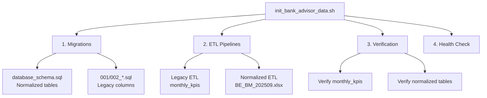

# Bank Advisor ETL Consolidation

## Resumen

Este documento describe la consolidación de los sistemas ETL del Bank Advisor, eliminando redundancias y creando un punto de entrada unificado.

## Arquitectura Consolidada

### 📊 Dos Sistemas ETL (Coexistentes)

#### 1. **ETL Legado** - Tabla `monthly_kpis`
- **Propósito**: Datos históricos 2017-2025 para visualizaciones Tableau legacy
- **Fuentes**:
  - CNBV_Cartera_Bancos_V2.xlsx
  - CASTIGOS.xlsx, Castigos Comerciales.xlsx
  - ICAP_Bancos.xlsx, TDA.xlsx
  - TE_Invex_Sistema.xlsx
  - CorporateLoan_CNBVDB.csv (1.3M+ registros)
- **Ubicación**: `src/bankadvisor/etl_runner.py` → `etl_loader.py`
- **Output**: 3660 registros en tabla `monthly_kpis`

#### 2. **ETL Normalizado** - Esquema normalizado
- **Propósito**: Datos estructurados para NL2SQL y queries avanzadas
- **Fuentes**: BE_BM_202509.xlsx (Balance Sheet + Income Statement)
- **Ubicación**: `etl/etl_processor.py`
- **Output**:
  - `instituciones` - Catálogo de instituciones
  - `metricas_financieras` - Métricas consolidadas (Pm2 + Indicadores + CCT)
  - `segmentos_cartera` - Catálogo normalizado de segmentos
  - `metricas_cartera_segmentada` - Detalle por producto

### 🎯 Punto de Entrada Unificado

**Script consolidado**: `scripts/init_bank_advisor_data.sh`

```bash
# Inicialización completa (migraciones + ambos ETL)
make init-bank-advisor

# Solo migraciones
make init-bank-advisor-migrations

# Solo ETL
make init-bank-advisor-etl
```

## Flujo de Ejecución



## Archivos Consolidados

### ✅ Activos (Mantener)

| Archivo | Propósito | Ubicación |
|---------|-----------|-----------|
| `init_bank_advisor_data.sh` | **Script maestro consolidado** | `scripts/` |
| `etl_runner.py` | Runner para ETL legado | `src/bankadvisor/` |
| `etl_loader.py` | ETL legado (incluye ICAP, TDA, tasas) | `src/bankadvisor/` |
| `etl_processor.py` | ETL normalizado (BE_BM_202509) | `etl/` |
| `carga_inicial_bancos.sql` | SQL generado por ETL normalizado | `etl/` |
| `database_schema.sql` | Esquema normalizado (IF NOT EXISTS) | root |
| `001/002_*.sql` | Migraciones legacy | `migrations/` |

### ⚠️ Redundantes (Candidatos a eliminar)

| Archivo | Razón | Reemplazado por |
|---------|-------|-----------------|
| `run_etl_enhancement.sh` | Funcionalidad incluida en ETL base | `init_bank_advisor_data.sh` |
| `etl_loader_enhanced.py` | Métricas ya integradas en `etl_loader.py` | `etl_loader.py` (incluye ICAP, TDA, tasas) |
| `fix_etl_with_banco.py` | Script one-time fix | N/A (ya ejecutado) |

### 🔍 Útiles para Desarrollo

| Archivo | Propósito |
|---------|-----------|
| `ops_validate_etl.py` | Validación de integridad de datos |
| `test_bank_query_detection.py` | Tests para detección de queries bancarias |
| `test_bank_query_hybrid.py` | Tests para clasificación híbrida |

## Dependencias Agregadas

Actualizadas en `requirements.txt`:
```txt
polars>=0.20.0      # High-performance dataframe library
pyarrow>=12.0.0     # Apache Arrow for Polars/Pandas interop
```

## Dockerfile Actualizado

```dockerfile
# Ahora incluye directorio etl/
COPY plugins/bank-advisor-private/etl/ ./etl/
```

## Schemas de Base de Datos

### Legacy Schema (monthly_kpis)
- **Estructura**: Wide table con ~30 columnas
- **Datos**: 3660 registros (2017-07 a 2025-07)
- **Uso**: Queries directas, visualizaciones legacy

### Normalized Schema
- **instituciones**: Catálogo de bancos
- **metricas_financieras**: Balance + Rentabilidad + Calidad cartera
- **segmentos_cartera**: Catálogo de segmentos (normalizado)
- **metricas_cartera_segmentada**: IMOR/ICOR por segmento

**Coexistencia**: Ambos schemas conviven usando `IF NOT EXISTS` - no hay conflictos.

## Uso Post-Rebuild

Después de reconstruir contenedores:

```bash
# Opción 1: Makefile (recomendado)
make dev-rebuild
make init-bank-advisor

# Opción 2: Script directo
./scripts/init_bank_advisor_data.sh

# Opción 3: Solo ETL (si ya hay migraciones)
./scripts/init_bank_advisor_data.sh --etl-only
```

## Verificación

El script verifica automáticamente:
- ✅ Columnas críticas existen (`tasa_mn`, `tasa_me`, `icap_total`, etc.)
- ✅ Datos legacy cargados (monthly_kpis)
- ✅ Datos normalizados cargados (instituciones, metricas_financieras)
- ✅ Rango de fechas correcto
- ✅ Health check del servicio

## Siguiente Fase: Limpieza

**Recomendación**: Una vez validado que todo funciona correctamente, eliminar:
1. `run_etl_enhancement.sh`
2. `etl_loader_enhanced.py`
3. `fix_etl_with_banco.py`

Esto reducirá confusión y mantendrá el código base limpio.

## Notas Técnicas

### ¿Por qué dos ETL?
1. **Legacy ETL**: Mantiene compatibilidad con queries existentes que usan `monthly_kpis`
2. **Normalized ETL**: Habilita NL2SQL avanzado con esquema normalizado

### ¿Se pueden consolidar en uno?
Sí, eventualmente. Pero requiere:
1. Migrar todas las queries legacy a usar el esquema normalizado
2. Actualizar visualizaciones existentes
3. Testing extensivo

Por ahora, la coexistencia es la solución más pragmática.

---

**Última actualización**: 2025-12-02
**Autor**: Consolidación de sistemas ETL existentes
