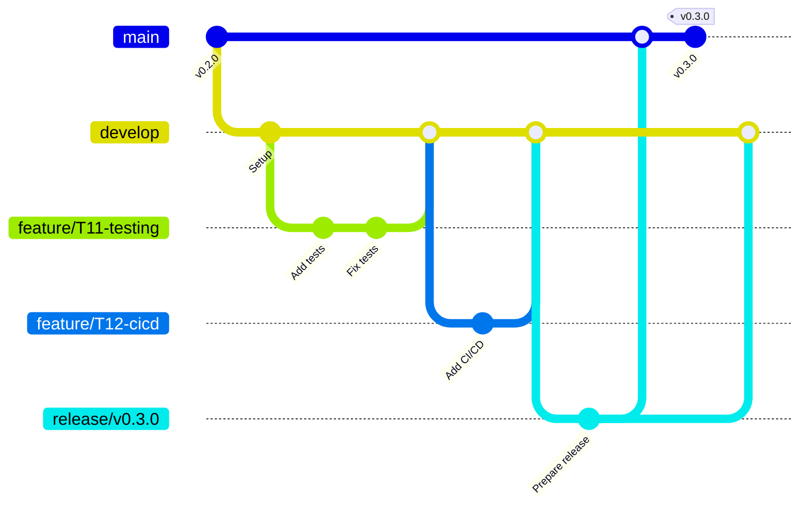

# 🌳 Branching Strategy - Aletheia Project

## 📋 Resumen

Este proyecto utiliza **Git Flow** modificado con las siguientes ramas principales:

- `main` - Código en producción, siempre estable
- `develop` - Rama de desarrollo, integración de features
- `feature/*` - Nuevas funcionalidades
- `hotfix/*` - Correcciones urgentes de producción
- `release/*` - Preparación de releases

## 🚀 Flujo de Trabajo

### 1. 📦 Feature Development

```bash
# Crear nueva feature desde develop
git checkout develop
git pull origin develop
git checkout -b feature/T11-testing-suite

# Trabajar en la feature
git add .
git commit -m "feat(testing): add unit tests for PlannerService"

# Push feature branch
git push origin feature/T11-testing-suite

# Crear Pull Request hacia develop
```

### 2. 🔄 Pull Request Process

**Antes de crear PR:**
- [ ] Tests pasan localmente
- [ ] Código formateado con Black
- [ ] Linting sin errores (Ruff)
- [ ] Documentación actualizada
- [ ] Self-review completo

**PR Requirements:**
- Minimum 1 reviewer approval
- CI/CD pipeline passing
- No merge conflicts
- Linear history (rebase preferred)

### 3. 🏭 Release Process

```bash
# Crear release branch desde develop
git checkout develop
git checkout -b release/v0.3.0

# Preparar release (actualizar versiones, CHANGELOG, etc.)
git commit -m "chore(release): prepare v0.3.0"

# Merge a main
git checkout main
git merge --no-ff release/v0.3.0
git tag -a v0.3.0 -m "Release v0.3.0: DevOps & Production Ready"

# Merge back a develop
git checkout develop
git merge --no-ff release/v0.3.0

# Push todo
git push origin main develop --tags
```

### 4. 🚨 Hotfix Process

```bash
# Crear hotfix desde main
git checkout main
git checkout -b hotfix/critical-api-bug

# Fix el issue
git commit -m "fix(api): resolve critical memory leak in deep-research endpoint"

# Merge a main
git checkout main
git merge --no-ff hotfix/critical-api-bug
git tag -a v0.2.1 -m "Hotfix v0.2.1: Fix critical API bug"

# Merge a develop
git checkout develop
git merge --no-ff hotfix/critical-api-bug

# Push
git push origin main develop --tags
```

## 📝 Naming Conventions

### Branch Names

```bash
# Features (basadas en tasks del plan.yaml)
feature/T11-testing-suite
feature/T12-cicd-pipeline
feature/T13-git-flow
feature/add-logging-middleware
feature/improve-error-handling

# Hotfixes
hotfix/critical-api-memory-leak
hotfix/security-vulnerability-fix
hotfix/tavily-timeout-issue

# Releases
release/v0.3.0
release/v1.0.0-beta
```

### Commit Messages (Conventional Commits)

```bash
# Format: type(scope): description

# Types:
feat: nueva funcionalidad
fix: corrección de bug
docs: documentación
style: formateo, sin cambios de código
refactor: refactoring sin cambios funcionales
test: añadir o corregir tests
chore: tareas de mantenimiento
perf: mejoras de performance
ci: cambios en CI/CD

# Examples:
feat(api): add /deep-research endpoint with Together AI pattern
fix(evaluation): resolve completion score calculation bug
docs(readme): update installation instructions
test(planner): add unit tests for research plan generation
chore(deps): update dependencies to latest versions
ci(workflows): add security scanning with Trivy
```

## 🛡️ Branch Protection Rules

### Main Branch
- ✅ Require pull request reviews (min 1)
- ✅ Dismiss stale reviews when new commits are pushed
- ✅ Require status checks to pass before merging
- ✅ Require branches to be up to date before merging
- ✅ Require conversation resolution before merging
- ✅ Restrict pushes that create files (prevent direct commits)
- ✅ Do not allow bypassing the above settings

### Develop Branch
- ✅ Require pull request reviews (min 1)
- ✅ Require status checks to pass before merging
- ✅ Require branches to be up to date before merging

### Required Status Checks
- `🧪 Tests / test`
- `🔍 Code Quality / lint`
- `🔗 Integration Tests / integration`
- `🐳 Build Docker Image / build`

## 🏷️ Semantic Versioning

```
MAJOR.MINOR.PATCH

MAJOR: Breaking changes (v0.3.0 → v1.0.0)
MINOR: New features, backwards compatible (v0.2.0 → v0.3.0)
PATCH: Bug fixes, backwards compatible (v0.2.0 → v0.2.1)
```

### Version Examples:
- `v0.2.0` - Current: Together AI pattern implementation
- `v0.3.0` - Next: DevOps & Production Ready
- `v1.0.0` - Future: First stable release

## 🔄 Merge Strategies

### Feature → Develop
- **Strategy**: Squash and merge
- **Reason**: Clean history, single commit per feature

### Release → Main
- **Strategy**: Merge commit (no fast-forward)
- **Reason**: Preserve release history

### Hotfix → Main/Develop
- **Strategy**: Merge commit (no fast-forward)
- **Reason**: Preserve fix history

## 🚨 Emergency Procedures

### Critical Production Bug
1. Create hotfix branch from `main`
2. Implement fix with tests
3. Fast-track PR review (1 approval minimum)
4. Deploy to staging first (if possible)
5. Merge to main and tag
6. Deploy to production
7. Merge back to develop

### Rollback Procedure
```bash
# Revert to previous stable tag
git checkout main
git revert <commit-hash>
git tag -a v0.2.2 -m "Rollback: revert critical bug"
git push origin main --tags
```

## 📊 Branch Lifecycle



## ✅ Checklist para Contributors

### Antes de empezar feature:
- [ ] `git checkout develop && git pull origin develop`
- [ ] Crear branch con naming convention
- [ ] Revisar plan.yaml para entender scope

### Antes de crear PR:
- [ ] `pytest tests/ -v` (todos los tests pasan)
- [ ] `black .` (código formateado)
- [ ] `ruff check .` (sin errores de linting)
- [ ] Actualizar documentación si es necesario
- [ ] Self-review del código

### Al crear PR:
- [ ] Llenar template completo
- [ ] Asignar reviewers apropiados
- [ ] Linkear issues relacionados
- [ ] Verificar que CI/CD pasa