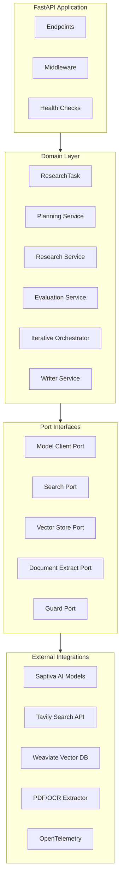
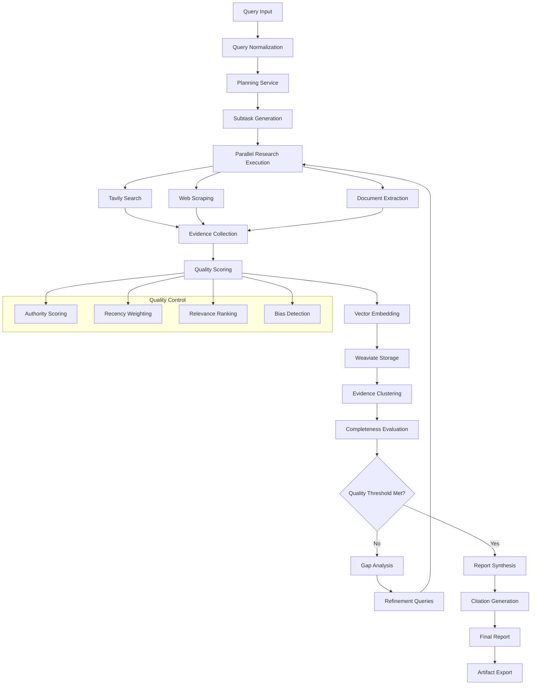

# Aletheia (ἀλήθεια – desocultamiento de la verdad)

[](https://github.com/saptiva-ai/alethia_deepresearch/actions)
[](https://www.python.org/downloads/)
[](https://fastapi.tiangolo.com/)
[](https://opensource.org/licenses/MIT)

Aletheia es una plataforma de investigación asistida por agentes que separa claramente el
*Dominio* de la orquestación y de las integraciones externas. El objetivo del repositorio es
ofrecer un pipeline reproducible para planear, ejecutar y sintetizar investigaciones
aprovechando modelos de lenguaje de Saptiva y fuentes externas (Tavily, documentos locales,
vector stores, etc.).

> **Estado:** ⚠️ **En desarrollo** – API base operativa y endpoints principales disponibles.
> Varias optimizaciones descritas en la documentación (auto-discovery de Saptiva, middleware
> de seguridad, almacenamiento persistente) están en progreso o pendientes de integración.

---

## 🚀 Enlaces rápidos

- **API Docs**: `/docs` (Swagger UI)
- **Health Check**: `/health`
- **Deployment**: Ver sección [Deployment](#-deployment)
- **Architecture**: Ver [diagrama de arquitectura](#-arquitectura)

---

## 📦 Qué incluye el repositorio

### Estado actual

- ✅ Orquestación de investigación secuencial e iterativa (Planner, Researcher, Writer, Evaluator)
- ✅ Integración con Tavily y Saptiva vía adapters con fallback a mocks cuando faltan API keys
- ✅ Pipelines CI/CD en GitHub Actions para linting, typing, pruebas y build de imágenes
- ✅ Middleware de seguridad y rate limiting activo a través de `ProductionSecurityMiddleware`
- ✅ Adapter de almacenamiento MinIO/S3 con fallback a filesystem (`MinioStorageAdapter`)
- ⚠️ Versionado del servicio reportado como `0.2.0` en `/health` (actualización en curso)

- **`apps/api`**: Aplicación FastAPI que expone endpoints de investigación y salud
- **`domain`**: Reglas de negocio (planificación, evaluación, orquestación iterativa y modelos)
- **`adapters`**: Integraciones concretas (Saptiva, Tavily, extracción de documentos, telemetría, almacenamiento vectorial, etc.)
- **`ports`**: Interfaces que definen contratos entre el dominio y los adapters
- **`infra`**: Infraestructura como código (Docker, Kubernetes)
- **`scripts`**: Scripts de deployment y utilidades de desarrollo
- **`tests`**: Suites unitarias e integrales (cobertura 23%+)
- **`docs`**: Material de referencia y diagramas adicionales

---

## 🛠 Requisitos

- **Python 3.11+** (requerido para sintaxis moderna de types)
- **pip** y **virtualenv** para aislar dependencias
- **Docker** (para deployment y servicios externos)
- **API Keys**: Saptiva AI y Tavily (ver [Configuración](#%EF%B8%8F-configuración))

### Servicios opcionales
- **Tesseract OCR** (para extracción de texto de imágenes)
- **Weaviate** (vector database)
- **MinIO/S3** (almacenamiento de archivos)
- **Jaeger** (observabilidad)

---

## ⚡ Configuración rápida

### 1. Clonar y configurar entorno

```bash
git clone https://github.com/saptiva-ai/alethia_deepresearch.git
cd alethia_deepresearch
python -m venv .venv
source .venv/bin/activate  # Windows: .venv\Scripts\activate
```

### 2. Instalar dependencias

```bash
pip install --upgrade pip
pip install -r requirements.txt
pip install -e .[dev]  # Incluye herramientas de desarrollo
```

### 3. Configurar variables de entorno

```bash
cp .env.example .env
```

Edita `.env` con tus API keys:

```bash
# API Keys (requeridas para funcionalidad completa)
SAPTIVA_API_KEY=tu_clave_saptiva_aqui
TAVILY_API_KEY=tu_clave_tavily_aqui

# Configuración opcional
WEAVIATE_HOST=http://localhost:8080
OTEL_EXPORTER_OTLP_ENDPOINT=http://localhost:4317
# Seguridad y límites (opcionales)
ENABLE_API_KEY_AUTH=false
RATE_LIMIT_PER_MINUTE=30
DEEP_RESEARCH_RATE_LIMIT_PER_MINUTE=10
# Almacenamiento externo (MinIO/S3)
MINIO_ENDPOINT=http://localhost:9000
MINIO_ACCESS_KEY=minioadmin
MINIO_SECRET_KEY=minioadmin123
MINIO_BUCKET=aletheia-artifacts
```

### 4. Ejecutar la API

```bash
uvicorn apps.api.main:app --reload --port 8000
```

🎉 **API disponible en:** http://localhost:8000/docs

---

## 🧪 Pruebas y calidad de código

El proyecto mantiene estándares altos de calidad con CI/CD automatizado:

### Ejecutar todas las verificaciones

```bash
# Linting y formato
ruff check .
ruff check . --fix  # Auto-fix issues

# Type checking
mypy domain/models --ignore-missing-imports

# Tests unitarios (99 tests)
pytest tests/unit/ -v --cov=domain --cov=adapters --cov=apps --cov-report=term-missing

# Tests de integración (requiere servicios externos)
pytest tests/integration/ -v
```

### Pipeline CI/CD

- ✅ **Linting**: Ruff + Black formatting
- ✅ **Type checking**: MyPy validation
- ✅ **Testing**: 99 unit tests with 23%+ coverage
- ✅ **Security**: Bandit + Safety checks
- ✅ **Build**: Multi-stage Docker builds
- ✅ **Deployment**: Automated to staging/production

Consulta `.github/workflows/pr-review.yml` para la revisión en PRs y `.github/workflows/ci-cd-aletheia.yml` para la automatización completa de build y despliegue.

---

## 🚀 Deployment

### Opciones de deployment

1. **[Servidor interno via SSH](#deployment-remoto-ssh)** ✅ **Recomendado**
2. **[Docker local](#deployment-docker-local)**
3. **[Kubernetes](#deployment-kubernetes)**
4. **[GitHub Actions CD](#deployment-github-actions)**

### Deployment remoto (SSH)

Para servidores internos con acceso SSH:

```bash
# 1. Configurar servidor (una sola vez)
./scripts/deployment/setup-server.sh

# 2. Desplegar aplicación
./scripts/deployment/deploy-remote.sh --verbose

# 3. Verificar deployment
curl http://YOUR_SERVER_IP:8000/health
```

### Deployment Docker local

```bash
# Build y deploy local
./scripts/deployment/deploy-docker.sh \
  --environment production \
  --tag latest \
  --port 8000
```

### Deployment Kubernetes

```bash
# Deploy a diferentes entornos
./scripts/deployment/deploy.sh --environment development
./scripts/deployment/deploy.sh --environment staging --tag v1.2.3
./scripts/deployment/deploy.sh --environment production --tag v1.2.3 --dry-run
```

### Configuración de producción

Para deployment en producción, configura estas variables:

```bash
# .env.production
ENVIRONMENT=production
DEBUG=false
LOG_LEVEL=WARNING

# API Keys (requeridas)
SAPTIVA_API_KEY=your_production_key
TAVILY_API_KEY=your_production_key

# Performance
API_WORKERS=4
MAX_CONCURRENT_REQUESTS=100
REQUEST_TIMEOUT=600

# Monitoring
ENABLE_TELEMETRY=true
METRICS_ENABLED=true
```

---

## 📡 API Endpoints

### Core Research Endpoints

| Endpoint | Method | Descripción |
|----------|--------|-------------|
| `/health` | GET | Health check con status de APIs |
| `/research` | POST | Investigación simple optimizada |
| `/deep-research` | POST | Investigación profunda iterativa |
| `/tasks/{task_id}/status` | GET | Estado de tarea en curso |
| `/reports/{task_id}` | GET | Reporte final generado |
| `/traces/{task_id}` | GET | Trazas de telemetría |

### Ejemplo de uso

```bash
# Investigación simple
curl -X POST "http://localhost:8000/research" \
  -H "Content-Type: application/json" \
  -d '{"query": "Latest AI trends 2024"}'

# Respuesta
{
  "task_id": "abc-123-def",
  "status": "accepted",
  "details": "Research task accepted with parallel processing"
}

# Verificar estado
curl "http://localhost:8000/tasks/abc-123-def/status"
```

---

## 🏗 Arquitectura

### Vista general



### Flujo de investigación





### Principios de diseño

- **🏛 Clean Architecture**: Separación clara entre dominio, puertos y adapters
- **🔌 Dependency Inversion**: Abstracciones estables, implementaciones intercambiables
- **🧪 Testability**: 99 unit tests, mocking de dependencias externas
- **📊 Observability**: OpenTelemetry integration, structured logging
- **⚡ Performance**: Procesamiento paralelo, optimizaciones asíncronas
- **🛡 Resilience**: Graceful degradation, retry mechanisms

---

## 🔧 Desarrollo

### Estructura del proyecto

```
alethia_deepresearch/
├── apps/                    # FastAPI application
│   └── api/
├── domain/                  # Business logic (clean architecture)
│   ├── models/             # Domain models
│   └── services/           # Domain services
├── adapters/               # External integrations
│   ├── saptiva_model/      # Saptiva AI integration
│   ├── tavily_search/      # Tavily search integration
│   ├── weaviate_vector/    # Vector database
│   └── telemetry/          # Observability
├── ports/                  # Interface contracts
├── tests/                  # Test suites
│   ├── unit/              # Unit tests (99 tests)
│   └── integration/       # Integration tests
├── scripts/               # Deployment & utility scripts
│   └── deployment/        # Deployment automation
├── infra/                 # Infrastructure as code
│   ├── docker/           # Docker Compose
│   └── k8s/              # Kubernetes manifests
└── docs/                  # Documentation
```

### Scripts útiles

```bash
# Development
./scripts/development/setup.sh        # Setup desarrollo local
./scripts/development/test.sh         # Run full test suite

# Deployment
./scripts/deployment/setup-server.sh  # Configurar servidor remoto
./scripts/deployment/deploy-remote.sh # Deploy via SSH
./scripts/deployment/deploy-docker.sh # Deploy local Docker

# Utilities
./scripts/utils/health-check.sh       # Verificar salud del sistema
./scripts/utils/backup.sh             # Backup de datos
```

### Configuración de desarrollo

```bash
# Pre-commit hooks (recomendado)
pip install pre-commit
pre-commit install

# Variables de desarrollo
export DEBUG=true
export LOG_LEVEL=DEBUG
export ENVIRONMENT=development
```

---

## 📊 Monitoreo y observabilidad

### Health checks

```bash
# Health endpoint básico
curl http://localhost:8000/health

# Respuesta
{
  "status": "healthy",
  "service": "Aletheia Deep Research API",
  "version": "0.2.0",
  "api_keys": {
    "saptiva_available": true,
    "tavily_available": true
  },
  "timestamp": 1757976601.2687306
}
```

### Logs estructurados

- **Formato**: JSON structured logging
- **Niveles**: DEBUG, INFO, WARNING, ERROR
- **Correlación**: Task IDs para tracking
- **Telemetría**: OpenTelemetry integration

### Métricas disponibles

- Request/response times
- API success/failure rates
- Task completion rates
- Evidence collection metrics
- Resource utilization

---

## 🤝 Contribuir

### Workflow de desarrollo

1. **Fork** el repositorio
2. **Crear branch** para feature/fix: `git checkout -b feature/amazing-feature`
3. **Commit** cambios: `git commit -m 'Add amazing feature'`
4. **Push** a branch: `git push origin feature/amazing-feature`
5. **Crear Pull Request**

### Estándares de código

- ✅ **Linting**: Código debe pasar `ruff check`
- ✅ **Format**: Usar `ruff check --fix` para auto-format
- ✅ **Types**: Type hints obligatorios
- ✅ **Tests**: Tests unitarios para nuevas features
- ✅ **Docs**: Actualizar README.md si es necesario

### Revisión de código

- CI/CD debe pasar (99 tests, linting, security)
- Revisión por al menos 1 maintainer
- Documentación actualizada si aplica

---

## 📚 Recursos adicionales

- **[Documentación completa](docs/)**: Guías detalladas y ejemplos
- **[API Reference](http://localhost:8000/docs)**: Swagger UI interactivo
- **[Architecture Deep Dive](docs/architecture.md)**: Decisiones de diseño
- **[Deployment Guide](docs/deployment.md)**: Guía completa de deployment
- **[Contributing Guide](docs/contributing.md)**: Guía para contribuidores

### Enlaces útiles

- **Issues**: [GitHub Issues](https://github.com/saptiva-ai/alethia_deepresearch/issues)
- **Discussions**: [GitHub Discussions](https://github.com/saptiva-ai/alethia_deepresearch/discussions)
- **Releases**: [GitHub Releases](https://github.com/saptiva-ai/alethia_deepresearch/releases)

---

## 📄 Licencia

MIT License - ver [LICENSE](LICENSE) para más detalles.

---

## 🙏 Agradecimientos

- **Saptiva AI** - Modelos de lenguaje de vanguardia
- **Tavily** - Search API para investigación
- **FastAPI** - Framework web moderno y rápido
- **Weaviate** - Vector database escalable

---

<div align="center">

**¿Encontraste útil este proyecto? ⭐ Danos una estrella!**

[Reportar Bug](https://github.com/saptiva-ai/alethia_deepresearch/issues) · [Solicitar Feature](https://github.com/saptiva-ai/alethia_deepresearch/issues) · [Documentación](docs/)

</div>
